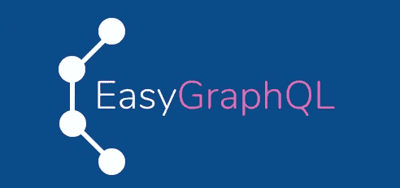
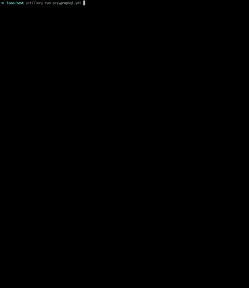
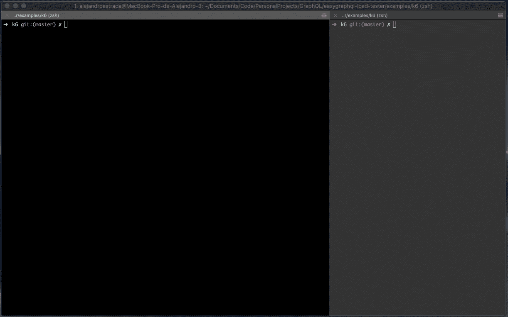
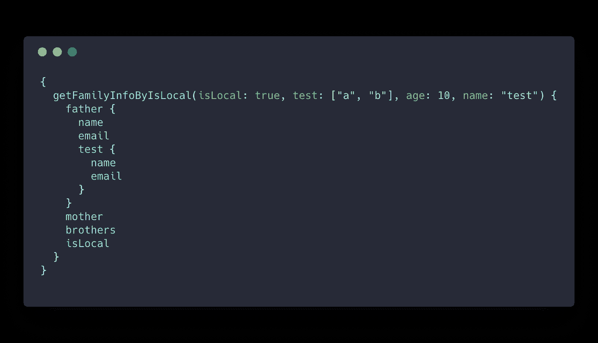

# 我是如何在不编写任何查询的情况下开始在 GraphQL 上进行负载测试的

> 原文：<https://medium.com/hackernoon/how-i-started-doing-load-testing-on-graphql-without-writing-a-single-query-8604ba38b422>



[EasyGraphQL](https://github.com/EasyGraphQL)

前一段时间，我在做一个 GraphQL 项目，这个项目包含了一些活动，每个活动都可以有一些评论，带有创建评论的用户的信息。你可能想到的第一件事是，这是查询`n + 1`的问题，是的；确实是！

我决定实现数据加载器，但由于某种原因，实现时出现了错误，所以它没有缓存查询，结果是对数据库的大量请求。发现这个问题后，我用正确的方法实现了它，将对数据库的查询从 46 个减少到 6 个。

这就是为什么我决定创建一个开源工具来帮助我创建查询和进行负载测试，只要通过我的 GraphQL 模式。

# 工作原理:

`[easygraphql-load-tester](https://github.com/EasyGraphQL/easygraphql-load-tester)`暂时可以用三种方式:

1.  使用`.artillery()`和[火炮](https://artillery.io/)设置。
2.  使用`.k6()`和 [k6](https://docs.k6.io/docs) 设置。
3.  使用`.createQuery()`可以创建查询，这样你就可以使用你最喜欢的负载测试器了。

# 怎么用？

*   导入`[easygraphql-load-tester](https://github.com/EasyGraphQL/easygraphql-load-tester)`包。
*   阅读模式。
*   初始化测试器，并将模式作为第一个参数传递。
*   如果有多个模式，则使用模式和参数传递一个数组。
*   第二个参数是查询上的参数，**只有**如果有一些查询的话。
*   **注意**:为了使用多个模式文件，必须扩展查询和突变。
*   **注意**:如果参数是一个数组，它应该作为`string`传递，例如:`'["name", "name 2"]'`

# 一个模式文件

```
'use strict' const EasyGraphQLLoadTester = require('easygraphql-load-tester')
const fs = require('fs')
const path = require('path')const userSchema = fs.readFileSync(path.join(__dirname, 'user.gql'), 'utf8')const loadTester = new EasyGraphQLLoadTester(userSchema)
```

# 多个模式文件

```
'use strict' const EasyGraphQLLoadTester = require('easygraphql-load-tester')
const fs = require('fs')
const path = require('path')const userSchema = fs.readFileSync(path.join(__dirname, 'user.gql'), 'utf8')
const familySchema = fs.readFileSync(path.join(__dirname, 'family.gql'), 'utf8')const loadTester = new EasyGraphQLLoadTester([userSchema, familySchema])
```

# 大炮

要与[cannon](https://artillery.io/)一起使用，您必须在您的项目中安装它，以防您没有它，只需运行:

```
$ npm install artillery --saved-dev
```

# 索引. js

您应该配置您的`index.js`文件:

```
'use strict' const EasyGraphQLLoadTester = require('easygraphql-load-tester')
const fs = require('fs')
const path = require('path')const userSchema = fs.readFileSync(path.join(__dirname, 'user.gql'), 'utf8')
const familySchema = fs.readFileSync(path.join(__dirname, 'family.gql'), 'utf8') const args = {
  getMeByTestResult: {
    result: 4
  },
  search: {
    id: '1'
  },
  ,
  searchUser: {
    where: {
      id: '1',
      name: 'demo'
    }
  }
}const loadTester = new EasyGraphQLLoadTester([userSchema, familySchema], args)const testCases = loadTester.artillery()module.exports = {
  testCases
}
```

## 自定义查询

您可以将自定义查询传递给负载测试，为此，您必须创建一个对象数组，然后将它传递给 options 参数:

```
const queries = [
  {
    name: '<NAME_OF_QUERY_TO_TEST>',
    query: '<YOUR_CUSTOM_QUERY>'
  }
]
```

## 选定的查询

您可以选择要测试的查询列表，为此，您必须用要测试的查询的名称创建一个字符串数组。这是可选的，如果你不创建它，所有的查询都将被测试。

```
const selectedQueries = ['getFamilyInfo', 'searchUser']
```

## 查询文件

如果您想要保存一个包含所有测试过的查询的`JSON`文件，您可以在选项 pass `queryFile: true`上选择这样做，如果您没有传递任何内容，它将不会被保存。

## 选择

*这是可选的，您可以将第一个参数留空，如果您不想传递任何选项*cannon 方法将接收一些选项，这些选项将有助于创建自定义查询，并测试特定查询。

```
const options = {
  selectedQueries,
  customQueries: queries,
  queryFile: true
}
```

然后把它作为第一个参数传递给`loadTester.artillery(options)`。**注意**:使用参数编写查询，另外，不要忘记将它们写在查询参数对象上，以便其他查询可以访问它们。

示例:

```
const queries = [
  {
    name: 'searchUser(id: "1")',
    query: `
      {
        searchUser(id: "1") {
          name
        }
      }
    `
  }
]const options = {
  selectedQueries: ['getFamilyInfo', 'searchUser'],
  customQueries: queries
}const testCases = easyGraphQLLoadTester.artillery(options)module.exports = {
  testCases
}
```

# 炮兵. yml

火炮文件应该有这样的最低配置，如果需要的话，你可以添加你的:

```
config:
    target: "http://localhost:5000/"
    phases:
      - duration: 5
        arrivalRate: 1
    processor: "./index.js"
  scenarios:
    - name: "GraphQL Query load test"
      flow:
        - function: "testCases"
        - loop:
            - post:
                url: "/"
                json:
                  query: "{{ $loopElement.query }}"
            - log: "----------------------------------"
            - log: "Query: {{ $loopElement.name }}"
          over: cases
```

*在这种情况下，服务器运行在*[*http://localhost:5000/*](http://localhost:5000/)

# 如何运行它

为了运行您的负载测试，在您的`package.json`上添加这个脚本:

```
"scripts": {
  "easygraphql-load-tester": "artillery run artillery.yml"
}
```

然后在终端上运行

```
$ npm run easygraphql-load-tester
```

*在这种情况下，火炮文件被称为火炮，但你可以用你最喜欢的名字命名你的文件，并运行* `*artillery run <MY_FILE_NAME>.yml*`

# 结果

如果您应用基本配置，结果将是这样的

```
All virtual users finished
 Summary report @ 15:03:05(-0500) 2018-11-17
   Scenarios launched:  5
   Scenarios completed: 5
   Requests completed:  40
   RPS sent: 8.95
   Request latency:
     min: 1.2
     max: 13
     median: 2
     p95: 6
     p99: 13
   Scenario counts:
     GraphQL Query load test: 5 (100%)
   Codes:
     200: 40
```



load testing

# k6

要与 [k6](https://docs.k6.io/docs/) 一起使用，您必须在您的计算机上安装它，如果您没有它，请访问[安装指南](https://docs.k6.io/docs/installation)

# 索引. js

您应该配置您的`index.js`文件:

```
'use strict' const EasyGraphQLLoadTester = require('easygraphql-load-tester')
const fs = require('fs')
const path = require('path')const userSchema = fs.readFileSync(path.join(__dirname, 'user.gql'), 'utf8')
const familySchema = fs.readFileSync(path.join(__dirname, 'family.gql'), 'utf8') const args = {
  getMeByTestResult: {
    result: 4
  },
  search: {
    id: '1'
  },
  ,
  searchUser: {
    where: {
      id: '1',
      name: 'demo'
    }
  }
}const loadTester = new EasyGraphQLLoadTester([userSchema, familySchema], args)easyGraphQLLoadTester.k6(<FILE_NAME>)
```

**第一个参数是 k6 配置文件的名称**

## 自定义查询

您可以将自定义查询传递给负载测试，为此，您必须创建一个对象数组，然后将它传递给 options 参数:

```
const queries = [
  {
    name: '<NAME_OF_QUERY_TO_TEST>',
    query: '<YOUR_CUSTOM_QUERY>'
  }
]
```

## 选定的查询

您可以选择要测试的查询列表，为此，您必须用要测试的查询的名称创建一个字符串数组。这是可选的，如果你不创建它，所有的查询都将被测试。

```
const selectedQueries = ['getFamilyInfo', 'searchUser']
```

## 查询文件

如果您想保存一个包含所有测试过的查询的`JSON`文件，您可以在选项 pass `queryFile: true`上选择这样做，如果您没有传递任何内容，它将不会被保存。

## 虚拟用户

您可以选择您的测试需要多少虚拟用户，只需传递到选项`vus: <NUMBER_OF_VUS>`。

## 持续时间

您可以选择测试的持续时间，只需转到选项`duration: '<DURATION>s'`。它应该是一个带有时间单位的字符串，例如`s`

## 选择

*这是可选的，你可以将第二个参数留空，如果你不想传递任何选项*

```
const options = {
  selectedQueries,
  customQueries: queries,
  queryFile: true,
  vus: 10,
  duration: '10s'
}
```

然后将其作为第二个参数传递给`loadTester.artillery(<FILE_NAME>, options)`。

**注意**:使用参数编写查询，另外，不要忘记将它们写在查询参数对象上，以便其他查询可以访问它们。

示例:

```
const queries = [
  {
    name: 'searchUser(id: "1")',
    query: `
      {
        searchUser(id: "1") {
          name
        }
      }
    `
  }
]const options = {
  selectedQueries: ['getFamilyInfo', 'searchUser'],
  queryFile: true,
  vus: 10,
  duration: '10s'
}easyGraphQLLoadTester.k6('k6.js', options)
```

# k6.js

火炮文件应该有这样的最低配置，如果需要的话，你可以添加你的:

**注意:不要更改查询的名称和路线** `**./easygraphql-load-tester-queries.json**`

```
import http from "k6/http";const queries = JSON.parse(open("./easygraphql-load-tester-queries.json"));export default function() {
  for (const query of queries) {
    const url = "http://localhost:5000/";
    const payload = JSON.stringify({ query: query.query });
    const params =  { headers: { "Content-Type": "application/json" } }
    http.post(url, payload, params);
  }
};
```

*在这种情况下，服务器运行在*[*http://localhost:5000/*](http://localhost:5000/)

# 如何运行它

为了运行您的负载测试，在您的`package.json`上添加这个脚本:

```
"scripts": {
  "easygraphql-load-tester": "node index.js"
}
```

然后在终端上运行

```
$ npm run easygraphql-load-tester
```



k6 load test



one of the queries created

*   如果参数是一个数组，它应该像例子`'["test", “test2”]'`中那样作为注释传递。

如果你喜欢这个包，别忘了在 GitHub 上给个⭐️。

回购:【https://github.com/EasyGraphQL/easygraphql-load-tester 

国家预防机制:[https://www.npmjs.com/package/easygraphql-load-tester](https://www.npmjs.com/package/easygraphql-load-tester)

**示例:**[https://github . com/EasyGraphQL/EasyGraphQL-load-tester/tree/master/Examples](https://github.com/EasyGraphQL/easygraphql-load-tester/tree/master/examples)

**更多 easygraphql 项目**:[https://github.com/EasyGraphQL](https://github.com/EasyGraphQL)

**网址:**[https://easygraphql.com/](https://easygraphql.com/)