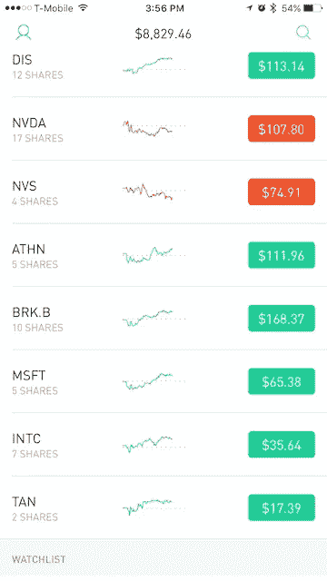
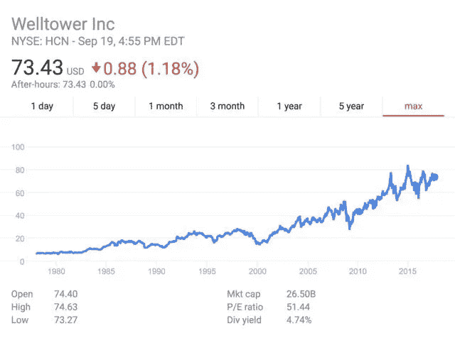
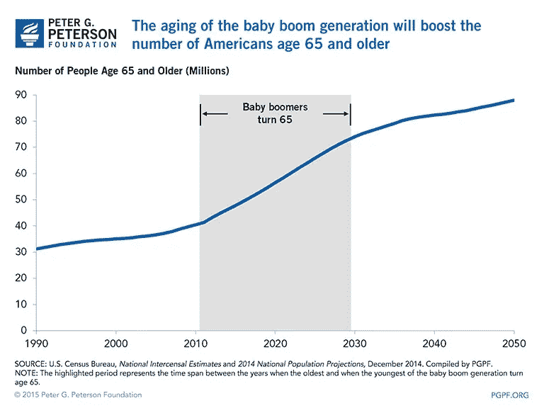
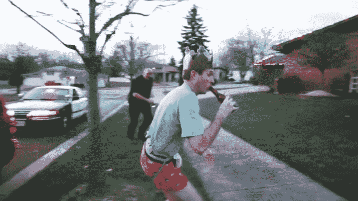
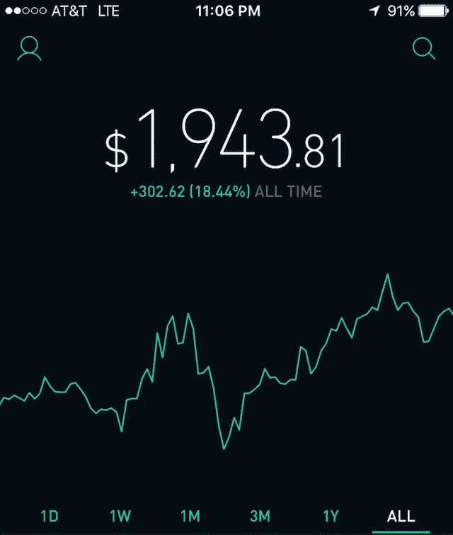

# 我是如何在一无所知的情况下开始投资的

> 原文：<https://medium.com/hackernoon/how-i-started-investing-without-knowing-a-damn-thing-f4e398d23ab3>

向千禧一代提及股票投资组合或 T2 投资，你可能会得到尴尬的沉默或刻薄的目光。而且理由很充分。许多人目睹了 2008 年的经济衰退在几天内耗尽了他们父母一生的积蓄。见鬼，我眼看着我十几岁时的房屋价值(尽管有些膨胀)从 60 万美元暴跌至不到 30 万美元(我们最终丧失了赎回权)。

这种对体制的不信任，加上日益紧缩和自动化的就业市场、低工资和学生贷款债务，构成了每个潮人都准备在周日早午餐时品尝的误导鸡尾酒。

**那么，你如何开始让年轻人考虑投资呢？**

# 彻底改变体验，中途与我们会合

大多数[投资](https://hackernoon.com/tagged/investment)平台的问题在于它们陈旧、难以理解，并且通常需要很高的准入门槛。它们根本无法与年轻人的大脑线路或他们的日常经验以及他们与其他技术的日常互动相融合。接入必须以移动为先，简单性是首要原则。

# 罗宾汉来救援了

Robinhood 是一款 iOS 和 Android 应用，允许任何人零手续费买卖股票。说真的，就是这样。而零费用*真正的意思是* **零费用**。

这让每笔交易收费高达 8 美元的主要经纪人大吃一惊。没有复杂的、充斥着流行词汇的平台，没有对 48 岁的经纪人玛格丽特的拜访，或者更糟——拜伦，留着蓬蓬头的帅哥，比你小 5 岁，他的年薪是你一生收入的 3 倍。玛格丽特是可以忍受的，但是拜伦可以抱着他的法国斗牛犬在高层公寓的顶上啜饮毒芹。Robinhood 于 2014 年推出，结合了美感和简单的股票交易方式，创造了一种易于理解的移动体验，并为普通人提供了一个很大程度上令人迷惑(如果不是可怕的话)的概念。这款应用使用起来非常简单，提供的信息非常周到，注册过程不到五分钟。

# 当你不知道自己在做什么时，如何挑选股票

*   没有细价股(告诉你的雷蒙德叔叔他是个白痴)
*   没有共同基金
*   没有上市前股票
*   仅在美国主要交易所积极上市的公司

虽然这些可能看起来像很多“规则”，但它有很大的目的:保护你免受风险过大的投资。

## 寻找有增长历史和未来潜力的股票

Welltower growth

只有当你这样做的时候，选股才会变得困难。我投入大量资金的第一批公司之一是 Welltower，这是一种高级活体房地产投资信托基金，是一种通过房地产或抵押贷款投资房地产的证券，经常像股票一样在主要交易所交易。

以下是我问自己的主要问题:

1.  **什么服务会对大部分人产生影响，并且是必需的？**高级护理和住房，温馨。我奶奶会为此爱我的！
2.  **在这个领域，哪家公司是领导者或主导力量？** Welltower 的市值超过 250 亿美元。
3.  **谁支付股息？**自 1987 年以来，Welltower 每季度支付一次股息，并且一直在增加股息。它目前每季度支付每股 0.86 美元。
4.  他们如何在经济低迷时期保持公平？井塔没有被 2008 年的倒塌压垮，但它确实受到了重创。

> 2011 年 1 月，二战后最老的婴儿潮一代开始步入 65 岁；从那时起，每天大约有 10，000 名婴儿潮一代庆祝他们的 65 岁生日。到 2029 年这一代最后一个人接近退休年龄时，18%的美国人将至少达到退休年龄。

There was a whole lotta humpin’ after WWII.

在未来的几年里，会有大量的、稳定增长的人口需要某种特定的服务或产品，这并不是什么难事。这个事实，加上上述标准，导致我的决定。我们甚至还没有开始谈论世界上其他的老龄化人口(Welltower 提供服务)…

## 从你的心(和常识)开始

> 在一生中成功投资并不需要极高的智商、非同寻常的商业洞察力或内幕消息。我们需要的是一个合理的决策框架，以及防止情绪侵蚀这一框架的能力。你必须提供情感训练。
> - **巴菲特**

你可能在想，我已经失去了我该死的头脑，我的建议“从你的心开始”是直接与巴菲特先生的声明不一致。事实上，事实并非如此，原因如下:

1.巴菲特指的是在你开始投资后，你无疑会面临的情绪反应。也就是说，你会卖掉你在脸书的全部股份，因为马克·扎克伯格被发现殴打羊驼并被迫辞职吗？还是会保持头脑清醒，渡过难关，关注公司目前的健康状况，以及它的发展方向？好吧，也许在这种情况下扎克可以和拜伦一起去。

2.从你的心开始，你投资于你真正相信的公司。欺骗你的妻子或女朋友取决于你发送无根据的、消失的阴茎照片的能力吗？你可以考虑 Snapchat。

我买股票的第一家公司是 Taser(现在是 Axon)。是的，泰瑟枪是在 BZZZZZZ 通电时，让你尿(或大便)裤子的警察使用的武器。几乎每天我们都听到警察开枪打死手无寸铁的人在街上和他们的家里。

对我来说，这简直是不可接受的，我想把我的钱投入到一些非致命的东西上，这将有望改变令人震惊的涉及警官的谋杀案的数量。

虽然我觉得 Axon 是朝着正确方向迈出的一步，但这并不是说它没有缺陷。路透社[记录了美国 1005 起警察用泰瑟枪电击致死的事件，几乎都发生在 21 世纪初。](https://www.reuters.com/investigates/special-report/usa-taser-911/)

导致我做出这个决定的另一个因素是，Axon 在 2008 年开始销售人体相机和在线文件存储。随着公众要求官员对自己的行为负责的压力不断增加，这种要求一直在增加。可能会出什么问题呢，对吗？

# 结论

Author’s Robinhood Portfolio

2016 年 1 月，我带着几百块钱开始了这段旅程。只要我有多余的钱，我就会多投资一点。我是百万富翁吗？当然没有。没关系。我已经把恐惧放在一边(在门口检查这些情绪),并尝试进入一个太多人害怕的世界——毕竟，只有 9%的千禧一代把自己描述为投资者。

我在一路学习，目前通过投资表现强劲、有增长潜力的公司，并在道德上相信它们，我的年平均回报率超过了 S&P。

如果你决定开始投资，给你一些临别建议

*   你不是也可能永远不会成为华尔街之狼——冷静点。
*   不要每天检查你股票的健康状况。你会把自己逼疯，没有任何目的和益处。最多给它一个 6 个月或者一年的评估。
*   不管你投了多少钱，都当它没了。一开始这很难，但是如果你能训练你的头脑，让它知道这些钱不再是你的，从长远来看，你会过得更好。这有助于消除情绪，并为你的长期发展做好准备(也称为明智之举——问问巴菲特先生就知道了)。
*   记得报税，笨蛋。在过去的一年里，我第一次专业地完成了它们。我使用 [Taxfyle](http://www.taxfyle.com) (促销代码:FYLE-VINCEA0G 将为您节省 20 美元)，这是我最好的体验。

**祝你成功，你这个肮脏的资本家败类！**
— —
披露:我持有文中提到的两家公司的股票；Welltower Inc .和 Axon Enterprise Inc .,而我写这篇文章是没有报酬的(那不是很棒吗？)，如果你[注册罗宾汉](http://share.robinhood.com/vincent13)，我会得到一个免费的股票。

我还写了其他一些无聊的东西，比如@[nerdyminutes.com](https://www.nerdyminutes.com)！