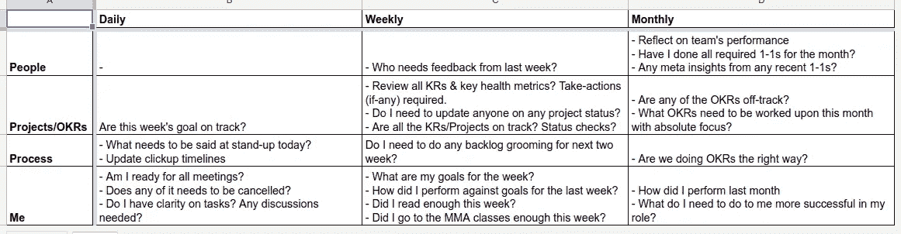
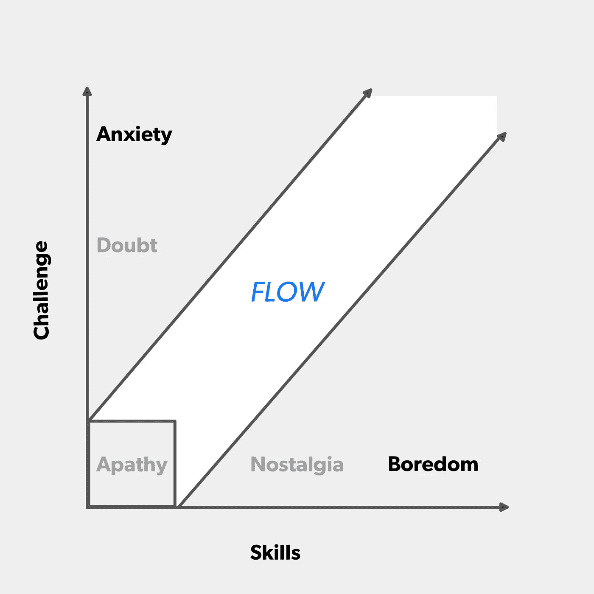

# 我如何停止糟糕的管理:来自开发者的领导力课程

> 原文：<https://medium.com/hackernoon/how-i-stopped-being-awful-at-managing-leadership-lessons-from-a-dev-d1bfebcb3a21>

“Black and white shot of geese flying in formation with cloudy sky in Boulder” by [Ethan Weil](https://unsplash.com/@weilstyle?utm_source=medium&utm_medium=referral) on [Unsplash](https://unsplash.com?utm_source=medium&utm_medium=referral)

在 [Squad](https://www.squadplatform.com/) ，我们一直遵循拥有小型跨学科团队的概念，我们称之为求解团队(Spotify 对这个概念进行了漂亮的[解释，我们从他们那里获得了很多灵感)。正如命运安排的那样，我领导了一个团队，负责从零开始为 Squad 构建机器学习平台。](https://labs.spotify.com/2014/03/27/spotify-engineering-culture-part-1/)

虽然我已经在大型项目上工作了两年多，但这是我第一次承担更正式的[领导](https://hackernoon.com/tagged/leadership)角色。求解团队领导更像是项目经理，而不是人事经理，所以我不仅仅是管理，也是执行。这可能会让令人恐惧的转变变得更容易。在过去的几个月里，我享受并学到了很多东西，开始的时候我完全被吸引住了。但是我很高兴地宣布，到最后，我比开始时要好得多。

我是如何变得不那么可怕的？我从自己的经历中学习，但更多的是从团队中得到的反馈。我最近在季度回顾中整理了这些教训和 1-1 笔记(忽略这是我第一次尝试的事实，并留下深刻印象)，并意识到它将成为与我处境相同的人的好读物。

以下是我发现有用的一些想法:

# 营造一个所有想法都值得分享的环境

一个团队是所有成员不同个性的混合体。不是每个人都愿意分享自己的想法。有些人可能对自己的想法不自信(这可能不是他们的正确判断)，有些人会避免说话，除非有人直接和他们说话，而有些人还不习惯在特定人群中说话(可能是新团队)。尽管如此，你如何让每个人分享想法？

我学到的是**你可以通过问正确的问题让人们分享他们的想法**。当我们手头有问题时，我经常问的问题是:

1.  你建议我们做什么？
2.  你认为我们能解决它的一些方法是什么？
3.  你认为会有解决方案失败的情况吗？

**问完这些问题，再暂停**。给他们时间思考。不仅如此，**让沉默鼓励对方说话**。克里斯·沃斯(Chris Voss)在他的著作《[永不分裂](https://www.goodreads.com/book/show/26156469-never-split-the-difference)》中将这描述为“[有效停顿](http://blog.blackswanltd.com/the-edge/how-to-use-silence-to-your-advantage)”。它不是在相同的环境中，但我看到它的工作，因为前提是相同的。有效的停顿能让人集中思想，进行思考。办公室里的典型对话是这样的:

> **无名氏(假想队友)**:所以，有这个问题。你认为应该怎么做？
> **科坦巴特**:有意思……你觉得应该怎么做？
> **JD** : …？
> **KB**:…:)
> **JD**:…
> **KB**:…
> **JD**:嗯…我想我们可以试试做 X？
> **KB** :有道理，你觉得如果我们做 X，情况会是什么样子？
> **JD** :这个特殊的东西可能会有一些问题，但如果我们对 x 做一点小调整，就可以解决这些问题。
> **JD** :嗯，让我再想想，再回复你？
> **KB** :当然！

每个面临问题的人也至少知道一种解决问题的方法。有时这种方式是所需要的，有时可能需要一些调整。否则，你可以提出一些你认为可能有效的建议，然后进一步讨论解决方案。

你这样做的次数足够多，人们会自动开始自己做这件事，提炼他们的想法，然后最终来和你分享他们的所得。由于现在有更多的人分享他们的想法，你的解决方案库就变得更大了，你的团队作为一个整体解决问题的质量也提高了。呜哇呜！

# 构建事件循环

我们都经历过。该项目从我们发誓要跟踪的细致的计划、时间表和度量标准开始。这个季度已经过去几周了，时间表和指标并没有被同样准时地跟踪，如果有的话。我也成为了受害者。

作为工程师，我们天生倾向于执行。很容易忘记/拖延更新时间表、待办事项、跳过单口相声、为未来几周做计划等等。随之而来的是能见度的下降:

1.  你的团队不知道它要去哪里，我们会达到我们的目标吗，我们在正确的轨道上吗？
2.  其他团队看不到你的团队正在发生什么
3.  你抓住问题，这可能危及目标，为时已晚。航向修正变得更加困难。

从错误中学习，从我的领导中得到指导，这里有一个建议:给自己建立一个 [**事件循环**](https://s3.amazonaws.com/marquee-test-akiaisur2rgicbmpehea/dgVXCQ87Ry2aeL7OKJyu_Screen%20Shot%202015-07-16%20at%2011.43.16%20AM.png) **，明确地为跟随它而封锁你的时间**。我们从 David Loftesness 的第一轮帖子中获得了这一点，如果你正在从开发人员向管理角色过渡，这是一篇必读的文章。

我们中的许多人已经在关注这类事情了，我发现让它明确对我来说更好。

My Event Loop

# 平衡好你的冲刺

Unity 的质量总监 Alan Page 在他的经理自述中对我的学习进行了完美的解释。具体来说:

> ***ACM 框架*** *(雄心勃勃，安逸，平淡无奇)。这个想法是，如果你看看你在一周/ sprint 中做的工作，有些工作是新的、有挑战性的或雄心勃勃的，大部分工作是你真正擅长的(舒适的工作)，你可能会结束一些你大材小用或无聊的工作，但只是需要完成(平凡的)。*
> 
> 我们应该共同努力，确保你有足够的雄心勃勃的工作，让你接受挑战并不断成长，如果你每周都学不到新东西，那就是我们应该共同努力的事情。我们也想尽量减少你的世俗工作。通常，你平凡的工作可能是别人雄心勃勃的工作。

我的导师 Vikas Gulati 是 Squad 的首席技术官，他经常从[第一篇评论文章](http://firstround.com/review/track-and-facilitate-your-engineers-flow-states-in-this-simple-way/)中指出下面的图表，来解释大致相同的事情:

Skills vs Challenge

众所周知，任何优秀的开发人员如果看不到自己的成长，都不会太高兴。但一个被忽视的事实是，成长是一个持续的过程，而不是你努力一个月就能获得的徽章。把雄心勃勃的任务一个接一个地分配给人们很容易让他们筋疲力尽(对你来说是善意的)，当人们意识到一些不可逆转的损害已经造成时，往往已经太晚了。**另一个重要方面是满足感**。有些任务很有挑战性，但很早就能带来满足感，而有些任务可能要很久以后才会有满足感。

你的冲刺就像一道甜点。糖太多了？谢谢你的糖尿病。太少了？这算是甜点吗？坚果和樱桃呢？不能太多也不能太少。完美的甜点是适量的糖，当你咬一口时，坚果和樱桃会随机给你惊喜。
**短跑很像甜点，应该是挑战性和舒适性的良好结合，以胜利为衡量标准:)**

这些经验对一些人来说可能只是常识(我尊重你的人)，但是我觉得清楚地知道这些事情有助于我以更好的方式引导团队的力量，从而公平地对待他们的才能。

*如果你是一名有才华的开发人员，并且相信她很适合这个团队—* [***我们正在招聘***](https://www.squadplatform.com/careers/?utm_source=mediumcom&utm_medium=article&utm_campaign=leadership_lessons_from_dev) ***！***