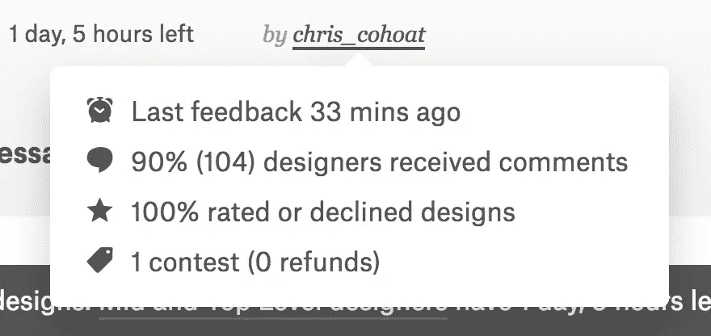

# 我如何成功地将我的创业公司打造成一个技术型的独立创业者

> 原文：<https://medium.com/hackernoon/how-i-successfully-branded-my-startup-as-a-technical-solo-founder-2ce9aa7de77d>

在[互联网](https://hackernoon.com/tagged/internet)上，成功的专业设计师们对设计恨之入骨。我看到的主要论点是，竞赛和特殊工作是一种很好的方式，可以让你的工作被剽窃，免费工作，或者将一个[设计](https://hackernoon.com/tagged/design)提交到无人欣赏或认可的以太中。

这是一个巨大的问题，但我不认为这是 99designs 的错。我认为创建和管理竞赛的人应该受到责备，我也相信我的竞赛解决了这些问题，给设计师和我这个客户带来了更好的体验。

我在 99designs 上的第一个错误是选择了公开竞赛(而不是盲目竞赛)。公开竞赛允许每个人查看所有的提交内容和所有的评分，而隐蔽竞赛显示人们的贡献，但隐藏他们的具体提交内容。

我选择公开竞赛，因为我在我的业务中实行完全透明。公开的工资是主要的项目，因为公司喜欢躲在商业游戏和谈判的背后，这 1)让他们的员工证明或猜测他们的价值，而不是仅仅知道它 2)使女性、有色人种和其他在技术领域代表性不足的群体的工资差距永久化…因为他们正在反对一种制度，这种制度惩罚了他们几代人以来为自己说话。

我比大多数人更进一步提高透明度，因为我认为这对每个人都有帮助。将我们公司的银行账户放在我们的网站上，让员工知道我们的财务状况，跟踪我们微型餐厅的确切成本和利润，这样当客户购买沙拉时，他们就知道它来自哪里，以及它在我们企业中的确切成本，等等。

因此，我们公司的核心是透明，我认为公开竞争是显而易见的。但是在运行了一天并收到了数百个重复的设计后，我意识到透明度实际上是关于同意的。网站上的设计师别无选择，只能提交一个公开可用的徽标，但这样做的同时，他们也将自己的作品完全暴露给了网站上成千上万的其他设计师，他们可以拿走他们的作品，应用它，并从中获利。在意识到发生了什么之后，我联系了 99designs 支持团队，他们改变了我的比赛的知名度。

我在整个比赛中做的最重要的一件事就是对每一份提交的作品进行评分、审核或拒绝。几乎每一个人…如果参加我比赛的设计师没有收到足够的反馈，请联系我。我的比赛还剩 1 天 5 个小时，作为客户，我的立场是:

在我发表这篇文章的时候，我已经收到了 451 份提交材料，仔细检查每一个设计，弄清楚我为什么喜欢它，为什么不喜欢它，浏览提交者的历史以了解我喜欢他们的工作，给设计师关于我的偏好的具体反馈，以及他们的提交如何迎合这一点，以及他们过去的工作如何做，等等，这绝对是令人疲惫的。

但是如果你作为客户不能做到这一点，那么你就失败了。有数百人(可能是数千人)给你他们的精神能量来阅读你的设计概要，思考它，坐在他们的电脑前，做一个设计，然后足够自信地提交给你，知道它可能不会被看到，甚至承认。

作为客户，我做的另一个决定是在某些情况下尽早淘汰设计师，即使他们非常有才华。提前淘汰是一个艰难的平衡…你可能会从一个设计师那里夺走一个机会，这个设计师可以从品牌的角度给你所需要的一切。但另一方面，你可以让他们长时间地工作，却没有任何获得报酬的机会。

我不知道我是否有具体的答案，但我的方法是查看他们的整个产品组合(如果他们有)，与他们谈论他们的设计(沟通是至关重要的，尤其是在这样一个微妙和主观的领域)，并对可能失去一个杰作充满信心。这样做，你尊重了他们的工作，也尊重了他们前进的时间。

我喜欢 99 设计，因为多年前我在 oDesk 和 Elance(现在是 [Upwork](https://www.upwork.com/) )上开始了我作为软件工程师的职业生涯。我以类似的方式把自己放在那里，我的一个真正伟大的导师 Jerry 找到了我，把我培养成一名软件工程师，并开始了我的职业生涯。我从数钱包里的美元来买冰淇淋，到给国防部、国务院和我的许多其他客户开出每小时 200 美元的账单。

在那里，我创办了 [Gardeno 基金会](https://gardeno.global/)，这是一家超本地化的沙拉和农产品配送公司。我在特拉华州注册了一家 C-Corp 公司，旗下有 [Gust Launch](https://gust.com/launch/) ，因为它们对像我自己这样的高增长初创公司来说是一项非常不可思议的服务。我使用 99designs 和其他服务，因为我没钱雇佣那些在过去十年里与我共事的才华横溢的人。我已经投入了大约 1 万美元的个人储蓄，我正在用一个[保险箱](https://blog.ycombinator.com/announcing-the-safe-a-replacement-for-convertible-notes)完成一轮 3 万美元的种子融资，我在丹佛的第一个客户已经准备好开始卖沙拉了。

我说，我已经成功地为我的公司树立了品牌，即使比赛只剩下一天，因为我在短短几天内就遇到了几十位令人惊叹的设计师。我收到了一些非常不可思议的作品，我认为其中有一些非常出色的入围作品。无论我在回顾和评论上有多累，我都要坚持到比赛的第一阶段，这样我才能给每个人一个公平的机会。我等不及要公布结果了！