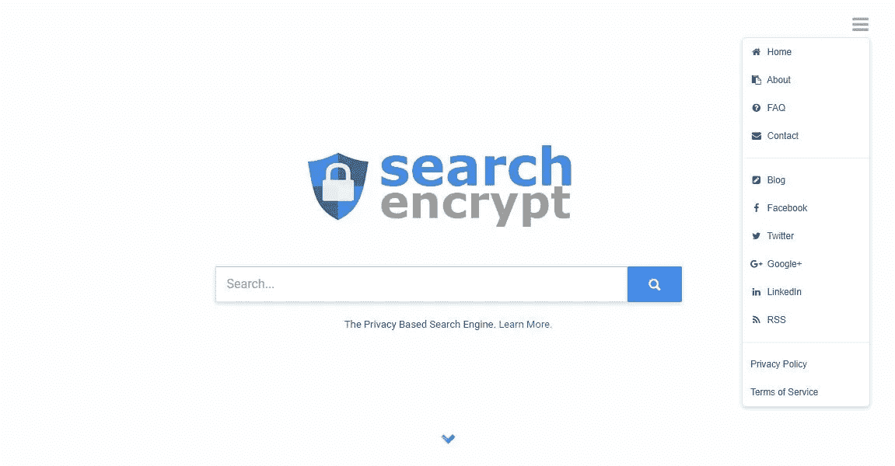

# 我是如何完全从谷歌转向加密搜索的

> 原文：<https://medium.com/hackernoon/how-i-switched-completely-from-google-to-search-encrypt-65cf7cb4c75a>

所以我想在一周内基本上不让谷歌出现在我的生活中，然后看看情况如何。我想，我一天只使用几次谷歌，所以这应该不难。

***我错了……***

我经常使用谷歌**。我想你可能也是这样。首先，谷歌偷偷进入我的互联网使用，而我没有注意到。我的意思是，虽然我可能不会经常输入“www.google.com ”,但我最终还是会使用谷歌服务。**

*   **如果我在网上看视频，很可能是在 YouTube 上。即使我实际上没有在 YouTube 上观看它，谷歌仍然知道…**
*   **如果我使用的是需要登录的服务，比如 Medium 或 Quora，很有可能我会用我的谷歌账户登录(或者我的[脸书](https://hackernoon.com/tagged/facebook)，这也好不到哪里去)。**
*   **在我的工作电脑上，我 75%的时间都在使用谷歌浏览器。其余时间我用 Mozilla Firefox。一直切换到 Firefox 应该不是问题。**
*   **如果我对某样东西感到好奇，我会经常在 iPhone 上打开 Safari，从 Omnibar(一种谷歌搜索)搜索。戒掉这个习惯可能更难，只是因为我想都不敢想。当我有问题的时候，我会本能地用手机在谷歌上快速搜索。我只需要把我默认的搜索引擎从谷歌上换下来。**

# **隐私和定制**

**隐私和定制通常是相互竞争的力量。一个网站要记住我的自定义设置，它需要能够识别什么时候是我在访问网站，而不是我网络上的其他人。**

**Search Encrypt 在其主页上不提供任何定制服务。不过这没什么，因为即使在谷歌上，我也从未改变过我的“[搜索设置](https://www.google.com/preferences)”。其他私人搜索引擎，如 StartPage 和 DuckDuckGo，提供“隐私友好”的定制选项。**

**我真的不觉得这些设置有用，要在 DuckDuckGo 和 StartPage 上使用它们，我必须使用自定义 URL。我很少用书签，所以对我来说不太方便。**

***如果把你的猫作为搜索引擎的背景是你最关心的，那么私人搜索引擎可能对你来说并不重要……***

****

**Search Encrypt Home Page**

**Search Encrypt 有一个干净的界面，老实说，它让我想起了谷歌。[相比之下，StartPage 和 DuckDuckGo](https://hackernoon.com/untraceable-search-engines-alternatives-to-google-811b09d5a873) 在它们的主页和结果页面上有着不同的*外观和感觉*。**

# **结论:切换到搜索加密很容易，除非你需要替代谷歌产品**

**当我说我使用谷歌产品(Gmail、谷歌文档等)时，我会说我是大多数。)，但我一点也不依赖它们。为了工作，我们使用不同的电子邮件提供商。在大学期间，我主要用谷歌文档和谷歌驱动来做项目——所以我不会用它们。Search Encrypt 满足了我的搜索引擎需求，但显然不能像 Google 一样提供全套的互联网工具。**

# **了解有关搜索加密的更多信息**

** [## 关于搜索加密:私人搜索引擎-搜索加密博客

### 你可能听说过 Search Encrypt，或者这可能是你第一次听说我们的私人搜索引擎…

choosetoencrypt.com](https://choosetoencrypt.com/search-encrypt/about-search-encrypt/)  [## 搜索加密是如何工作的？-搜索加密博客

### Search Encrypt 是一个以隐私为核心价值的私人搜索引擎。搜索加密保护您的隐私…

choosetoencrypt.com](https://choosetoencrypt.com/tech/how-search-encrypt-works/) 

***感谢阅读！*****