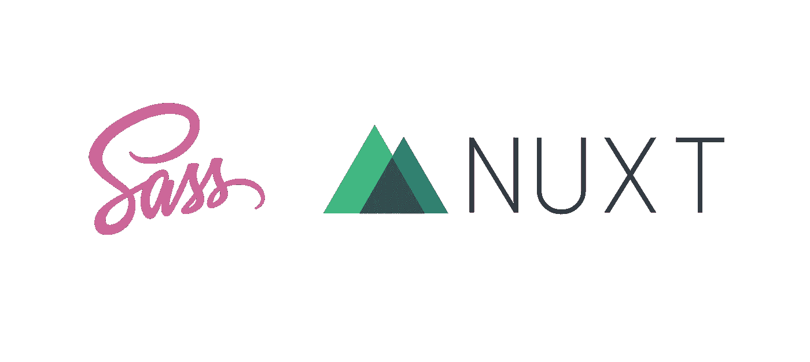

# 我如何在 Nuxt.js 项目中全局使用 SCSS 变量、混合和函数，同时用 4 个步骤编译 CSS 实用程序类！

> 原文：<https://medium.com/hackernoon/how-i-use-scss-variables-mixins-functions-globally-in-nuxt-js-projects-while-compiling-css-utilit-58bb6ff30438>



自从 3 年半前我开始制作网站以来，我一直在使用 Sass。我爱死它了！！！我觉得它填补了 CSS 的许多缺失功能，同时也使我的风格更加简洁，更容易使用。我正努力让 2018 年成为我征服 VueJs 的一年。有一个问题。我仍然想让我的 Sass 变量、函数和 mixins 对我所有的单个文件 Vue 组件可用。我也希望有一堆使用相同的变量、函数和混合创建的全局 CSS 实用程序类。我是这样做的。

# 编译 Sass

我有一个风格的集合，不管我使用的是 [Vue.js](https://hackernoon.com/tagged/vue-js) 、Rails 还是 WordPress，我都会把它移植到每个 now 项目中。(獾 SCSS [工具包](https://hackernoon.com/tagged/toolkit)将于 2018 年 4 月发布)。我所有的 CSS 选择器都是实用程序类，我希望它们可以用于我的 Nuxt 项目。做起来超级简单！我有一个单独的 Sccs 文件，我用它来导入我所有单独的 SCSS 文件，所以这将是我要编译的文件。如果你愿意，你可以包含多个文件，但是我真的建议用一个干净的文件来处理你所有的导入。

1.  确保您安装了`node sass`和`sass-loader`;

```
npm i -D node-sass sass-loader
```

2.在你的`nuxt.config.js`文件中包含你的 SCSS，在那里你可以导入所有其他的 SCSS。

```
css: [
    '@/assets/scss/main.scss'
]
```

像魔术一样！现在你的 SCSS 正在被编译，并将被自动插入你头脑中的一个`<style>`标签中。更多信息请查看 CSS 上的 Nuxt.js 文档。

**编辑 2019 年 2 月 2 日—更新 Nuxt 模块说明**

# Nuxt 样式资源模块

令人敬畏的 Nuxt 社区已经创建了一个包，可以消除将 Sass/SCSS 文件暴露给 Vue.js 组件的所有痛苦。虽然我确实设法在没有这个包的情况下暴露了文件，但这有点痛苦。

1.  安装软件包；

```
npm i -D @nuxtjs/style-resources sass-loader node-sass
```

2.您需要通过更新您的`nuxt.config.js`，让 Nuxt 知道您想要暴露哪个文件；

```
module.exports = {
    // Other nuxt.config.js

    modules: ['@nuxtjs/style-resources'],
    styleResources: {
        scss: [
            'assets/scss/file/_path.scss',
            'assets/scss/file/_path-two.scss'
        ]
    }
}
```

真的就这么简单。欲了解更多信息和详细文档，请查看 [Nuxt 风格资源加载器的 Github repo](https://github.com/nuxt-community/style-resources-module) 。

任何问题/评论/bug/反馈请联系！感谢阅读。

## 旧加载 Sass 加载插件

这个插件现在被弃用了，但这是我以前访问的方式，但这是我以前的指令

[**Nuxt Sass 资源加载器**](https://github.com/anteriovieira/nuxt-sass-resources-loader)

令人敬畏的 Antério Vieira 已经创建了一个包来消除将 Sass/SCSS 文件暴露给 Vue.js 组件的所有痛苦。虽然我确实设法在没有他的包的情况下暴露了文件，但这有点痛苦。如果你热衷于自己做这件事，看看这个 Github 问题帖子，塞巴斯蒂安·肖邦会告诉你怎么做。

1.  安装软件包；

```
npm i nuxt-sass-resources-loader
```

2.您需要通过更新您的`nuxt.config.js`，让 Nuxt 知道您想要暴露哪个文件；

```
module.exports = {
    // Other nuxt.config.js

    modules: [
        [
            'nuxt-sass-resources-loader', 
            [
                'assets/scss/file/_path.scss',
                'assets/scss/file/_path-two.scss'
            ]
        ]
    ]
}
```

真的就这么简单。欲了解更多信息和详细文档，请查看 [Nuxt Sass 资源加载器的 Github repo](https://github.com/anteriovieira/nuxt-sass-resources-loader) 。