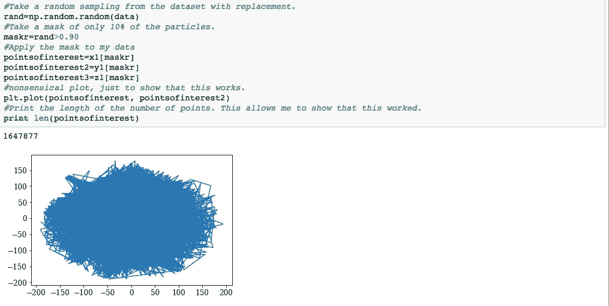

# 我如何使用 Python 让大数据看起来很小

> 原文：<https://medium.com/hackernoon/how-i-used-python-to-make-big-data-seem-small-cb2beef679f5>

我是一名天体物理学研究助理。这项工作需要管理和操作大型数据集。为了做到这一点，我必须采用反映更大数据集的子集。为了让我的计算机能够运行我的代码而不出现运行时错误，我必须取原始粒子的 10%的子集。这给了我一个与原始图像相似的图像，同时仍然能够在我的笔记本电脑上运行。为此，我使用了 [numpy.random](https://docs.scipy.org/doc/numpy-1.14.0/reference/routines.random.html) 。如何做到这一点的示例如下所示。

Image of my code.

在我使用随机粒子后，我创建了一个只有 10%粒子的遮罩。这允许我让我的代码以更快的方式运行，并允许我维护数据集的准确描述。这些数据集的快照提供了有价值的信息，让我能够更快地得出结论。

我希望你花时间亲自尝试一下这个方法！编码快乐！

感谢您的阅读！