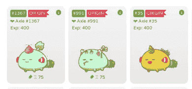

# 我如何评价数字收藏品

> 原文：<https://medium.com/hackernoon/how-i-value-digital-collectibles-ed3f28b510ac>

由 [**@** Jihoz_Axie](https://twitter.com/Jihoz_Axie) ，成长引线@ [**效用:** Genesis 的基因组与其他 99 只“创始人”猫相似。这些猫是唯一拥有“美洲虎”和“猩猩”基因的第 0 代猫。这些基因也是纯种的，意味着每个创始人都有 50%的机会将其中一个基因遗传给后代。如果繁殖了 2 个创始人，那么与 OrangeSoda 和 Jaguar 有后代的几率是 100%。这只小猫在分散式游戏社区中也很“有名”,可能会被用来推广其他项目。例如，如果 Axie Infinity 购买了 Genesis 并将其命名为“Axie Infinity ”,这可能会导致一些人关注我们的游戏。](https://medium.com/u/f4f989915036#1。此外，创世纪还有一个专属标签，这在他们的宇宙中也是相当罕见的。

<p id=)[今天早上刚刚以 0.75 美元的价格售出一台](https://etherscan.io/tx/0x17c03626f0a9688460387ace7a6620ab8ada3c4c64ea3a68673730d1e96ddf7a)

通过我们的销售合同卖出的最贵的 Axie 是一个售价为 9.5 ETH 的“Triple Mystic”Axie。

我希望你们觉得“三重威胁”框架有用。我看到许多人一头冲进加密收藏品，做出错误的决定，然后在意识到他们以低效的方式部署他们的资本后抱怨，这让我很沮丧。不是每个人都把秘密收藏品视为投资。然而，如果你是对投资这个领域感兴趣的人之一，我认为这个框架可能对你有用。

非常爱你，

吉霍兹

附:如果你想与我联系并讨论我在这里提出的想法，请随时给我发电子邮件到**Jeff@axieinfinity.com**或在 Axie Infinity Discord:[https://discord.gg/68DeTqc](https://discord.gg/68DeTqc)找到我。你也可以在 twitter 上找到我 [**@** Jihoz_Axie](https://twitter.com/Jihoz_Axie)

*如需了解更多信息，请加入我们 Discord 的讨论或在 Twitter 上关注我们。也记得喜欢这个内容就鼓掌分享。*

阿克西无限: [https://axieinfinity.com](https://axieinfinity.com)
Discord: [https://discord.gg/68DeTqc](https://discord.gg/68DeTqc)
Twitter: [https://twitter.com/AxieInfinity](https://twitter.com/AxieInfinity)
Facebook: [https://www.facebook.com/AxieInfinity](https://www.facebook.com/AxieInfinity) Instagram: [https://www.instagram.com/axieinfinity](https://www.instagram.com/axieinfinity/)
Reddit: [https://www.reddit.com/r/Axieinfinity/](https://www.reddit.com/r/AxieInfinity/) T17:T18:https://t.me/axieinfinity