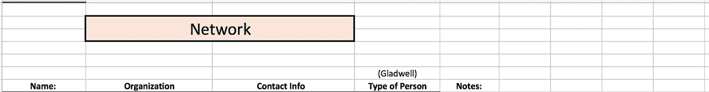
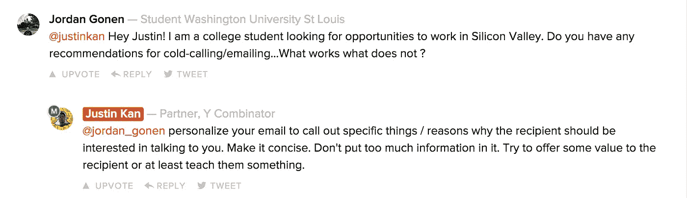
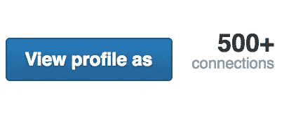

# 我是如何从一个陌生人变成在硅谷拥有人脉的

> 原文：<https://medium.com/hackernoon/how-i-went-from-being-a-stranger-to-having-a-network-in-silicon-valley-1fbae3d0a4c8>

You can find me on [Jordan Gonen](http://www.jordangonen.com/) or [Twitter](https://twitter.com/jrdngonen). Originally Published in November of 2016 in [Startup Grind](/startup-grind/how-to-hack-networking-50ee4cb74bf5)

我在生活中收到的一般性建议是，“尽可能多地去见人”，这可能是最常见的。

像大多数流行语一样，我发现自己在问，“这到底是什么意思？”“嗯，咄，我想见见人。但是怎么做？”

作为一个科技世界的陌生人，那时我才 18 岁，我需要所有我能得到的帮助。就在那时，大约一年前，我开始有意识地努力将这些建议内化，并定义一条加速我成长的道路。

# 所以我去了一个使命，去认识更多的人，建立更牢固的联系。

有人称之为网络。其他人使用一个奇特的短语，比如“建立关系”不管怎样，认识新朋友是非常有价值的。有了正确的心态，你可以从每个人身上学到东西。

“网络”活动可以分解为几个简单的部分:

*   弄清楚你的目标
*   与人接触
*   一起做一些创造价值的事情

我按照这个指南努力进入科技领域，结识新朋友。

The Hive

# 建立你的职业网络

*没有什么是一成不变的，你应该总是做适合你的事情*

在向外看之前，我们必须投资于变得有自我意识，这样我们才能最好地展示自己。大多数人跳过了这至关重要的第一步。他们在了解自己的优先顺序之前，会先提出要求。

自我意识是极难实现的。这不是一个可以衡量的标准，而是一个持续的发展过程。

我发现定义我的目标是至关重要的，但我仍然知道它们会发生变化。正是这种专注和流畅的平衡增强了我的生活。

# 开始的第一个问题:你的目标是什么？

含糊不清使得这个问题很难回答。但你最好问自己，而不是别人问你。你想要一份工作吗？实习？一种联系？公司介绍？等等。

立即问自己这些难题。接下来，你要找出你的原因。你为什么想要一份工作？实习？等等。

这里的最佳答案不是表面水平。他们需要一些思考，也许需要几层挖掘才能找到有价值的东西。没有错误的答案，只有无用的答案。

**不好的例子:**

*   你想要一份工作，因为你想赚钱。
*   你想实习是因为你明年想工作。

花些时间认真思考…你为什么想要一份工作？为了赚钱。你为什么要钱？去旅行？和朋友一起开心吗？为什么这份工作能让我得到这些？

你现在知道，或者开始明白，你是什么和为什么。在这一点上，你还应该定义你最擅长什么。你做了什么别人无法与之竞争的事？是什么让你独一无二？你有什么技能？

如果你觉得自己缺乏技能，或者似乎无法回答这些问题，考虑学习新的技能吧！

重要的是不要撒谎，因为此时你只是在对自己撒谎。人们重视诚实。

## 下一步是开始有目的的外联:

是时候向外看了，这样可以很快遇到人。这里的关键是要有目的性。

对我有效的两个最佳策略是:

## 1.直接外联

我想认识有趣的人，和他们一起学习，交流，创造价值。

所以我建立了一个拓展的框架:

接下来要学习的是如何写一封完美的电子邮件，这样你就可以接触到你的清单了。这是很多人搞砸的部分。这里有几个关键:简短，询问你想要什么，以及为什么他们应该关心。

不要光听我的，贾斯汀·坎(Justin Kan)有一些很好的建议:

以下是我发送的一个非常简单的框架(不是模板，只是一封示例邮件):

> 嗨，
> 
> 我的名字叫乔丹，我对科技和商业的交叉有着共同的热情。
> 
> 我对你在 ____ 和 ____ 的经历很感兴趣，很想找个时间聊聊你的过去，以及你对未来学生的建议。另外，我很乐意帮助你做 ________，因为我是 _ _ _ _ _ _ _ _。
> 
> 在一个对你合适的时间拍摄，我一定会让它成功，
> 
> 约旦

*不要用模板，每次都写出来，个性化

很简单，击中了所有的点。没有完美的电子邮件，但是有很多糟糕的。一定要迅速切入正题。

我在这里要注意的一件重要事情是，发送一两封电子邮件很可能不会给你带来任何结果。事实上，发送 20 封电子邮件可能不会得到任何回复。

如果你想真正投资建立一个品牌和网络，你必须长期投资。只有真正投入、持续的努力才能给你带来结果。

如果你的目标是建立一个网络(这并不是必须的)，那么试着从每天一封电子邮件开始。然后缩放。从你可以每天执行的事情开始。这会帮助你获得动力，激励你继续前进。

## 2.加入一个团体

另一种建立人际网络的方法是加入一个和你有共同兴趣的社区。这一条相当简单明了，但是非常有帮助。

积极参与社区活动并提供有价值的信息大有裨益。

在科技领域，一个很好的方法是在这样的地方:

 [## 产品搜索

### 产品搜索是每天对最好的新产品的策划。发现最新的移动应用程序、网站和…

www.producthunt.com](https://www.producthunt.com/)  [## 黑客新闻

### 谷歌人工智能发明了自己的加密算法

news.ycombinator.com](https://news.ycombinator.com/)  [## 启动基础|启动聊天

### 一群纯粹的创始人在内容、反馈和分享想法方面互相帮助。你选择频道然后…

startupfoundation.co](http://startupfoundation.co/hashtag_startup/) 

这些只是几个例子。你也可以加入“科技推特”,通过这种方式认识很多人。不管怎样，加入一个社区是一种很好的建设方式。

# 最后一部分，做点什么！

认识很多新朋友并把他们添加到你的 LinkedIn 个人资料中是一回事。不要再瞄准 LinkedIn 上 500+的连接。

许多人会告诉你，要找到一份好工作或建立一个大企业，你需要有大量的朋友和职业关系。

事实是:任何人都可以达到 500 个连接。那不值钱。

**什么是有价值的？深刻而有意义的联系。**

> 我学到的最重要的一课是，你的密友是最能帮助你成长的人。在一个稀疏的网络中，一些强有力的结合比许多联系重要得多。

虽然很难建立一个无机的网络，我上面列出的步骤是对我有效的方法。

我永远感激通过这次拓展活动结识的人们。伟大的事情，像愚蠢的项目和不可思议的饭菜，都源于此。

虽然不是每个人都会接受这个建议，但我会一直在这里帮助你~一定要伸出援手！

# 你可以在[乔丹戈宁](http://www.jordangonen.com/)或[推特](https://twitter.com/jrdngonen)上找到我