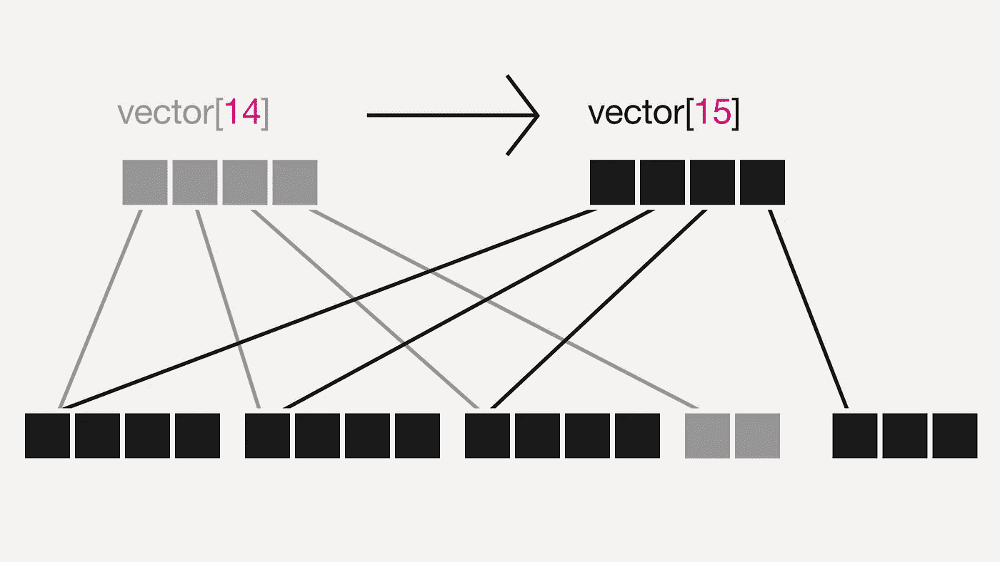
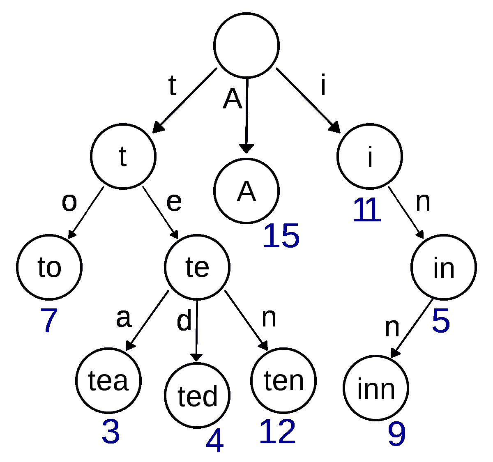
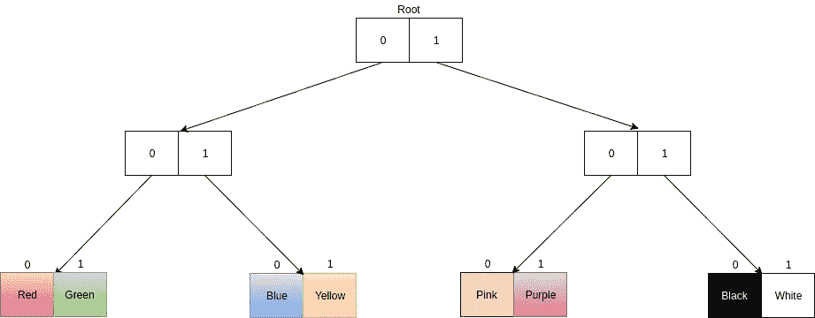
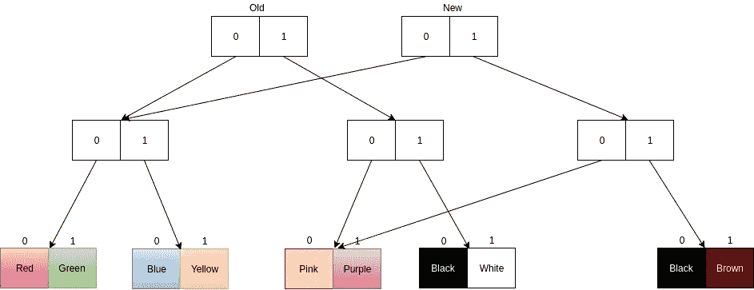

# 如何优化不可变数据结构(例如，不可变. js)

> 原文：<https://medium.com/hackernoon/how-immutable-data-structures-e-g-immutable-js-are-optimized-using-structural-sharing-e4424a866d56>



[http://leonov.net](http://leonov.net)

最近我一直在用 T4 JavaScript T5 学习 T2 函数编程。由于函数式代码的优雅，我开始真正喜欢函数式编程。

不变性是函数式编程的基石之一。以下是使用不可变对象的一些优点。

*   不可变对象更容易构造、测试和使用
*   真正不可变的对象总是线程安全的
*   它们有助于避免[时间耦合](http://enterprisecraftsmanship.com/2017/04/10/temporal-coupling-and-immutability/)
*   他们的使用是无副作用的

如果你想了解更多关于为什么你应该使用不可变对象的知识，这篇文章是一篇很好的文章。

但是当谈到不变性时，首先想到的问题是性能。举个例子，假设我们有一个整数数组。我们需要改变数组中的一个整数。现在，如果我们想保持不变，而不是改变数组的位置，我们需要保持原来的数组完好无损，并返回一个新的数组与改变的整数。为此，我们需要创建一个新的数组并复制旧的元素。这比就地改变阵列要昂贵得多。

在这篇文章中，我将讨论一种用于优化不可变数据结构的方法，称为“结构共享”。首先，让我们学习什么是持久数据结构。

# 持久数据结构

这就是维基百科引入持久数据结构的方式，

> 在[计算](https://en.wikipedia.org/wiki/Computing)中，**持久数据结构**是一个[数据结构](https://en.wikipedia.org/wiki/Data_structure)，当它被修改时，总是保存它自己的前一个版本。这种数据结构实际上是[不可变的](https://en.wikipedia.org/wiki/Immutable_object)，因为它们的操作不会(明显地)就地更新结构，而是总是产生新的更新结构。

持久数据结构通常用在函数式编程中，因为这增强了不变性。几乎所有的函数式编程语言都有持久数据结构的实现。 [Immutable.js](https://facebook.github.io/immutable-js/) 是一个实现持久数据结构的 JavaScript 库。

这些实现经过了大量优化，以提高性能。结构共享是用于优化的技术之一。

# 努力

首先，如果你不熟悉 Trie 数据结构，我们需要先了解什么是 Trie。Trie 是一种特殊的树数据结构。看看维基百科上的下图。



wikipedia

这与二叉树不同，因为没有节点专门存储与该节点相关联的键。节点在树中的位置定义了它所关联的键。某个节点下的所有节点都有一个公共前缀。值往往只与叶(以及一些内部节点，如果它们有意义的话)相关联。尝试通常用于存储字典。从这个例子中我们可以看到，我们可以很容易地验证单词并获得部分单词的建议。请参考[此处](https://en.wikipedia.org/wiki/Trie)了解试炼详情。

# 使用 Trie 来表示数组

现在我们知道了 Trie 是什么，让我们看看如何用 Trie 来表示一个数组。以下面的数组为例，

[“红”、“绿”、“蓝”、“黄”、“粉”、“紫”、“黑”、“白”]

让我们看看如何用 Trie 来表示它。



不错吧。

所以现在你会问我如何得到索引 1 的元素。如果按照路径“001”(0 表示左节点，1 表示右节点。从根节点开始，你可以找到索引为 1 的元素(绿色)。每个叶节点都有一个唯一的地址。使用这些，我们可以索引元素。

现在让我们看看为什么我们把数组表示为一个 Trie。假设我们需要将这个数组的最后一个元素从“白色”改为“棕色”。我们希望以持续的方式完成这项工作。因此，改变原始数据结构不是一个解决方案。让我们来看看下图。



您可以看到旧的根仍然在那里，您可以使用它来访问旧的数组。添加新元素后的数组是具有新根的结构。通过重用旧的结构，我们用新元素创建了一个新的数组。如果我们有一个传统的数组，我们必须复制所有的元素。

# 使用 Trie 来表示散列图或对象(JavaScript)

我们已经了解了如何将数字索引数据结构表示为一个 Trie，并使用结构共享来优化它作为一个持久数据结构。接下来让我们看看如何用非数字键来表示一个对象。

这很简单。在散列映射中，我们为每个键获取一个数字散列，并使用它来创建一个数据结构。我们可以在这里使用相同的想法。

```
hash('a') = 97
```

让我们把一个字符串的哈希值作为它的字符 ASCII 值的总和。然后我们得到的是 97。我们可以使用这个值和模运算来创建一个 Trie 来表示数据结构。如果你想了解更多关于哈希表的工作原理，请参考[这里的](https://dzone.com/articles/how-hashmap-works-in-java)。使用 Trie 数据结构，我们可以以更有效的方式持久地处理对数据结构的修改。

# 分支因子

考虑到分支因素，为了简单起见，我们在示例中使用了双向分支。但是对于一个大的数组，这将意味着一个非常深的树。深树提供了大量的共享，因此减少了内存的使用，但是随着树越来越深，修改的时间也增加了。应该有一个平衡。 [Clojure](https://clojure.org/) (一种函数式编程语言)使用 32 路分支。这提供了良好的平衡。十亿个元素的 Clojure 数组只有 6 个节点深。你需要 350 亿个节点来达到 8 个节点的深度。

# 修改的时间复杂性

传统上，如果你想创建一个新的数组并改变一个元素，需要 O(n)时间。但是通过尝试的表示和使用结构共享，它可以降低到 O(log(branch _ factor)n)。由于分支因子是一个常数，这意味着 O(log n)。

# 结论

在本文中，我们已经学习了如何使用带有 try 的结构共享来实现高效的持久数据结构。欲了解更多信息，请查看参考资料。

**参考文献:**

*   不可变. js 文档[https://facebook.github.io/immutable-js/docs/#/](https://facebook.github.io/immutable-js/docs/#/)
*   clo jure persistent vectors[http://hypi rion . com/musings/understanding-persistent-vector-pt-1](http://hypirion.com/musings/understanding-persistent-vector-pt-1)

## 在你走之前！

如果你喜欢这篇文章，欢迎鼓掌！！！