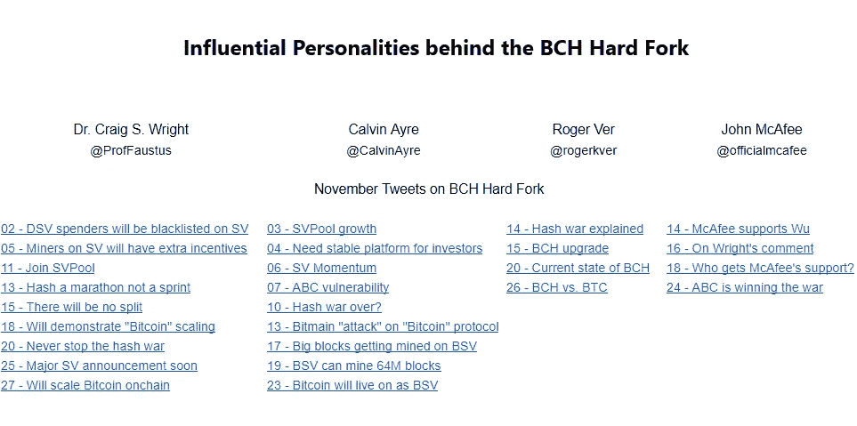

# 影响者如何改变市场

> 原文：<https://medium.com/hackernoon/how-influencers-change-the-market-f6bc2c0c53ca>

金融市场是一个复杂的系统，极度依赖于交易者的决策、公司的表现以及一系列外部因素，如政治和社会形势。假设特定的人物是市场变化的幕后推手将是一件奇怪的事情，但有足够的理由相信这可能是事实。

对加密货币市场动态的洞察通常是通过检查 Twitter 和脸书等热门社交媒体账户，以及关注 Reddit 上的社区或阅读 Medium 上与加密货币相关的帖子来获得的。这些社交平台中的每一个都允许持续的交流和用户生成信息的传播。影响者通常活跃在至少一个社交网站上。这里我们指的不仅是那些在网上分享新闻和观点的名人，还包括围绕加密相关主题开发在线亚文化以吸引大量受众的加密货币爱好者群体。这项研究考察了有影响力的密码行业人士通过其 Twitter 账户传播的观点和见解如何影响数字资产的汇率波动。

**从行业领导者到潮流引领者**

与意见领袖合作的总体目的是培养对特定项目的共同积极态度，并使受众参与众筹活动。这就提出了一个问题，即如何评价公众对促销信息的反应。为了探究促销信息和汇率之间的相关性，我们分析了与意见领袖发布其促销内容的时间段相关的汇率的关键变化。

我们可以确定与加密货币市场更新相关的三种不同类型的 Twitter 账户:围绕杂志和新闻门户网站上的广泛跨部门主题发展的技术和加密社区；交易公众或交易相关账户，实时发布来自加密世界的最新消息；通过实践或推广特定理念对如何理解加密市场做出重大贡献的关键人物。

密码市场的发展反映了双重运动。一种趋势是由外部事件引导的，这些事件会改变市场的看法，从而改变对世界金融格局的看法；另一个导致对新资产和产品的认可和采用。两条发展线对交易策略都有明显的影响。由于调查的主要目的是在有影响力的促销活动和资产率之间建立联系，我们特别关注了密码行业关键人物和交易员的 Twitter 账户。我们将这两类信息与媒体报道的重大事件进行了比较。

首先，我们建立了两组被称为影响者和交易者的账户，每组包含 10 个账户，这些账户在关注者数量上非常匹配，并且与转发相比，包含高达 60%的季度创建推文的个人消息。拥有 30 万至 50 万追随者的 Twitter 账户被用于选择有影响力的人物，而那些拥有 5 万至 15 万追随者的账户被用于选择交易账户。为了识别有影响力的背景，推特被人工审查。其次，我们分析了一个年度叙事的范围，并选择了一个由六个叙事组成的语料库，这些叙事在 2018 年上半年成为媒体审查的一个焦点。所选叙述的重要性由媒体提及的频率决定。在研究的最后阶段，我们比较了两组中与每个新闻公告相关的推文数量，并计算了推文数量的百分比，如图表 1 所示。

应该注意的是，由此产生的推文与账户所有者的商业利益密切相关，因为作为创始人、首席执行官或主要投资者，他们肯定会跟踪对其公司或利益领域有最重大影响的领域的事件。特别是加密影响者倾向于密切参与一个或多个项目，因此对与这些特定项目相关的新闻更感兴趣。作为这一点的延伸，他们也可以更具规范性，倡导他们的想法和喜爱的项目。我们归类为交易者的账户更具描述性和分析性，对影响整个加密市场的事件更感兴趣，而不是任何特定的项目。然而，奇怪的是，与 SEC 法规相关的新闻引起了第一类人更大的兴趣。这可以解释为它们对特定项目更重要，如比特币或以太坊。

*Chart 2a.* BCH: Price changes in November 2018\. Based on data for November 2018 provided by Coinmarketcap.com. Prices are given in USD.

我们还决定使用比特币现金硬分叉的例子来研究影响者对特定数字资产价格的可能影响:这一事件影响了整个加密市场，并引起了加密货币社区各方的评论。虽然其中也涉及其他因素，但主要行业人物和公司的参与肯定很重要，尤其是在“混战”期间说服矿工和其他行为者支持一方或另一方的时候。

*Chart 2b.* Influencers and the BCH hard fork. Based on data for November 2018 provided by Coinmarketcap.com. Prices are given in USD.

*Table 1\.* Influential personalities behind the BCH hard fork. Summaries of the most notable November tweets of crypto influencers who were most prominently involved in the conflict: Craig Wright and Calvin Ayre as the leaders of the BCH SV camp, Roger Ver as their opposite number on the BCH ABC side and John McAfee as a vocal late supporter of the latter’s ally, Jihan Wu.

同样值得一提的是，由于其广泛接受的影响，交易分析师 Tone Vays 在 11 月 8 日对赖特的采访和 11 月 18 日对 BCH ABC 的批评，以及以太坊创造者 Vitalik Buterin 在 11 月 14 日对赖特的批评性推特。

必须指出的是，总体而言，密码市场的主要声音更倾向于支持 BCH ABC。然而，BCH SV 的支持者用纯粹的数量弥补了这一点。直接参与竞争项目的人可能会损害彼此的立场，而不是推进各自的事业，因为他们的推文通常缺乏改变人们想法所需的惊喜因素(尽管赖特对 ABC 的威胁可能特别有助于吓跑投资者)。像 John McAfee 和 Tone Vays 这样的“哈希战争”的局外人有更大的影响，因为他们没有被视为在任何一个项目中固有地投资到这样的程度。在艰难分叉之后的几周里，关于这个主题的推文频率有所下降，这可能使它们更有影响力。特别是，美国广播公司的相对衰落及其竞争对手在本月最后三分之一的复苏可能部分归因于后者的支持者对前者明显缺陷的批评和适时的宣布。

意见领袖对市场的未来有什么看法？

在 2018 年的加密货币熊市中，许多代币失去了很大一部分价值，这可能让一些更随意或最近的参与者感到失望或害怕，但我们为了了解他们对市场的看法而联系的加密行业领导者和专家仍然毫不畏惧。他们是长期投资者，可以或多或少从容应对暂时的下跌趋势。根据会计师事务所基金的**蒂姆·道森**的说法，“这正是直接对冲和卖空有用的环境类型。这种类型的危机不仅有可能被该基金经受住，而且会让你看到它的一些创纪录表现。”**西蒙·科金**，爱尔兰科技新闻和加密货币主编。News 指出，虽然加密市场肯定面临不利条件，但“在第三季度，也有许多投资者根据他们何时卖出和何时买入获得了回报”。

可能影响 2019 年市场的主要趋势之一是政府法规的增长和发展。然而，这种影响的确切形式和确切性质仍不清楚。Cocking 对市场监管前景的看法是，尽管爱沙尼亚等一些国家在制定加密货币相关立法方面走在了前列，以成为市场领导者，但包括美国在内的其他国家则采取了观望的态度，以学习他们的经验。汤森路透的技术专家 Joseph Raczynski 评论了美国司法管辖区之间的差异，提到了俄亥俄州和怀俄明州等一些州采取的开创性做法。“有些人会反对，有些人会赞成，这将是一个重要的开端”。他补充说，“我们已经看到了基于规则的加密市场的变化。从短期来看，它会把事情压下去，许多较小的项目会被淘汰，一些会消失。其他人会活下来”。他强调了加密金融基础设施项目巨大的未开发潜力。

最终，市场的未来很难预测，但认真参与其中的人很少会认为它会崩溃。用道森的话来说，“我们认为加密的波动性使得加密市场成为一个很好的交易场所，所以我们不希望它在短期内发生变化。它可以去牛市或熊市，因为它一直在前进！”虽然强劲的牛市是可能的，但目前还没有确凿的证据。然而，随着市场适应其损失和不断发展的监管，2018 年的幸存者和新项目都将有很好的机会吸引投资者。要做到这一点，他们需要一个可靠的概念来满足真实的、得不到充分满足的需求，但他们也需要依靠声誉完好的专家和有影响力的人，以便接触到久经沙场的加密货币社区。

本报告由 Bonanza Kreep 编写。报告中包含的信息是截至发布之日的最新信息，可能不反映发布之日后发生的任何变化。有关本出版物的任何查询，请发送至 [ceo@bkreep.pro](mailto:ceo@bkreep.pro) 的 Bonanza Kreep。