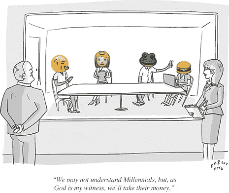

# 互联网巨头如何让千禧一代继续贫穷

> 原文：<https://medium.com/hackernoon/how-internet-behemoths-are-keeping-millennials-poor-216dcba55d35>

你有没有停下来想过，我们在互联网上分享了多少时间、注意力和内容，而我们除了模糊的“曝光”概念之外，基本上没有得到任何回报，这是多么疯狂？哦，是的，我们为曝光做的事情…

曝光的悲哀之处在于，它不能养活你，除非你有很多曝光，即使有也只是可能。在 YouTube 上，只有大约 3%的内容创作者能够挣到足够的钱度过贫困线。一直以来，脸书和谷歌合计占了[2017 年](https://www.forbes.com/sites/johnkoetsier/2018/03/09/report-google-captures-nearly-80-of-all-retail-search-ad-spend/2/#14b2b540445a)全部在线广告收入的 73%。向这个世界问好，在这个世界里，大多数千禧一代将永远不会拥有自己的房子，或者负担不起他们的孩子上大学。向你的个人数据被用来为前 1%的人创造财富的世界问好。

我们太习惯于刻板地思考我们创造的“内容”，以至于大多数人甚至没有意识到他们的自拍是最没有价值的资产。目前，我们创造了大量令人厌恶的数据，这些数据被重新打包，然后卖给公司。这些公司有胆量抱怨“千禧一代正在扼杀钻石行业。”说真的，弯下腰。

Farley Katz via New Yorker

这里有一个想法:*为什么在“现实世界”中驱动人类行为的同样的激励机制没有应用在互联网上来解决困扰“网络世界”的众多问题？*在这些问题中，最主要的是缺乏补偿，其次是隐私丑闻、侵犯版权、假新闻和虚假流量——所有这些我们已经非常习惯于听到，尤其是如果一个人经常访问某个特定的小鸟品牌微博网站。

从表面上看，这似乎是一个相当简单的问题。然而，答案是真正多方面的，可以带我们穿过跨学科领域的贫瘠土地，那里食物匮乏，大多数时候，需要从仙人掌中挤出水分。

首先，我们需要理解缺乏基于激励的网络空间治理体系的严重后果。对于这一点，我们不需要看得比最近涉及脸书的丑闻更远。

**我们如何创造了一个怪物**

毫无疑问，互联网是一个奇妙的工具，它以我们以前无法想象的方式改变了世界。然而，更多的时候，我们面临着连通性的真实而丑陋的代价——身份的淡化。

当然，最近的一个例子是剑桥分析丑闻，它导致每个人都喜欢的外星人在美国国会作证。流行的观点仍然是，如果你想要一个让你与人联系的免费服务，那么你的在线个人资料将会被用来向你出售东西。大多数时候我们并不介意。鞋子广告通常不太准确，不会引起笑声[我确信向我出售我已经购买的东西会有很大的价值]。当产品不再符合预期的“产品”轮廓时，一切都变得糟糕了。意识形态是一种产品吗？

为什么允许脸书和其他公司为了个人利益侵犯我们的隐私？为什么允许公司利用我们的数据向我们展示一个混乱无序的世界，在这个世界里，恐惧和愤怒引导着我们的决策过程？你可能觉得我跑题了。

*相反，正是这种我们已经习以为常的“自由竞争”的商业模式导致了我们今天所面临的世界。*

本质上，随着 Web 2.0 的兴起，我们看到了一种新型公司的出现，它管理着一个社区中心。对全球社区的集中控制为这些公司提供了强大的力量，在某些情况下，就连它们自己也没有完全理解这一点。剑桥分析公司正是利用了脸书的这一弱点。

现在，我们可以确定的两个主要问题是:

1.  提供免费软件的公司通过向广告商提供数据分析来赚钱，这导致了非常准确的客户定位工具的产生，这些工具可以用来大规模影响决策能力。
2.  对数十亿用户的集中控制点和缺乏经济上合理的基于激励的系统导致混乱、剥削和不公平的价值分配。

现在，让我们重复一下开始时提出的问题，看看所有这些是如何联系在一起的:*为什么在“现实世界”中驱动人类行为的相同激励机制没有应用到互联网上来解决困扰“网络世界”的众多问题？*

直到几年前，我们还没有合适的工具将先进的经济模型引入在线系统。我们也没有看到现有模式对隐私、自由和我们赚钱能力的威胁有多大。就目前情况来看，没有人会大声疾呼“我创造的数据是我的，你应该为此付钱给我！”即使有，也只是声音不够大。现在，这种情况开始改变。

**觉醒**

现在，我们主要使用具有集中控制点的系统。所有规则都由运行该系统的公司强制执行。这样的公司可以在考虑公司最佳利益的情况下实施它认为合适的变革。例如，这在某些情况下适用于制造商和零售商。然而，当一家公司像一个管理机构一样管理着数百万或数十亿人的社区中心时，会发生什么就不那么清楚了。

在全球社区中，提供工具来更好地联系人们具有内在价值。然而，对消费者数据和行为进行集中控制会带来很大的风险:用户很容易被操纵，并且用户数据只有一个访问点。

用户无法控制自己的在线身份:他们不能发布他们想要的内容，他们不能看到他们想要的内容，他们不能以他们认为合适的方式将他们的信息和内容货币化。拥有该平台的公司对网络上发生的一切拥有最终决定权。在某种程度上，这(有点)有道理，因为这些公司害怕为用户的言行负责。他们扮演权威人物的角色。然而，控制数百万人的网络生活使他们不是公司，而是…到底是什么？*政府？尺子？*

我们不知道。该系统没有准备好应对公司控制社区时会发生的情况，以及如何重新定义它们的权力结构。

**区块链意味着自由？**

尽管最近的隐私丑闻很糟糕，但它们也有积极的结果——它们让人们重新思考他们如何看待隐私，如何看待社交网络公司，并让他们开始思考为什么他们创建的数据不是真正属于他们自己的。

简而言之，人们已经准备好继续前进，正在寻找替代方案。因此，许多公司开始利用新兴技术创造非常规解决方案。到目前为止，最令人兴奋的是试图使用区块链的平台。我不想在这篇文章中过多地谈论区块链的本质，因为我觉得这应该是另一篇文章的主题。

然而，我将解释为什么区块链是我们一直在等待的希望的灯塔。简而言之:区块链是一个分布式账本，使用加密哈希来保护信息。它向其矿工提供基于博弈论的激励，以便他们保持诚实，并以社区的最佳利益为重。

区块链的发明产生了奇妙的效果，创造了一个新兴的密码经济学领域——一个跨学科的领域[密码学+经济学]，它着眼于系统设计(如区块链)，旨在分析人类行为，因为它适用于这些系统，以提供适当的激励。

现在，自互联网发明以来，我们第一次努力全面理解各种在线系统的经济含义。将区块链作为一个系统，将经济建模的原则作为管理规则，我们可以尝试在互联网上引入更好的价值分配。

然而，从一个集中的控制点转移到一个激励系统是一个挑战。如果没有强有力的执法，激励制度可能很难控制。这在现实世界和在线系统中都是如此。即使冒着坐牢的风险，一些人仍然会犯罪——随着我们走向在线身份，这也将成为一个问题。这不应该阻止我们将货币价值引入在线互动，只要我们也有一个强大的问责制基础。

那么，世界到底会走向何方？是不是陷入了进一步不平等的深渊？还是朝着密码安全的在线身份发展？我更倾向于认为是后者。同时，我想把我最喜欢的亨利·福特的名言留给你们:“如果你总是做你一直做的事情，你就会一直得到你一直得到的东西。”美国梦可能走错了方向，但区块链梦才刚刚开始。

***

编辑:2018 年 7 月 26 日

在 Yuser，我们密切关注行业新闻。就这样，就在几分钟前，我们发现另一家安大略省伦敦的公司刚刚解雇了 40 名员工。我想引用刚刚出现在 [The Logic](https://thelogic.co/) 的文章:

> 流量下降很大程度上是因为脸书对**内容算法的一系列改变。最近的一次变化发生在一月份，大幅减少了用户新闻订阅上发布者的空间。根据 SimilarWeb 的数据，Diply 严重依赖脸书分享来传播其有力而幽默的内容——该社交网络占其桌面社交流量的 90%以上。**

在脸书宣布其政策变化一周后，另一家内容公司[小事情](https://www.littlethings.com/)停止运营。所有其他出版商也受到这些变化的重大影响。现在，迪普利正在报告他们的削减。

如此多的公司、出版商和有影响力的人依赖脸书和其他社交媒体网络。这些公司对以下事实不负任何责任:当他们改变政策或算法时，许多人的生计往往会受到巨大影响。我想和你们分享这个，作为一个完美的例子，说明这个领域已经发生了一段时间了。如果你仍然怀疑这些互联网巨头实际上是让千禧一代贫穷的元凶，那就告诉这 40 个刚刚失业的人吧。

为了应对这一问题和其他因素，这个行业正在发生范式转变，甚至社交媒体巨头也感受到了影响。据分析师称，脸书将使 T2 的市值损失 1200 亿美元。对于一家价值超过 1500 亿美元的公司来说，这是历史上最大的跌幅！

变革即将到来，在 Yuser，我们很高兴成为其中的一员。虽然没有人能肯定地说到底会发生什么，但我现在可以告诉你，有一波公司进入科技领域，很快就会让你大吃一惊。

与此同时， **Yuser 有两个职位空缺**:一个是精通 JavaScript 的前端或全栈开发人员，另一个是营销/社区开发向导**。如果你符合这些描述中的任何一个，请在 info@yuser.co 联系我们。**

*****Eunika Sot****是 Yuser 的首席运营官，Yuser 是第一个分发区块链驱动的奖励的游戏化创意社交网络。你可以在这里* *了解更多关于 Yuser 及其革新社交网络空间* [*的使命。*](https://yuser.co/)**

**Yuser 目前正在积极开发中，正在寻找 beta 测试者和赏金猎人。如果您对我们的项目感兴趣，并且迫不及待地想试用我们的应用程序，请在[*【info@yuser.co】*](mailto:info@yuser.co)*对我们大喊一声。我们希望你成为我们社区的一部分，所以:* [*电报*](https://t.me/yuserQA) *和* [*推特*](https://twitter.com/yuser_network)*——你知道该怎么做！对于即将到来的代币销售和空投，请订阅我们的简讯@*[【yuser.co】T21](https://yuser.co/)*。***

**Yuser 将于 2018 年夏天在 Android 和 iOS 上发布。**