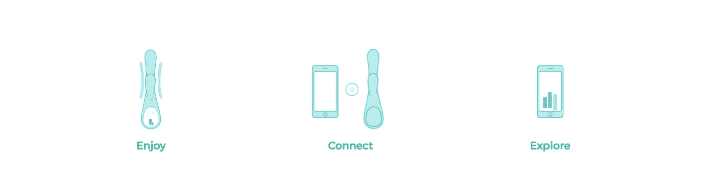
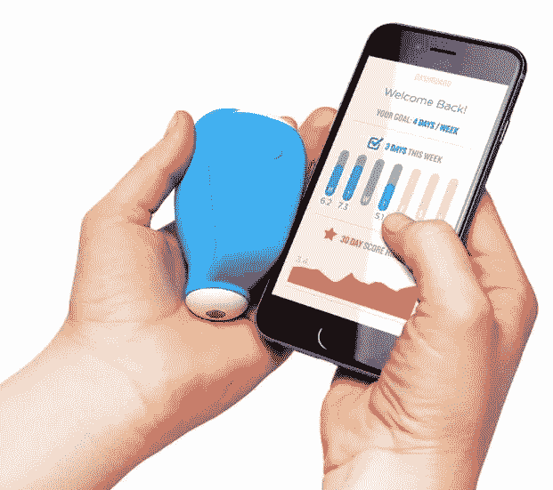

# 联网情趣用品如何让我们明白我们需要担心物联网

> 原文：<https://medium.com/hackernoon/how-internet-connected-sex-toys-makes-it-clear-that-we-need-to-worry-about-the-internet-of-things-525c2156e4e2>

“Become an expert in your own sexuality in 3 steps”, is how the Lioness vibrator is pitched. But where might your data end up?

## 联网冰箱是可能很快就会联网的普通技术的典型例子。把性玩具放到网上让物联网的问题更加明显。

说白了就是物联网(IoT)，意思是我们的东西都要联网。在其 [2017 炒作周期分析](https://www.gartner.com/smarterwithgartner/top-trends-in-the-gartner-hype-cycle-for-emerging-technologies-2017/)中，Gartner 估计物联网将在两到五年内到达大多数人。

到目前为止，物联网主要被[的书呆子们所接受。](/@hauken/en-kort-personlig-innføring-i-smarthus-28b760beba3)有联网灯泡、门锁、取暖器、咖啡机、浴室秤、机器人吸尘器、防盗报警器。但是由于物联网设备通常比其未联网的竞争对手更昂贵，所以它们不会成为主流，直到不精通技术的人发现物联网设备更优越。

有时技术的传播需要我们更基本的欲望的帮助。

# 色情传播技术的陈词滥调

一般来说，人类的欲望，特别是色情行业，如何促进新技术的传播的故事[已经成为一个老生常谈的话题](https://www.theatlantic.com/technology/archive/2016/06/how-porn-leads-people-to-upgrade-their-tech/486032/):超级 8 摄像机使业余色情成为可能。有了宝丽来相机，你可以拍出大胆的照片，而不用担心冲洗过程。色情行业选择了更便宜的 VHS 格式而不是 Betamax，并一直在推动按次付费-在线支付的解决方案和创新。

色情行业并没有发明这些技术，但经常发现这些技术比仅仅为了技术而技术有更广泛的吸引力。

# 性+物联网=？

如果你已经想知道为什么你的咖啡机应该在线，你可能会问同样的关于性玩具的问题。

有一些与性相关的物联网设备与色情无关。这个目标帮助女性[正确地做凯格尔运动](https://www.theverge.com/2015/1/26/7892551/kgoal-kegel-exercises-device-review)。这个小工具被插入阴道，并对你做练习的方式提供反馈。振动器雌狮[收集关于使用和高潮的数据](https://mic.com/articles/112886/a-pair-of-entrepreneurs-want-to-make-sure-every-woman-gets-the-pleasure-she-deserves#.RcDR1ln3n)，帮助主人弄清楚是什么影响了她的欲望和高潮。

So many iPhones next so to many sex devices. This is kGoal.

面向大众市场的性玩具生产商将他们的销售卖点包装成一个异地恋的浪漫故事。如果你的另一半能在地球的另一边控制你的玩具，那不是很令人愉快吗？遥控振动器已经有一段时间了，但也有成对的振动器和人造阴道(“Fleshlights”)，它们可以同时使用，并相互发送信号，相互控制对方的动作。

# 进入色情行业

随着 camgirls 和 camboys [开始使用双人情趣玩具](https://motherboard.vice.com/en_us/article/ae35be/cam-girls-are-hacking-teledildonics-to-make-virtual-sex-feel-real)，双人情趣玩具的使用迅速走出了浪漫的领域。自从网络摄像机出现以来，人们就一直在摄像机前做着或多或少露骨的事情。在世界各地，你会发现有人以网络视频节目为生，处于脱衣舞、色情和卖淫之间的数字灰色地带。

观众可以和表演者聊天，给他们小费。对于某个小费，你可以看到这个或那个动作。然而，价格正在被压低。有了联网的性玩具，摄像机女孩和男孩们可以让他们的观众在远处控制这些性玩具，并在一段时间内从人群中脱颖而出。

色情行业也发现了物联网的扭曲之处。人造阴道(“肌肉灯”)与一个上下移动阴道的小机器人相连。阴道机器人上线后，动作[可以和你在色情电影里看到的动作](https://thenextweb.com/gear/2017/07/07/fleshlight-launch-review-masturbation/)同步。一些色情电影就是专门为此拍摄的，经常以[第一人称](https://www.vice.com/en_us/article/neekj7/this-orgasm-machine-almost-revolutionized-sex-as-we-know-it) POV 拍摄。结合虚拟现实眼镜，色情行业希望创造出足够身临其境的色情作品，让人们愿意花钱购买。

(远离色情行业，你可以选择振动器 Vibease，它的运动与[有声读物色情](https://www.glamour.com/story/meet-the-smart-vibrator-that-syncs-with-your-audiobooks)同步。)

# 当你的设备被黑客攻击时会发生什么？

物联网小工具有很多有问题的方面，但随着性的参与，有问题的方面变得更加明显。所有连接到互联网的东西都可以被黑客攻击。如果不是你的女朋友在远程控制这个情趣用品，而是其他人侵入了它，你会有什么感觉？或者，如果有人得到了性玩具播放的音频和视频会怎么样？(是的，有带集成摄像头的振动器)。

关于性玩具[如何被黑，有很多例子。](https://www.pentestpartners.com/security-blog/vulnerable-wi-fi-dildo-camera-endoscope-yes-really/)去年，标准创新公司不得不支付原告[375 万美元](https://www.nytimes.com/2017/03/14/technology/we-vibe-vibrator-lawsuit-spying.html)，因为他们的 We-Vibe 振动器显然可能遭到黑客攻击，并且正在[将关于温度和振动设置的数据](https://www.theguardian.com/technology/2016/aug/10/vibrator-phone-app-we-vibe-4-plus-bluetooth-hack)发送回公司的服务器。换句话说，有可能收集到何时以及如何使用振动器。

# 你并不真正拥有你的物联网设备

其次，当你购买物联网设备时，不清楚你[真正购买的是什么](https://www.nytimes.com/2016/06/19/magazine/just-how-smart-do-you-want-your-blender-to-be.html)。即使你已经支付了数百美元，你也不能准确地决定如何使用或者如何使用[数据](https://www.nytimes.com/2016/06/19/magazine/just-how-smart-do-you-want-your-blender-to-be.html)。制造商可能会发送改变功能的软件更新。

当人们只需支付一次费用，而不是订阅一项服务时，他们如何能够为运营成本和进一步发展提供资金？当公司破产时，你的振动器(或者冰箱，或者灯泡)会停止工作吗？此外，如果商业模式不是那么稳固，但这个小工具可以[访问](https://www.theverge.com/2017/11/10/16634442/lovense-sex-toy-spy-surveillance) [大量](https://www.nytimes.com/2015/09/06/opinion/sunday/allison-arieff-the-internet-of-way-too-many-things.html) [数据，](https://www.nytimes.com/2016/06/19/magazine/just-how-smart-do-you-want-your-blender-to-be.html)出售数据或至少数据分析可能很有诱惑力。物联网没有明确遵守任何[法律要求](https://www.theguardian.com/commentisfree/2017/oct/06/drive-by-sex-toy-hacking-wake-up-call-britain-internet-security-vibrators)或[标准。](https://motherboard.vice.com/en_us/article/gv55vb/your-dildos-will-be-hacked)

# 以一种好的方式控制设备

幸运的是，互联网足够大，当然有人在努力把我们的性玩具带回来！在世界各地，已经有几个性黑客马拉松(它们远比名字所暗示的[无辜](https://www.theguardian.com/science/brain-flapping/2017/dec/01/its-a-sex-robot-but-not-as-you-know-it-exploring-the-frontiers-of-erotic-technology))。来自不同领域的爱好者将技术放在一起，用新的方式制造能够解决亲密关系和性需求的小玩意。有了[编程](https://hackernoon.com/tagged/programming)框架 [buttplug.io，](https://buttplug.io/about/)人们更容易控制他们的性玩具，并重新编程以新的方式工作。

Make sure to check out [the suggested principles for IoT](https://iotmark.wordpress.com/principles/).

还有一场争取更好地监管物联网的运动。设计师兼物联网爱好者 Alexandra Deschamps-Sonsino 去年秋天在奥斯陆就这个主题做了一次令人大开眼界的演讲。他们的目标是让制造商遵循 30 条原则，包括隐私、安全、开源以及管理和控制你购买的小工具的可能性。

在挪威，[挪威消费者委员会](https://www.forbrukerradet.no/tingenes-internett/)对物联网进行了典型的批判，揭示了[健身手环](https://www.forbrukerradet.no/siste-nytt/klager-inn-aktivitetsarmband-for-brudd-pa-norsk-lov/)和[联网儿童玩具](https://www.forbrukerradet.no/siste-nytt/cayla-og-i-que-bryter-flere-norske-lover/)。

换句话说，技术已经准备好了，用例正在增加，但是安全性和监管还没有到位。未来几年，我将继续使用物联网设备。