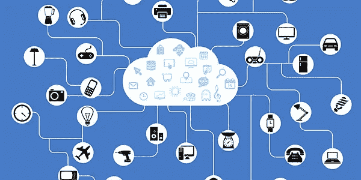
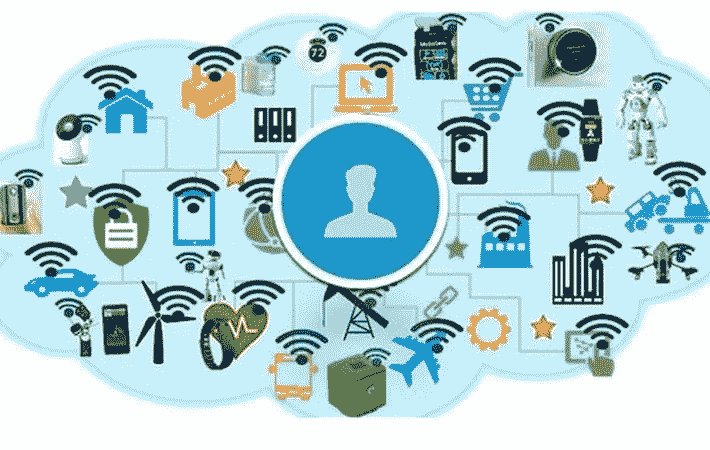

# 物联网(IoT)如何改变未来的商业格局

> 原文：<https://medium.com/hackernoon/how-internet-of-things-iot-is-transforming-the-future-business-landscape-e6ef7fea5b2b>

物联网技术终于开始有了节奏。随着物联网在技术领域的如此多的发展，有理由说物联网已经开始改变商业格局。我们还可以看到物联网如何改变汽车、能源、医疗保健、运输和制造等行业，以及各种电器，如门洞摄像头、空气跟踪、电源插头、安全系统、烤箱、恒温器等。

那么，你的企业物联网准备好了吗？物联网技术将如何影响企业。这就是本文试图寻找的。我们开始吧。

**访问更多数据**

数据是任何企业在市场中生存的关键。企业主拥有的数据越多，就越能与消费者建立联系。连接各种设备的最新物联网技术被规划为能够收集比以往更多的数据，以便为用户提供准确的服务。物联网就绪型企业能够跟踪和记录消费者行为模式，然后形成下一个营销/广告战略，该战略被证明能够在精确的定性水平上有效地瞄准人口统计数据。

有了精确的数据在手，企业就能够进行智能的产品推荐和定制搜索来吸引更多的顾客。

**物联网支持的库存管理流程**

物联网技术还将带来库存跟踪和管理的变革。

支持物联网的远程扫描仪有助于企业轻松跟踪从制造工厂到仓库再到交付的物品库存。物联网还可以应用于自动化库存管理，将公司从任何经常导致违规行为的人工参与中解放出来。因此，物联网不仅仅是关于“智能家居”或“智能家电”，它还涉及“智能办公室”、“智能仓库”、“智能货物运输”等等。

**远程工作的员工**

物联网技术为那些想要远程工作的人提供了很好的可能性。当[物联网技术](http://www.rapidsofttechnologies.com/ioT.php)与无线技术相结合时，员工能够通过在办公室或工厂车间接入他们的设备来远程工作。他们能够以期望的工作效率完成更多任务，而无需浪费时间前往远程站点。

**快速便捷的可访问性**

随着消费者通过基于研究的方式接触产品——根据特定类型的用户进行优化/定制——购买周期将会缩短。即使有少量的口语短语和找到他们正在寻找的产品的精确匹配的消费者，商品的搜索也将是可能的。是的，消费者会要求快速交付，但幸运的是，一些合作伙伴，如供应商和物流服务提供商也将在他们的工作场所应用物联网实践。因此，订单处理速度会更快。

**效率和生产率**

事情不会仅仅以超快的速度结束。今天的企业也需要高水平的生产力和效率来完成他们的运作。物联网无疑可以加快许多业务流程，而不会影响效率和生产力。技术的新发展使工人能够快速完成大任务，甚至不会出错。

此外，企业将能够用很少的员工来完成他们的业务。

**新消费者所需**

在将您的业务扩展到物联网的同时，不要忘记使用您的物联网设备的客户会有新的需求。他们也会想要以前从未要求过的东西。当然，他们会对每一笔新采购和每一份新订单有更高的期望。这就是物联网驱动的智能设备发挥关键作用的地方，并成为电器、小工具、配件、工具以及一切可以连接网络或计算机的东西的新标准。

**所需的新员工**

随着物联网应用到您的业务中，您还需要新的员工或培训现有员工，以使他们适应新技术。您肯定需要能够负责物联网运营并将这些物联网设备集成到您的持续流程中的人员。

**持续的客户互动**

当产品变得智能时，通过使用网络连接和互联网，为用户提供无线交互和控制这些产品的能力。这些通信功能还可以用于监控产品和提供主动支持。

**包装**

但是物联网技术的发展速度有多快呢？几年前，最初的估计相当大胆。这些估计表明，人们将很快采用物联网设备，但这仍然需要很多年。物联网技术正在稳步发展，正如许多报告所表明的那样，在不久的将来，我们将看到物联网设备变得越来越流行，用于大多数通用计算任务。

**作者简介:-** Sofia 是 Rapidsoft Technologies 的数字营销专家，Rapidsoft Technologies 是一家领先的 it 咨询公司，提供全方位的 IT 服务，包括物联网应用开发、 [ERP 软件开发](http://www.rapidsofttechnologies.com/enterprise-resource-planning-app-development.php)和大数据应用开发解决方案。