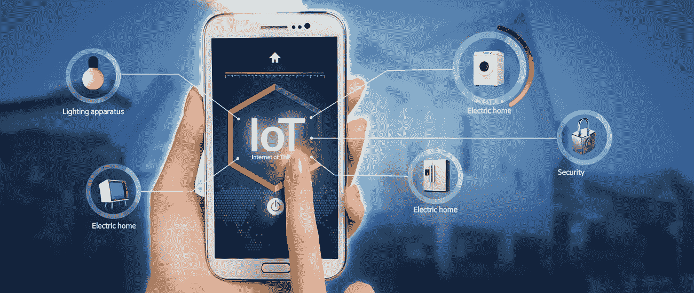
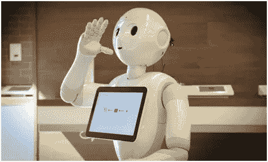
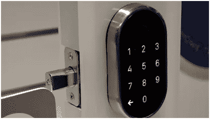

# 物联网如何改变工作场所

> 原文：<https://medium.com/hackernoon/how-internet-of-things-is-changing-things-at-the-workplace-29a4fe945449>

物联网(IoT)正在显著改变我们所有人的生活。这是一项变革性的技术，可以给企业和为其工作的员工带来巨大的变化。经理们刚刚开始发现基于[物联网](https://betapage.co/tag/iot)的系统和解决方案所创造的新的可能性；从照明设备到空调。最重要的是，物联网设备会产生大量数据，为企业的成本节约战略和自动化计划提供基础。

以下是物联网技术将帮助企业更高效、更经济地运营的 5 种方式。

# **舒适的工作环境**

工人和雇员经常在共用办公室设置正确的空调温度方面有问题。在那里，我们看到同事之间有很多分歧。但是这个问题可以通过物联网的融合得到智能解决。

有了支持物联网的空调系统，哪种温度设置对他们来说更舒适就不再取决于人们了。空调系统将从所提供的手动设置中学习并持续很长一段时间，然后调整其功能以提供舒适的温度。这种物联网系统**的一个很好的例子是**谷歌的 [Nest 恒温器](https://nest.com/ie/thermostats/nest-learning-thermostat/overview/)，它学习连续几天手动设置的用户偏好，然后系统根据你的需求调整功能。此外，该系统还能节省 60%的电费。

# 远程呈现和虚拟会议

[物联网技术](http://www.rapidsofttechnologies.com/iot-solutions-for-agriculture.php)可以应用于实现网真的概念。远程呈现机器人正在实验基础上部署，让你与一个人进行面对面的会议，这个人可能离工作地点有几千英里远。这些是自我引导的机器人，它们被创造出来的方式可以让它们模拟面对面的会议，或者在远程用户控制的走廊里导航。一旦会议结束，机器人可以自动移动到下一个预定的目的地或返回其充电站。

Pepper is already in use as a robot greeter.
Image: Softbank

毫无疑问，它看起来很有趣，但在它的实际方面，它允许老板、经理和主管到达一个他们在现实中不能立即到达的地方。

# **提高效率和生产力**

物联网驱动的解决方案将使工人和员工能够在更短的时间内完成更多工作。这项技术可以帮助人们更快地完成大规模任务，而不会出错。

企业主将能够跟踪在工作场所进行的各种操作。从控制和监控库存到管理现场服务员工，物联网可以与工具和设备相连接，以提高企业人员和流程的绩效。此外，这些支持物联网的工具和设备可以连接到中央系统，这有助于企业更轻松地控制工作场所及其工作流程。

从支持物联网的办公室/工作场所运营中生成的数据将首先提高企业的整体绩效，其次为其提供更好的业务扩展机会。

# 有组织的工作场所和更安全的工作场所

工作就是崇拜！这是我们从小就被教导的。但是，如果一个人的工作场所有满溢的垃圾桶、有污渍的咖啡机、无人维护的电梯和不必要的照明灯，他怎么能把自己的工作当成崇拜呢？

感谢上帝，我们有物联网技术来拯救我们！借助物联网设备和传感器，这些办公室管理工作可以轻松实现自动化。物联网还可以更进一步，帮助证明谁一直让休息室冰箱的门开着。

# **门禁系统**

物联网技术甚至可以智能地取代典型的锁定和控制访问的系统。许多公司已经提供了先进的电子访问控制系统，不需要任何类型的钥匙。他们甚至不需要任何通行码或门禁卡来为特定区域或设施中的工人和雇员提供通道。

An IoT lock in action.
Image: Scymyn

生物识别锁已经开始工作，但现在，支持物联网的智能手机应用程序可以比它们更好地管理你的工作场所安全。它们可以被编程为向特定的人提供访问，或者特定的访问可以只对特定的人保密。物联网还可以支持远程锁定。事实上，可以有数十种方式使用物联网进行访问控制。

# **收尾**

因此，工作场所正在经历由物联网和相关移动应用开发技术引领的变革。智能手机已经成为[物联网应用开发](http://www.rapidsofttechnologies.com/ioT.php)的关键平台。它们是便携式的，很容易放在口袋里。他们提供高功率的互联网连接，不需要任何额外的胶带和泡泡糖。

我们知道，物联网的概念并不新鲜。它存在了超过 35 年。但是，实现它的真正障碍是缺乏硬件，没有稳定的无线技术和高速互联网，以及对台式电脑的依赖，这在许多实际情况下无法在任何地方进行。他们一起把物联网变成了不切实际的技术，但现在事情发生了变化。我们有智能手机，它本身是一个完整的设备，具有理想的便携性、移动性、速度和功能。

**作者简介:-** Sofia 是 Rapidsoft Technologies 的数字营销专家，Rapidsoft Technologies 是一家[离岸软件开发公司](http://www.rapidsofttechnologies.com/offshore-development-center.php)，为全球教育、自动化、建筑和金融领域开发软件。她喜欢写最新的移动趋势、技术、创业公司和企业。