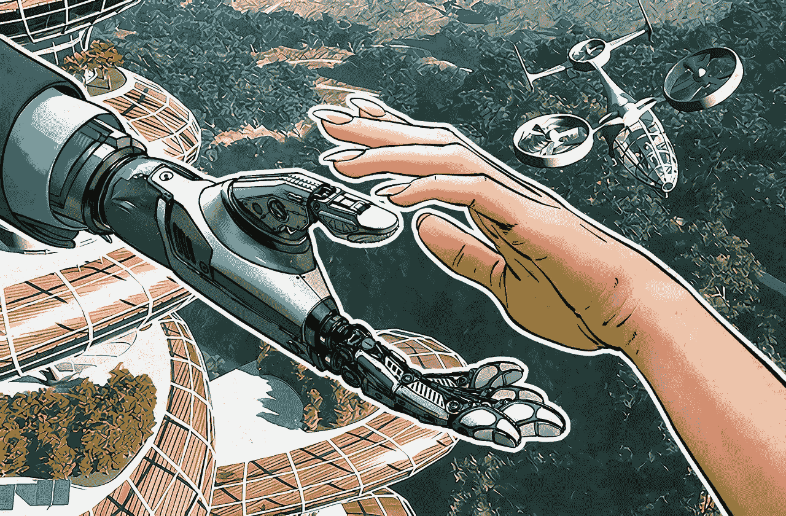

# 投资在不久的将来会如何变化

> 原文：<https://medium.com/hackernoon/how-investments-will-change-in-the-near-future-671161d4176e>

今天，非常重要的是，我们认识到我们正处于第四次技术革命的边缘，这意味着我们正站在将影响整个人类社会生活所有方面的巨大变革的开端。

[Source](https://cdn-images-1.medium.com/max/800/1*7zOf9tHlltgSgSW24wF66w.jpeg)

在日常生活中，我们已经习惯了甚至在 10–15 年前都难以想象的事情和现象:我们不用相机拍照，也不担心能多拍几张照片；我们不用纸质百科全书；我们不在街上拦出租车；我们不去药店寻找药物；我们不去银行；我们不在旅行社买机票；我们不使用昂贵的国际漫游；当搜索引擎知道我们最近的兴趣，或者视频托管服务知道我们今天想看什么时，我们不会感到惊讶。

如果在上个世纪，电力是生产增长的推动力；现在，创业起飞的新故事将基于他们对人工智能的使用而被书写——从智能家居到智能鞋，它们根据天气和用户的福祉改变自己的配置。

记住，技术变革会发生得越来越快。比我们想象的要快。用了 13 年才有了 5000 万电视用户；第一批 5000 万脸书用户是在 3.5 年后出现的，而在《愤怒的小鸟》中，5000 万是在短短 35 天内发生的。

我们日常生活中的变化是工业和国家层面深刻变化的最终表现。

二百年前，80%的人类从事农业。然后，机械化和劳动自动化使我们能够将农业生产中雇用的人数减少一个数量级，城市中出现了新的就业领域。所以现在，随着我们经历一场新的技术革命，今天 70%以上的职业将实现自动化，被机器取代。

在我看来，最先消失的将是那些与低技能和单调工作相关的职业。这适用于蓝领和白领工作。第二，由于引进区块链技术，经济进程的透明度和速度提高了，一些人质将会受害:这些人质是今天的中间人、商人、代理人、房地产经纪人和经纪人。与高度智力和创造性工作相关的职业将取代那些已经消失的职业。成为发明家、投资者、股东或梦想家会有更多的价值。已经有科技公司出现，帮助投资新一代埃隆马斯克的梦想。

例如，初创公司 [Dreamr](https://www.dreamr.app) 的团队正在创建一个平台，用于围绕个人或集体想法发起众筹活动，能够使用分散的服务市场，用户将在那里将他们的技能货币化。该公司还创建了变革基金，计划通过该基金向其用户和合作伙伴发放 10 亿美元，用于将他们的梦想变为现实。

[Dreamr 的首席执行官 Chris Adams 说](/dreamr-social-media-for-the-future/dreamr-is-not-social-media-or-crowdfunding-it-is-something-entirely-new-f321e3d3bb84):

> 不如不要为了广告商的利益而制造那些让人上瘾和娱乐的产品，而是制造那些旨在给人们带来价值和丰富他们生活的产品？

在国际竞争中，廉价劳动力将不再是竞争优势。这将是机器人和 3D 打印技术的使用大幅降低技术成本的结果。资源租金的价值将大幅下降，而技术租金的价值将大幅上升。国家将被划分为技术型和非技术型，它们的技术发展水平将决定它们在全球经济中的权重。几乎所有主要的经济学家和分析师都对未来几年的全球经济增长做出了非常保守的预测。与此同时，与新技术革命相关的行业将以每年百分之几十到几百倍的速度增长。根据各种估计，人工智能技术市场将在未来八年增长 20 倍。

在这方面最先经历革命性变化的行业是医疗保健和金融行业。传感器、微芯片、虚拟和增强现实技术、机器人和 3D 打印等个性化生产技术、云技术、无人机、医疗和家用机器人以及无人驾驶汽车的生产也将发生巨大变化。

## 在新世界里什么会有价值，什么会失去价值？

似乎旧的、永恒的价值观会明显落后于新的价值观。石油、黄金、天然气、木材、毛皮、贝壳、袋装盐——当然，所有这些都将继续耗费金钱。但新数字经济的份额只会增加，其在全球股票市场资本总额中的份额也会增加。因此，我建议大幅降低你的金融投资组合中“盐壳”和“盐袋”的比例，增加专注于新经济的公司的股票数量。

与此同时，必须记住的是，在像这样的转折点上，星星不仅会亮，有些还会熄灭。努力摆脱正在衰落的业务中的股票。曾经有一段时间，施乐和柯达的收入、利润和未来前景都相当不错。未来几年不仅会有大量股票创出新高，也会出现低点。

## 有哪些公司值得投资者关注？

1.  控制主要互联网平台的公司
2.  在虚拟和增强现实领域取得令人信服的成功的公司
3.  面向机器人和 3D 打印等技术的公司
4.  专注于大数据和人工智能的公司
5.  物联网的零部件供应商

关于创业努力和投资回报的应用点，我想引用著名的梦想家、记者和网络文化专家凯文·凯利的话。他在《不可避免》一书中写道:

> 事实是，今天是开始创造的最佳时机。从来没有像今天这样有更多的机会，更低的壁垒，更高的收益和风险比，以及更高的投资回报。此时此刻。就是这一刻，未来的人会看着感叹:“要是我现在在就好了！”这是人类历史上开创新事物的最好时机。你还不算太晚！

一切真的才刚刚开始。而且会很有趣。