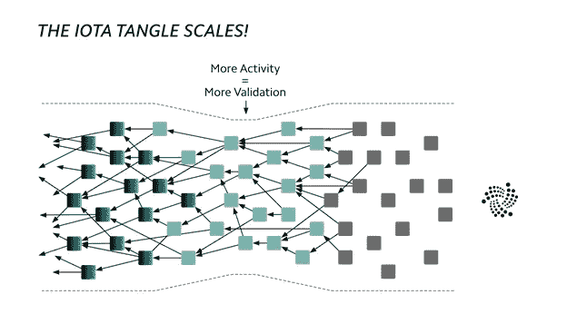

# IOTA 的 Qubic 如何实现机器经济

> 原文：<https://medium.com/hackernoon/how-iotas-qubic-is-enabling-the-machine-economy-43da90464797>

DLT、IOTA、Qubic 和机器经济概述

The Dawn of a New Era

# DLT 正在扰乱我们的社会

分布式账本技术(DLT)-IOTA/ether eum/Hyperledger-准备从根本上改变我们社会的运作方式，提供一种“无信任”关系的方式-不需要中介。可信系统需要检查和平衡来确保我们对它的信任是安全的，而不可信系统则不需要。

现代法定货币就是可信系统的一个很好的例子。我们银行账户和钱包里的钱仅仅是由政府承诺印制的。政府有责任确保货币保持稳定，商品和服务可以可靠地兑换成货币。政府是保证货币价值的中介，任何交易都必须得到政府的信任。

Trust is no longer mandatory

DLT 通过将系统的可信度锚定在组成系统的算法上，消除了对中介的需求。从数学上讲，这是不可能的，也不需要调解。通过提供一个没有中介的无信任系统，DLT 为人们以前所未有的方式互动提供了可能性。这种行为变化将终结许多长期主导社会的行业，并标志着基于去中心化未来的新行业的开始。

# IOTA 正在扰乱 DLT 空间

IOTA 是专为物联网(IoT)行业打造的 DLT。IOTA 背后的团队意识到，在未来的物联网机器经济中，数百万台计算机和传感器将需要相互交互和支付，通常是小额和纳米支付。他们还意识到，由于不断增加的交易费用和可扩展性限制，区块链网络将无法处理此类交易。此外，传统区块链的能源密集型开采和共识机制不太适合低成本物联网设备和间歇性网络。

这意味着如果物联网和 DLT 要合并，就需要开发一种新的“区块链”,这正是 IOTA 团队创造的 Tangle network。准确地说，奥塔·泰戈不是区块链。相反，它使用了一种称为有向无环图(DAG)的数据结构，这样做，Tangle 不仅保持了区块链的原始优势，还可以成倍地改善它们。

Solving the blockchain’s bottleneck

使用 DAG 背后的核心创新是其进行零费用交易的能力，因此也是进行纳米支付的能力。这是通过削减矿工和矿工费用实现的，尤其是通过使交易验证成为分类账的固有部分，使矿工(验证交易的人)和赌注者(发送交易的人)成为同一个人。

# 库比奇:失踪的谜题

IOTA 展示了一种新颖的 DLT 实现:一种专为物联网(IoT)和机器对机器(M2M)经济构建的无区块链方法。IOTA 有潜力为世界带来几乎无限的可伸缩性和免费的纳米交易。然而，智能合约等重要功能缺失。

上周，IOTA 基金会结束了几个月来围绕 Qubic 项目的猜测。被吹捧为 IOTA 历史上最热切期待的发展，新项目寻求创建一个协议，*“指定 IOTA 对 oracle 机器、智能合同、外包计算等的解决方案。”*

Qubic 不仅引入了神谕和智能契约，还引入了基于群体的计算，一种分布式计算的形式。简而言之，Qubic 使 IOTA Tangle 可编程，并引入了一个分布式计算环境，在这个环境中，机器可以建立信任，共享数据，并使用免费的纳米交易为任何资源相互支付费用。

## 神谕

Quorum consensus of an oracle assembly

像泰戈这样的 DLT 无法访问其网络之外的数据。Oracles 是第三方服务，用于查找和验证真实世界的数据，并将这些数据提供给 DLT 用于计算(例如智能合同……)。这种数据可以是任何数据，如天气温度、成功支付、价格波动等。

激励先知保持诚实的是一个由 qubic 所有者维护的奖励系统。请注意，Qubic 并不天真地“信任”第三方神谕。它通过法定人数共识确保了有关数据正确性的高度确定性。

## 智能合同

智能合同是一种计算机协议，旨在模拟并改进现实世界合同的性能。它的功能是定义条件，当满足这些条件时，由给定网络中的计算机执行合同。智能合同被认为是企业、商人和工匠等提高运营效率和削减成本的一种创新方式。

A self-executing, trustless contract

智能合同可以自动化许多不同类型的流程和操作，如支付和以支付为条件的行动，从而提高以前难以想象的效率和精确度。它们正在改变商业生命周期中交易和交易的执行和管理方式。智能合同的一些潜在用例包括:

*   数字身份和金融数据记录；
*   贸易融资、衍生品和证券；
*   抵押和土地所有权记录；
*   供应链；
*   汽车保险；
*   临床试验

使用 IOTA 作为主干，Qubic 的智能合同超越了这些传统的智能合同。免费交易与基于法定人数的通用计算的结合为全新的可能性打开了大门。例如，一个智能契约可以用来将来自不同预言的温度数据聚集成一个平均温度，这个平均温度会定期发布给 Tangle。智能合约现在已经成为一个 oracle 本身，也就是说，合约本身已经成为一个外部数据源，可供 oracle 机器拾取并发送回其他 qubic。

这些类型的智能合约也只是基于法定人数的计算的更一般能力的迭代。因此，Qubic 还提供了一种标准化的方法来定义、验证和执行智能合同的结果，并具有很高的确定性。

## 魁北克项目的影响

Qubic 利用 IOTA 协议在各种参与者之间进行安全、分散的通信。此外，由于 IOTA 有其自己的内置支付系统，IOTA 令牌用于为 qubic 运营商提供激励系统。任何人都可以自己决定，在什么样的门槛上，奖励才变得足够有趣，值得参与。

Qubic 为人们运行节点提供了巨大的激励:让其他人使用多余的计算能力或存储能力，从而提供有用的服务，并为此获得报酬。q-node 可以为旧的、被遗弃的 PC 带来新的生命，它们可以为传统的加密货币矿工提供一种通过进行有用的计算而不是解决无意义(和浪费)的密码难题来赚钱的方法。

Leveraging otherwise-wasteful resources

Qubic 针对物联网进行了优化——低能耗和小内存占用——但这并不排除大规模计算，特别是对于可能并行化和分布在大量处理器上的计算。在未来，Qubic 将利用全球可用的、未使用的计算能力来解决各种计算问题，同时帮助保护 Tangle:基于 IOTA 的世界超级计算机。

# 机器经济

The Machine Economy — Powered by IOTA

通过 Qubic，IOTA Tangle 将克服区块链的限制，提供完整的金融管理、分布式计算、分布式人工智能和群体智能技术栈，利用存储在 Tangle 中以及从现实世界中收集的可信和不可变的数据。让我们想象这样一种经济:一切都将是智能的、高效的、自主的和互联的，经济上独立的，并且最有可能由安全的、分散的技术骨干 IOTA 来管理。

因此，在不久的将来，我们可以预期一台机器将能够通过向其他机器提供数据、计算能力、存储或物理服务来支付其组装、维护、能源以及责任保险。有史以来第一次，一个设备将能够自己挣钱和花钱。这就是 Qubic 创造的机器经济。

(欲了解更多关于 Qubic 的信息，请访问:[https://qubic.iota.org/](https://qubic.iota.org/))