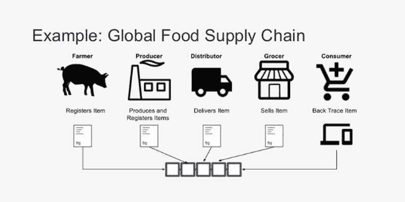

# 区块链是如何颠覆供应链行业的？

> 原文：<https://medium.com/hackernoon/how-is-blockchain-disrupting-the-supply-chain-industry-f3a1c599daef>

## 改造商品从生产者到消费者的流动

How is Blockchain Disrupting the Supply Chain Industry — [Image Source](https://www.engineerbabu.com/blog/how-is-blockchain-disrupting-the-supply-chain-industry/)

你有没有想过，你日常生活中使用的手机是从哪里来的？或者你买的衣服或者你吃的食物？除了你去的商店之外，还有一个由不同的相互关联的元素组成的完整的其他链，致力于将这些产品交付给你。这个相连的链被称为供应链。

以服装供应链为例。由于对工作的需求是永无止境的，服装、纺织和服装制造行业需要大量的劳动力。据估计，全球该行业的雇员人数超过 6000 万。服装行业的供应链一词指的是该行业的后端。服装行业的供应链是由以下环节构成的:

*   原材料来源
*   使用这些原材料并生产最终产品的工厂
*   将这些衣服送到消费者手中的分销网络

在全球范围内，服装供应链包括数百万人以及数吨水、农作物、化学品和石油。这使得制造商很难找到他们产品的不同部分来自哪里。对提高速度、高容量和更便宜的消费的需求与日俱增。正因如此，当盲目的消费主义重视道德供应链的透明度时，这种透明度就会受到损害。

# **什么是供应链管理？**

Supply Chain Management — [Image Source](https://dribbble.com/shots/4188819-CONNECTED-SUPPLY-CHAIN)

更明确地说，供应链管理包括综合计划以及不同流程的执行。这涉及到物流、信息流以及金融资金流。对货物、服务和信息流的管理，包括原材料、建筑产品以及成熟的成品从一点到另一点的储存和移动，被称为供应链管理。供应链管理中的供应链是在产品或服务的制造中结合在一起的个体实体、组织、企业、资源以及技术的网络。

任何供应链都是从最初将原材料从供应商交付给制造商，到最终将最终产品交付给消费者。供应链管理的正确实施可以带来收益，如增加销售额和收入，减少欺诈和间接成本，提高质量。此外，这也将导致加速生产和销售。

虽然所有这些在理论上看起来很简单，但实际上维护供应链是一项乏味的任务，即使对小企业来说也是如此。当企业成长时，供应链中不同要素的相互联系逐渐变得更加低效。为了解决这些效率低下的问题并节省公司的资金，人工智能和机器学习等不同的技术正在应用于供应链管理。其中，区块链正在探索改变整个游戏的新方法。

# **供应链挑战和区块链解决方案**

区块链可以应用于供应链行业的许多挑战，如复杂的记录保存和产品跟踪。作为集中式数据库的一种不易损坏且自动化程度更高的替代方案。以下是区块链在供应链行业中的应用。

Challenges and Solutions to those — [Image Source](http://modusbox.com/2017/05/09/blockchain-and-the-b2b-supply-chain/)

## **出处追踪**

大公司和组织的供应链中有很多元素。因此，即使是跨国公司，也几乎不可能跟踪每一项记录。缺乏透明度会导致成本和客户关系问题，最终削弱品牌知名度。

在区块链的供应链管理中，记录保存和来源跟踪变得很容易，因为可以通过嵌入式传感器和 RFID 标签的帮助来访问产品信息。一个产品从诞生到现在的历史可以通过区块链追溯。此外，这种精确的出处跟踪可用于检测供应链任何部分的欺诈行为。

## **降低成本**

在区块链的帮助下，供应链中产品的实时跟踪降低了供应链中物品移动的总成本。根据 APQC 和数字供应链研究所(DSCI)对供应链工人的调查，超过三分之一的人认为降低成本是区块链在供应链管理中应用的最大好处。

当应用区块链来加速供应链中的管理流程时，系统中产生的额外成本会自动降低，同时仍能保证交易的安全性。消除供应链中的中间商和中间商可以降低欺诈风险和产品重复率，还可以节省资金。供应链内的客户和供应商可以通过使用加密货币而不是客户和供应商而不是依赖于 EDI 来处理支付。此外，通过准确的记录，将提高效率并降低丢失产品的风险。

## **建立信任**

对有许多参与者的复杂供应链的信任是顺利运作的必要条件。例如，当一个制造商与供应商分享他的产品时，他/她应该能够依赖他们遵守工厂安全标准。此外，当涉及到法规遵从性(如海关执法者)时，信任起着至关重要的作用。区块链在供应链中不可改变的本质是为了防止篡改和建立信任而精心设计的。

# **使用区块链的供应链的好处**

Data Visibility in Supply Chain with Blockchain — [Image Source](https://faizod.com/blockchain-rescued-europe-looming-butter-crisis/)

对数据使用区块链的最有吸引力的好处之一是它允许数据更好地互操作。因此，公司与制造商、供应商和销售商共享信息和数据变得更加容易。区块链的透明度有助于减少延迟和纠纷，同时防止商品在供应链中受阻。由于每个产品都可以被实时跟踪，因此误放的可能性很小。

区块链提供了可扩展性，通过它可以从世界各地的多个位置访问任何大型数据库。它还提供了更高的安全标准和根据数据馈送进行定制的能力。此外，区块链也可以以私有方式创建，这将允许拥有权限的各方之间显式地访问数据。

采用区块链技术的价值在于，它有可能连接不同的分类账和数据点，同时维护多个参与者之间的数据完整性。区块链技术的透明性和不变性使其有助于消除供应链中的欺诈和维护系统的完整性。

除此之外，在供应链行业采用区块链技术的其他好处还包括:

1.  减少或消除欺诈和错误
2.  改善库存管理
3.  最大限度降低快递成本
4.  减少文书工作造成的延误
5.  更快地发现问题
6.  增加消费者和合作伙伴的信任

# **使用区块链用例的供应链管理**

Supply Chain Use Cases — [Image Source](https://www.ibm.com/blogs/watson-customer-engagement/2017/04/11/blockchain-supply-chain/)

随着越来越受欢迎，区块链技术似乎是当今许多行业问题的解决方案。供应链是最受欢迎的行业之一，在某些使用案例中，区块链技术的应用可以发挥作用。一批货物可能至少有 20-25 个人或组织在处理，这导致他们之间大约有 200 次交互，从而导致一个漫长的过程。

如果应用正确，区块链技术可以确保整个供应链的来源跟踪和可追溯性。反过来，这将导致更少的伪造者，并确保安全的过程。供应链中的区块链还将允许制造商、运输商和最终用户收集数据、研究趋势和应用预测监控流程，以获得更好的产品体验。以下是区块链在供应链中的一些使用案例。

## **海鲜验证**

由于缺乏透明的系统，海鲜供应链已经多次成为负面头条新闻，并且仍在继续。目前的海鲜供应链有繁琐的流程，如人工记录，这使其更容易出错。此外，导致海产食品供应链效率低下的其他问题是不适当的食品储存条件、错误标签欺诈和不受监管的做法盛行。

由于这些问题，到达最终消费者手中的食品的质量和安全性受到损害，这威胁到行业的经济安全。此外，由于链条中涉及不同类型的欺诈，客户和供应商之间仍然缺乏信任。

区块链技术可以被证明是解决海鲜验证问题的灵丹妙药，因为它可以从生产到分销全程跟踪鱼类和海鲜。像 Hyperledger 这样的大公司甚至已经开始在他们的项目中实施这项技术，以解决海鲜供应链行业的问题。

名为 Hyperledger Sawtooth 的项目通过其模块化的区块链平台带来了可追溯性和问责制，从而彻底改变了供应链。它使用 PoET(经过时间的证明)共识算法，该算法允许系统中的参与者在交易对手不知道彼此信息的环境中达成共识。

锯齿允许通过传感器检测供应链中的海鲜，传感器将产品的位置和时间传输到区块链。这使得买方能够获得产品来源的全面记录。

## **咖啡供应链**

[Image Source](https://www.bext360.com/#) — One such successful example

当你早上从那个大杯子里喝一口热咖啡时，你甚至不会意识到它的供应链有多长多复杂。高度复杂且急需改革的全球网络中的咖啡供应链。咖啡的生产是分散的，因为它通常生长在世界上偏远的发展中地区。影响咖啡产量的其他因素也应该考虑在内，如价格波动和气候变化的影响。

此外，由于咖啡供应链中的农民和劳工来自偏远的发展中地区，因此也有虐待的报道。由于系统的复杂性，咖啡供应链为区块链的采用提供了一个理想的用例，并为系统带来了透明度和效率。

总部位于丹佛的初创公司 Bext360 正在使用一台名为“bextmachine”的区块链机器，该机器用于分析农场的咖啡豆，并为它们分配一个编号以实现可追溯性。就性能而言，这台机器一分钟能处理 50 公斤左右的咖啡。该机器还能够以三维方式扫描每个豆子的外部果实。此外，这种机器还能提供农场级咖啡的质量细节，从而为即兴创作提供更多空间。

在咖啡供应链中使用区块链带来了更高的生产率，同时为生产商带来了公平交易和透明度，因为该系统确保了一旦农民的产品售出，他们就能直接获得付款。另一方面，终端客户可以随时查看数据，追踪他们咖啡的原始来源。

## **药物和药品**

药品供应链是制药业的一个方面，区块链可以从中获利。假药正变得越来越麻烦，因为全球黑市一直在向人们提供此类药物而不被发现。服用假药带来的生命风险不可低估。

世卫组织报告称，全球假药销售额已从 2010 年的 750 亿美元增长到未来五年的 90%。假药造成的主要受害人群来自亚洲和非洲等发展中国家，这些国家的假药约占销售药品总量的 10%至 30%。对于世界各地的制药公司和经销商来说，提高药品供应链的安全性和可追溯性变得越来越重要。

考虑到当前药品供应链因人数增长而变得复杂，必须有可靠的数字技术和管理系统来保护整个流程。区块链技术可以解决这个问题，因为它在与供应链管理相关的应用方面已经变得非常流行。

药品供应链中的系统漏洞会导致许多棘手问题，例如很难跟踪和验证产品。在这种情况下引入区块链有几个好处。药物可以贴上条形码标签，一旦被扫描，它们的记录就可以保存在安全的数字块中的区块链上。随着药品从供应链中的一个实体转移到另一个实体，这些记录将被实时更新。被授权访问的各方，包括患者，可以随时检查记录。

区块链的不可改变性提供了从制造商到客户的药品可追溯性，并允许人们检查系统是否在某个地方被破坏。除了确保产品的完整性和防伪工作，区块链技术还可以帮助解决供应链上的小型零售商和运营商面临的财务问题。

## **食品供应链**

Example of Global Food Supply Chain — [Image Source](https://www.slideshare.net/tkuhrt/lwt-introduction-to-blockchain-technologies)

我们的食品供应链越来越复杂，因此，食品生产商、供应商和零售商越来越难以通过供应链确保产品的来源。

由于缺乏数据和可追溯性，包括交叉污染识别和食源性疾病传播在内的食品安全问题变得更加严重。污染源和找到根源可能需要几天到几个月的时间，最终导致患病人数增加、收入损失和食物浪费。根据世卫组织的数据，十分之一的人会因为受污染的食物而生病，大约 420，000 人因此而死亡。

消费者越来越意识到并要求他们消费的食品透明。目前，大约只有 12%的消费者相信他们购买食品的品牌，因为他们了解食品信息，而 94%的消费者表示，了解与他们购买的食品相关的所有信息对他们来说非常重要。

区块链通过在平台中提供中立性来解决复杂供应链的问题。由于在交易授权中没有第三方参与，并且一切都在一致同意的基础上工作，所以系统的用户和操作者都必须遵循一套规则来保持系统运行。

区块链为供应链中的所有参与者带来了巨大的优势。食品生产商可以通过跟踪食品在供应链中移动时的篡改企图来确保其供应的原创性和质量。如果发现欺诈，供应商将受到威胁，甚至在食品到达目的地之前，就可以将通知发送给零售商。

同样，在零售商的情况下，如果一个受损的食品不知何故进入商店，他/她可以只识别和移除这些违规的商品，而不是检查整批供应。有了区块链，当消费者需要保证他们消费的食品时，他们会得到透明和公开的对待。这使得消费者能够识别和消费高质量的食物。

## **汽车供应链**

从零件供应商、制造商到销售商，汽车供应链是一个高度复杂和广泛的行业，有多个参与者。交付真正的客户价值需要分析现有的 IT 和业务流程，以及遵守安全性、机密性和授权许可的解决方案。区块链可能会成为一个理想的解决方案。此外，爱尔兰的 Moyee Coffee 在这种情况下提供了整个供应链的透明度，同时降低了与多方打交道的成本和复杂性。对于汽车供应商来说，区块链可以用来保护他们的品牌免受重复产品的影响，并创建以客户为中心的商业模式。

在汽车行业，假冒产品给汽车制造商带来了一个重大问题。此外，目前假冒备件的市场估计有几十亿美元。这些产品可以直接或通过原始设备制造商和售后供应商进入供应链。假冒备件不可靠，因为它们的质量水平下降，而且往往会出现故障，这给最终客户带来不满，最终导致他们撤销对该品牌的信任。引入区块链技术来伪造产品被证明是非常有利的，因为它允许备件被唯一地识别，并以数字方式表示它们。备件的数字标识增加了系统的透明度，并且可以在网络中的多方之间共享。

区块链的入站物流和智能制造可以提高汽车供应链的效率。目前，跟踪入站供应链的单个组件是复杂的，并且容易出错。多层供应商、第三方物流和运输公司之间通过制造工厂的协调对于供应链的有效运作是必要的。通过使用区块链，我们可以确保各方获得准确、实时的信息。相关人员可以检查单个零件的状态、数量以及位置。

同样，外向供应链也是一个复杂的网络，由分销商、制造商、进口商和经销商组成。这些参与者也没有一个通用的数据共享模型，这使得他们很难交换信息。基于区块链的共享系统可确保可见性和透明度，进而确保更快的交易和更短的结算周期。

# **结论**

[Image Source](https://www.techbullion.com/blockchain-the-key-to-an-efficient-supply-chain/)

到目前为止，区块链已经在许多行业和业务中发挥了其潜力，带来了积极的变化，包括供应链行业。事实上，供应链管理是区块链技术最明显和最有用的应用之一，因此，我们可以预计它在不久的将来将以非常快的速度增长。供应链管理系统成功运作的源泉是保持健壮、透明和端到端的通信。

公司正在探索过滤其供应链当前工作方式的方法，并采用区块链技术必须提供的变化。一旦企业看到了更广阔的前景，他们最终会经历应用嵌入区块链的更新系统的麻烦，以便在未来获得更大的利益。放弃文书工作和集中化的数据库将带来更高的回报和供应链团队绩效的提高。

只有当现有的供应链团队注意到区块链领域的最新技术趋势，并找到可行的方法在其现有系统中采用该技术时，这一目标才能实现。在供应链管理中使用区块链将通过消除当前系统的漏洞和低效率来改变游戏规则。

— — — — — — — — — — — — — — — — — — — — — — — — — —

## 看我的其他相关文章

**1。** [**区块链技术讲解:简介、意义、应用**](https://www.engineerbabu.com/blog/what-is-blockchain/) **，也上**[**hacker noon**](https://hackernoon.com/blockchain-technology-explained-introduction-meaning-and-applications-edbd6759a2b2)
**2。** [**区块链是如何彻底改变银行和金融市场的**](https://www.engineerbabu.com/blog/blockchain-revolutionizing-banking-financial-markets/) **，也上**[**hacker noon**](https://hackernoon.com/how-is-blockchain-revolutionizing-banking-and-financial-markets-9241df07c18b) **3。** [**区块链在医疗保健:机遇、挑战、应用**](https://www.engineerbabu.com/blog/blockchain-in-healthcare-opportunities-challenges-and-applications/) **，也上**[**hacker noon**](https://hackernoon.com/blockchain-in-healthcare-opportunities-challenges-and-applications-d6b286da6e1f) **4。** [**关于智能合约你需要知道的一切:初学者指南**](https://www.engineerbabu.com/blog/smart-contracts/) **，也上**[**hacker noon**](https://hackernoon.com/everything-you-need-to-know-about-smart-contracts-a-beginners-guide-c13cc138378a) **5。** [**十大知名区块链开发公司**](https://www.engineerbabu.com/blog/top-10-reputable-blockchain-development-companies/) **，也上**[**hacker noon**](https://hackernoon.com/top-10-reputable-blockchain-development-companies-7c6eba562b90)

> *我是 Mayank，*[*engineer Babu*](https://www.engineerbabu.com/)*的联合创始人。随时联系我*[*LinkedIn*](https://www.linkedin.com/in/mayankpratap/)*| mayank@engineerbabu.com(关于 EngineerBabu —* [*中*](https://hackernoon.com/how-mayank-pratap-built-engineerbabu-a-profitable-it-service-company-generating-more-than-50-000-per-month-bcd3006bdbb5) *)。*

此外, [EngineerBabu](https://www.engineerbabu.com/) 通过构建高级 IT 解决方案，帮助初创公司、企业和所有者发展业务。他们开发的项目 95%都按时完成了。 [30+由风投](https://www.engineerbabu.com/casestudies)资助，获得最具创新总理设计奖，入选 Y-Combinator 2016 & 2017。