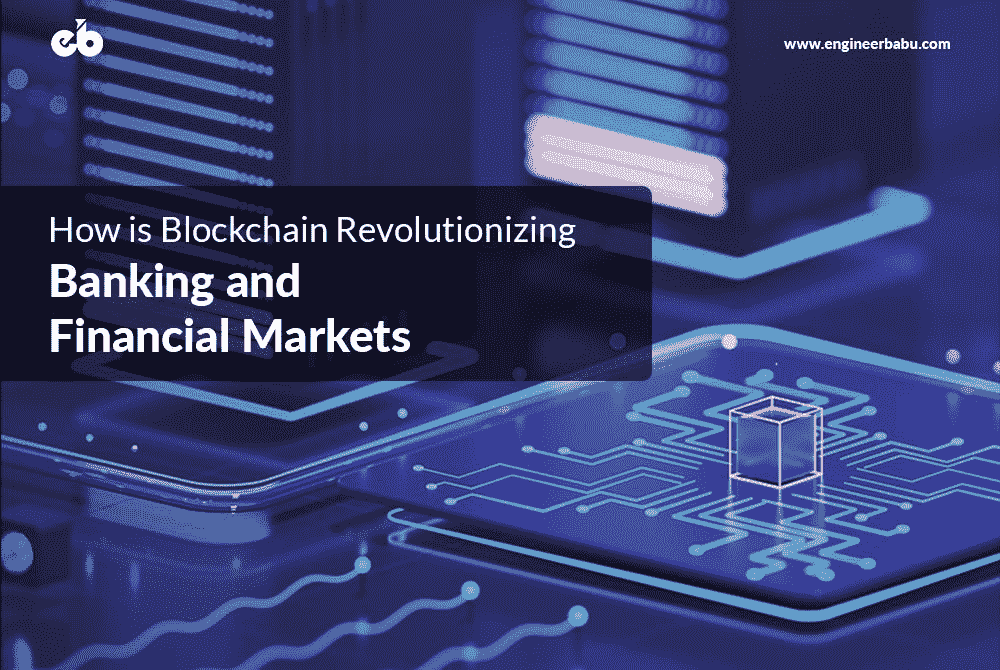
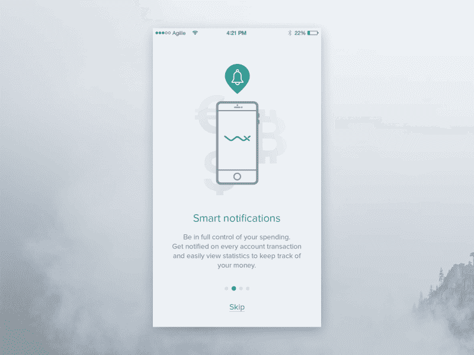
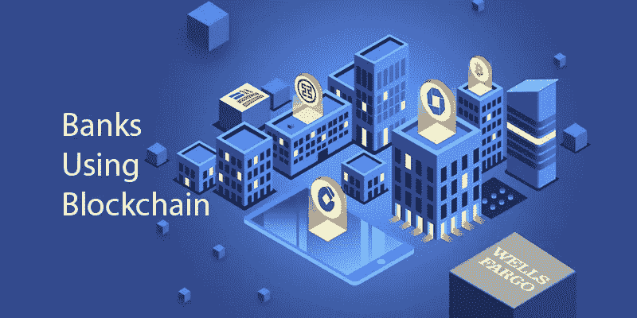
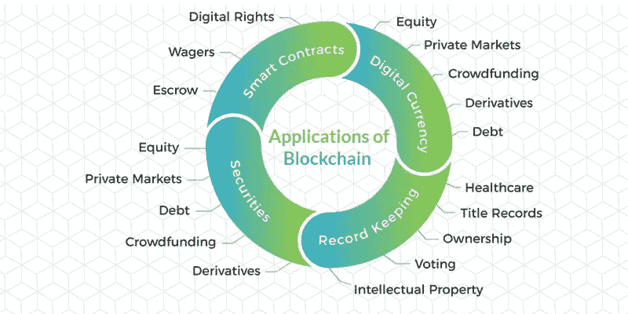
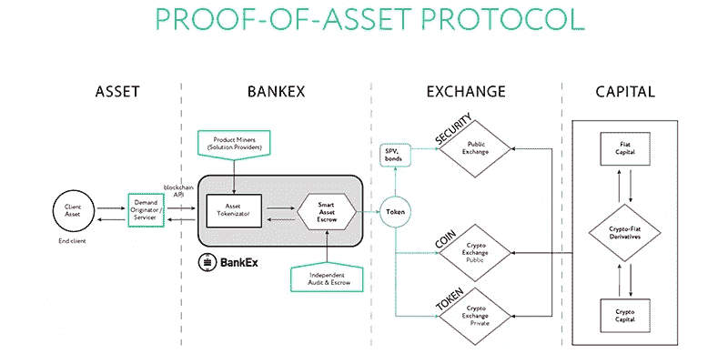
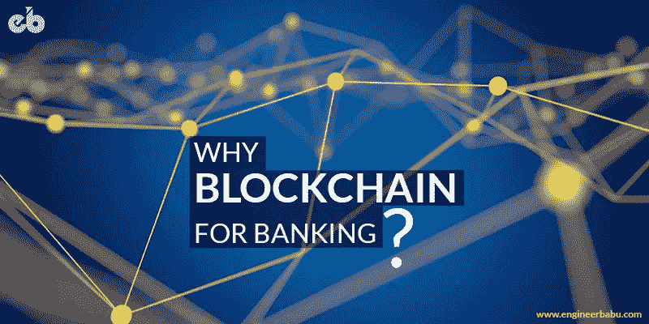
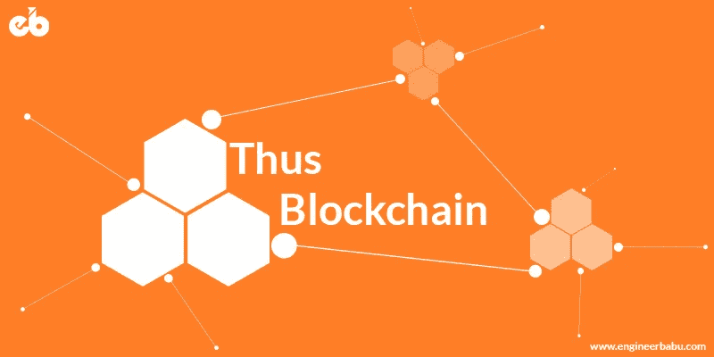

# 区块链如何变革银行和金融市场

> 原文：<https://medium.com/hackernoon/how-is-blockchain-revolutionizing-banking-and-financial-markets-9241df07c18b>

## 创造机会重塑金融世界。

Blockchain for Banking and Finance — [Image Source](https://www.engineerbabu.com/)

早在 2008 年发明的区块链技术已经描述了它可以在不同的商业领域带来的变化。这项技术，即使在它的初期，也已经扰乱了不同的行业和部门。区块链的各种功能，如去中心化、不变性和透明性，使其对世界各地的商业部门和领域具有吸引力。在发掘区块链潜力方面处于领先地位的一个行业是银行和金融业。

尽管目前存在一些障碍，但可以肯定的是，区块链有可能通过降低潜在成本和节省劳动力来改变金融和银行业。根据普华永道的一份报告，全球 24%的金融高管非常熟悉区块链技术，其中北美人明显比其他地区的人更熟悉。观察到该技术的广泛影响，公司正在不断研究如何在多个领域应用区块链。

具体谈到银行和金融部门，每天都有成千上万的资金定期从世界的一个地区转移到另一个地区。这使得全球金融系统成为最受欢迎的行业之一，可以通过区块链的应用受益。银行和金融部门在高度依赖人工网络的基础上运营，容易出现错误和欺诈，从而导致资金管理系统瘫痪。根据 2017 年全球金融科技报告，77%的金融科技机构预计到 2020 年将采用区块链作为生产系统或流程的一部分。

# **面向银行业的区块链**

Banking Features — [Image Source](https://dribbble.com/shots/2781759-Financial-App-Onboarding-app-design-concept)

随着对区块链技术及其工作的基本了解，我们脑海中浮现的真正问题是，区块链对银行业真的有用吗？如果是，那么我们如何才能以对行业最好的方式利用区块链？最重要的是，区块链是留还是走？

根据《T2》《哈佛商业评论》的报道，区块链将会像互联网对待媒体一样对待银行。谈到当今的银行和金融机构，区块链有可能解决很多问题。区块链技术拥有涉及金钱事务的可靠技术所需的所有吸引人的特征。它安全、可靠、分散、透明且相对便宜。

在交换数据、信息和货币时，区块链提供了非常高的安全性。它还允许用户利用透明的网络基础设施以及借助于分散化的低运营成本。这些特点使区块链成为银行和金融业可靠、有前途和受欢迎的解决方案。

金融机构履行必要的职能，确保人们的资金安全，因此，现有的流程需要大量中介。这些中介的介入使得这个行业更加昂贵。此外，由于涉及太多的人员和人工流程，出错和欺诈的机会总是会增加。区块链技术旨在通过保护交易和使整体客户体验更满意和更少的金钱消耗来完成繁重的工作。

# **部分银行使用区块链的例子**

Example of Banks using Blockchain — [Image Source](https://dribbble.com/shots/4796418-Blockchain-Illustration)

尽管在区块链这个词被采用的早期，银行和金融机构对其持怀疑态度，但现在情况已经发生了变化。随着区块链在各个行业的成功，银行界正在积极寻求区块链技术的新领域和新应用。

摩根大通(JP Morgan Chase)等知名企业对区块链技术的未来充满信心。总部位于纽约市的美国跨国投资银行成立了一个名为 Quorum division 的新部门，专门负责区块链技术的研究和实施。Quorum 是一个面向企业的分布式分类账和智能合约平台，支持快速交易和吞吐量，解决了金融行业、银行及其他行业面临的挑战。根据资源，他们已经发行了基于可变利率的分布式注册的年度存款证明。

除此之外，一家主要的美国银行，美国银行已经提交了一份由美国专利商标局公布的专利文件。该文档讨论了一个许可的区块链的实现，用于保护记录以及认证商业和个人数据。

该系统将只允许授权的参与者访问数据，并保留所有登录条目的日志。此外，建议的系统将利用区块链技术将多个现有的数据存储平台合并为一个。这个安全的单一网络将提高整体效率，减少用户数据的存储位置数量。

另一个名字是 Goldman Sachs，他积极参与分布式注册技术的研究和支持。他们投资了一个名为 Circle 的加密货币项目。该项目被认为是区块链地区资金最充足的初创企业之一。它旨在解决数字货币空间波动性的关键问题，从而通过加密选项使金融部门更加可靠。

支持这样一个受欢迎的项目，高盛集团打算成为华尔街竞争对手中采用加密货币的领导者。他们还建立了自己的加密货币交易平台，专门处理他们的数字交易。

# **区块链在金融中的应用**

Applications of Blockchain in Finance — [Image Source](https://www.google.co.in/url?sa=i&source=images&cd=&cad=rja&uact=8&ved=2ahUKEwju2avMz8vcAhULfSsKHXBXATMQjRx6BAgBEAU&url=https%3A%2F%2Fwww.quora.com%2FWhat-are-some-possible-applications-of-blockchain&psig=AOvVaw36NrpLQ4MwihxryVW7-fFD&ust=1533196917848317)

随着每天都有新的用例出现，区块链技术有可能颠覆当前的银行和金融部门。区块链可以通过以下几种方式改变银行业的现状:

## **诈骗减少**

任何情况下涉及金钱都会增加欺诈活动的机会。对于一个以货币为基础运作的整体行业来说，安全性至关重要。超过 40%的金融机构和中介机构，包括汇款服务提供商和证券交易所，每年都容易遭受与经济犯罪有关的重大损失。

原因是使用中央数据库系统进行操作和资金管理。集中式数据库系统是脆弱的，并且非常容易受到网络攻击，因为单点故障，这样的系统可能被黑客利用。一旦黑客进入了这样的系统，他/她要拿钱就是小菜一碟。这导致了对更安全的系统的需求，这些系统足够强大以避免这种攻击。

进入区块链，这是一种在分布式数据库系统上运行的安全、不易损坏的技术。由于区块链是分布式的，所以不存在单点故障的可能性。每个交易都以块的形式存储，具有极难被破坏的加密机制。

此外，所有区块都相互链接，由于这种链接机制，如果一个区块被破坏，区块链上的所有其他区块都会立即显示变化。这反过来有助于跟踪违规行为，使黑客没有时间对整个系统进行更改。有了安全的区块链系统，我们可以消除当前时代发生的银行和金融部门的网络犯罪和攻击。

## **了解你的客户(KYC)**

银行和金融机构非常担心为了遵守反洗钱和 KYC(即反洗钱和了解客户规范)而不得不承担的不断增加的成本。所有这些过程耗费大量时间，并且必须由所有银行和货币机构单独执行。

根据 Thomson Reuters 的一项调查，这些过程的总支出估计为每年 6000 万至 5 亿美元。执行这些客户尽职调查条例是为了减少洗钱和恐怖活动。目前，银行需要将客户的 KYC 数据上传到中央登记处，以便核对现有客户或新客户的信息。

随着区块链系统的采用，一家银行或金融机构对每个客户的独立验证将可供其他银行使用，这样就不必再次启动 KYC 流程。

这意味着借助区块链技术可以消除重复劳动。此外，客户的所有更新将近乎实时地发送给所有金融机构。这将减少管理工作以及合规部门的成本。

## **智能资产**

One example showcasing Smart Assets Management — [Image Source](https://www.confere.org/wp-content/uploads/2017/12/bankex-asset-protokol.png)

当资产形式的交易必须以明确的日期和时间戳记录时，贸易融资可能会变得极具挑战性。全世界的供应链都涉及到大量的实体和组件，它们被不断地买卖。记录需求和供给细节的所有文书工作甚至更加复杂。区块链可以以数字化形式保存这些智能资产的记录，并实时更新它们。智能资产系统不仅限于物品从这里移动到那里的记录，它还可以跟踪特定物品的交付地点和来源。

在当前时代竞争中，用于银行和金融机构的智能资产跟踪系统在竞争中占有很大的空间。在区块链的帮助下，拥有丰富数据集的银行可以将这些数据转化为对客户有价值的信息。

## **智能合约**

智能合同的应用在银行和金融领域尤为重要。智能合约是一段可自我执行的代码，当上面写的某些条件满足时，它就会运行。

智能合约在用于金融交易时，将有助于提高速度和简化复杂的流程。这也将确保准确信息的传递，因为只有在满足代码的所有书面条件的情况下，交易才会被批准。此外，由于这些条款对交易中涉及的所有各方都是可见的，因此在执行时出错的可能性大大降低。

## **贸易融资**

贸易融资被认为是区块链技术在银行业最有用的应用之一。所有相关方(如复杂的交易)都可以登录到区块链网络上，出口商、进口商和银行可以在一个通用的分布式分类账上共享信息。一旦交易的某些特定条件得到满足，智能合约将自动执行，各方可以查看所有执行的操作。

据消息人士称，一家总部位于以色列的初创企业与巴克莱银行(Barclays)一起，利用区块链技术，在短短 4 小时内成功完成了一笔通常需要 7 至 10 天的贸易交易。与现有基础设施相比，使用区块链可以大幅降低与许可、票务以及其他间接费用相关的成本。

# **为什么区块链适用于银行业？**

Why Blockchain for Banking? — [Image Source](https://securecdn.pymnts.com/wp-content/uploads/2018/01/babb-blockchain-johnson-cio.jpg)

1.  当今的银行系统在纸面上和陈旧的流程上都非常可靠。当务之急是拥有一个嵌入可靠可信技术的升级系统，能够抵御欺诈、可扩展性和安全性问题。区块链技术及其去中心化的本质可以给银行系统带来他们所期待的急需的优势。
2.  银行不能被称为独立运作的自给自足的实体，因为通过它们进行的任何交易仍然涉及中介。此外，在国际范围内转移资金的速度仍然需要长达 5 天的时间，并伴随着风险。随着区块链系统的到位，银行将能够真正快速地进行转账，甚至不必承担风险负担，因为该系统将能够自给自足，自行解决所有问题。
3.  世界正在走向数字化，随着这一进步，即使是小额交易和支付也在数字化进行。经济活动率正在上升，毫无疑问，这一比率将在未来几天继续上升。借助较低的费用和交易的可扩展性，区块链技术将使小额转账变得可行和快速。
4.  银行以外的金融服务机构不断借助最新技术改进其系统，以便通过以更低廉的价格提供经济可行的服务来确保市场安全。银行和其他金融机构也应该期待采用新的区块链技术，以确保他们在生态系统中的地位。

# **采用中的挑战**

鉴于区块链的拟议功能，它在采用方面肯定有其优势，但在道路上也有一些障碍，需要解决这些障碍，以便银行和金融机构与区块链一起向前发展。

Challenges in Adopting Blockchain as a Platform — [Image Source](https://engineerbabu.com/)

## **互通:**

区块链技术不受任何对其设定标准的国际规则和条例的约束。随着像银行这样的大型行业对互操作性需求的增加，该技术需要与不同的系统兼容，并且应该具有被大众采用的潜力。将现有系统与基于区块链的模型集成是当今的一大挑战，因为当前的系统和流程无法完全消除。如果区块链的实际采用允许多个系统顺利地一起工作，那么就可以实现操作上的可行性。

## **隐私:**

银行和金融机构是人们信任的存储资金的实体。为了让区块链取而代之，重要的是确保存储在区块链技术上的数据被安全地保存，并且不会妨碍任何个人的身份。由于在公共区块链上进行的交易是公开的，因此需要探索私有区块链在数据关键领域的潜力，并解决互操作性等问题。

## **加密:**

私钥是区块链的基本元素，因为它们在保护区块链上个人数据的安全方面起着重要作用。然而，一旦生成的私钥必须非常安全地保存，因为一旦它被放错地方或丢失，就没有办法再找回它。此外，用于存储数据的加密可以通过在网络中找到漏洞而被破坏，这反过来使区块链容易受到黑客攻击。

## **安全:**

Security in Blockchain — [Image Source](https://dribbble.com/shots/4874845-AltoStack-Managed-SecOps-Illustration)

区块链网络是安全和强大的，因为它嵌入了加密技术。密码网络很难破解，因此，这种网络中的任何类型的安全漏洞都需要大量的计算能力来确保任何破解的安全。当区块链网络应用于任何银行机构时，它必须采用多种安全协议进行保护。网络应该有足够的能力来限制参与机构仅根据给予它们的访问许可来控制网络。根据要求，此类系统或组织中涉及的区块链可以是许可的，也可以是不许可的。为了保护整个网络免受恶意内部人员和网络黑客的攻击，组织中的人员需要拥有不同级别的访问权限。

## **可扩展性:**

现有数据库的增长是不可否认的。条目的数量将继续增加，因为人数也将继续增长。这对区块链技术网的应用提出了很大的挑战。通过区块链创建的网络应该能够处理不断增长的流量，同时保持网络参与者的访问速度。如果将区块链技术应用于当前的银行系统和机构，它还必须确保处理大量数据的能力。

## **能耗:**

大多数当前成功运行的区块链网络基于工作验证机制的概念运行，在该机制中，网络参与者基于他们求解等式以向网络添加新块的速度而被奖励。虽然这保持了网络的平稳运行，但它也以计算工作的形式增加了大量的能量消耗。这种计算能力会留下大量影响环境的碳足迹。在像银行业这样的行业采用区块链之前，这个问题需要通过替代奖励机制来解决。

## **法律法规:**

如果区块链应用于银行业，围绕它的国际和国内法规将成为强制性的。目前，加密货币是区块链最受欢迎的应用，但没有任何相关法规，这使得它们容易受到利润和损失的影响。然而，如果区块链在银行业或金融业找到了自己的位置，就需要出台相关法规，以避免在出现任何损失时引发混乱。

# **结论**

Concluding the use of Blockchain in Banking Industry — [Image Source](https://engineerbabu.com/)

尽管银行业受到严格的管辖，但随着加密货币在当前市场的流行，金融机构已经开始意识到区块链技术的潜力。银行业的大巨头已经开始进行测试，以找出这种分散化技术在他们的业务流程中可能的用例。

此外，一些组织也在大量投资由初创公司进行的此类研究和测试，以开发基于区块链的解决方案。随着区块链进入当前场景，许多问题都可以得到解决，同时使系统更加透明，易于访问和可靠。

— — — — — — — — — — — — — — — — — — — — — — — — — —

## 看我的其他相关文章

**1。** [**区块链技术讲解:简介、意义、应用**](https://www.engineerbabu.com/blog/what-is-blockchain/) **，也上**[**hacker noon**](https://hackernoon.com/blockchain-technology-explained-introduction-meaning-and-applications-edbd6759a2b2)
**2。** [**区块链在医疗保健中的机遇、挑战与应用**](https://www.engineerbabu.com/blog/blockchain-in-healthcare-opportunities-challenges-and-applications/) **，也论**[**hacker noon**](https://hackernoon.com/blockchain-in-healthcare-opportunities-challenges-and-applications-d6b286da6e1f) **3 .****[**区块链是如何颠覆供应链行业的？**](https://www.engineerbabu.com/blog/how-is-blockchain-disrupting-the-supply-chain-industry/) **，也上** ****4。** [**关于智能合约你需要知道的一切:初学者指南**](https://www.engineerbabu.com/blog/smart-contracts/) **，也上**[**hacker noon**](https://hackernoon.com/everything-you-need-to-know-about-smart-contracts-a-beginners-guide-c13cc138378a) **5。** [**十大知名区块链开发公司**](https://www.engineerbabu.com/blog/top-10-reputable-blockchain-development-companies/) **，也上**[**hacker noon**](https://hackernoon.com/top-10-reputable-blockchain-development-companies-7c6eba562b90)****

> *****我是 Mayank，*[*engineer Babu*](https://www.engineerbabu.com/)*的联合创始人。随时联系我*[*LinkedIn*](https://www.linkedin.com/in/mayankpratap/)*| mayank@engineerbabu.com(关于 EngineerBabu —* [*中*](https://hackernoon.com/how-mayank-pratap-built-engineerbabu-a-profitable-it-service-company-generating-more-than-50-000-per-month-bcd3006bdbb5) *)。*****

****此外, [EngineerBabu](https://www.engineerbabu.com/) 通过构建高级 IT 解决方案，帮助初创公司、企业和所有者发展业务。他们开发的项目 95%都按时完成了。 [30+由风投](https://www.engineerbabu.com/casestudies)资助，获得最具创新总理设计奖，入选 Y-Combinator 2016 & 2017。****