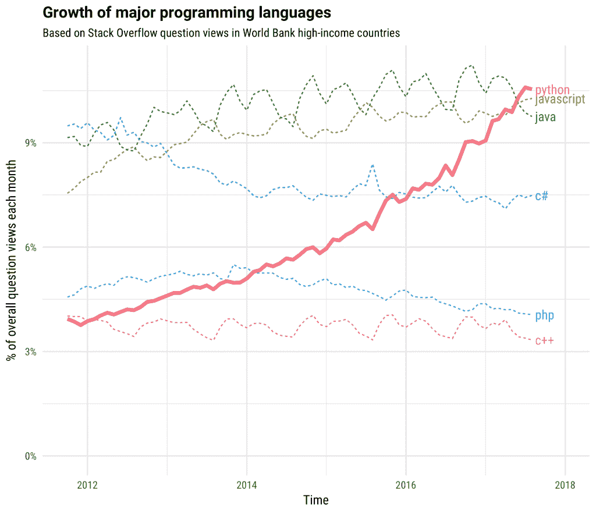
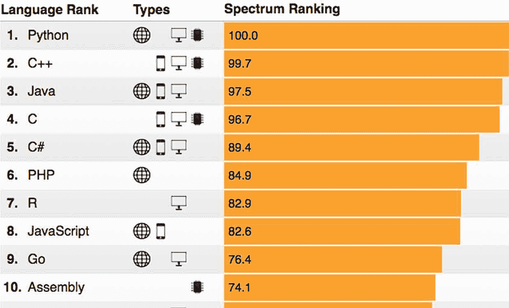

# Python 和其他编程语言有什么不同？

> 原文：<https://medium.com/hackernoon/how-is-python-different-from-other-programming-languages-63311390f8dd>

Python 是广泛应用于各种应用领域的流行高级编程语言之一。

这种语言是由一位名叫吉多·范·罗苏姆的荷兰程序员创造的，最初发布于 1991 年。

常驻美国的 Python 专家 DevZero 表示，“Python 通常被拿来与其他编程语言相比较，尤其是因为它独特的特性和高效的设计理念。”

在本文中，我将试图说明 Python 与其他编程语言的不同之处。


# **1。Python 使用起来很有趣**

与大多数人认为的相反，Python 编程语言并不是以名为 Python 的无毒蛇命名的。

它以 20 世纪 70 年代的英国超现实喜剧团体命名，名为[巨蟒剧团](https://en.wikipedia.org/wiki/Monty_Python)，范罗森喜欢看他们的戏剧。


Monty Python comedy group

喜剧团的理想融入了 Python 代码和文化。特别是，为了让语言使用起来有趣，语言的使用者(称为 Pythonists、Pythonistas 或 Pythoneers)通常会避免不必要的复杂性。

例如，Pythonistas 比 C 或 Pascal 等其他语言的程序员使用更少的语法异常和特殊情况。

此外，这种语言偶尔会在其文档资料中使用有趣的引用；例如，metasyntactic 变量被称为 spam 和 eggs，而不是传统的 foo 和 bar。

# **2。Python 关注代码的简单性和可读性**

Python 的语法和语义强调代码的简单性和可读性。这种语言的设计很大程度上受到了被称为 Python 的[禅的 20 条原则的影响。](https://www.python.org/dev/peps/pep-0020/)

以下是一些原则:

*   漂亮总比丑陋好
*   简单比复杂好
*   复杂总比复杂好
*   可读性计数
*   面对模棱两可，拒绝猜测的诱惑
*   应该有一种——最好只有一种——显而易见的方法来做这件事
*   如果实现很难解释，这是一个坏主意

Python 旨在成为一种易于阅读的语言。一个格式良好的 Python 代码是干净整洁的。

它通常使用英文关键字，而其他编程语言使用标点符号。

与大多数其他编程语言不同，Python 不使用花括号来分隔代码块；相反，它利用空白缩进。此外，没有必要在语句后放置分号。

例如，下面是一段 Java 代码:

```
*public class PythonVsJava {**public static void main(String[] args)**{**System.out.println(“Python Vs Java!”);**}**}*
```

以下是输出:

```
*Python Vs Java!
>>>*
```

下面是用 Python 编写的相同代码片段:

```
*Print (“Python Vs Java!”)*
```

下面是另一段 C++代码:

```
*#include <iostream>**void main()**{**cout << “Python Vs C++!”;**}*
```

以下是输出:

```
*Python Vs C++!
>>>*
```

下面是用 Python 编写的相同代码片段:

```
*Print (“Python Vs C++!”)*
```

# **3。Python 是高度可扩展的**

这种编程语言并没有将所有的功能都设计在 Python 的核心上，而是具有很强的可扩展性。

当需要将可编程接口集成到现有应用程序中时，这一特性使得这种语言非常流行。

Van Rossum 设想了一种语言，它有一个小的核心和大量的支持库，可以增强它的能力。

他想摆脱在使用 ABC 编程语言时遇到的挫折，因为 ABC 编程语言不支持相同的价值观。

有各种各样的 Python 库用于完成各种任务，包括执行科学计算、机器学习、单元测试、图形用户界面和管理数据库——任何您想轻松完成的事情，您都可能找到它的库。

例如，如果您希望在低级计算环境中实现快速性能，您可以将时间敏感的操作迁移到使用 Python 编程语言(如 PyPy 和 Cython)构建的扩展模块。

其他编程语言没有 Python 那样丰富的支持库。

# **4。Python 发展很快**

Stack Overflow 最近认为这种语言是[发展最快的主要编程语言](https://stackoverflow.blog/2017/09/06/incredible-growth-python/?_ga=2.199625454.1908037254.1532442133-221121599.1532442133)。

这里有一个堆栈溢出图，显示了 Python 与其他语言相比是如何经历了令人印象深刻的增长的:



此外， [IEEE Spectrum](https://spectrum.ieee.org/at-work/innovation/the-2018-top-programming-languages) 连续第二年将 Python 列为 2018 年的顶级语言。



Python 的[快速增长](https://hackernoon.com/could-pythons-popularity-outperform-javascript-in-the-next-five-years-abed4e307224)很大程度上归功于其诱人的特性，这是其他编程语言所没有的。

特别是，它简单易用的语法使它对初次开发人员很有吸引力。

此外，Python 的可靠性和效率赢得了在机器学习和数据科学等快速发展的技术领域工作的专业人士的喜爱。

# **包装**

Python 是一种通用的编程语言,它显然自成一派。这种语言的独特之处在于它与众不同。

尽管如此，除了它的优势，Python 仍然不是一种完美的编程语言。例如，Python 被认为是移动计算的弱势语言。

你还知道 Python 和其他语言有什么不同吗？

为什么可以选择 Python 而不是其他编程语言？

请在下面分享你的评论。