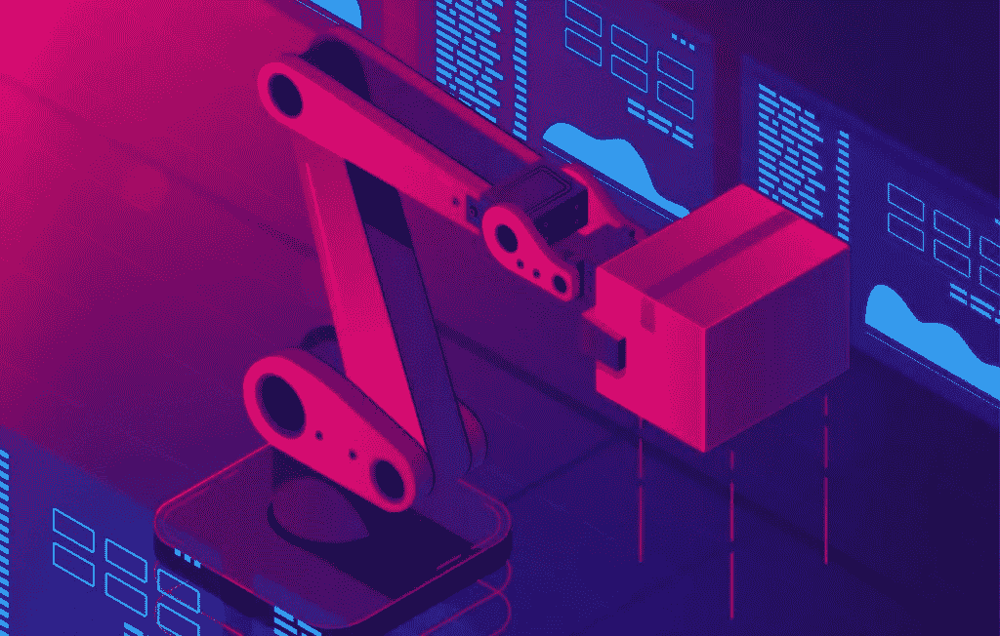

# 机器人过程自动化(RPA)如何改变企业？

> 原文：<https://medium.com/hackernoon/how-is-robotic-process-automation-rpa-transforming-enterprises-709739a5b6a3>

在全球范围内，企业越来越多地转向数字解决方案来创新流程、削减时间和成本，并改善运营。实现这一点的方法之一是采用一种称为机器人流程自动化(RPA)的技术解决方案。

机器人流程自动化(RPA)是一种技术应用，允许员工配置和访问计算机软件(一种“机器人”)来[解释、分析和捕获应用程序以处理交易](https://eleks.com/blog/attention-models-amplifying-machine-learning-benefits/?utm_source=medium&utm_medium=refferal&utm_campaign=Republ-RPA-Blog)，操纵数据并与其他数字系统通信。

这种做法不仅是必要的业务流程自动化的一种方式，而且它还解放了有价值的员工，使他们专注于不同的任务，例如服务消费者和客户。企业利用 RPA 的方式多种多样，从自动回复客户电子邮件(维珍列车在 2015 年实施的第一个)到银行完全重新设计其索赔处理流程，使其每年能够处理超过 150 万个请求。

# 铺平道路的行业:

**汽车。**
[Unimate technology(1954)](https://www.robotics.org/joseph-engelberger/unimate.cfm)，第一个计算机操作的机器手臂，在现代社会可能看起来很原始，但它无疑是该领域自动化革命的开端。如今，汽车制造商可以使用 RPA 来遵守法规，并从实时报告中受益，以开发业务流程和运营。

**零售。**
在零售领域，采用创新是让你从竞争对手中脱颖而出的重要途径。RPA 可以帮助生产，以确保商品安全快速地上架，并在电子商务商店的情况下自动退货。通过消除人工员工手动输入每个产品退货的需要，企业不仅可以节省资金，还可以节省宝贵的时间。

**运输&物流。**
通过使用 RPA，物流公司可以[从开始到结束自动完成运输过程](https://eleks.com/blog/intralogistics-supply-chain-materials-handling/?utm_source=medium&utm_medium=refferal&utm_campaign=Republ-RPA-Blog)。通过访问实时数据，企业还可以更深入地了解供应链和财务状况。另一方面，运输部门可以使用 RPA 来[有效地响应客户期望](https://eleks.com/blog/where-is-my-parcel-or-why-logistics-shouldnt-ignore-chatbot-technology/?utm_source=medium&utm_medium=refferal&utm_campaign=Republ-RPA-Blog)，例如创建现代消费者渴望的自助服务系统。

# 机器人流程自动化(RPA)有什么好处？

**降低成本。**
采用 RPA 软件比雇佣一名新员工来完成任务花费更少。这导致企业每年平均节省 37%的总成本。

**减少人为错误。**
人类会犯错；这是我们的天性。[机器人不会](https://labs.eleks.com/2018/02/how-to-build-nlp-engine-that-wont-screw-up.html?utm_source=medium&utm_medium=refferal&utm_campaign=Republ-RPA-Blog)。当人类员工缺乏完成任务的知识时，RPA 会介入提供帮助。它消除了出错率，从而降低了运营风险。

**改善客户体验。你的顾客是你业务的支柱。RPA 释放了员工宝贵的时间，这意味着他们可以响应客户的查询并提供帮助，而在以前，他们可能会忙于一项普通的任务。**

没有必要更换现有的系统。
要采用 RPA，您只需将其添加到您现有的 it 解决方案中。它是一种工具，可以促进和改善您当前的运营，而不是完全取代它。

# 选择 RPA 需要牢记什么？

RPA 可以显著提高企业的生产力，并使其当前运营数字化。它减少了员工的时间限制，降低了出错的风险。因此，企业越来越多地转向这种流程也就不足为奇了。但是，在您的公司内实施 RPA 之前，需要记住一些注意事项。

**投资风险。** 现在有这么多机器人选项可用，做出正确的选择可能相当具有挑战性。市场上也有很多低质量的自制 RPA。您需要研究、规划并仔细管理您实施的 RPA，以确保您的业务不会面临一些安全风险，也不会造成损失。

**安全漏洞。**
由于 RPA 技术需要适当的治理和安全控制，RPA 软件和 RPA 实例都会引入额外的安全漏洞。否则，它会成为许多黑客的目标。这里关注的关键领域包括软件机器人的治理、漏洞管理和密码管理、法规遵从性等。为了深入了解安全风险，[我们的白皮书进一步解释了](https://eleks.com/whitepapers/preventive-actions-enterprises-can-take-to-avoid-it-security-vulnerabilities/?utm_source=medium&utm_medium=refferal&utm_campaign=Republ-RPA-Blog)。

**不道德的机器学习模式。**
不幸的是，机器学习算法冒着[拾取不道德和不可接受的模式](https://eleks.com/blog/responsible-innovation-ai-ethics/?utm_source=medium&utm_medium=refferal&utm_campaign=Republ-RPA-Blog)的风险，而这些模式是它们做出决策的基础。尤其是对跨国企业来说，这是一个真正的风险，可能会严重损害企业的声誉。这种风险的一个引人注目的例子是优步。在伦敦恐怖袭击期间，[优步算法将票价抬得很高](https://www.independent.co.uk/news/uk/home-news/london-terror-attack-uber-criticised-surge-pricing-after-london-bridge-black-cab-a7772246.html)，导致了一场声誉受损的丑闻，优步很难从中成功恢复。

# 最后

在采用 RPA 时，无论您属于哪个行业，您都需要极其小心谨慎地进行研究。只有提前做好业务准备，并与专家讨论您的[定制软件开发](https://eleks.com/services/software-engineering/?utm_source=medium&utm_medium=refferal&utm_campaign=Republ-RPA-Blog)，您才能成功采用这一流程。

准备好采用自动化软件解决方案来满足您的业务需求了吗？我们会指引你前进的每一步。[联系我们](https://eleks.com/contact-us/?utm_source=medium&utm_medium=refferal&utm_campaign=Republ-RPA-Blog)！

*原载于 2018 年 11 月 1 日*[*【eleks.com】*](https://eleks.com/blog/robotic-process-automation-rpa-enterprises/?utm_source=medium&utm_medium=&utm_campaign=Republ-RPA-Blog)*。*