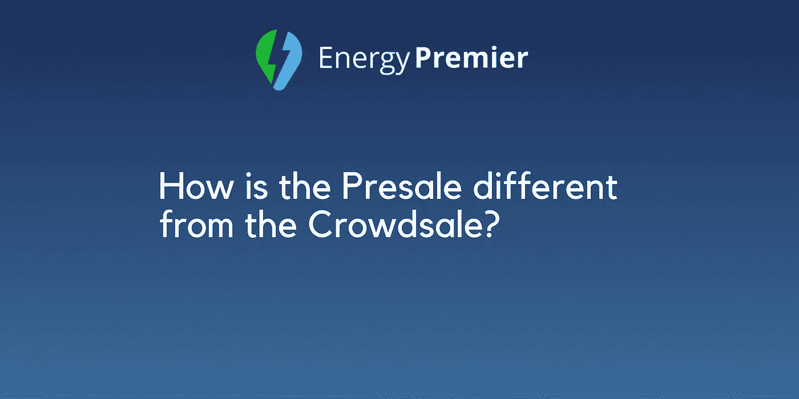

# 预售和众筹有什么不同？

> 原文：<https://medium.com/hackernoon/how-is-the-presale-different-from-the-crowdsale-f369f484794d>

近来，加密货币 ICOs 的世界发展迅速。看起来，这些 ico 在以太网上带来了利益和利润。ico 已经成为一种非常受欢迎的加密货币项目融资方式。如今，ICOs 似乎要在众筹开始之前启动一个所谓的预售阶段。

*在介绍一个区块链项目的过程中，我们经常会看到* ***预售*** *和* ***众筹*** *这样的字眼。这就是为什么分离和解释这些术语很重要。在本文中，你会发现预售是什么，它包含什么，以及它与众筹销售有何不同。*

**什么是预售？为什么我们会有它？**

预售是公司向公众展示“嘿，我们成功了！加入我们”。预售或 pre-ICO 是一个术语，指的是在众筹开始之前发生的过程。它通常允许投资者在众筹开始前购买代币。此外，这也是公司为他们的区块链项目筹集资金的好方法。

这种代币销售事件通常有独立于主众筹销售事件的智能合约。它通常针对较大的投资者以及一些私人投资者，这取决于代币销售的结构。

预售是对 ICOs 产生积极影响的新现象。预售的主要理念是提供折扣。公司没有筹集到大量资金，但这是一个机会，他们可以借此推销自己试图出售的代币。参与预售的投资者通常会获得更低的每枚硬币价格以及更高的奖金数额。因此，这些人有时会得到额外的奖励，如一些免费的访问，一个奖励卡等。

这就是为什么我们有售前阶段，为什么它对 ico 有很好的影响。这件事对公司和投资者都有好处。

在另一边，我们有众筹

众筹是 ICO 项目的核心。是一个有加密货币项目的公司出售部分代币换取金钱的事件。这是一个筹集资金的过程，人们通过小额投资来创造更大的投资。

任何人都可以参与众筹。你只需在该公司的页面上创建一个账户，将你想投资的存款放入他们的钱包地址，然后就可以享受了。只要按照说明去做，就可以在那里投资，被认可为投资人。

众筹有自己的好处。首先，当你加入某个项目时，你支持并相信那个项目，通过投资，你得到了你以后可以出售的代币。当你参与众筹销售时，还有不同的奖金和奖励。

这是预售和众筹的一些区别。正如我们所看到的，这两个阶段都是独特的，都有各自的特点和优势。尽管有众所周知的众筹活动，但现在我们有了预售，这是启动 ICO 项目的好方法。

看起来，预售对投资者很重要。这是官方众筹将如何进行的指南。这就是为什么最好在众筹开始前进行预售。我们认为售前有利于 ICO 项目，所有 ICO 都应在其计划中包括这一活动。

预售要想成功，公司必须拥有投资者可以试用的成品、可以执行目标的优秀团队、专业的营销活动、强大的网络安全等。我们相信，我们已经具备了成功进行售前的一切重要条件。

我们迈出了第一步，因为我们的预售已经开始。看看吧。

> 感谢您的阅读。
> 
> [订阅最大的电力竞价平台](/@energypremier)，随时关注我们的更新。也在我们的电报频道参与讨论:【https://t.me/joinchat/Hq0j1hDxZ3eRKFNo5f7oTw 
> 
> 在这里加入预售和众筹:【https://tokensale.energypremier.com/ 

您也可以查看一些类似的文章:

*   [预售和众筹说明](/@EnergyPremier/instructions-for-presale-and-crowdsale-ef0353202fe)
*   [永远不要错过能源总理](/@EnergyPremier/never-miss-anything-from-energy-premier-e8a9e1305901)
*   [能源市场中的区块链——专家怎么说？](/@EnergyPremier/blockchain-in-the-energy-market-what-are-the-experts-saying-86e55f754a2a)