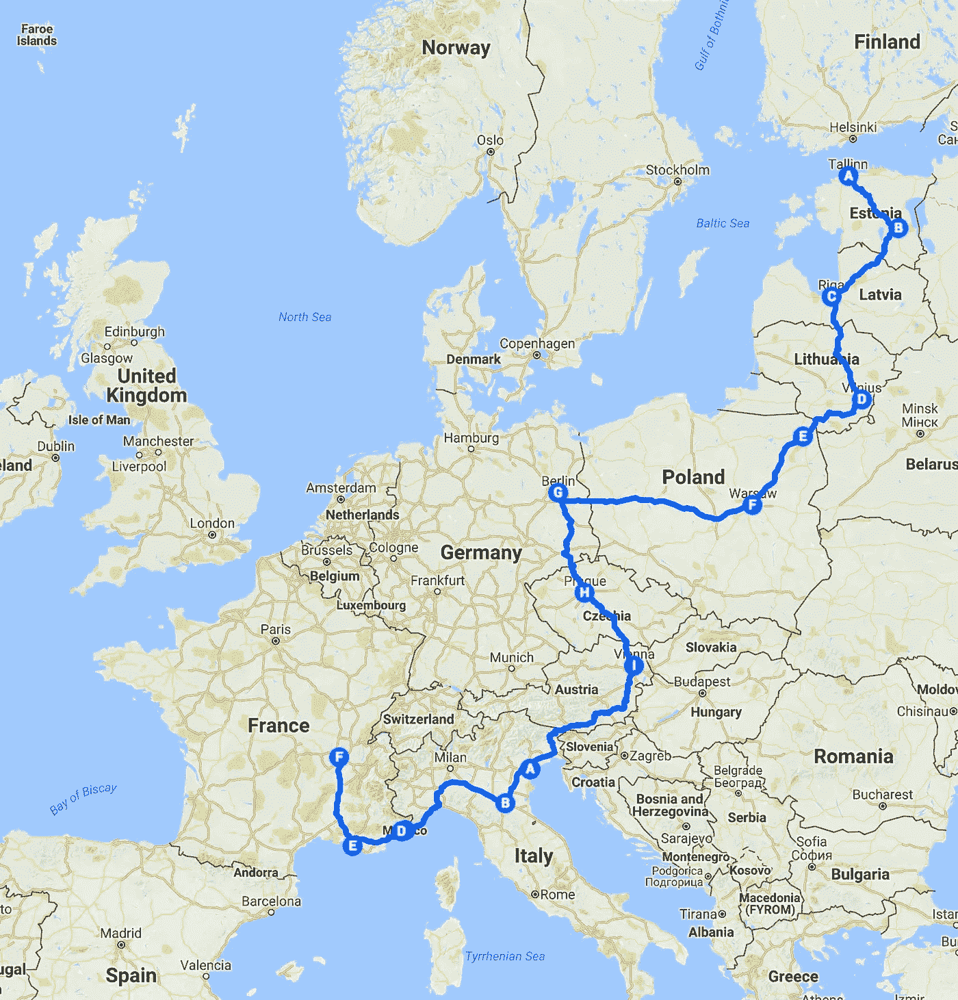
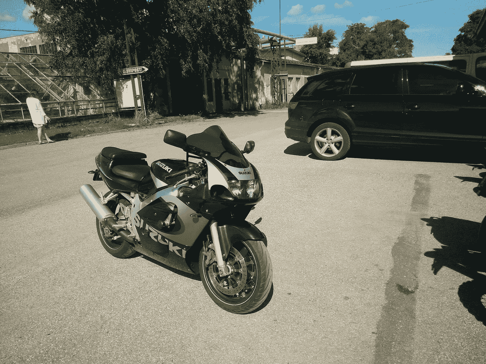
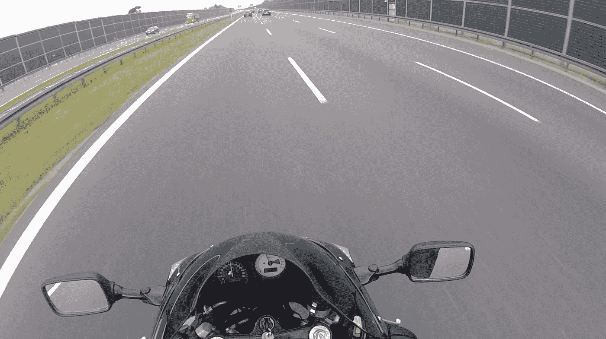
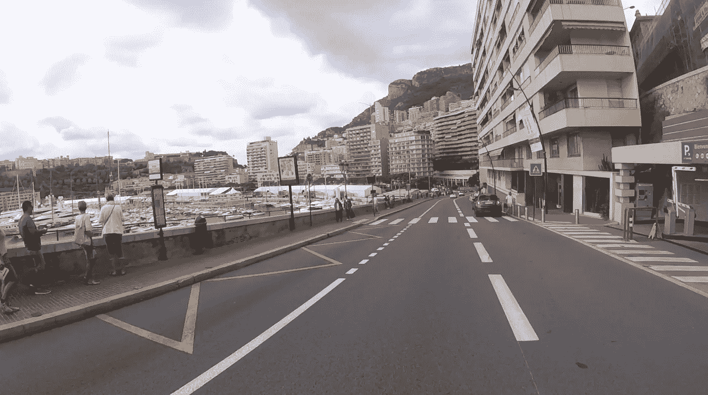
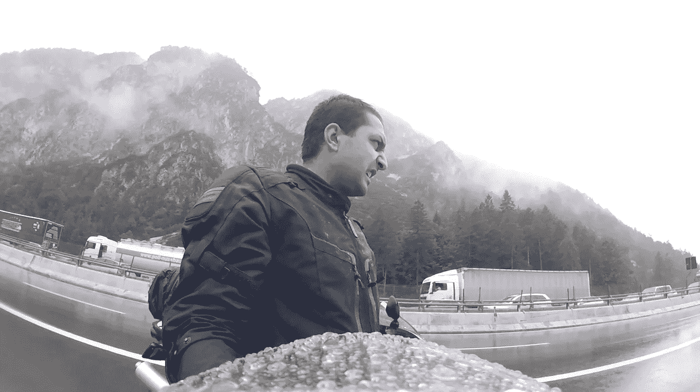
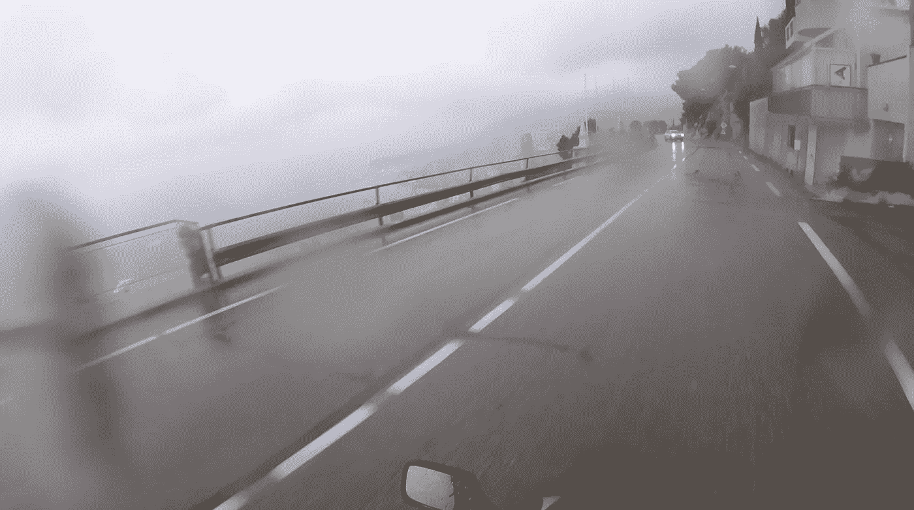
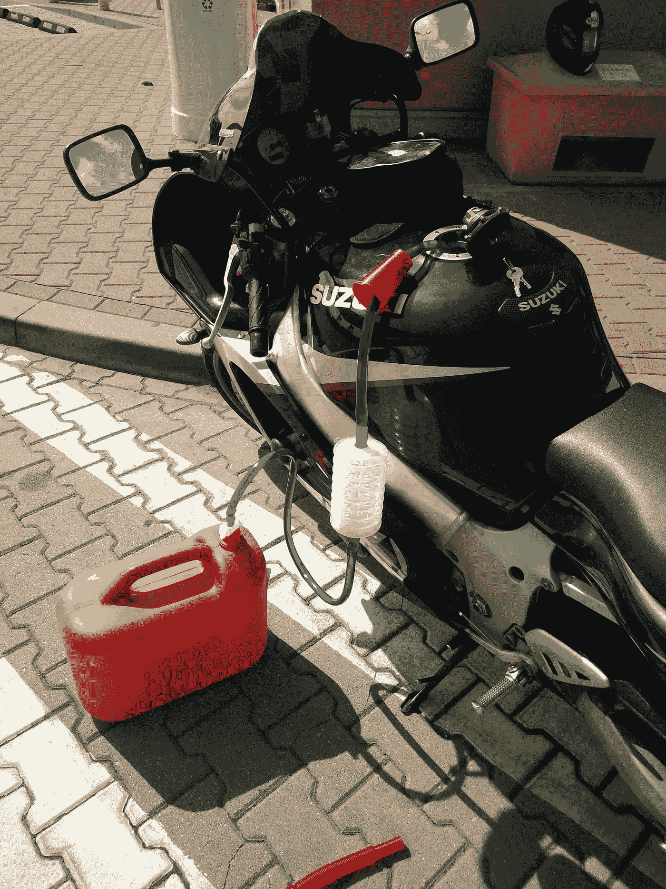
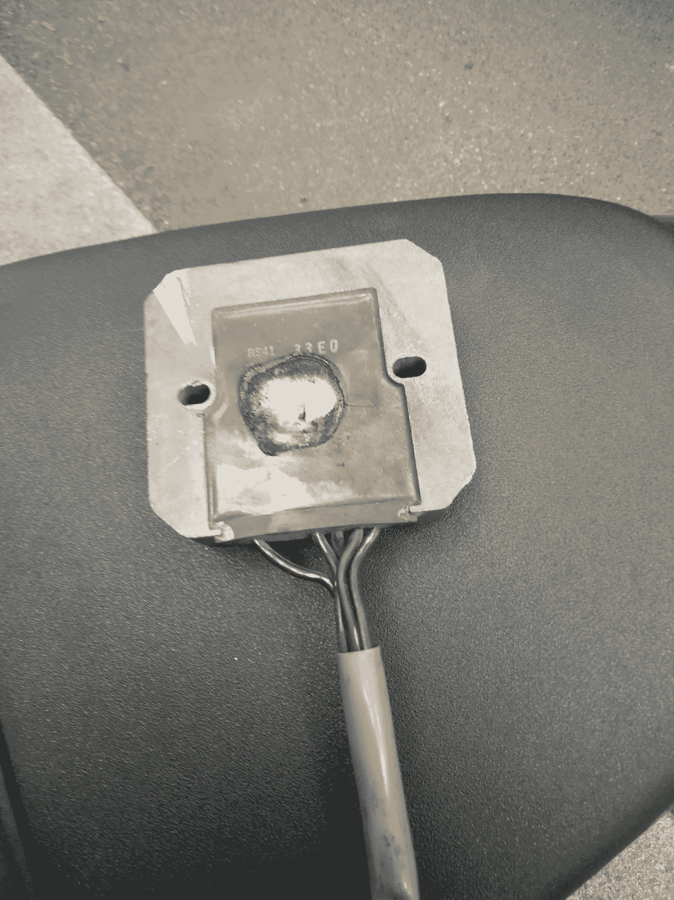
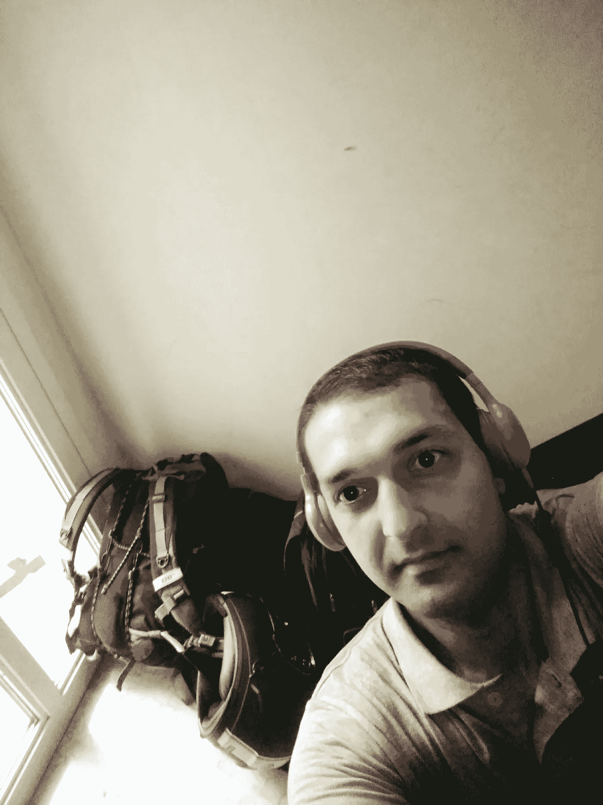

# 骑行 5000 英里的感受，全程编码

> 原文：<https://medium.com/hackernoon/how-it-feels-to-ride-5000-miles-and-do-coding-at-the-same-time-40aeb2e4f7fa>

Screenshot from Google Maps

我大约 3 年前开始骑摩托车，一直想一个人骑很长时间。

作为一名企业家，我不得不每周 7 天、每天 24 小时工作，从来没有时间花一天以上做其他事情，但有时工作和冒险是完全可能的！

# 怎么开始的？

今年八月，我去了爱沙尼亚拜访我的朋友，并使用 E-Residency 完成了我的公司设置。这个过程通常需要 2 个月，所以我不想在爱沙尼亚等那么久，并开始考虑在这段时间搬到欧洲的其他地方。

突然，我有了一个想法，在 1.5 个月内从爱沙尼亚的塔林骑摩托车到葡萄牙的里斯本💡很快我就迷上了这个想法。一天之内，我决定买一辆便宜的二手摩托车，骑到里斯本，在那里卖掉摩托车，然后飞回塔林。似乎很合理，对吗？

从 dragbike.ee 网站上找到了一辆自行车，计算了一下全程大约需要 4K 欧元，最终决定骑上它！

**我唯一的计划**

*   每天只骑 3-4 个小时的摩托车，其余时间工作
*   仅在大城市停留 2-3 晚，主要是首都
*   只住在旅馆里，以满足新的人和旅行者
*   尽量保持乘车安全:)

# 准备骑行

使用在线服务在爱沙尼亚研究摩托车 1 天后。终于只花了 1900 Eruo 就买到了这辆**铃木 GSXR 600 2001** ！

First photo after signing documents

又花了 1000 欧元买了特别的衣服，头盔，当然还有 GoPro 会议，拍了很棒的骑行视频。

如果你现在认为“运动自行车对于长途旅行来说是可怕的”，你是完全正确的，但是它看起来很棒，我真的想用运动摩托车来制造它🎉

选择合适的摩托车进行长途旅行是随意的，因为你要一个人骑，不需要别人帮忙你应该能修好。在这种情况下，我做了一个可怕的决定，买了铃开 GSXR，因为发动机完全是根据电喷原理工作的，所以每当你的电池没电时，你就不能做任何事情，只能更换电池。

# 从一个城市到另一个城市

欧洲县的定位是理想的，从一个首都骑到另一个在 3-4 小时内。我能花半天时间享受骑车的乐趣，然后坐在某个地方(通常是咖啡馆)完成当天的工作！

每个城市都有自己的故事和特别的东西可以展示。这就是为什么有时候，如果我喜欢这个城市本身，我会超出我的计划，多呆几天。

我去过 16 个城市，所有的城市我都住在非常便宜的旅馆里，这帮助我把这次旅行保持在 4K 欧洲之下，包括摩托车！但是旅舍最重要的部分是和许多其他有趣的旅行者共用一个房间。你会惊奇地发现，你可以听到几乎所有国家的许多有趣的故事。

以下是在宿舍发生的最鼓舞人心的事。在柏林，我遇到了一个叫乔恩的人(就这么称呼他吧)，他来自英国，以摄影为主要收入来源，他正在世界各地旅行。我对他在巴塔哥尼亚、哥伦比亚等地的故事很感兴趣…猜猜看，16 天后，当我在意大利的博洛尼亚时，我们意外地住在同一家旅馆，同一间房间💥他看着我，说“嘿，伙计，你到底在这里做什么？？！!":)

# 道路条件

欧洲的道路真是太棒了！我在德国以 220 Km/h 的速度骑过赛车，用的是随机音频 TT。事实上，如果你在收费的道路上骑行，你可以从一个城市到另一个城市更舒适更快捷，但是普通的道路也很棒。

Warsaw — Berlin autoban

Monaco

最有趣的骑行是从尼斯到摩纳哥！总的来说，意大利曲折的道路令人惊叹。

# 什么会出错？！

这就是进行一些“冒险”的想法。最初几天，所有城市都很棒。然后开始了我作为摩托车手最讨厌的事情**下雨！很多下雨天！**

Somewhere in Italy from Vienna to Venice — RAIN!!

Arriving to Monaco — Still RAIN!!

By mistake filled Diesel :)) Pulling out it here!

最终在尼斯出了点车祸，多亏了车架滑块，没什么大碍。

**这里最恐怖的事情发生在从法国马赛到里昂的旅途中。** 我已经骑了大约 140 公里/小时，突然发动机熄火，所有的电都没了！😱

向右转，称之为道路紧急情况(感谢法国，他们有这方面的服务)，并疏散摩托车到最近的摩托车店。

原来摩托车的**整流器**负责将发动机的电力转换成电池的，完全烧坏了！

Suzuki GSXR Rectifier completely burned!

当然也没有摩托车修理店，那里有这种东西。所以我开始研究如何让它跑起来，再骑 200 公里，到达最终目的地法国里昂。

在浏览了大量的技术视频和手册后，我终于明白了，我可以拔掉整流器，在充满电池的情况下行驶大约 100 公里，直到电池失去电荷。这是因为现代自行车使用电动燃油喷射技术，这意味着如果你的摩托车上没有电池，它根本不会运行，不像碳酸摩托车。

所以我买了两块电池，以防万一:)给它们充电，然后骑了最后 200 公里到里昂。当然，在没有充电整流器的情况下，骑了 120 公里后，我不得不开出一条路，换一个电池。

# 但是编码呢？

你会感到惊讶，但我每天都在工作，不管白天发生了什么。如果你考虑到我和我的团队有美国时区每日站立，有时我不得不在大楼入口、公园甚至洗手间做这些，这就更可怕了:)

Bologna some random building entrance — Standup call with US team!

每次当我在一些随机的城市需要一个工作的地方时，我都会使用这个网站[https://workfrom.co/](https://workfrom.co/)，它显示了所有可以工作的地方、咖啡店、合作空间等等。如果你打算做类似的事情，这是一个理想的信息(希望更好！)并且也想在那段时间工作。

# 概括起来

这次旅行改变了我很多。我开始变得更加冷静，对我正在做的事情更加热情。

我遇到了很多很棒的人，听到了他们的故事，分享了我的故事。了解了其他文化，整个旅程非常愉快。

我认为在你的生活中有这样的经历正在改变和塑造你是谁，最重要的是，即使在这种冒险之后，你也不会感到无聊。

如果你喜欢这个故事，就拍拍**👏** min 50 次:)拍手，拍手，拍手，分享，分享，分享！！