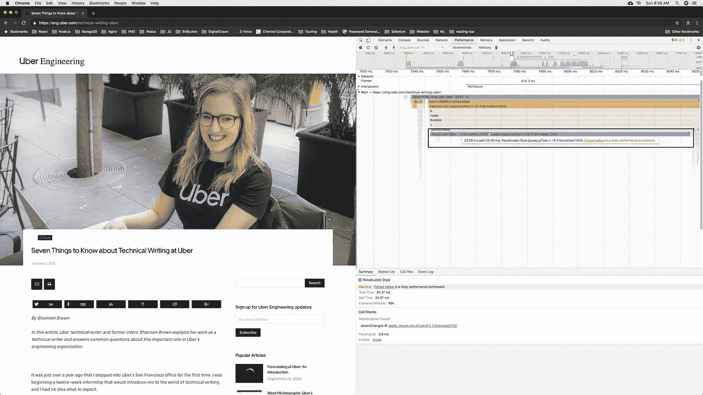
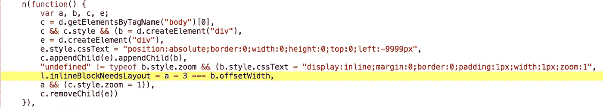
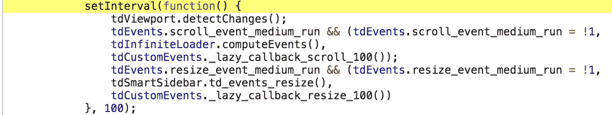

# jQuery 是如何扼杀优步工程的？

> 原文：<https://medium.com/hackernoon/how-jquery-is-killing-uber-engineering-892dbec26fde>

Photo by [Victor Xok](https://unsplash.com/photos/qd-zd2MoeE8?utm_source=unsplash&utm_medium=referral&utm_content=creditCopyText) on [Unsplash](https://unsplash.com/search/photos/uber?utm_source=unsplash&utm_medium=referral&utm_content=creditCopyText)

就像另一天，当我在优步工程学院看一些有趣的博客时，一些有趣的事情引起了我的注意。

你知道我们的眼睛有多强，能轻易找到不稳定的东西吗？通常，我们的设备每秒渲染 60 帧，这意味着它在 16.66 毫秒内渲染 1 帧(时间间隔可能因低配置设备而异)。如果事情没有在指定的时间框架内呈现，我们在我们的访问网站得到不稳定的东西。

这就是我今天参观[优步工程](https://eng.uber.com/)时发生的事情。

## 浏览器渲染优化。

通过对浏览器渲染优化的简短介绍，我想进一步加深对本文的理解。

Browser’s Rendering Pipeline

这是一个典型的框架。可以把它看作是浏览器的渲染管道。通常，我们使用 JavaScript 来处理会导致视觉变化的工作。

1.  ***JavaScript*** —你可以用 JavaScript 或 CSS 做出视觉上的改变
2.  ***样式*** —浏览器必须重新计算受影响元素的样式。
3.  ***布局*** —现在，如果你改变了布局属性，如宽度、偏移量、高度等，浏览器将不得不检查所有其他元素并重新排列页面。
4.  ***油漆*** —任何受影响的区域都需要重新油漆。
5.  ***合成***——最终绘制的元素需要重新合成在一起。

希望您对框架生命周期有所了解。如果你想进一步了解，看看浏览器渲染优化课程。

 [## 浏览器渲染优化| Udacity

### 本课程将揭开浏览器渲染管道的神秘面纱，让您轻松构建高性能的网络…

in.udacity.com](https://in.udacity.com/course/browser-rendering-optimization--ud860) 

## jQuery 如何影响优步？

直奔主题，让我开始列出加载[eng.uber.com](https://eng.uber.com/)时发生的不平稳的事情。

先看看视频里的混蛋。

视频中发生了什么？你能认出一些混蛋吗？

# 装载物品时。

Forced reflow — Performance bottleneck.

在加载一篇文章时，你可能会在谷歌浏览器的“性能”标签中看到一条警告，

> [强制回流](https://developers.google.com/web/tools/chrome-devtools/../../fundamentals/performance/rendering/avoid-large-complex-layouts-and-layout-thrashing#avoid-forced-synchronous-layouts)是一个可能的性能瓶颈——在重新计算样式时。

## 这是什么？

按照管道，我们需要在样式和布局之前计算几何元素(使用 JavaScript)。经过逆向工程(当时找不到贴切的词) [jQuery v1.12.4](https://code.jquery.com/jquery-1.12.4.js) ，我才知道 **div.offsetWidth** (一张图片中的 b.offsetWidth)在案例中加载需要几秒钟。记住，我们需要在 16.66 毫秒内加载一帧

Function to set body.style.zoom

这里，jQuery 执行前面提到的函数来设置 body.style.zoom 属性。根据 [CSS 指南](https://developer.mozilla.org/en-US/docs/Web/CSS/zoom)，缩放属性为**非标准**且不在标准轨道上。不应在生产现场使用。

## 解决方案。

为了克服这个问题，他们可以在 CSS 级别使用属性`[transform: scale()](https://developer.mozilla.org/en-US/docs/Web/CSS/transform-function/scale)`,或者升级 jQuery，我希望在下一个版本中可以解决这个问题。

# 为什么使用[放大弹出菜单](http://dimsemenov.com/plugins/magnific-popup/)？

## 这是什么？

> Magnific Popup 是一个响应式 lightbox & dialog 脚本，专注于性能，为使用任何设备的用户提供最佳体验
> (用于 jQuery 或 Zepto.js)。

我找不到确切的原因，比如为什么使用这个弹出插件(也许有一些情况，我不知道)，但我可以向你保证，你正在损害你的网站的性能。

[requestAnimationFrame](https://developer.mozilla.org/en-US/docs/Web/API/window/requestAnimationFrame) can be used instead of setInterval

这里，setInterval 一直调用一个名为 **detectChanges，**的方法，该方法计算元素相对于浏览器的几何(clientWidth)并使用 setInterval 在某一点迭代该函数，可能会导致低质量的动画。

## 解决方案。

这里，Magnific Popup 仍然使用 setInterval，而我们有了最新的 Web API，名为[*requestAnimationFrame*](https://developer.mozilla.org/en-US/docs/Web/API/window/requestAnimationFrame)。

[*requestAnimationFrame*](https://developer.mozilla.org/en-US/docs/Web/API/window/requestAnimationFrame)API 产生高质量的动画，完全消除了使用 setTimeout 或 setInterval 时可能发生的闪烁和剪切。

检查 [*为什么 requestAnimationFrame 比 setInterval 或 setTimeout*](https://stackoverflow.com/questions/38709923/why-is-requestanimationframe-better-than-setinterval-or-settimeout) 更清晰。

全球 92.78%的用户使用 requestAnimationFrame(来源:[can use](https://caniuse.com/#feat=requestanimationframe))。当谈到浏览器兼容性时，我可能是错误的，在旧的浏览器中可能会出现漂亮的弹出窗口。

我只是想让优步让他们知道这是事实，大多数浏览器都支持 requestAnimationFrame，作为一名前端工程师，我也这么建议。

同样，在滚动、导航等过程中，我可以发现网站的许多性能瓶颈。同样在 UberEats 中，这个问题可以通过移除 jQuery 或**来解决，方法是雇佣像我这样的前端开发者，他可以让网站以 60fps 的速度运行，而我现在失业了。**

> 甚至在 [UberEats](https://www.ubereats.com/en-IN/stores/) 中，我在跟踪我已经订购的订单时发现了一些性能问题。帧没有在 60fps 内渲染，这导致骑手移动时地图垃圾。

作为一名优步爱好者和前端开发人员，优步从 jQuery 到 React-Redux 的技术转变是一个很好的举措。

我不知道 [Web Workers](https://developer.mozilla.org/en-US/docs/Web/API/Web_Workers_API/Using_web_workers) 在他们的堆栈中被利用到了什么程度，这可以极大地提高他们的性能。

我个人很喜欢优步，也看到了它在日常生活中的进步。作为前端技术的终身爱好者，我确信我可以帮助您应对前端即将到来的挑战。

我只是想让这些东西接触到优步，这样他们也应该关心他们的技术爱好者。

## 测试机器的配置。

谷歌 Chrome 版本: **69.0.3497.100(正式版)(64 位)**

iMac (Retina 5K，27 英寸，2017) macOS High Sierra。版本 10.13.4。

(仅供参考，优步工程网站是在谷歌浏览器的匿名模式下加载的，所以我不想指责任何扩展。)

**免责声明**:我尽我所知写了这篇文章，有错的地方请大家指正。我也很想知道这些事情。

谢谢你。