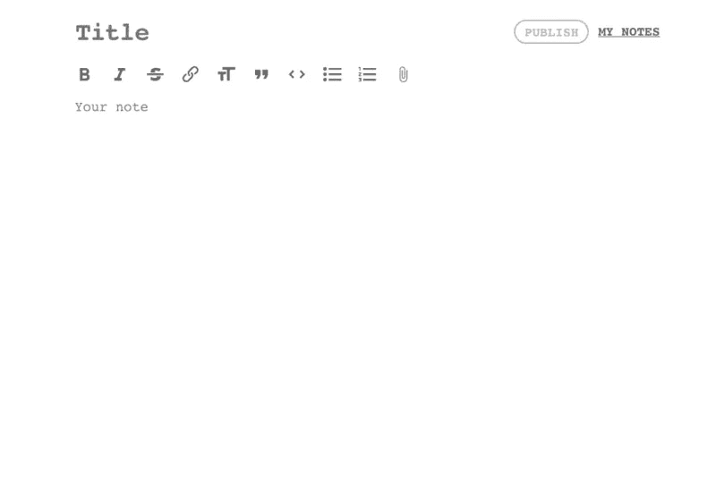
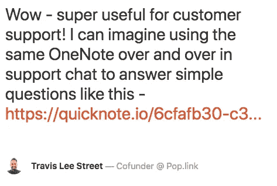
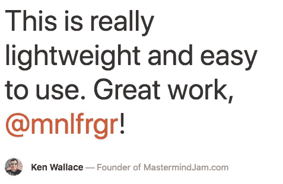
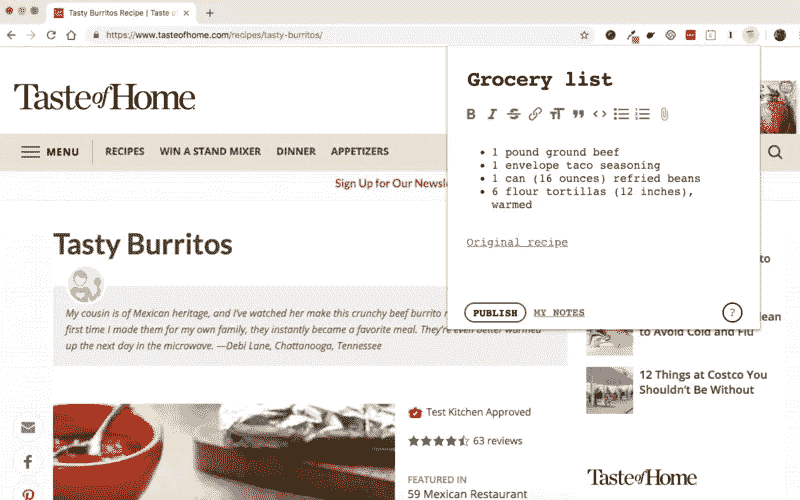

# 学习的反应让我创建了一个 10K 人使用的应用程序

> 原文：<https://medium.com/hackernoon/how-learning-react-led-me-to-create-an-app-used-by-10k-people-a15db65a841>

几个月前，为了好玩和挑战，我为自己设定了目标:学习反应和 T2 无服务器架构。

幸运的是，[无服务器堆栈](https://serverless-stack.com/)拯救了我。

无服务器堆栈教程旨在教你什么是无服务器(特别是 AWS Lambda ),并指导你创建一个简单的笔记应用程序。frank Wang([@ fanjie Wang](https://twitter.com/fanjiewang))&Jay V([@ jayair](https://twitter.com/jayair))在创建一个简单易懂、清晰且解释丰富的分步教程方面做得非常出色。

但现在我跑题了。很久以来，我就有了一个免费的、极简的、无需登录的笔记应用的想法。

为什么免费、极简、开放？
我不确定，但我知道我经常发现自己需要做一个快速笔记——比如复制一段代码、列一个购物清单或只是转储一些快速的想法——并对我必须创建一个新的谷歌文档、更改共享设置等感到沮丧。

我想要快速的东西，我说的“快速”是指打开-写-保存-分享的快速。

所以我想，如果我需要这样的东西，我肯定不是唯一的一个？
所以我四处询问其他人是否有同样的问题，做了我的研究，在几周的客户开发之后，我马上开始编码。

两天后它就准备好了。我把它叫做[快速笔记](https://quicknote.io/) *

# 什么是 QuickNote？

QuickNote 是一个免费的，不需要登录的，做任何你想做的事情和一些其他连字符单词的笔记应用程序。

您可以即时创建笔记**——其中可以包含链接、图像、列表或代码片段，并在几秒钟内与您的同事或朋友分享。**

**正如一个人在产品搜索上所说:**

> ***它在数字上相当于刮一张纸来快速传递某物。***

**你可以用它做任何你想做的事情，但是这里有一些想法:**

*   **在 Skype 通话期间与朋友分享笔记**
*   **回答[简单的客户支持问题](https://quicknote.io/6cfafb30-c314-11e8-8b1e-dd72d0895237)**
*   **与团队中的其他程序员分享代码片段**
*   **与你的搭档分享食谱**
*   **[给你的伴侣发送情话](https://quicknote.io/93f75080-db9c-11e8-b844-53a0ed97ebc5)**
*   **[草拟博文](https://quicknote.io/0f4ecb10-dae8-11e8-9646-c1b74445c3c8)**
*   **创建一个[购物清单](https://quicknote.io/7adb3500-db90-11e8-b844-53a0ed97ebc5)**

# **启动和初始反应**

**9 月 28 日，我在[产品搜索](https://www.producthunt.com/posts/quicknote-io)上发布了它，并取得了一定的成功。**

********

**自发布以来，超过 10，000 人创建了超过 30，000 条快速笔记。平均每天 1000 英镑左右。最积极的国家是中国。不知道和 QuickNote 是匿名服务有没有关系。**

**一个主要的功能需求是 Chrome 扩展，这样人们可以在任何标签页上做笔记。**

**10 月 28 日，我发布了官方 Chrome 扩展[,我个人非常喜欢它，因为它让在任何标签页上记笔记变得非常简单，这正是我最初想要的。](https://chrome.google.com/webstore/detail/quicknote/femcdccfbknpggkbjnhodfbfnpfocacg)**

****

**.**

****

**QuickNote 现在是我事实上记笔记甚至为博客文章写草稿的方式(就像这个)。**

**我不确定未来会发生什么，也不知道人们会如何使用它，但坦率地说，我不在乎。
我为自己创建了 QuickNote，我喜欢它。我没有计划将它货币化，也没有计划让它成为一个“严肃”的项目。QuickNote 由 AWS S3 托管，并使用 AWS Lambda 作为后端，这意味着即使每月有数百万人使用它，它也只需花费几分钱。**

**PS:如果你曾经以任何酷/不同的方式使用过 QuickNote，[请让我知道](https://twitter.com/mnlfrgr)！**

*   **创造力并不是我的第二个名字，但他们说描述性的名字是件好事，对吗？**