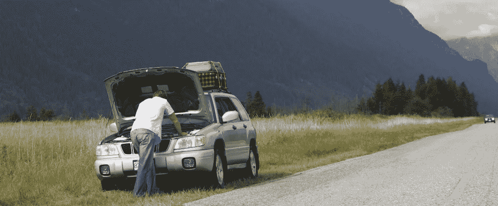

# 离你从破车里出来还有多久？

> 原文：<https://medium.com/hackernoon/how-long-before-you-get-out-of-a-broken-car-5485d9e90e90>

有一次，我一个人在高速公路上开车，手机没电了。过了一会儿，我的[车](https://hackernoon.com/tagged/car)的发动机开始发出劈啪声，最终停了下来。我检查了汽车里还有燃料。所以，我试着打开点火开关几次，希望汽车能启动。但事实并非如此。

我不知道最近的[加油站](https://hackernoon.com/tagged/petrol-station)在哪里，自从我停下来后，我没有看到一辆车经过，我也不知道还要多久太阳才会下山，天黑下来。但是，我坐在车里，一次又一次地打开点火开关，希望汽车能够启动，让我继续前行。

当然，我实际上并没有这么做。至少不是字面上的意思。没人会这么做。

我们都知道，在这种情况下，我们会尝试几次点火，如果不起作用，就接受发动机有问题的事实，并尝试不同的方法来修复它。在最糟糕的情况下，如果我们无法在引擎盖下做出任何改变，就放弃，把车留在后面，搭顺风车或和机械师一起走到最近的地方。

当陷入像比喻的坏掉的汽车这样的情况时，我们倾向于不停地转动钥匙，希望摆脱我们所处的情况，而不接受某物坏了，需要修理。

这可能有很多原因——我们不想接受我们做了一个错误的决定，我们不想让别人回来告诉我们“我们告诉过你”,我们不想面对从头再来的现实，我们不想告诉自己我们迄今为止投入的所有努力都是浪费。

但是坐在那里等待汽车启动只会延长这种认识和最终的修复。我们可以随心所欲地欺骗自己，在相对较短的时间内感觉良好、乐观，但一旦太阳下山，我们最终必须找到前进的方法。

接受痛苦的事实有助于我们做出重大的转变。

这是教练或导师最重要的角色。帮助我们看清并接受自己的缺点。

只有那时我们才有希望变得更好。

## 在你走之前…

*如果你喜欢这个，支持我的工作。你需要做的就是鼓掌。*

[*跟我讨论美好生活的错综复杂。*](http://eepurl.com/cqwJZT)

[*读我的书*](https://www.amazon.com/s/ref=nb_sb_noss?url=search-alias%3Daps&field-keywords=mayantuyacu)