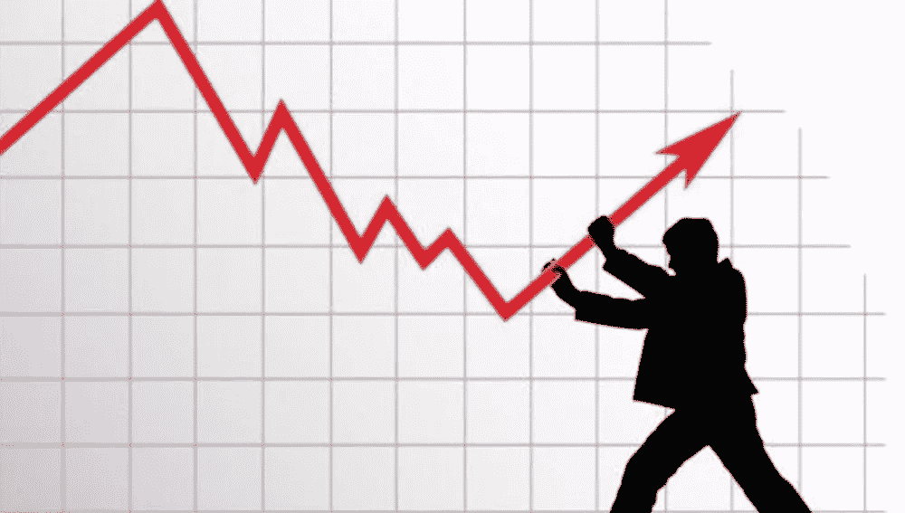
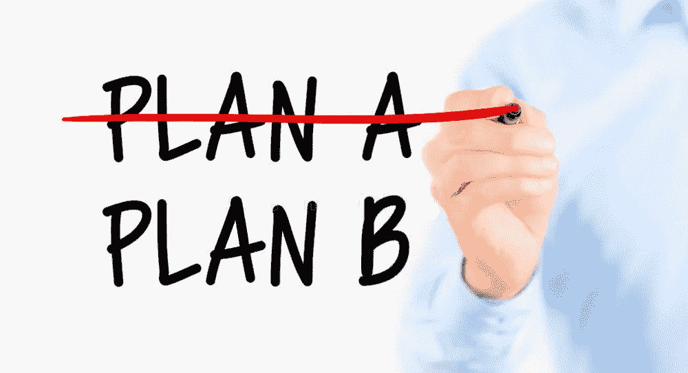
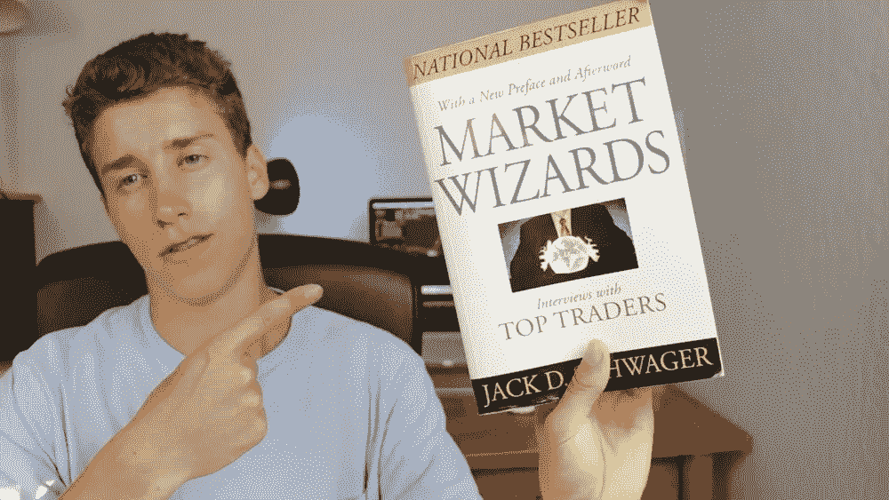

# 一个人成为优秀的交易者需要多长时间？

> 原文：<https://medium.com/hackernoon/how-long-will-it-take-for-a-person-to-become-a-good-trader-42293c59cfab>

这个发人深省的问题的答案基于许多因素，有些因素在一个人的控制能力之内，而有些则不然。首先，我们必须假设潜在交易者相当聪明，如果我们可以这样假设，那么我们也可以假设他们想成为一个聪明的投资者，拥有一个多元化的交易平台，帮助他们免受市场波动的影响。

纪律和耐心是一个好的交易者获得长期成功的两个关键因素。大多数人一开始会成为一个糟糕的交易者，因为他们不知道更好的交易方式，可能会买顶卖底，只有在窗口有绿灯亮的时候才会买入。新交易者在学习投机和如何把你扔进狼群的过程中会犯错误。

90%的交易者在头 90 天损失了大部分资产，那些没有损失的人可以认为自己很幸运，因为这不是典型的结果。对大多数交易者来说，真正的问题是他们如何达到自己的临界点，让交易者改变他们的方法，做出好的决定，或者退出游戏，回到他们入席前的状态。

适应性是区分成功交易者和不成功交易者的一个重要因素，聪明的投资者总是会运用他们学到的东西，这样他们就可以在成功的道路上迈出下一步。糟糕的经历可以让潜在的人了解一些残酷的现实，对大多数人来说，这是他们心态改变和做出明智决定的起点。

需要注意的一点是，这个突破点不是能冲的。潜力不应该寻找一个突破点，因为每个人都不一样。相反，潜在投资者应该继续前进，学习所有成功投资者在他们自己的成功之路上必须学习的课程。由于这些课程对每个人来说也是不同的，所以不可能预测他们将如何被吸收或需要多长时间来学习它们。

对大多数潜在投资者来说，这些教训是非常情绪化的，当这些惨痛的教训被吸取后，你可能会想从交易中抽身出来，为损失带来的悲伤做准备。这将使潜在的人清理他们的头脑，而不是作出重要的决定，而情感的洪流已经控制了他们的敏感性。对失败感到难过是很重要的，因为这种情绪会刺激成功所需的改变。

达到临界点是潜在投资者在通往成功投资的道路上需要经历的大约 60%的旅程。一旦达到这一点，聪明的投资者就会花时间通过阅读一些好的书籍和由知情人士撰写的材料来自学影响市场的所有因素。这并不意味着只看几个自称无所不知的人制作的 YouTube 视频，而是在真正的教育上做出真正的努力。对大多数人来说，买书并阅读，看视频课程，做笔记，或者参加一些研讨会是最好的方法。

理解风险管理(提示)对于任何投资都是至关重要的，这一学科必须在许多方面发挥作用。你会发现管理这些风险的方法可以在 Michel Crouhy、Dan Galai 和 Robert Mark 所著的《风险管理要点》(第二版)等书中找到，虽然这类书不是关于加密货币的，但特别是，它们可以教你管理风险的基本方法。聪明的投资者会知道如何运用这些方法，并成为出色的风险管理者，知道如何避免投资世界中的许多陷阱。

一旦你在游戏中有了一些经验，另一本值得一读的好书是杰克·施瓦格的《市场奇才》，你可以通过点击这里免费阅读这本书，并获得一些聪明的投资者会喜欢的关于交易的重要知识。这本书应该只在获得一些交易经验后阅读，因为你需要能够理解所说的内容。

对于那些喜欢视频学习的人来说，Option Strategies Insider 有一个免费的视频课程，展示如何通过卖出波动性来赚钱。本课程很好地运用了现实生活中的演示，让用户很容易理解和制定一个成功的交易计划。这本[期权策略](https://optionstrategiesinsider.com/blog/28-option-strategies-that-all-options-traders-should-know/)指南是一个很好的起点。

所以鼓起勇气，不要担心多久你会成为一个好的交易者。每个人都不一样，只要你真诚努力，有耐心，有纪律，你会发现成功终将到来。请记住，每个人都必须从某个地方开始，大多数人在开始看到任何成功之前都会犯很多错误。

对于那些想快速成功的人来说，交易教练是确保在遇到障碍时做出最有可能的决定的最好方法。市场分析和具体的交易策略是让一个人远离危险，在继续学习的同时继续盈利的关键。