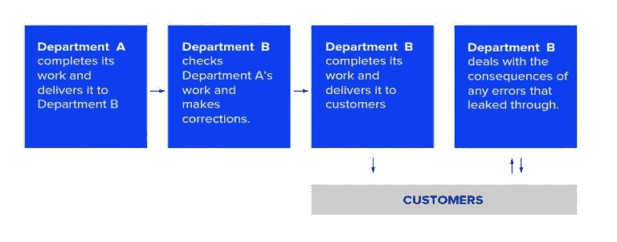

# 机器学习数据如何定义您的人工智能解决方案的成功

> 原文：<https://medium.com/hackernoon/how-machine-learning-data-defines-the-success-of-your-ai-solution-5a29466d4559>

大数据可以释放组织中最关键领域的大量洞察力和效率。然而，你需要非常小心使用机器学习数据，因为数据集的质量将直接影响你的预测建模的成功。以下是你需要知道的。

[数据科学和机器学习](https://eleks.com/expertise/data-science/?utm_source=medium&utm_medium=referral&utm_campaign=Republ-AR-MR-CR-Blog)就在你身边，让你的海量信息变得有意义并得到利用。然而，你的下一个智能解决方案的成功很大程度上取决于机器学习数据的质量。如果你的信息质量不达标，你很可能无法从你组织中的所有智能工具中获得任何[可靠的结果。](https://eleks.com/whitepapers/getting-most-predictive-analytics-technology/?utm_source=medium&utm_medium=referral&utm_campaign=Republ-DataQuality-ML-Blog)

# 一切都与数据质量有关

许多人认为，在追求机器学习的过程中，数据质量应该是次要的考虑因素，但这些数据不会说谎。IBM 估计，低质量的数据每年会让美国组织[损失 3.1 万亿美元](https://hbr.org/2016/09/bad-data-costs-the-u-s-3-trillion-per-year)；这个总数是从大规模错误和控制它的人所采取的变通办法中得出的。

在 IDC 对大数据市场的估值达到 1360 亿美元的背景下，这个巨大的数字显得更加重要。《哈佛商业评论》提供了一张图表，总结了糟糕数据质量的多米诺骨牌效应，这在一定程度上解释了这种情况是如何发生的。

## 隐藏的数据工厂

可视化纠正昂贵且耗时的数据错误所需的额外步骤。资料来源:托马斯·莱德曼。

数据质量差的原因有很多。其中一个更明显的原因是公司需要玩数量游戏，但是数据的质量应该比数量更重要。ELEKS 去年完成了 20 多个机器学习项目，其中大约一半的案例要求在建模开始前进行数据清理。

使用坏数据，你的机器学习模型将产生坏结果，因此任何机器学习算法的成功实现都需要某种形式的数据清理。

# 如何区分好数据和坏数据？

[数据质量](https://eleks.com/blog/rise-dark-data/?utm_source=medium&utm_medium=referral&utm_campaign=Republ-DataQuality-ML-Blog)至关重要，但是您如何知道您的信息是否真的没有达到要求的标准呢？这里有一些“危险信号”供您观察:

*   它缺少变量，无法标准化为唯一的基础。
*   这些数据是从许多不同的来源收集来的。来自第三方的信息可能属于此类。
*   数据与算法的主题无关。这可能有用，但不是在这种情况下。
*   数据包含矛盾的值。这可能会看到对立的类有相同的值，或者一个类中有非常大的差异。

当您遇到这些问题中的任何一个时，在您实施机器学习算法之前，您的数据都有可能需要清理。

清洗，而不是替换，可能是你在这里寻找的行动。就像第三点一样，你的数据可能适合使用，但不适合上述目的。根据我们的经验，您可能需要将大约 70–80%的总体建模时间分配在数据清理或替换缺失和矛盾的数据样本上。发现不良数据会引发一些行动，如将信息合并到一个数据库中、添加新数据或改进现有来源。

# 结论

将一个糟糕的数据库转变成一个为业务转型做好准备的数据库是可能的。像关注质量而不是数量以及信息的一致性这样的行动可以大大有助于确保机器学习算法的[无缝实施](https://eleks.com/case-studies/russmann-data-driven-digital-transformation-of-a-car-rental-business/?utm_source=medium&utm_medium=referral&utm_campaign=Republ-DataQuality-ML-Blog)。

重要的一点是，在委托任何大数据项目的严肃工作之前进行这一点。根据我们自己的经验，分配给这些行为的资源通常意味着我们只有 20-30%的时间用于实际的算法建模。

您是否充分利用了您的数据？[联系我们](https://eleks.com/contact-us/?utm_source=medium&utm_medium=referral&utm_campaign=Republ-DataQuality-ML-Blog)获得专家帮助，实现数据驱动的数字化转型。

*原载于 2018 年 5 月 24 日*[*eleks.com*](https://eleks.com/blog/machine-learning-data-defines-ai-solution-success/?utm_source=medium&utm_medium=referral&utm_campaign=Republ-DataQuality-ML-Blog)*。*