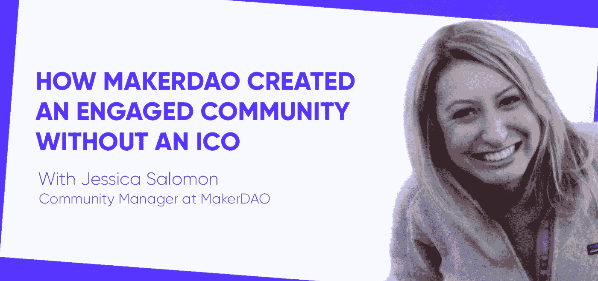
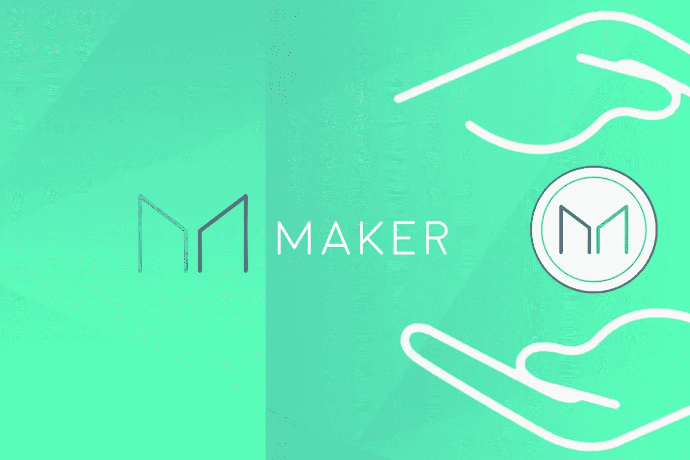
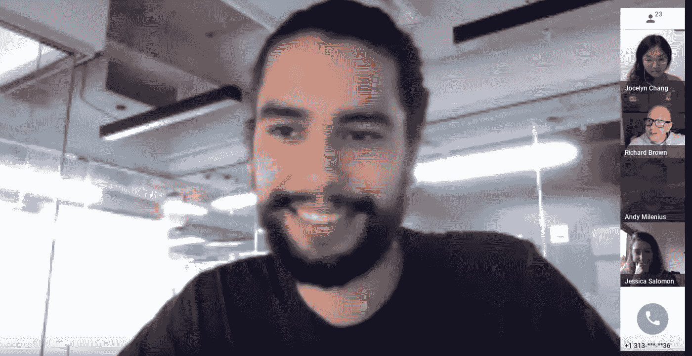
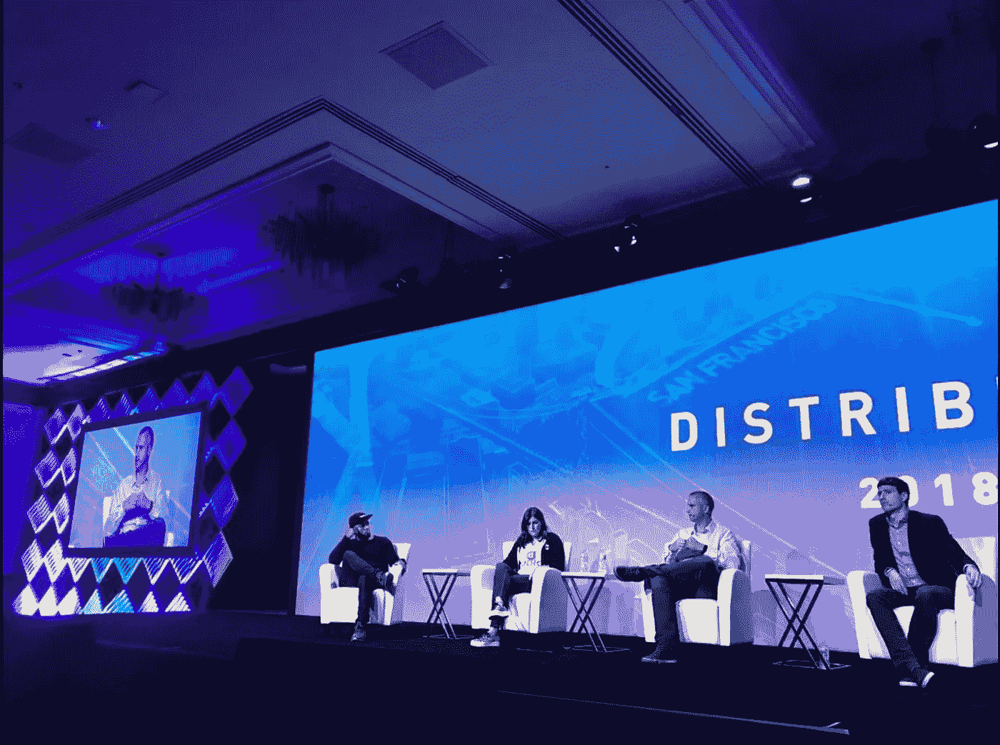

# MakerDAO 如何在没有 ICO 的情况下创建一个参与性强、有凝聚力的社区

> 原文：<https://medium.com/hackernoon/how-makerdao-created-an-engaged-cohesive-community-without-an-ico-1247c2f54e51>

*在* [*Chainfuel 博客*](https://www.chainfuel.com/blog) *以及他们的免费电子书* [*上找到更多关于建立和运营一个成功的加密社区的有用资源:加密社区管理的 7 大支柱*](https://www.chainfuel.com/pillars) *。*

**马克尔道是以太网上稳定币戴的制造者。戴是一个完全分散的稳定币，纯粹存在于区块链上。**

# 你的背景是什么？你是如何入门 crypto，然后涉足 Makerdao 的？

我在加州大学伯克利分校学习修辞学，辅修政治经济学。我第一次听说 crypto 是在我 19 岁的时候，那应该是在 2012 年。我认为像比特币这样不可信的跨国数字货币的概念非常迷人，但并没有为自己创造一条职业道路。

大学毕业后，我靠扶轮奖学金进入研究生院，在剑桥大学犯罪学研究所攻读学位。该项目不是关于法医学，而是一门跨领域的课程，包括社会学、人类学、心理学、伦理哲学、统计分析和其他学科。有些禁忌是普遍存在的，也有一些犯罪统计数据是普遍存在的——比如随着年龄的增长，犯罪的趋势在下降，暴力犯罪中男性对女性的比例非常大。另一方面，刑事执法和惩罚在世界不同地区差异很大。所以研究犯罪学其实是研究人的动机和人与人(即社会文化)的互动。

获得哲学硕士学位后，我在都灵的联合国犯罪和研究所工作，我参加了一个由我的一位剑桥犯罪学同事组织的会议，该会议专注于大数据及其潜在的滥用以及其在检测和预防犯罪方面的用途。有一些关于加密的小介绍，类似于边上的对话。我再次产生了兴趣，并决定开始做一些自己的研究和阅读。

我的弟弟是一个非常活跃的 Redditor 和密码爱好者，他和我聊了很多，并激发了我的兴趣。这让我首先在圣莫尼卡找到了一份名为 BlockV 的工作。该项目专注于将数字商品放在区块链上，这是一个非常酷的营销创新，但我最感兴趣的是创造一个成功的 stablecoin 的想法，我认为这是实现加密的真正愿景和用例所必需的。因此，为[马克尔道](https://hackernoon.com/tagged/makerdao)工作的机会真的实现了我最大的希望和梦想。所以我在这里，我热爱每一天。

# 在 Makerdao 不做 ICO 的理由是什么，这对社区建设有什么影响？

最初，MKR 通过私人销售卖给朋友和家人，以及像安德森·霍洛维茨和 Polychain 这样的投资者。这个过程过去和现在都比你在典型的 ICO 中看到的更加个人化。目标是创建一个有凝聚力的所有权社区，致力于长期成功，而不仅仅是短期收益。

MKR 的目标是让其持有者对治理和财政决策负责。基本上，这是一种风险分担模式——制造商的所有者分享利润，但也分担潜在的损失。为了实现道的梦想，(马克尔道的分散自治组织)需要有负责任的令牌持有者或 MKR 持有者来组成道。拥有负责任的“所有者/经营者”的目标是 Maker 从未有过疯狂的 ICO 的部分原因。鉴于我今天在社区成员之间看到的高质量互动水平，我可以自信地说，Maker tokens 的推出是明智的。

# 作为一名社区经理，你每天都做些什么？你的职责是什么？

我不是唯一的社区经理，但是当我开始的时候我是。以前，更多的时间是在网上，但现在我更专注于社区的活动方面，更多的物理空间。所以我看了看在聪明的 Rich Brown 管理技术社区的时候，有哪些不同的机会和地方可以让它发生并蓬勃发展。

重要的是要记住，并不是所有的秘密社区都发生在网上。实际上，我在活动中遇到了很多社区成员，他们告诉我他们对这个项目有多兴奋，对 Maker 有多狂热。有趣的是，很多人并不总是参与在线聊天，尽管他们确实关注讨论。看到不同的社区成员在不同的空间蓬勃发展是一件很酷的事情:一些人喜欢在线，一些人喜欢离线。我的工作是确保所有人都有参与的空间。

我做的另一件事是策划视频会议，这些会议对寻求更多项目信息的社区成员开放。现在有很多关注治理，因为我们正在快速地成为一个可操作的 DAO。MakerDAO 的管理非常雄心勃勃，因此确保社区成员有机会得到他们的问题的答案，并主持视频通话是一种非常酷和令人满意的与社区互动的方式。很高兴看到社区成员和像我们的 CEO Rune 或我们的开发人员这样的人之间的桥梁，他们有机会来谈谈他们正在做的事情。在上市公司，股东是公司的比例所有者。但是，举例来说，谷歌股东有多少机会与首席执行官、其他关键高管或开发人员和其他技术专家交谈？这种非等级的人际互动经常在 Maker 发生，我很高兴能在这些互动中扮演一个小角色。

([Source](https://www.youtube.com/watch?v=DDzXjY2WMYY&t=850s))

# 社区管理如何适应更大的组织结构？它在项目的长期愿景中扮演什么角色？

我们正朝着权力下放的真正愿景前进，虽然有些缓慢，但却稳如泰山。在某种程度上，这需要我们获取大量信息，以确保我们的社区成员尽可能多地接受教育，以做出负责任和令人满意的管理决策。我认为社区管理在我们的扩张计划中起着重要的作用。成功的稳定硬币必须达到临界质量，然后它的使用将呈指数增长。我们已经看到了其他伟大的发明，如航空旅行、电子邮件、互联网——你从一些好的东西开始，然后你建立采用，并以网络效应为目标。MakerDAO 的成功建立在有凝聚力、相互联系的社区的发展之上。我们是一个国际项目，不仅因为我们的员工和 MKR 持有者生活在许多不同的国家，还因为我们的目标是为整个世界创造一种相对稳定的数字货币。

我们正在招聘，我们已经在全球招聘了一些真正不可思议的社区领导。我现在在美国，但我刚刚与蕾恩卡·胡达科娃通了电话，她是我们在欧洲的杰出社区领袖。这很好，因为社区建设的机会是全球性的，我们的社区领导团队正在全球范围内运营。我很感激能和一群社区建设超级摇滚明星一起工作，包括欧洲的蕾恩卡、拉丁美洲的 Mariano Di Pietrantoni、中国的潘超和新加坡的 Jocelyn Chang！

对于任何组织来说，记住组织存在的原因是很重要的。我要说在许多方面 MakerDAO 对社区来说是真实存在的。我们为其他组织或社区建立基础设施，然后继续使用。其中一些基础设施是稳定币、Dai 或通过 CDP 发生的无许可贷款。优化 Maker 所做工作的方法是确保社区继续保持热情和参与，继续感到他们的需求或问题可以真正得到解决，并且他们有机会与我们合作。因此，就实现大多数加密项目的整体愿景而言，我认为社区是核心。

# 你能为你的社区提供一些数字吗？为了实现这一目标，你实施了哪些增长战略？

我们现在对社区的策略不是扩大它，而是关注它。多押戴还没推出，但快推出了。因此，到目前为止加入的社区已经对戴专门使用以太坊的单一抵押品感到兴奋。我想说，我们的目标是保持激动和热情，这是理所当然的，直到更大规模的发布，这是戴真正想要的，包括多种宣传类型。发展战略是与现有的社区成员建立更深层次的关系，尤其是已经乐于使用 MakerDAO 基础设施的发展中社区。一旦推出多抵押品 Dai，该战略将更加强调规模化。我想你可以说，我们想在做大之前先把它做好。我们希望并期待随着我们不断达到里程碑，增长将会加快。

# 你如何参与更广泛的社区？

我们每周星期二举行一次社区会议。人们也有机会参与或观看回顾。我们回顾了那个星期发生的所有新闻和进展。真正与我们媒体上的精彩内容保持同步，然后我们继续发推文或发布到 Reddit 或在我们自己的 Rocketchat 中使用。

我喜欢我们的社区战略的一点是，我们没有太多的平台。例如，我们在 Rocketchat 上把我们做的很多事情局限于 chat.MakerDAO.com，这很酷，而不是通过很多不同的渠道加入大量的社区。这并不是说未来不会发生，但截至目前，很多信息都是通过 Twitter、Reddit 以及我们的 Rocketchat 传播的，我们在 Twitter 上的影响力很大。因此，这些社区的维护得到了简化，我认为这很有帮助。

# 你如何定义一个成功的加密社区？你会用什么标准来定义成功？

这取决于加密社区的目标。我将成功定义为一种积极的参与。所以没有人过来问“这什么时候上月球？”对某些人来说是成功的定义。很多都与定性评估有关，这在某种程度上很难用简洁的标准来定义。

# Makerdao 对社区的目标是什么？

让社区做好准备，迎接我们路线图上即将发生的大事——即去中心化治理。确保社区接受的教育达到他们认为做出好的投票决定所必需的水平。我们还希望保持已经存在的激情和热情，并确保我们能够继续保持前进的势头。

# 如果你能回到过去，你会做些什么不同的事情？你希望早点知道什么？

如果我能回到过去，我会更多地考虑社区建设和商业发展之间的混合。社区是一个如此宽泛而空灵的术语。当你想到社区时，它真的包含了每个人。为了成为一名更成功的社区经理，我现在正在努力做的事情之一是磨练我们的业务发展战略和流程。这样，当我与创客社区中的人和项目互动时，我可以了解我们的利益一致性，并以尽可能多的积极方式优化传播创客基础设施。

# 你如何进行国际扩张？

我实际上是通过事件接近它的。因此，布宜诺斯艾利斯 ETH 对我们在拉丁美洲的发展非常重要，不仅仅是社区存在，更重要的是 MakerDAO 的项目存在。我在那里遇到了两个非常了不起的人。包括 Mariano Di Petrantonio，他现在是我们在拉丁美洲的社区领导，还有令人难以置信的 Nadia Alvarez，他现在是我们在南美洲的业务发展助理。

从招聘的角度来看，建立一个国际化的存在，与将要成为其中一部分的人见面和接触真的很有帮助。如果项目有机会参加一个大型活动，或者一个看起来与他们想要在特定区域进行的社区建设相一致的活动，那么他们肯定应该利用这个机会。我们已经看到了很多积极的事情。

([Source](/makerdao/making-maker-august-4-6fc66628161e))

# 关于新项目开始并试图建立社区的社区管理，你还有什么想说的吗？

我很幸运加入了创客项目，因为这个社区已经存在，并且已经有了这种美丽的和谐，这是维持并继续繁荣的种子。因此，就为还没有强大追随者的事物建立一个社区而言:保持一种关于你的项目正在做什么的纯粹的精神气质，将路线图融入你试图实现的任何社区，并宣扬那些好处是什么，以便带来新的社区成员。这可能会带来一些热情和积极性，而不是真正激进的营销策略。也许参加更多你尊敬的项目的活动，或者与你正在努力做的事情有一些协同作用，然后与社区互动，这可能是建立社区的一种有趣的方式。找出已经奏效的方法，然后看看你是否能从中汲取一些积极的能量。

# 人们在哪里可以联系到你？

他们可以通过[chat.MakerDAO.com](http://chat.makerdao.com/)与我联系，这是我们火箭聊天的一部分。也在我们的 Reddit 上，这是 [r/MakerDAO](http://reddit.com/makerdao) ，或者如果他们想给我发消息到[u/jessa lomon-maker Dao](http://reddit.com/u/jesssalomon-makerdao)，我真的很乐意多说。

*Alan VanToai 是*[*chain fuel*](https://www.chainfuel.com)*的联合创始人之一，这是一家为加密初创公司提供社区管理和设计服务的机构。*

*你可以在他们的* [*博客*](https://www.chainfuel.com/blog) *以及他们的免费电子书:* [*秘密社区管理的 7 大支柱*](https://www.chainfuel.com/pillars) *上找到更多关于建立和运营一个成功的秘密社区的有用资源。*