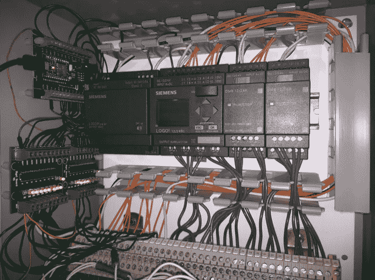

# 制造商如何利用物联网改善运营和降低成本

> 原文：<https://medium.com/hackernoon/how-manufacturers-are-improving-operations-and-reducing-costs-with-iot-6a5c09252ade>

## 了解商业螺纹制造商如何利用物联网驱动的数据来提高效率和降低成本。

在生产车间，即使是最小的移动部件如果损坏也会导致间歇性中断和性能下降。这些意外事件不仅会给制造商带来灾难性的经济损失，也会给他们所服务的团体带来损失。更糟糕的是，如果不在机器检查上分配大量资源，很难找到这些中断的原因。

然而，物联网让制造商有能力监控他们生产中最细微的变化。小型廉价的计算硬件(如[物联网原型套件和开发板](https://www.particle.io/products/hardware/photon-wifi))可以监控任何机器的状态并立即无线传输数据。对于希望提高效率、降低成本或全面优化生产的公司来说，物联网是一条必由之路。

然而，制造商如何将嵌入式硬件应用到他们的运营中并不总是很清楚。在这篇文章中，我们将通过解释美国商用线和纱线制造商[的](https://hackernoon.com/tagged/manufacturer)[服务线](http://www.servicethread.com/)如何使用物联网硬件来监控和维护占地 115，000 英尺的 3，000 个锭子来澄清这一点。

# 服务线程旨在通过物联网驱动的数据节省成本

Service Thread 的主要目标是更好地了解其主轴机器的效率。过去，他们依靠亲自检查。然而，这个系统有几个问题:

*   检查员每周花 10 小时(或每年累计 500 小时)进行这些检查
*   **人为错误的可能性很大，**任何不准确都会影响整体车间绩效。
*   **他们的数据范围有限，**他们的最终估计不一定准确。

虽然 Service Thread 的机器已经具备了用板载计算机监控和跟踪主轴性能的能力，但它们无法在一个集中的位置记录每个单独主轴的状态。他们希望物联网设备能够轻松跟踪所有这些数据。

# 物联网设备要求

对于这款物联网设备，他们设定了一些要实现的目标:

*   **构建一个简单的设备**，可以通过网络向中央位置提供和报告数据。
*   **找到负担得起的硬件组件**这样他们就可以制造出可以在不同机器上运行的多种设备。
*   **创建一个端到端的设备**，它可以连接到云并与其他设备和系统通信。
*   **易于访问和使用**，方便需要访问设备或读取设备报告数据的人使用。

***A photon-powered retrofit***

# 解决方案

Logical Advantage 的首席执行官丹·塞耶(Dan Thyer)和他的团队使用了一种[光子](https://www.particle.io/products/hardware/photon-wifi/)(一种 Wi-Fi 连接的微控制器)，因此该设备可以连接到互联网，并与其他以人为中心的界面进行通信。通过光子，他们的纺锤体监控设备可以将纺锤体的状态(比如它们是否在移动)传递给云。Photon 还能够发送和接收 [OTA 固件更新](https://blog.particle.io/2017/12/18/over-the-air-firmware-the-critical-driver-of-iot-success-859927/)，这使他们能够在设备部署后向设备发送代码更新。这一点至关重要，因为他们可以轻松地更新和维护他们的设备，同时保持成本效益。

# 结果呢

自从 Service Thread 在其日常制造服务中实施物联网硬件和云服务以来，他们一直在受益:

*   **增强的数据管理** —服务线程现在正在收集数据，为他们提供有关其机器性能的更准确信息。这也有助于他们在劳动力、销售和供应链管理方面做出更明智的决策。
*   **改进的设备群可见性** —服务线程现在可以通过实时信息反馈立即查看主轴是否有问题或需要维护。
*   **降低运营成本** —服务线程目前估计，他们的物联网解决方案将至少降低 50%的单轴运营成本。
*   **节约成本增加** —该公司预计通过减少维护加班和管理费用可节约约 117，000 美元。

借助物联网，Service Thread 能够改善他们的运营，并深入了解机器上最小的移动部件。当前的制造商必须决定他们当前的系统是否能够让他们充分了解他们的日常运营，或者投资物联网解决方案是否是监控他们日常运营的更高效和有效的方式。