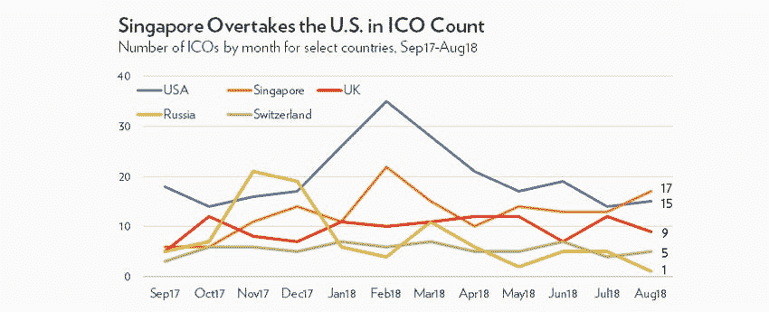
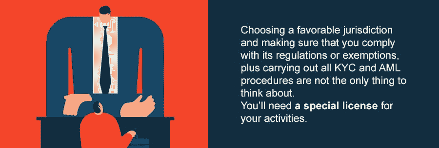

# 如今的 ico 有多少符合 2018 年的规定？

> 原文：<https://medium.com/hackernoon/how-many-of-todays-icos-comply-with-2018-regulations-68bfd470be7b>

[source](https://www.bostonathenaeum.org/sites/default/files/taste_009_champney-bloody-massacre.jpg)

如今，加密和监管是一揽子交易——无论我们是在谈论加密空间和 ico 的发展，监管始终是前进之前必须考虑的问题。从 2017 年中国采取果断措施禁止密码交易所和 ico 开始，到如今各国试图找出保护投资者同时不损害创新的最佳政策。对于投资者和创始人来说，最重要的是当前的监管格局以及有多少 ico 实际上满足了当局的要求？

# 这一切是如何开始的

第一届 ICO 于 2013 年由 [Mastercoin](https://en.bitcoinwiki.org/wiki/Mastercoin) 举办，同年年底[以太坊](https://ethereum.org/)由 Vitalik Buterin 提出。以太坊在 2014 年推出了 ICO，并推出了智能合约，包括 ERC20，项目随后开始广泛使用这些合约来筹集资本。然而问题是从[刀](https://en.wikipedia.org/wiki/The_DAO_(organization))开始的。这个组织在 2016 年筹集了大约 5000 万美元，不久后被黑客攻击。2017 年 7 月，美国证券交易委员会(SEC)宣布，DAO 应被视为一种证券——几个月后，中国人民银行[宣布](https://www.coinspeaker.com/peoples-bank-china-declares-icos-illegal/)ICO 非法，并要求它们立即停止(禁令仍然有效，30 个源于中国的 ICO 项目不得不在 2018 年[第三季度](https://icorating.com/pdf/74/1/8TuF3swJWq8J82o4CnGI6dyEn3GQYhw9qdKTAE7U.pdf)选择另一个国家进行 ICO 注册)。尽管随着监管机构开始拧紧螺丝，形势正在升温，但 ICOs 不可能那么容易就被阻止。该市场在 2017 年底蓬勃发展，在 2018 年 1 月达到顶峰，当时[通过 ico 筹集了超过 22 亿美元](https://next.autonomous.com/thoughts/crypto-did-icos-raise-300-million-or-2-billion-in-september-depends-who-you-ask)。

# 法规:当前形势

ICO 繁荣之后是 2018 年夏季的低迷——收紧监管可能是原因之一。在 2018 年，从散户投资者到机构投资者的转变正在发生，正如 Autonomous Next 最近的报告所示，风险投资基金在 2018 年 8 月向区块链项目投资了超过 16 亿美元。另一方面，通过 ICOs 收集的资金在 2018 年 1 月至 9 月下降了 80%。成功筹集超过 100 万美元的 ico 数量[从 5 月的 110 家减少到 9 月的 54 家](/icobox-io/quarterly-cryptocurrency-and-ico-market-analysis-q3-2018-5e75961d931c)，2018 年第三季度筹集的最高金额[仅为 1.34 亿美元](/icobox-io/quarterly-cryptocurrency-and-ico-market-analysis-q3-2018-5e75961d931c)。

[source](https://next.autonomous.com/thoughts/crypto-did-icos-raise-300-million-or-2-billion-in-september-depends-who-you-ask)

在当前的市场条件下，尤为重要的是:

1.  **如何安全进行 ICO**
2.  **募集资金后合法运营项目，也需要授权和许可**

有些国家对 ico 有积极的监管和明确的指导方针，也有些市场有复杂或不确定的头寸。

# 欧洲——观望

欧洲并不急于监管 ICOs 监管机构正在逐案考虑加密技术。专门研究经济的欧洲智囊团[Bruegel](http://bruegel.org/)[建议](https://hackernoon.com/cryptocurrency-regulation-update-october-2018-7e1275932694)在 [ESMA](https://www.esma.europa.eu/) (负责欧盟金融体系的欧洲权威机构)为整个欧盟提出一个协调的方案之前，欧盟成员国可以遵循他们自己的 ICO 监管方案。尽管 ESMA 还没有实施针对 ico 的法律，但还是不断向投资者发出警告。此外，监管机构非常明确地表示，全球的 ico，包括欧盟的 ico，[应该遵守所有 KYC 和反洗钱法律](https://hackernoon.com/cryptocurrency-regulation-update-november-2018-d9b17837aeec)才能合法。

一些欧洲国家已经采取了自己的措施来控制 ICO 空间:

*   ***法国——***在过去的两个月里，法国一直非常支持 ico 和加密货币——2019 年 10 月，在一个公共论坛之后， [AMF](https://www.amf-france.org/en_US/) 委员会[决定](https://www.amf-france.org/en_US/Actualites/Communiques-de-presse/AMF/annee-2018?docId=workspace%3A%2F%2FSpacesStore%2F57711a6c-4494-4215-993b-716870ffb182)继续致力于 ico 的特定法律框架。该框架将使项目创始人和投资者对监管有更清晰的认识。不到一个月后，法国议会下院财政委员会证实了其计划，将降低比特币销售税，从而使其与其他资本利得税保持一致。不过，这项修正案必须得到更广泛的议会批准，具体日期尚未确定。
*   ***瑞士—*** 长期以来，瑞士一直在宣传自己是一个有利于创新的加密货币中心——自 2016 年瑞士小镇楚格[开始接受比特币](https://www.swissinfo.ch/eng/business/crypto-valley_zug-first-to-accept-bitcoin-for-government-services/42143908)作为政府服务的支付方式以来。2018 年 2 月，瑞士金融市场监管局 FINMA[发布了一套针对 ICO 项目的指导方针](https://www.finma.ch/en/news/2018/02/20180216-mm-ico-wegleitung/)，其中指出，“每个案例都应该根据其具体情况来决定。”监管机构还表示，某些类型的项目可能需要获得银行牌照。最后，所有代币发行者都应遵守反洗钱法规。
*   ***英国—*** 在英国，金融行为监管局(FCA)没有提供具体的指导方针来确定 ico 是否受国家法规的管辖，并根据具体情况处理此类问题。因此，许多 ico 现在不需要 FCA 许可。然而，ICO 授权[取决于](https://sterling-law.co.uk/en/initial-coin-offering-ico-regulated-uk/)它是否涉及交易、安排交易或为该国投资行业提供金融或咨询服务等活动。

瑞士是 Q3 2018 年第三季度欧洲最受欢迎的 ico 中心——瑞士的代币销售额达到了5.55 亿美元；英国以近 4.9 亿美元紧随其后。

[https://www.fabric.vc/report/](https://www.fabric.vc/report/)

# 美国——双重方法

美国仍然是 ico[的重要市场——ico bench 将其列为有史以来 ico 数量最多的国家(总共 675 个项目)。](https://icobench.com/stats) [ICO 评级显示](https://icorating.com/report/ico-market-research-q2-2018/)在 2018 年 Q2 奥运会上，尽管存在各种监管问题，但美国在注册的 ICO 项目方面领先。问题是这种趋势是否会继续，因为这里有很大的不确定性。

美国证券交易委员会最近跟进了它在 2018 年初向数十个项目发出的一系列传票，对那些没有确保只有合格投资者参与筹资的项目特别感兴趣。关于 ICO 代币是否应被视为证券并在 SEC 注册的争论仍在继续。但是一个[豪威测试](https://consumer.findlaw.com/securities-law/what-is-the-howey-test.html)被用来确定这一点。对于那些出售证券的人来说，可以使用法规的[豁免，以避免 SEC 注册的困难、昂贵和耗时的过程。](https://hackernoon.com/ico-or-sto-who-wins-fd43c3ee7b8d)

直到 2018 年 3 月，禁卫军集团[正式申请](https://www.praetoriangroup.io/company/news/)注册 PAX coin(等待批准)，才在 SEC 注册了 ico。此外， [18 个项目(至少)利用 2018 年 Q2 奥运会的监管豁免完成发行](https://www.smithandcrown.com/q2-2018-material-development-in-a-bear-market/)。

# 新加坡——友好的加密中心

一些市场在 ICO 监管方面比其他市场更加积极主动，并已立法或制定了评估 ICO 的方法、标准或指南。其中包括直布罗陀、T2、泽西岛、马耳他、立陶宛、开曼群岛和新加坡。特别是新加坡，在 2018 年成为真正的加密中心，在 ICObench 上以持有的 ico 数量排名[第二。2018 年 8 月，新加坡有史以来第一次在 ICO 数量上超过美国，](https://icobench.com/stats) [Elementus 显示](https://elementus.io/blog/ico-market-august-2018/)。ICO Rating 的报告证明了新加坡对区块链发展的重要性——截至 2018 年第三季度的[，46 个 ICO 项目在该国注册，共筹集资金 2.41 亿美元，尽管其中只有 16 个项目实际上起源于新加坡！这意味着 ico 向司法管辖区有利的国家的迁移正在开始。](https://icorating.com/pdf/74/1/8TuF3swJWq8J82o4CnGI6dyEn3GQYhw9qdKTAE7U.pdf)

[https://elementus.io/blog/ico-market-august-2018/](https://elementus.io/blog/ico-market-august-2018/)

*   **新加坡**对加密货币的监管处理持积极态度。2017 年 11 月，新加坡金融管理局(MAS) [发布了](http://www.mas.gov.sg/News-and-Publications/Monographs-and-Information-Papers/2017/Guidance-on-Digital-Token-Offerings.aspx)一套指导方针，称不会监管数字货币，而是监管涉及的活动。  新加坡金融管理局[希望 ICO 发行人](https://sbr.com.sg/sites/default/files/singaporebusinessreview/print/SBR_2018_AugSept-26-28.pdf)解决反洗钱问题并进行独立的法律尽职调查，以确保代币不是证券。MAS 董事总经理 ravi Melon[解释说](https://cryptovest.com/news/singapore-should-not-implement-extremely-lax-crypto-regulation-c-bank-boss-says/)有三种类型的代币:公用、支付和安全(唯一需要 MAS 注册的代币)。
*   **泰国**也在走向明确的 ICO 监管。2018 年 11 月，泰国 SEC [宣布](https://ethereumworldnews.com/thailand-sec-announces-imminent-launch-of-countrys-first-cryptocurrency-ico-portal/)批准该国首个 ICO 门户网站。今年早些时候，公布了 ico 的监管框架。结果，不下 50 个 ICO 项目[表示有兴趣](https://bitcoinist.com/thailand-50-cryptocurrency-ico-license/)获得新的泰国加密许可证——尽管很难预测其中有多少会真正被批准。
*   **开曼群岛**已经成为 ico 的另一个中心——在 2018 年第三季度，12 个项目在那里注册，总共筹集了 1.25 亿美元。[根据美国国会图书馆](https://www.loc.gov/law/help/cryptocurrency/world-survey.php)，“开曼群岛对加密货币和区块链技术的监管环境似乎相当灵活。”该地区没有针对 ico 的具体法规，但证券投资业务法或 AML 等法律适用于具体情况。当局避免匆忙通过 ICO 法律来享受区块链技术的好处。

# 那么，要合法经营一个区块链项目，你需要什么？

正如我们已经看到的，不同国家的法规有很大不同。其中许多都没有关于如何对待 ico 的精确框架——项目是在个案基础上进行审查的。这就是为什么很难评估目前符合所有法规的 ico 比例。然而，我们可以肯定的是，KYC 和反洗钱程序已经成为所有想要进入市场的项目的必备条件。在 ICObench 上发布的 4780 个 ico 中，只有 21%符合这个标准，只有 10%有原型或 MVP。另一方面，在 738 个正在进行的 ico 中，313 个满足 KYC 要求，208 个有 MVP 或原型。这意味着超过 70%的 ico 容易受到法律问题的影响。

选择一个有利的司法管辖区，并确保您遵守其法规或豁免，以及执行所有 KYC 和反洗钱程序，是所有项目必须采取的必要步骤。然而，这不是唯一需要考虑的事情。一旦你完成了融资，并开始在金融科技领域运营一家公司，你将需要一份特殊的活动许可证。

尽管每家公司都需要一张在这个行业运营的许可证，但我们在这里将重点关注金融初创公司——特别是银行业的初创公司。

1.  在整个 2018 年，提供金融服务的项目[在 ico 数量上一直稳步领先](https://icorating.com/pdf/74/1/8TuF3swJWq8J82o4CnGI6dyEn3GQYhw9qdKTAE7U.pdf)。[2018 年第三季度](https://icorating.com/pdf/74/1/8TuF3swJWq8J82o4CnGI6dyEn3GQYhw9qdKTAE7U.pdf)，银行和支付初创公司在筹集的资金中排名第三。
2.  获得银行牌照的过程尤其令人沮丧和耗时，因此在产品开发的早期阶段申请是有意义的。

[https://icorating.com/](https://icorating.com/)

下面的列表证明了这一说法，并展示了大多数知名的加密银行，它们在 ICO 期间设法筹集了超过 5000 万美元( [Bankera](https://icorating.com/ico/bankera/) 、 [Tenx](https://icorating.com/ico/tenx/) )，得到了当局的完全许可( [Platio](https://icobench.com/ico/platio) )或吸引了来自老牌风险投资者的资金( [Wirex](https://en.wikipedia.org/wiki/Wirex) )。

*   [Platio](https://platio.io/?utm_source=hackernoon&utm_medium=article&utm_campaign=1) —智能银行生态系统，提供三种资产类型的银行和交易服务:菲亚特、加密和股票。该公司获得 FCA 的授权进行支付和接收支付，并获得欧盟当局的许可以加密货币和法定货币进行支付。Platio 背后的[团队表示，“许可是金融领域的一个整体，如果不及时解决，金融科技业务将无法完全符合国际和当地法规。”该许可证允许 Platio 客户进行真实交易和交换操作，以及在独立账户中持有法定资金。](/@platio/platio-roadmap-announced-641c56dd3ebd)
*   [Bankera](https://bankera.com/) 拥有支付机构执照，并被授权在欧洲经济区运营。然而，该公司尚未获得欧盟境内的银行牌照，这意味着它还不能成为支付卡的授权发行者和收购者，因此必须依赖代理银行服务。Bankera 预计将于 2019 年底在[获得许可。在此之前，该公司将无法推出一些核心银行服务，如存款或投资。](https://icorating.com/upload/whitepaper/YLuetfjRzqDjwWwCnfi8BN3IcZ3l2ytV6AtTBz1M.pdf)
*   [TenX](https://tenx.tech/en/pay-token/)(2017 年 6 月关闭的 ICO)已经等待其银行牌照作为金融机构运营了几个月。截至目前，他们已经确认持有主要信用卡公司的有效 BIN (银行识别号)。BIN 标识了发卡机构，尽管它还没有赋予该公司引入银行产品的权利，但这是向获得银行牌照迈出的一大步。
*   Wirex 最近[从 FCA 获得了](https://wirexapp.com/what-the-fca/)电子货币许可证。该团队表示，FCA 可能需要长达 12 个月的时间来决定是否向该组织发放许可证，整个过程要求公司提交产品如何工作的所有细节，内部政策的准确描述，安全机制，团队传记，利益相关者名单，以及提供受监管服务的充足资本证明。

上述公司是区块链持牌银行业务的显著例子。至少目前来看，还有其他项目不那么成功。Nebeus 还没有获得银行执照。它需要 FCA 颁发的[电子货币许可证](https://startacus.net/culture/fintech-startup-nebeus-aims-to-bring-borderless-banking-to-2-billion#.W_fICegzbIU)来服务更广泛的受众。[Fiinu](https://fiinu.com/),[于 2017 年底推出 ICO](https://icobench.com/ico/fiinu) ，并计划于 2018 年第三季度成为全牌照银行，目前仍处于英国央行授权的预申请阶段[。瑞士加密银行 Seba](https://fiinu.com/) 计划在 2019 年获得银行执照[，所以在那之前不会发布。](https://cointelegraph.com/news/swiss-crypto-bank-startup-expects-to-receive-banking-securities-dealer-license-in-2019)

获得银行执照既费时又费钱。那些获得完全许可或仍在等待并已取得实质性进展的公司是极少数能够合法提供金融服务的公司，正如人们在 ico 期间投资这些公司时最初计划的那样。

# 结论

如今，随着各国对 ico 下定决心并收紧监管，为区块链项目筹集资金颇具挑战性。其中一些国家，包括美国，正在失去对更有利的 ICO 管辖区的地位，如新加坡或开曼群岛，在 2018 年第三季度分别筹集了 2.41 亿美元和 1.25 亿美元[。由于 ICO 指南的明确性，欧盟的积极成员也发挥了带头作用-在 Q1，2018 年第三季度的令牌销售额达到 5.56 亿美元](https://icorating.com/pdf/74/1/8TuF3swJWq8J82o4CnGI6dyEn3GQYhw9qdKTAE7U.pdf)[。](https://static1.squarespace.com/static/5a19eca6c027d8615635f801/t/5bc72f94a4222f9ca0750b0e/1539780519641/State+of+the+Token+Market+2+FINAL.pdf)

对于创始人来说，选择正确的司法管辖区，保证他们的项目不会受到意外关闭成为必须。尽管如此，正如我们已经提到的，70%的 ICO 项目容易受到法律问题的影响，仅仅是因为缺乏 KYC 和 AML 程序。合法经营是硬币的另一面。即使你确保你的项目满足所有的 ICO 要求，你仍然需要考虑根据法律开展业务的许可。可以理解的是，对于负责人们资金的银行项目来说，这是一个特别重要的问题。

## 关于作者:

基里尔·希洛夫——geek forge . io 和 Howtotoken.com 的创始人。采访全球 10，000 名顶尖专家，他们揭示了通往技术奇点的道路上最大的问题。加入我的**# 10k QA challenge:**[geek forge 公式](https://formula.geekforge.io/)。