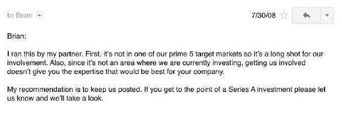
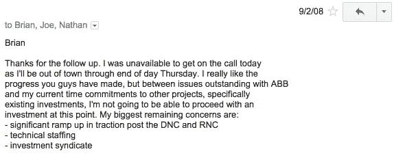
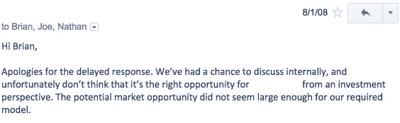

# 你应该向多少风投推销？

> 原文：<https://medium.com/hackernoon/how-many-vcs-should-you-pitch-to-7da510de59ce>

## 每个企业家都在思考一个问题——在我得到一笔交易之前，我需要和多少风投谈？


([Credit](https://unsplash.com/photos/xhRA-N3HYjw))

```
[**Originally published on Quora**](https://www.quora.com/As-a-startup-founder-who-would-you-not-be-willing-to-receive-funding-from/answer/Abhishek-Anand-1)Reproduced for HackerNoon. Some minor edits for improved readability.**The original question on Quora:**
As a startup founder, who would you not be willing to receive funding from?
```

每当创始人(*或创始团队*)准备为他们的初创公司筹集资金时，他们都会听到一个轶事，即 Airbnb 的创始人在成功达成交易之前，曾与许多投资者交谈过。这是真的。[迈克尔·赛贝尔](https://medium.com/u/a352d7f296c5?source=post_page-----7da510de59ce--------------------------------)(y combinator 和 Justin.tv 的创始人)在 2008 年单独向 7 位投资者介绍了[布莱恩·切斯基](https://medium.com/u/bb249e5e0d1b?source=post_page-----7da510de59ce--------------------------------)(*详见本* [*中帖*](/@bchesky/7-rejections-7d894cbaa084) )。正如布莱恩在他的文章中所写的:

> 下面你会看到 5 个拒绝。另外两个没有回复。

因此，这 7 位投资者放弃了以看似微不足道的 15 万美元获得 Airbnb 10%股份的机会。



3 of the 5 rejection mails Airbnb received out of the 7 introductions that were made.

Brian 在文章结尾说了一些激励创业者的话。

> 下次当你有一个想法被拒绝时，我希望你能想到这些邮件。

现在。这是强有力的，确实是那些为了更好地改变世界而不懈奋斗的人需要听到的话。继续比赛，保持动力，不放弃。

但是，我现在在这里谈论一些不同的东西。我在这里告诉你，当你计划筹资时，在你开始筹资之前，退一步想一想。

## 这不仅仅是你接触的风投数量的问题，也是你接触的世卫组织的问题

Brian 分享的 5 封电子邮件中有 3 封谈到了一个共同的主题—“*这不是我们关注的领域。*

当然，投资者想要赚钱，事后看来，这些投资者中的一些人(*也许是所有的*)会后悔没有抓住这个机会(*他们 15 万美元的投资本可以让他们获得数百亿美元*)。但这并不能改变这样一个事实，即投资者通常会考虑一些重点领域。这有多种原因:

*   有时候，他们的有限合伙人会要求他们参与哪些行业。
*   只有当创业公司做得非常好的时候，风投公司才能赚钱。所以风投们真的投资了(不仅仅是财务上的投资)他们投资的公司。因此，你通常会发现风投只投资于他们非常了解的细分市场，以及他们认为自己能够为投资组合中的公司增加非货币价值的领域。
*   *一朝被蛇咬十年怕井绳*。风险投资确实支持聪明的企业家，但偶尔他们也会遇到看起来很有前途，但最终失败的公司。如果是这种情况，并且如果他们看到其他机构投资者在同一领域的其他糟糕押注，他们可能会对涉足该领域持谨慎态度——至少目前是如此——T2。

可能的原因清单可能比这长得多。我建议的一家初创公司是酒类钱包，他们正在寻找种子期投资者。我认识一个人，他一直在积极投资早期公司，但我也知道这不会是一个他会过于热衷的领域——*，完全是因为个人原因，而不是商业理由。因此，我没有联系上。我上周在一次活动中遇到了他，于是就谈到了酒类钱包业务的话题。他对业务的反应被不做介绍的决定所证实。*

> 所以，做你的研究。弄清楚你打算接触的风险投资公司感兴趣的领域。不仅要对公司进行调查，还要对你可能联系的人进行调查。

很有可能在同一个风投公司有两个人，但是其中一个对公司不冷不热，而另一个很可能是你在公司的拥护者。

## 你可能只需要一个投资者

如果你是一家早期创业公司，很有可能你现在正在寻找一个投资者。那么，为什么不做一个漏斗来帮助你过滤，从而缩小你达成交易的可能性呢？

## 就像投资者容易受到不良创业公司的影响一样，创业公司也容易受到不良投资者的影响

它是双向的。你不可能认为任何投资者都是好投资者。就像你公司里一个糟糕的员工会毁掉很多资源的生产力一样，一个不合适的投资者也会对你的企业不利。

当然，你后悔搞砸了一笔潜在的交易，但请记住我的话——如果你与错误的投资者达成交易，你会更加后悔。

> 遵循散弹枪式的筹资方法(*与尽可能多的投资者交谈*)可能会增加你获得资金的机会；这也可能增加你被错误的投资者束缚的机会。

如果我打算从某人那里筹集现金，有几件事可能会对我产生危险:

1.  他们的支票簿将是他们能够为我的业务增加的唯一价值。经营一家初创公司很难，真的很难，我寻找投资者的主要原因之一是在某些方面寻求他们的帮助。显然，在一天结束的时候，需要由企业和我来做繁重的工作，但我真的很期待在我们艰难前行的时候帮助指导企业。如果我在时尚/零售领域工作，我真的会寻找一个人，他(a)了解供应链流程的错综复杂和细微差别，(b)能帮助我与那些可能有助于推动业务发展的人建立联系。
2.  **当谈到最基本的事情时，我们没有相同的波长，相同的思维过程**。不要误会我的意思——我并没有完全想好生活，职业世界更是如此。我总是希望向任何人和每个人学习。但是我们需要坚持指导我们思考过程的基本要素。如果我们两个不能在这些问题上达成一致，那么对我们两个来说都将是一段艰难的旅程。我们总是忙于在每一个商业决策上互相争斗，那我们什么时候才能经营公司呢？我曾经拒绝了一位天使投资人，因为一件简单的事情——*我们当时只专注于做一件事，他希望我们疯狂扩张，而其中一些事情会与我们从事的业务完全脱节。当我解释为什么过早多样化并不是一个好主意，从而削弱我们的品牌定位、信息和身份时，他的观点很简单——“但你这样做会赚更多的钱。”谢谢，但是我不去了。(尽管他是对的。我们本可以赚更多的钱，但是(a)不频繁，而且很分散，(b)重复交易几乎为零，这将导致灾难。)*
3.  他们有很多事情要做。好吧，这听起来可能有点穷，但我并不特别期待有一个支持我的生意的风险投资人，他“*总是很忙*”。他们可能陷入困境的原因之一可能是庞大的投资组合，而这——*这是一把双刃剑*。虽然这将使风险投资相当多产，并肯定会让你得到很多关注，但这也意味着他们将很少有时间给你。你需要他们的时间，尤其是在早期阶段。我见过风投公司向其他多产投资者介绍他们的投资组合公司，其中一些电子邮件是主动写的，创始人甚至没有要求建立这种联系。这些邮件的长度和背后的思考/时间让我更加尊重那些风投。不过，这并不是异常行为。风投应该与你的成长保持一致。毕竟，你的成功就是他们的成功。因此，我希望他们至少有足够的带宽，以记住我的业务可能不时需要一个友好的推动。

找到合适的第一个投资者几乎和找到合适的联合创始人一样重要。你们会在里面待很长时间。确保这将是一次你们都喜欢并相互支持的旅程。离婚对孩子来说是件麻烦事，而孩子是你的梦想，你的事业。不要因为你不耐烦，接受了你遇到的第一笔交易而让它受苦。

*最初发表于*[*www.quora.com*](https://www.quora.com/As-a-startup-founder-who-would-you-not-be-willing-to-receive-funding-from/answer/Abhishek-Anand-1)*。*

# 今天到此为止。明天见！


```
[**Twitter**](http://twitter.com/@abyshake) **|** [**Facebook**](http://facebook.com/abyshake) **|** [**Quora**](http://bit.ly/abyshake) **|** [**LinkedIn**](http://in.linkedin.com/in/abyshake) **|** [**E-mail**](mailto:mail@abyshake.com)
```

[](https://upscri.be/a5ccb9/)

Click here to join the mailing list