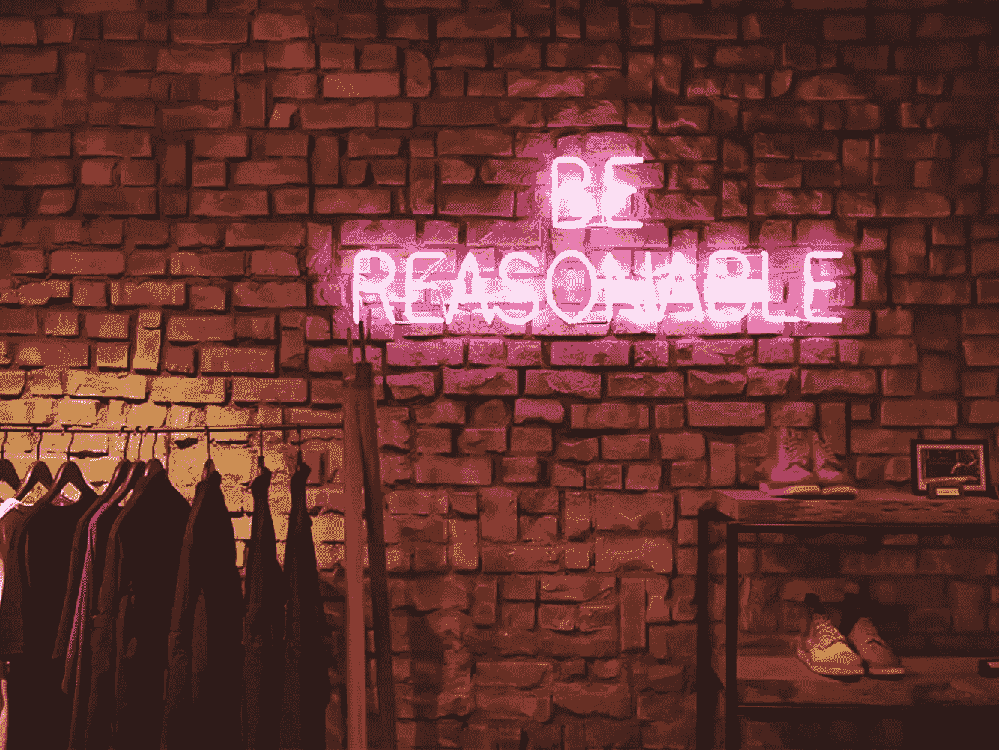

# 营销机构如何利用注册会计师定价敲诈客户

> 原文：<https://medium.com/hackernoon/how-marketing-agencies-rip-off-their-clients-with-cpa-pricing-2eb0b50e7dd0>

## 理解为什么注册会计师定价有时被使用，为什么你应该尽量避免它。

在 Pearmill(一家由技术支持的绩效代理公司)，我们已经处理了许多客户希望使用每次收购成本(CPA)定价模型的情况。(注:如果不知道什么是 CPA 定价，文末有简要说明)

我一直站在品牌的一边(当时我是 [Checkout 51](https://www.checkout51.com/) 的增长主管)，现在站在代理的一边——我们已经帮助了像 [Frank & Oak](https://frankandoak.com) 、 [Cover](https://cover.com) 等许多品牌——我们已经意识到 CPA 定价几乎从来都不是正确的选择。

# 为什么你不应该使用注册会计师定价。

反对 CPA 定价的主要论点是激励的一致性——从长远来看，广告商和代理机构的目标并不完全一致，这导致了沟通不畅和绩效浪费，我们认为这可以通过更好的定价模型来避免。

## 无效的长期支出

在 CPA 定价的情况下，广告商的[营销](https://hackernoon.com/tagged/marketing)支出并没有随着时间的推移变得更有效——这通常是绩效营销的目标。如果[代理](https://hackernoon.com/tagged/agency)在以低价获得有价值的用户方面做得很好，效率并没有传递给广告商。随着收购成本越来越低，代理机构赚的钱越来越多，而你却看不到任何业绩增长，因为你支付的是注册会计师的费用。

## 短期焦点

该机构不再单纯关注业绩，而是根据他们能获得的业绩来划分他们能赚多少钱。更多收入的诱惑或对收入不足的担忧可能会分散广告公司的注意力。

这有时会导致获得短期收益的努力在中长期内不一定是可持续的。

## 最少的实验

注册会计师定价惩罚实验。如果有活动已经打破了设定的目标，该机构不太可能会继续建立其他实验来保持良好的表现，因为这可能会减少利润。最终，表现良好的营销活动将被耗尽，而这些活动的采购成本将会上升。如果没有不断的尝试，广告商和代理商将会被抓住，争先恐后地试图策划新的活动。

当我们与客户达成注册会计师定价模式时，我亲身经历了这一点。我们比他们的每用户 CPA 上限低 70 美元。这意味着我们从这些活动中赚了很多钱，但我们开始害怕测试其他东西，因为这会减少利润，导致我们的费用降低。

我们意识到这对我们和我们的客户来说都是不好的行为，我们实际上说服了他们转向广告支出百分比定价——即使这意味着短期内我们的收入会减少。

你想为你的公司建立的理想环境是一个不会因为他们尝试新事物而惩罚他们的环境。取消这种惩罚会培养更多的主动性和雄心勃勃的想法——即使这些活动已经进行得很好了。

# 是什么让 CPA 定价如此吸引人？

双方都有一些选择加入注册会计师模式的动机，尽管我们认为这些动机是短期的——在雇用代理机构时，这些动机值得理解和考虑。

## 广告商的动机

对于广告商来说，最重要的是以尽可能精确的方式对你的增长进行预算，并获得一个强有力的保证，即该机构能够让你以稳定的 CPA 稳步增长。

因为你多少知道你的最大 CPA 是多少，你可以模拟出你的产品的增长和你的预算能够维持的增长率。

由于该机构从注册会计师价格套利中赚钱，你可以假设他们有实现目标的压力，并保持符合目标的强大活动。

注意:在实践中，这可能会变得模糊，因为机构并不总是能够随着你的预算规模保持稳定的 CPA。

## 机构的激励措施

对广告公司来说，在广告运营和创意工作上有巨大的潜在收益和成本节约。

根据交易的条款，如果有足够的预算，并且他们能够获得非常便宜的用户，代理商可以赚很多钱。

例如，如果固定 CPA 设置为 100 美元，代理商想出一个以 40 美元获得用户的方法——他们每个用户赚 60 美元！这是一个相当不错的利润。

成功的广告活动完成后，广告公司可以缩小实验规模，让广告活动自动运行一段时间，而不必分配太多的内部资源用于广告运营和创意制作。

注意:在实践中，当然也不全是阳光——如果绩效更难实现，那么进步也更难实现。

# 结论

虽然广告客户可能会在为固定 CPA 获取用户中找到安慰，但他们很可能会错过更高质量的用户或广告公司正在发现的成本效率收益。基于 CPA 的定价将减少对用户长期价值的关注，并使团队只关注短期目标。

我们几乎总是推荐其他定价模式。或者是固定的每月预聘费用(对于较小的预算)，或者是公平的广告支出百分比，该百分比可以根据当前的预算和获取客户的成本来确定。

最重要的是将广告公司和广告商的激励结合起来，而注册会计师的定价在长期内无法实现这一点。

如果您正在寻求建议，或者正在考虑与代理机构合作，我们很乐意为您提供帮助。给我们喊一声！

# 什么是 CPA 定价？

为了清楚起见，让我们定义一下每项收购的定价成本，它是如何定义和计算的。

注册会计师定价是指营销公司或广告渠道承诺为广告商提供统一的每项采购成本。他们要么担保它(非常罕见)，要么构建合同，如果平均注册会计师高于设定的限制，广告商就不向代理机构支付费用——这通常被称为套利模型。

例如，假设品牌和营销公司同意以 10 美元的 CPA 定价收购 iOS 应用程序安装，并为公司建立了套利模型:这意味着公司将尽一切努力将 CPA 保持在 10 美元以下，实际 CPA 和平面 CPA 之间的差额将归营销公司所有。

用数字来表示，如果公司以 8 美元购买了 1000 个应用程序，那么他们将获得 2000 美元。如果他们以 11 美元的价格购买了 1000 个应用程序，那么他们没有资格获得任何付款。

# 为什么我有意见

在过去的 7 年里，我一直以某种形式在数字平台上部署广告预算。无论是脸书、谷歌广告、必应、Pinterest、Snap，还是更小的网络。

我的职业生涯开始于管理各种初创公司的增长，最终是一家名为 [Checkout 51](https://checkout51.com) 的公司，在那里我花了数百万美元做广告，并雇佣代理机构来帮助我们实现积极的用户获取目标。几年后，T4 公司被出售，我离开了这家公司，创办了一家名为 Pearmill 的独特演出经纪公司。

在[pear mill](https://pearmill.com)——我们通过广告帮助品牌成长。在过去的几年里，我们已经花费了数百万美元用于像弗兰克、橡树、封面和更多的品牌——使用我们自己的技术进行报道和广告运作。

我一直站在桌子的两边:雇用广告公司，在竞争激烈的市场中严格保护我的预算，以及作为一家试图实现高增长目标的公司与我们的客户合作！