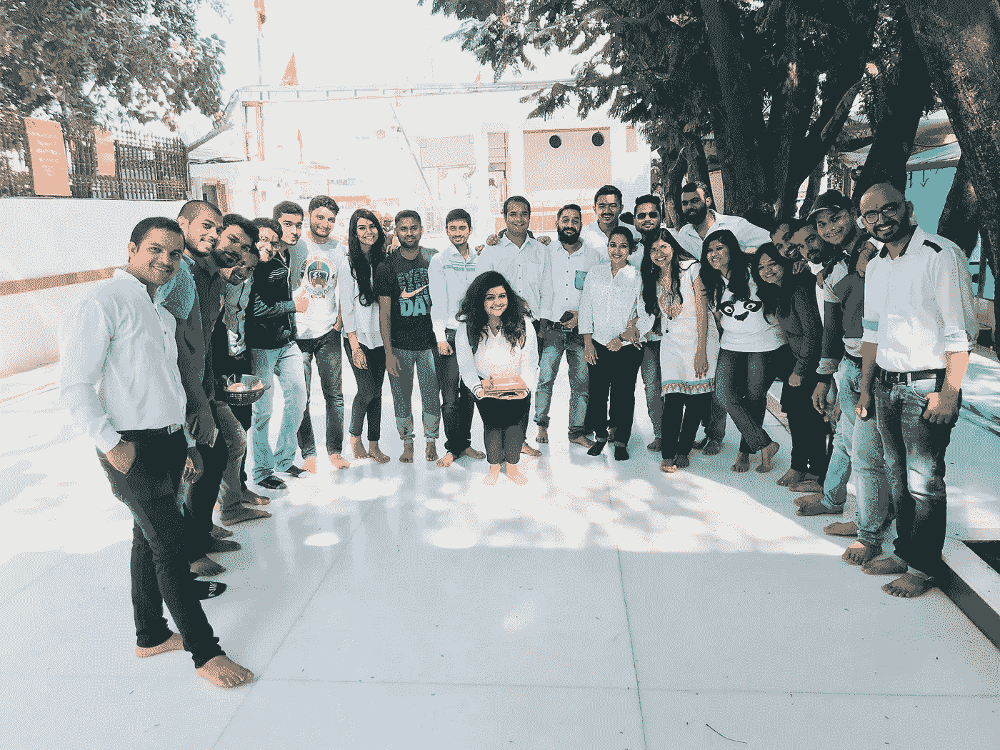
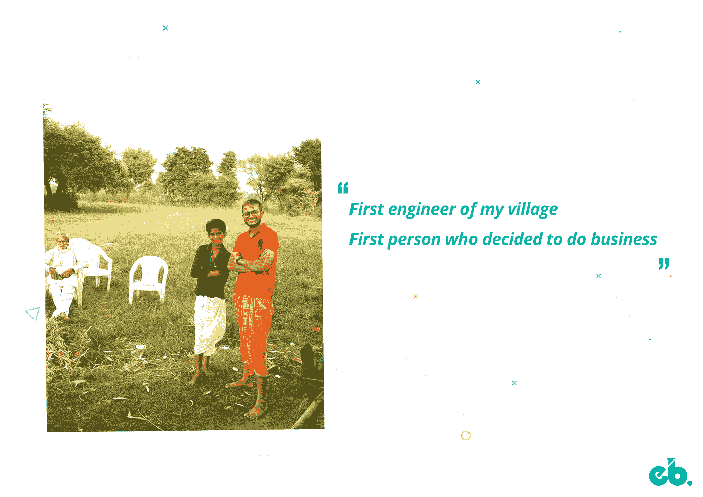
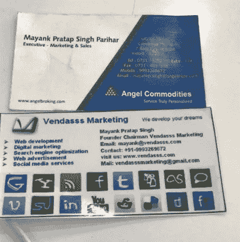
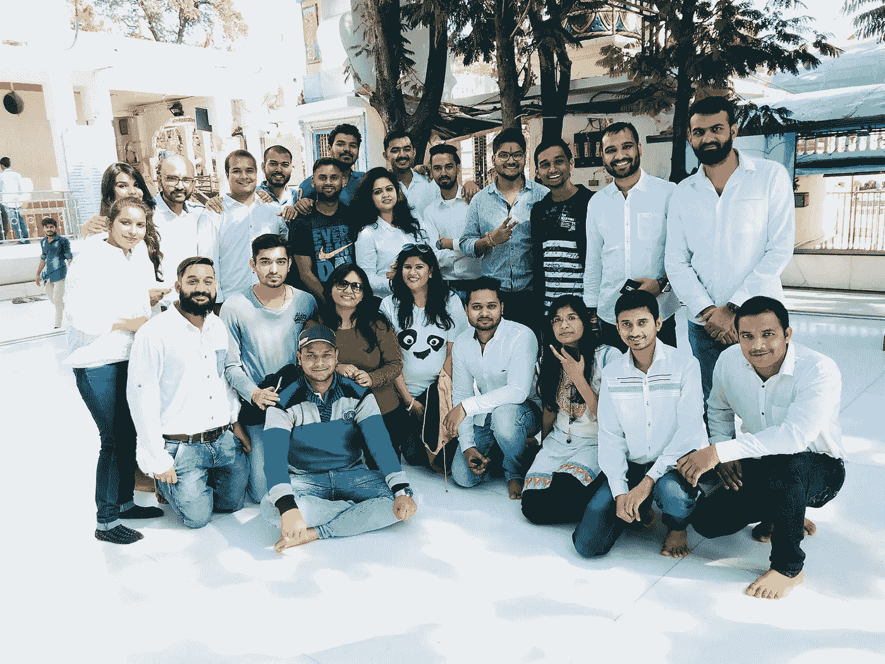
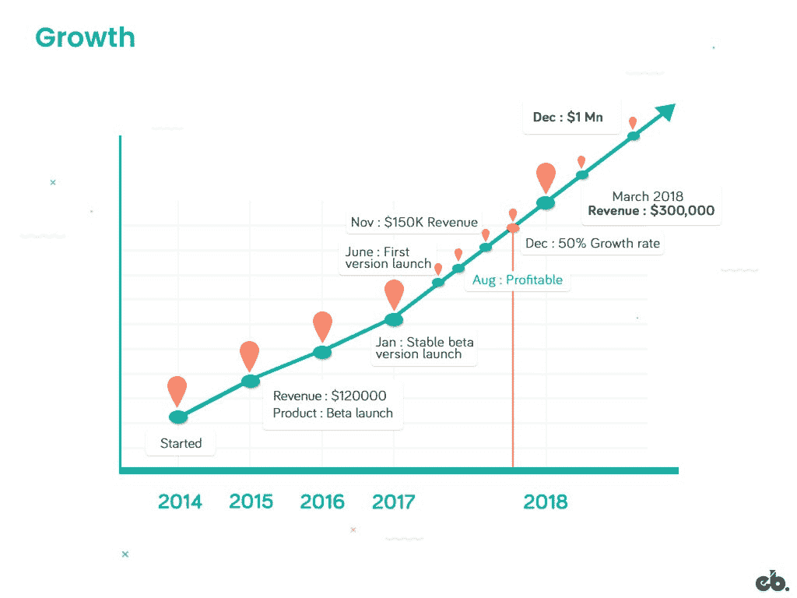

# Mayank Pratap 如何建立 engineer Babu——一家盈利的 IT 服务公司

> 原文：<https://medium.com/hackernoon/how-mayank-pratap-built-engineerbabu-a-profitable-it-service-company-generating-more-than-50-000-per-month-bcd3006bdbb5>

## [推送面试](https://www.facebook.com/groups/Pushstarter) 09:

## 关于 [Mayank Pratap](https://www.linkedin.com/in/mayankpratap/) 如何建立 [EngineerBabu](https://www.engineerbabu.com/) 的旅程——一家盈利的 IT 服务公司。

**Team @** [**EngineerBabu**](https://www.engineerbabu.com/)

印度是世界上发展最快的创业生态系统，每天都有 3-4 家新公司诞生。在过去五年中，我们取得了显著增长，预计在 2020 年之前的未来五年中，我们的年增长率将达到 10–12%。

*这种繁荣也导致了许多 IT 服务公司的发展，以迎合初创公司的需求。*

但这些公司只是在数量上有所发展，在产品和业务流程上几乎没有差异，也没有创新。

此外，没有一家公司处于市场领先地位，可以被称为这个新兴市场的**[**TCS**](https://www.tcs.com/)**/**[**Infosys**](https://www.infosys.com/)**。****

**这就是 [**EngineerBabu**](https://www.engineerbabu.com/) 正在改变游戏并试图成为这个创业市场的领导者的地方。**

## **通读这篇采访，了解:**

> **Mayank Pratap 如何建立 EngineerBabu 这是一家盈利的 IT 服务公司，月收入超过 5 万美元。**

**这是“[**push interview**](https://www.facebook.com/groups/Pushstarter/)**:帮你 Pushstart 的面试”**系列第九期由 [**Pushstart**](https://www.facebook.com/groups/Pushstarter/) 提供动力。**

**如果你碰巧错过了我们之前关于“ [**我如何建立印度最活跃的创业社区之一**](https://hackernoon.com/how-i-built-the-most-active-startup-community-of-india-dfd83e8fe687) ”的采访，请查看一下。**

** [## 我如何建立印度最活跃的创业社区之一

### 我从零到一建立创业社区的旅程

hackernoon.com](https://hackernoon.com/how-i-built-the-most-active-startup-community-of-india-dfd83e8fe687)** 

# **你是🕴Who 吗？**

**嘿 [**Pushstarters**](https://www.facebook.com/groups/Pushstarter/) ！我是[**Mayank Pratap**](https://www.linkedin.com/in/mayankpratap/)**俗称**【工程师巴布】**因为我是我们村的第一工程师。****

********

******Me chilling in my village :P******

****我的职业生涯始于技术- >销售- >营销- >内容写作- >有时我也会打扫办公室。****

****我在 2008 年*(大学二年级)*得到了我的第一份销售主管的工作，离开它开始了我的第一次创业，经过 1 年半的奋斗*(家庭期望，我的梦想，稳定的跨国公司工作)* **，**在 [**Tech Mahindra**](https://www.techmahindra.com/DAVID.html) 做了两年技术人员，最后辞职并在 [**EngineerBabu**](https://www.engineerbabu.com/) 工作****

********

******Today my-cofounder found these cards when I was shifting to a new house.******

****[EngineerBabu](https://www.engineerbabu.com/) 是一家盈利的初创公司，每月经常性收入超过**5 万美元**。我们有一个小团队，里面有很多快乐的客户。然而，还有很长的路要走。****

# ****🤔 [EngineerBabu](https://www.engineerbabu.com/) 怎么回事？****

> ****对于大多数企业家来说，技术是他们创业不可或缺的一部分，但不是他们的核心专业领域。建立和管理一个技术团队很麻烦，创始人通常会浪费很多时间、精力和金钱。****
> 
> ****这就是 EngineerBabu 的用武之地。****

********

****我们专门为创业公司打造**[**MVP**](https://www.techopedia.com/definition/27809/minimum-viable-product-mvp)*(最低可行产品)*。我们几乎 80%的客户是企业家，他们有一个粗略的想法，需要以较低的成本快速执行，需要一个平易近人的优质团队。******

*******他们带着想法来找我们，我们帮助他们建立技术基础设施。简而言之，我们是一家帮助其他创业公司的创业公司。*******

****我们还为 [**三星**](http://www.samsung.com/in/) 等企业开发了许多产品。我们目前正在开发以下三种内部产品:****

1.  ******创业公司的 EB:**创业公司的产品开发。****
2.  ******面向企业的 EB:**为企业提供技术解决方案。****
3.  ******电子商务市场:**IT 服务的策划市场。****

# ****💯是什么激励你开始 [EngineerBabu](https://www.engineerbabu.com/) ？****

****离开 Tech Mahindra 后，我回到印多尔，开始在一家教练学院做兼职讲师。我仍然记得他们收取 10 万卢比的安置费。****

****一天，当我到达学院时，我发现它已经关门了。我们打电话给研究所所长，但他没有接电话。我们很快意识到这完全是一个骗局。大约有 23 名学生，其中很少有人来自贫困家庭。****

****那天，我决定不拿任何报酬去教他们。我创建了一个 [**脸书集团**](https://www.facebook.com/groups/bangwalkins/) *(现在超过 10 万成员)*这样我就可以大规模地帮助人们。目的是帮助工程师找到工作。经过 3-4 个月的努力，他们中的一些人找到了工作。****

## ****点击此处阅读更多内容:****

**** [## 启动 EngineerBabu 背后的真实故事是什么？这个名字是怎么来的？

### 答:EngineerBabu 从来没有计划过，我从来没有想过我会做出这样的公司。

www.quora.com](https://www.quora.com/What-is-real-story-behind-starting-EngineerBabu-How-does-this-name-came) 

在帮助开发商安置的同时，我对这个市场有了很好的了解。以前经常听说印度开发者不够好。但是很快我就明白了下面的道理:

> ***印度开发者在印度并不好，但一旦去了美国，就成了谷歌和微软的 CEO。***

印度 IT 公司的工作文化和招聘流程中存在一些固有问题，这些问题阻碍了员工发挥最大潜能。

就在那时，我决定着手解决这个问题，并且…..砰！[**engineer Babu**](https://www.engineerbabu.com/)**的诞生就是为了解决以下问题。**

*   **聘用合适的候选人**是一个**三个月的过程** *(面试——筛选——选拔——通知期——入职——培训)。*
*   对于非技术型创始人来说，管理技术团队是一项复杂的任务。大多数创始人最终都雇佣了错误的团队。
*   **固定基础设施成本** *【系统、租金、互联网】*。随着时间的推移，系统会变得过时，基础设施需要维护。
*   在印度雇佣一个团队比在美国雇佣一个拥有相同专业知识的全职团队便宜 70%**。**
*   **每月固定工资*(人们得到的评估是基于几个月的经验，而不是技能的提高)*。****** 

# ******🤝你是如何获得最初的客户的？******

******当我与 Tech Mahindra 一起工作时，我在班加罗尔的创业社区建立了很多联系。******

******当我想到[工程师巴布](https://www.engineerbabu.com/)的想法时，我和我的关系人讨论过，他们中很少有人感兴趣。我在班加罗尔的一次创业活动中遇到了我的第一个客户。******

******他有了一个想法，正在寻找可以帮助他开发的人。这似乎是一个绝佳的开始机会，所以我向他伸出援手，为他开发了一个 MVP。******

> ******他很高兴看到这个产品，并把我们介绍给他的几个朋友。******
> 
> ******我们所有的初始客户都是通过现有客户的推荐获得的。******

******我们的一些客户使用我们开发的 MVP 获得了数百万美元的资金，连锁反应开始了。我们很自豪成为连锁反应的源头。******

> ******获得首批客户是一项挑战，但如果你重视他们的时间和信任，并提供出色的服务/产品，他们会永远追随你。******

******我们试图做一个类似于 [**Tinder**](https://tinder.com/) 的应用，并测试 [Tinder](https://tinder.com/) 的付费账户，得到了一个匹配，并点击了下面的想法。******

## ******通过 Tinder 寻找客户:******

*****(做生意全靠人脉)*****

*   ****我们销售团队的七个人订阅了 Tinder 的付费账户。****
*   ****我们把地点改到了德国墨尔本、芝加哥和其他“富裕”的城市。****
*   ****我们的目标人群是 50 岁以上的人，不分性别，因为他们通常都很富有，没有人去调查他们。****
*   ****我们会告诉他们，我们只是在探索 [Tinder](https://tinder.com/) 并试图建立一个类似的应用程序，而不是为了搭个顺风车。其中几个回复:*嘿伙计们！很高兴知道这个。你能帮我做一个网页/应用程序吗？*****

## ******通过事件寻找客户:******

*****(联网是在活动前而不是活动后完成的)*****

****每当我们知道任何城市有重大事件发生时:****

*   ****我们将使用**#活动名称搜索谁将参加活动。******
*   ****他们会是我们的潜在客户吗？****
*   ****我们如何帮助他们？****

****在 [**全球投资者峰会**](https://en.wikipedia.org/wiki/Global_Investors_Summit) 中，我们使用相关标签寻找与会者，并试图通过**电子邮件**和 **Linkedin** 与他们建立联系。****

********

## ****我们在向他们发送信息/电子邮件时使用了以下格式:****

****你好像正在参加 [**GSS**](https://en.wikipedia.org/wiki/Global_Investors_Summit) **。非常感谢你访问印度——这是一个美丽的国家。以下是一些能让你的旅行更有成效的指南:******

*   ****印度十大旅游胜地*(文章链接)。*****
*   ****印度十大新兴创业公司*(名称)。*****
*   ****选择 [**OYO 客房**](https://www.oyorooms.com/) 而不是酒店。****
*   ****订购食物的应用程序可以让你选择食物*(名字)*。****

****如果还有什么需要我们帮忙的，请告诉我们。****

****大约 90%的人回复了这封邮件。我们还帮助一些人计划他们的旅行。有些人甚至来见我们，成为我们的客户。****

> ****销售就像一个婚姻联盟；人们只有在彼此信任的情况下才会结婚。平均而言，即使我们没有参加任何活动，我们也能从每个活动中获得超过 1 万美元的收入。****

# ****💰你的商业模式是什么？****

> ****你读过龟兔赛跑的故事吗？我们都知道最后谁会赢得比赛，不是吗？****
> 
> ****我们生活在一个充满野兔的社会；人们想要速赢。****

****但是我们决定一步一步来。在开发我们的产品之前，我们决定通过开发企业家的产品来帮助他们。我们帮助他们进行产品开发、营销，并帮助他们找到合适的导师。经过几个月的努力，我们终于推出了我们的平台。****

****定价主要取决于客户的功能和技术要求，付款以里程碑为基础。自从我们的平台推出以来，我们的收入增长了数倍。****

****我们在 2017-2018 年实现了 57%的平均季度增长率。****

*   ******第一季度:** *20%的增长*****
*   ******第二季度:** *100%增长*****
*   ******第三季度:** *18%的增长*****
*   ******第四季度:** *增长 54%*****

****[***engineer Babu***](https://www.engineerbabu.com/)***是一家盈利的初创公司，每月经常性收入为 5 万美元。*******

# ****👬你是如何着手组建你的团队的？****

> ****开始很容易，任何人都可以开始。但是你需要一个优秀的团队来建立和发展你所开创的事业。****

****我一个人开始 [EngineerBabu](https://www.engineerbabu.com/) 。过了一段时间，我让我的两个学生负责销售和 Android 开发。*现在他们领导着各自职能的团队。*****

****一路上还雇了两个设计师，五人核心团队就是这样产生的。****

****我们是一群从事客户项目的技术人员，没有任何清晰的愿景、使命、团队结构或工作文化。我已经解决了技术方面的问题，现在是时候为业务方面找个人了。****

****我从来都不是一个好的决策者。我甚至没有给自己买衣服，这要感谢格外关心我的父母。但是，我做了一个正确的决定——我让 Aditi Chaurasia 担任 EngineerBabu 的 CEO。****

> ****女性领导者有内在的管理技能。看看我们的妈妈们；他们把我们的房子管理得天衣无缝。****

****Aditi 和我在准备 MBA 的时候就认识了，因为我们是同一个教练班的成员。在我三年级的时候，我们还一起参与了一个失败的创业项目。之后，她攻读了 MBA，我加入了马欣德拉科技。****

****所以，我联系了 Aditi，说服她成为 EngineerBabu 的一员。很难说服她，因为她有一份高薪的政府工作。****

> ****作为一个创始人，你需要说服很多人。你的同事为什么他们应该与你合作，你的客户为什么他们应该与你做生意，你的投资者为什么他们应该资助你的公司。****

****我们花了五个月才让她上船。*一个女性在印度印多尔这样的二线城市追求* [*创业*](https://hackernoon.com/tagged/entrepreneurship) *并不容易(家庭压力，社会规范，文化)。但是她赢得了这场战斗，现在已经成为那个社会所有人的榜样。*****

> ****她进来做 CEO 后，我们从一群人变成了一个公司。****

## ****现在我们是一个五十多人的团队****

********

******Team @** [EngineerBabu](https://www.engineerbabu.com/)****

# ****🏁你未来的目标是什么，你打算如何实现它们？****

> ****我们不做长期计划，因为它们行不通。我们设定短期目标 *(3-6 个月)*从新的经历中学习，并相应地规划道路。****

********

******Estimated growth in revenue if things go as planned. Although we don’t believe in making long-term plans******

## ****目前，我们专注于:****

*   ****为 IT 服务建立一个策划的市场。****

****在过去的三年里，我们在印度建立了一个由优质 IT 服务公司和自由职业者组成的庞大网络。*所以我们解决了供应方面的问题。*****

****为了满足需求，我们在澳大利亚的**和德国的**和**开设了销售办事处。******

*   ****为企业提供技术解决方案。****

****我们已经开办了新企业。大多数交易来自个人推荐，因为我与印度创业生态系统中许多有影响力的人关系很好。****

# ****🗒，你对创业有什么建议？****

*   ****团队向创始人学习，就像孩子向父母学习一样。如果你是一个懒惰的老板，不要指望你的员工会努力工作。****
*   ******销售是愚蠢；关注交付，因为它会带来加速。******
*   ****你需要一支伟大的球队来赢得世界杯或者一个大项目。****
*   ******对员工要私人，对客户要专业**，反之亦然。****
*   ******帮助需要你的人但要记住:******

> ****"不要只提供吉安，要带着真正的沙门来！"****

*   ******赔钱可以，丢关系不可以**。在大多数情况下，人们做相反的事情。****
*   ****无论何时你需要帮助，尽管开口。好心人会帮助你的。让那些白痴笑吧，他们不知道要达到这个目标需要什么。****
*   ****不要计划你的一天；计划好你的夜晚，这样你就知道第二天要做什么。****
*   ****不要把沉默误认为拒绝！****

> ****得到女孩的不是最帅的男生，而是最执着的那个。所以，要坚持。****

# ****✉️:我们怎样才能和你联系上？****

****可以在**[**Linkedin**](https://www.linkedin.com/in/mayankpratap/)**[**Twitter**](https://twitter.com/mayankpratapeb)**或者** [**脸书**](https://www.facebook.com/mayankpratapEB) **上联系我。**********

**我积极分享我在 [**Quora**](https://www.quora.com/profile/Mayank-Pratap) 和【Entrepreneur.com】**上的学习和知识。****

## **非常感谢你的阅读！如果你喜欢，请鼓掌支持👏🏻还有分享帖子。请随意发表评论💬下面。**

## **想成为印度最活跃的创业社区的一员吗？**

***在* [***上发送请求 Pushstart***](https://www.pushstart.in/join-network-community) *成为我们不断壮大的大家庭的一员。***

***嘿！Neeraj 这里的创始人*[***Pushstart***](http://pushstart.in/feed)*，印度最活跃的企业家群体。我每周都会发布对成功企业家的采访。**[***脸书***](https://www.facebook.com/jneeraj0807)***|***[***Linkedin***](https://www.linkedin.com/in/jneeraj0807)***| neeraj . Joshi @ pushstart . in |***[***Twitter***](https://twitter.com/jneeraj0807)***