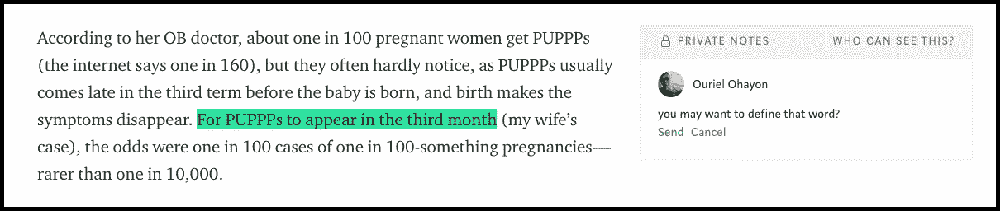

# Medium 如何成为第一家加密媒体公司(并永远改变新闻出版业)

> 原文：<https://medium.com/hackernoon/how-medium-could-become-the-first-crypto-powered-media-company-d2655df479bc>

与区块链创始人的愿景一致，这家以他为动力的媒体可能会改变游戏规则，在新闻出版业开创先例

我怀着极大的兴趣阅读了[最近发表的由](/@ev/the-rationalization-of-publishing-dc001d509de8) [Ev Williams](https://medium.com/u/268314bb7e7e?source=post_page-----d2655df479bc--------------------------------) 撰写的帖子，该帖子讲述了新闻出版业如何能够并将会从基于广告的业务向基于订阅的方式发展/转变(这两种方式可能会并存)。最近假新闻的风暴和由注意力/广告等式引起的用户体验的灾难性权衡呼唤更好的东西，只有有人持续为质量付费，这才会令人高兴。

> 唯一出错的事情是不可避免的。商业总是为了钱的来源而优化，广告商不是为了公共利益。这意味着他们最终得到了更好的结局，而我们其他人则经历了必然会受到损害的痛苦经历。

音乐行业已经看到了这种转变，电影/电视行业也是如此。超出我们目前所依赖的实验状态，这种情况出现在新闻行业只是时间问题。未来将有利于方便的付费捆绑包，将用户和出版商的利益结合起来。那些包裹会是什么还有待观察。但是新闻即订阅将会成为一件事。一直都是，互联网的前 20 年创造了一个即将结束的括号。准备好每月 5/15 美元的无广告新闻服务吧

Medium 处于一个有趣的位置。他们已经通过一个优雅的平台成功建立了一个了不起的贡献者社区。他们设法建立了一个繁荣的作家和读者社区，并开始创建微捆绑新闻和付费服务来改善阅读体验，以此奖励贡献者。但如果他们在区块链技术上建立自己的方法，他们的模式可能会好得多:改善内容所有权，促进无摩擦支付，让读者成为贡献者，更透明的反馈系统。

Ev Williams 几乎暗示了解决方案，但是太快就放弃了。

> 如果每个人的浏览器中都有一个数字钱包，并愿意在网上漫游时进行微支付，这可能是一个解决方案。但这不太可能

在某种程度上，他是对的。目前的解决方案无法实现这一点:它们太复杂、成本太高，而且因国而异。但是区块链技术公司完全可以做到这一点。我不知道在这一点上，他们是否应该有一个使用硬币的媒介，不管现存的硬币象征是什么。但这不是重点。他们可以利用现有的已经采用的加密硬币(超国家设计)钱包技术，并选择加入一个分散的基础设施，使之成为可能。

这就是区块链驱动的媒体所能实现的。

# 内容的所有权

现在你的媒体内容在媒体服务器上。所有权的概念对贡献者来说是至关重要的，有一个默认的契约，你为 medium 写的内容不是你的。这是不对的。应该有一个保证，无论发生什么(即使媒体作为一个公司消失了)，内容应该总是为你和读者。基于区块链的方法可以通过保证内容为其贡献者所有并保证其贡献者的身份来改善这一点(使用例如**公民**或 **uPort** 或**key**身份提供者来代替或补充 Twitter/脸书连接)。但内容也将永远可用，因为它将“托管”在区块链上(可能使用 Filecoin 或另一个基于 IPFS 的系统)，并将依赖于中型服务器。媒介角色将是允许访问、管理和编辑这些内容。

不言而喻，但 Medium 会用自己的令牌奖励原始内容，并加强所有权意识，同时提供一个分类帐证书，证明该内容是您的。

# 无摩擦支付

在这个阶段，你必须拿出你的信用卡支付你的媒体专业版订阅。但是想象一下，Medium 会在你的账户中托管一个加密钱包，使你能够将你的加密转移到这个钱包中，并以加密方式支付你需要的任何费用。

1 MediumCoin/month

此外，你不仅可以支付你的经常性订阅，但你也可以奖励贡献者额外付款，如果你喜欢它。Medium 有一个“鼓掌”系统来为质量鼓掌，这可能与微交易相关，而“喜欢”则与实际奖励相关。以前有人尝试过给小费，但从未成功过，因为它与过时的支付系统有关……这可能会改变游戏规则。鼓掌=付款

1 Clap = 1 micropayment

贡献者将在他们的中型钱包中得到加密奖励，无论他们在世界的任何地方，甚至可以在用户级别上追踪来源。今天的贡献者不知道谁为什么付费，这是一件大事(想想追随者，但 x 1000 更重要)

媒体也可以更容易地回报策展人/聚合者(想想像 [**Hackernoon**](https://hackernoon.com/) 这样的频道，他们目前只依赖于广告)，在如何分配和消费内容流量方面有更多的可见性和透明度。

# 作为贡献者的读者

我看到自己花了大量的时间来修复中型作家的错别字，甚至纠正他们的错误。想象一个奖励加密信用(MediumCoin)读者的系统？为了让媒体内容更好。这个应该奖励:不是。我相信许多媒体读者会为这些事情留下“私人笔记”。他们很自然地这样做，但没有动力让这变得高效和一致。这是过渡性法定支付系统无法做到的。只是太重太贵了。

Help contributors make better content — get rewarded

让我们更进一步:想象一个回报系统，读者将被支付翻译成他们自己的母语的内容。Medium 主要以英文提供。世界上没有比说母语并喜欢翻译内容的人更好的人了。我知道这件事。早期我为 Techcrunch 做过。

# 用户作为产品贡献者

Medium 的用户对平台了如指掌，也许比他们的创造者更了解。他们有独特的见解(中[请为您的评论](/@ourielohayon/medium-please-fix-your-product-b063f800cb9d)系统修复)。但我确信他们会把它留给自己，并在适当的激励下，通过分享这些见解让它变得更好。如果 medium 有正确的激励机制，由 crypto 提供动力，他们可以创造一个良性循环，让 Medium 成为一个更好的地方。例如，他们的反馈渠道可以对用户提交的任何想法给予 1 级奖励，对用户接受的任何想法给予另一级奖励，而区块链带来的透明度将使这一渠道变得可靠和公平。

# 为什么媒体能做到这一点

Medium 比其他出版公司更能做到这一点的原因(也许 Reddit 也能做到)，是这个平台上高质量的加密内容数量惊人。如果你对它有任何疑问，检查一下[这个](/tag/cryptocurrency)。由于它的贡献者，这可能是迄今为止关于这个行业的最好的信息和学习来源之一。他们将是第一个接受并欢迎这种转变的人。这将为行业树立一个榜样，开创一个先例。谁知道呢，也许通过这样做，这种媒体甚至可以成为其他出版商在新系统下的一个伞状聚合器/捆绑器，将出版业带入一个新时代。毫无疑问，新闻捆绑是未来的趋势，行业需要合适的基础设施和激励机制来实现这一点。区块链技术肯定会有所帮助

Steem, pays for contribution and rewards for votes.

Steemit (奇怪地看起来像 Medium，我肯定他们现在已经注意到了)已经这样做了，但是没有 Medium 的足迹、规模和社区。 [Refind](https://refind.com/) (他也有一个非常像媒体的设计和方法应用于书签和发现)是另一个社区驱动的社区，它正在实现一个令牌系统来奖励其贡献者(目前没有任何 ICO)。需要说明的是，Medium 并不一定要做 ICO 才能做到这一点。他们可以简单地接受现有的加密资产或[向社区空投](/@ourielohayon/airdrops-for-dummies-8a500229c2f3)他们的新硬币来提升网络效应，就像 Refind 所做的那样。

Refind, Coin integration

# 时机和进一步的想法

那么 Medium 什么时候可以开始在这方面工作，如何部署它呢？我相信他们今天就可以开始。他们可以从一个简单的新闻类别(提示:crypto)开始，邀请用户使用空投他们的令牌来贡献内容。每个作者/评论者都会收到一些代币，因为他们有一个简单的规则:1 条评论= 1 个代币，1 篇文章= 10 个代币。他们的钱包会随着他们使用这项服务而增加。Medium 将允许这些用户“付费”访问该类别中的付费内容。这一垂直领域的内在经济性将表明这是否可以扩展到更多的类别和功能(例如翻译)。测试这种方法的成本很小，但它的影响可能很大。

与 Telegram 不同的是，Telegram 对即将到来的令牌的使用还不清楚，也没有在网络层面得到加强，在这种情况下，Telegram 可以与其社区有机地发展

读者你怎么看？Ev Williams 你在听吗？