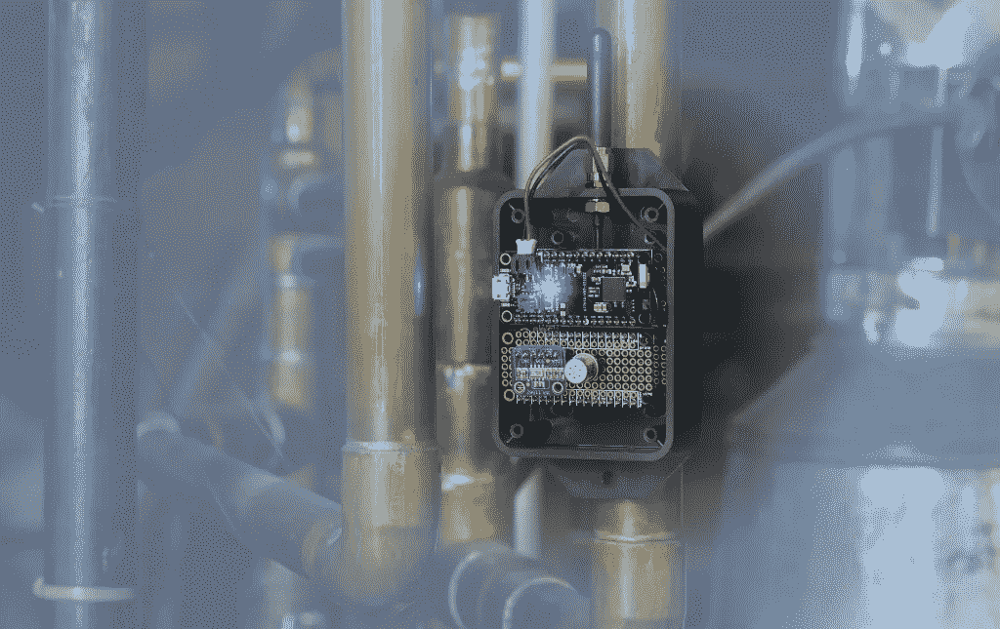
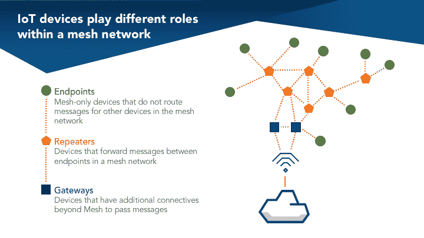
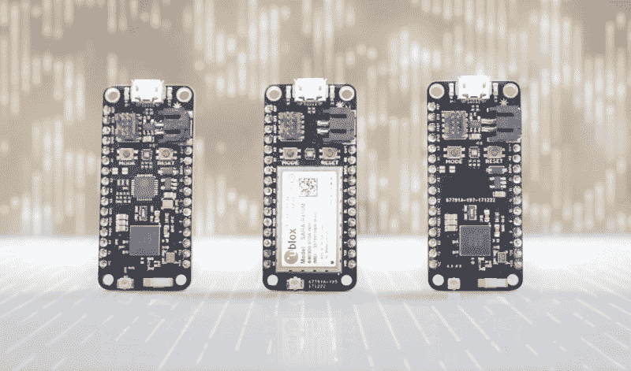

# 网状网络如何实现物联网

> 原文：<https://medium.com/hackernoon/how-mesh-networking-will-make-iot-real-b5b88baab63b>

## 详细介绍物联网网状网络基础和主要优势的快速指南

过去，超越单点连接的构建需要高成本的硬件解决方案和软件实现来连接设备到设备通信所需的中间空间。随着物联网平台的成熟，它们开始采用一种低功耗、低成本的替代方案来弥合这些设备之间的差距:无线网状网络。

# **什么是无线网状网络？**

无线网状[网络](https://hackernoon.com/tagged/network)是节点的基础设施(网状拓扑),彼此无线连接。这些节点相互搭载，以扩展无线电信号(如 Wi-Fi 或蜂窝连接)来路由、中继和代理往来于客户端的流量。每个节点传播无线电信号的距离都比上一个节点稍远，从而最大限度地减少了出现盲区的可能性。

# **网状网络由哪些部分组成？**

1.  **网关** —边界路由器是具有超越网状网络的附加连接的设备，允许它们在网络之间传递消息。您可以认为这些设备为本地网状网络提供了到互联网的“回程”。
2.  **中继器** —路由器是在网状网络中的终端设备(端点)之间转发消息的设备。它们通常不被设计为休眠，因为它们是网状网络基础设施的一部分。
3.  **端点** —终端设备是纯网状设备，不为网状网络中的其他设备路由消息。因为它们没有联网责任，所以它们可以进入睡眠模式，并且是电池供电节点和传感器的良好候选。

# **网状网络和物联网如何协同工作？**

应当注意，每个网状网络解决方案的工作方式不同。所以对于这篇文章，将重点介绍[粒子网格](https://www.particle.io/mesh/)技术是如何工作的。粒子网格是一种无线网格网络，旨在将现有 Wi-Fi 和蜂窝部署之间的空间与低成本、安全和可靠的本地网络连接起来。

Particle Mesh Hardware — Argon, Boron, and Xenon

使用 Wi-Fi 和蜂窝连接的传统物联网设备依赖云在设备之间中继消息。当你在做一个独立的产品时，这很有用——但是有时候你需要的不止这些。粒子网格开发工具包不仅仅连接到互联网，它们还是互联网的网关，可以创建其他设备可以加入的本地无线网格。这些设备协同工作，以确保信息到达它们要去的地方，并为使用 Wi-Fi 和蜂窝连接不可能或经济上不可行的产品提供动力。粒子网格为每个物联网设备提供了一个本地网络来了解和连接周围的世界，确保产品拥有所需的信息。

# **为什么物联网要使用网状网络？**

虽然无线网状网络技术已经存在了一段时间，但直到最近，网状网络的功能才与芯片和硅片供应商的高可用性一起达到成熟点。由于成本较低，无线网状网络已经成为物联网构建者的理想选择。随着联网家庭的兴起和行业对 Thread 等开源资源的支持，Mesh 现在真正可以访问，同时成本低廉，足以进行生产。因此，对于工业和商业物联网应用而言，无线网状网络正成为一种更加可行的真正选择。它可以在扩展两个节点之间的连接受到限制的系统中提供附加服务:

1.  **智能城市** —无线网状网络非常适合通过停车场、校园、商业园区和其他户外设施扩展无线电信号。使用空间可用性检查器的停车库从网状网络中受益匪浅，因为它们可以将信号扩展到整个空间，并且能够在其他客户占用停车位时进行通信。
2.  **医疗保健设备** —无线网状网络可以帮助快速监控和定位医疗设备。它们还可以作为总是需要保持在线的医疗设备的备份。如果一个节点失去连接，另一个节点可以介入以保持连接。
3.  **智能家居**——无线网状网络可以帮助你跟踪和管理整个房间的温度。设置一个供电网关，并在每个房间使用温度传感器和支持网格的节点来捕捉实时数据并自动调整设置。
4.  **农业** —无线网状网络也非常适合追踪阳光照射和作物水位。您可以在整个区域内使用支持网格的节点以低成本进行扩展，以创建一个蜂窝连接的物联网农场。
5.  **工业互联网** —无线网状网络也非常适合通过高度可靠的无线连接网络来跟踪托盘和监控大型物理对象。借助无线网状网络，您可以轻松跟踪整个工厂车间和多个地点的关键数据，以便在问题发生前发现问题。

# 无线网状网络适合您吗？

在为您的物联网项目使用无线网状网络时，重要的是您要考虑这三个核心变量:**安装**、**设备**、**管理**和**支持**。

1.  **安装** —这完全取决于您的预期应用。您需要问问自己，对于您的用例，您是否真的需要一组分布式网格节点。如果您打算为商业或工业应用程序实现网格，您应该在部署整个网格网络系统之前，设置一个小规模的网格网络来确定系统的效率。
2.  **设备管理—** 在比较网格解决方案时，重要的是找到一种能够让您管理设备群、监控事件日志、执行诊断和无线发送更新的解决方案。
3.  **支持—** 在选择网格解决方案时，考虑其周围的社区也很重要。采用有限的网状网络解决方案将会有较少的资源来帮助您进行开发。

# 超越网状网络

如果您希望在物联网基础设施中实施无线网状网络，您必须检查整个物联网系统，而不仅仅是单个组件。要构建任何物联网产品或基础设施，您都需要硬件、软件和连接。为了整合这三个组件，你必须[研究能够为你提供这些组件的物联网平台](https://hackernoon.com/how-to-choose-the-right-iot-platform-the-ultimate-checklist-47b5575d4e20)，并且[咨询物联网领域专家](https://blog.particle.io/2018/04/03/the-five-domain-experts-you-need-to-build-an-iot-device/)来帮助你确定这三个复杂性的范围。

# 底线

网状网络是物联网架构的重要组成部分，因为它使设备能够覆盖更多的区域并收集更多的数据。公司必须决定网状网络是否是扩大其本地网络覆盖范围的有效途径，或者依靠传统的 Wi-Fi 和蜂窝连接是否足以满足其通信系统。