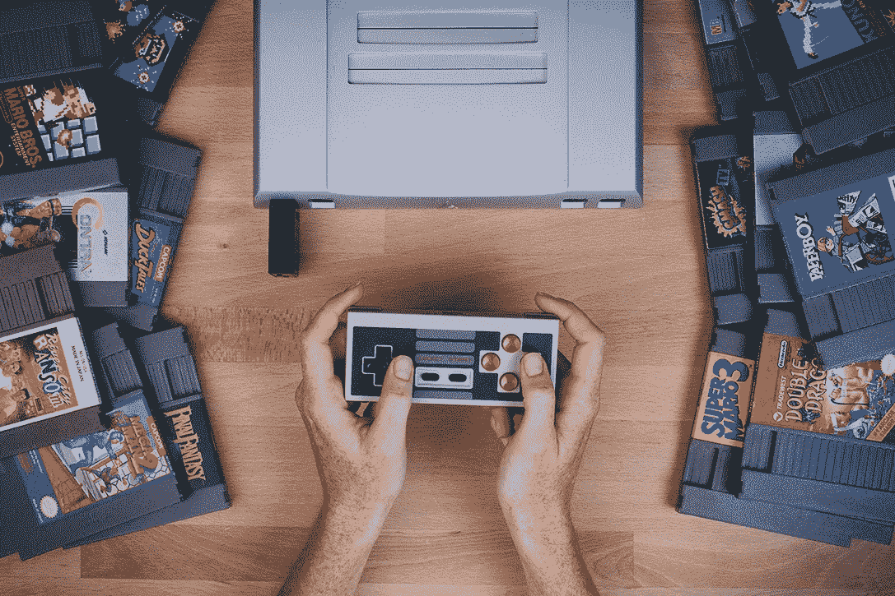
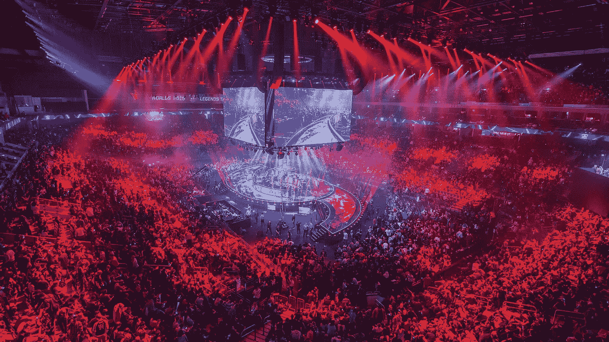
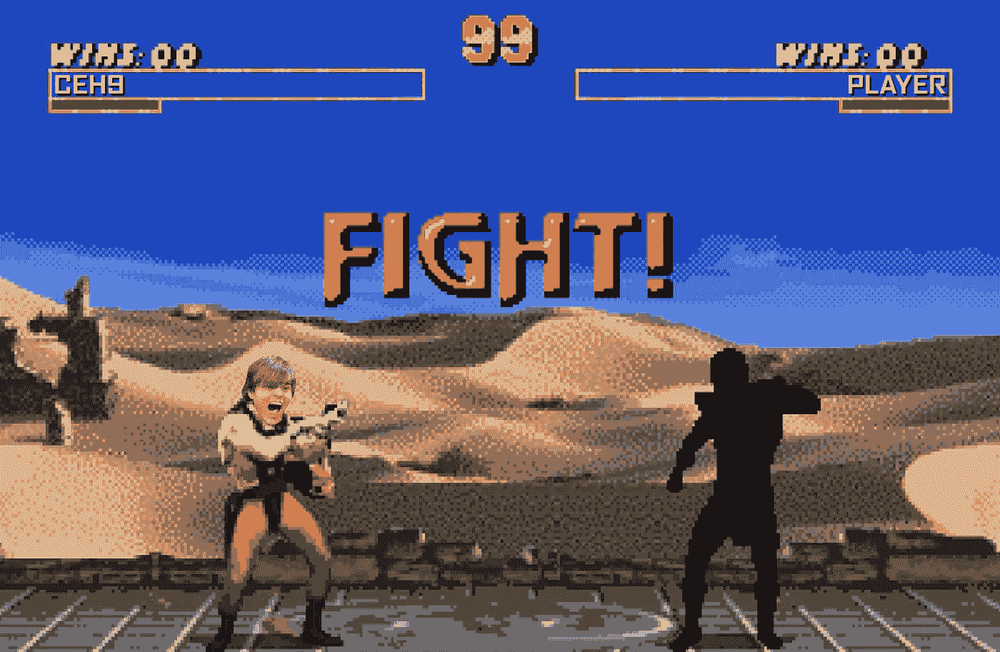

# 千禧一代如何塑造全新的数字娱乐产业

> 原文：<https://medium.com/hackernoon/how-millennials-shape-the-whole-new-personalised-entertainment-industry-c745c581eedb>

年轻人正在改变我们魔法世界的一切。千禧一代每年花费超过 650 亿美元，总消费支出超过 1 万亿美元。他们说懒惰是一个引擎。嗯，根据 [Axios](https://www.axios.com/millennials-a-tale-of-two-generations-ff2a6de5-cfde-42c5-ab38-ec0908fbfcc9.html) 的说法，年轻人被别人和他们自己描述为“被宠坏的”、“懒惰的”和“有权利的”。

社交媒体时代娱乐性活动少了。潜在的现实是，传统媒体不再是信息或娱乐的来源，因为年轻人花在智能手机或更广泛的互联网上的时间要多得多。他们发现了生活的新感觉，[已经创造了新的生活方式](https://successstory.com/spendit/most-expensive-virtual-items-in-video-games)。

EXTRA LIFE: 15 BEST RETRO GAMING CONSOLES by [HiConsumption](https://hiconsumption.com/2016/10/best-retro-video-game-consoles/)

## 1.友谊正在从朋友转变为有创造力的策划者

对于花大量时间观看在线视频的人来说，YouTube 创作者比传统名人更有影响力。70%的青少年 YouTube 用户表示，他们与 YouTube 创作者的关系比传统名人更密切。40%的千禧一代订阅者表示，他们最喜欢的创作者比他们的朋友更了解他们。这里有更强的联系。

## 2.一切都在变成一场基于游戏的成为明星的战斗

年轻人看不到未来的可持续增长模式。但是…成为名人是他们争夺太阳的途径。“… *如果你在 Instagram、YouTube 和 Twitter 上美化自己的生活以保持足够好的状态，你可能会成为一名微星……他们痴迷于名誉”——[TIME](http://time.com/247/millennials-the-me-me-me-generation/)写道。*

## 2009 年比 1982 年多 58%的大学生在自恋程度上得分更高。“媒体鼓励人们认同明星，憎恨‘大众’…”

打败最好的是成为新国王的公式。有一次，说唱大战成了那种情况的一个例子。维基百科写道:“说唱之争通常只是为了用技术创新的说唱给人们留下深刻印象……”。*名声赢得了教育的权利，成为一个全新的黑人。*

**3。无形中产生的情绪&荷尔蒙开始流行**

虚拟商品现在创造了超过 150 亿美元的年收入。事实上，Steam 上的一些皮肤价值高达 2000 美元。2017 年经常电竞观众和爱好者[人数达 1.43 亿](https://www.statista.com/statistics/490480/global-esports-audience-size-viewer-type/)。这一数字预计将在 2021 年达到 2.5 亿。Entropia 游戏[中的行星 Calypso 在拍卖会上以 600 万美元或 600 万美元的价格售出](https://successstory.com/spendit/most-expensive-virtual-items-in-video-games)以观看虚拟世界。

CARTRIDGE-FREE: THROWBACK VIDEO GAMES FOR ANDROID & IOS by [TN2 Magazine](https://www.tn2magazine.ie/cartridge-free-throwback-video-games-for-android-ios/)

## 4.电子竞技世界是主流娱乐的未来

根据高盛[的说法](https://www.goldmansachs.com/insights/pages/infographics/e-sports/report.pdf)，电子竞技正在成为主流。

[DIVERSITY IN ESPORTS: THE ONGOING STRUGGLE by CGMazagine](https://www.cgmagonline.com/2016/03/24/diversity-esports-remains-ongoing-effort/)

根据 NewZoo 的数据，2018 年，预计全球每月电子竞技观众将达到 1.67 亿人，超过美国职业棒球大联盟和国家曲棍球联盟，全球游戏玩家人数超过 22 亿人。欢迎来到数字化竞赛的时代。

**5。娱乐正从集体互动转向个人互动**

曾经，去听一场音乐会是一个梦想。事情有点变化。Lady Gaga 在最近的欧洲巡演后创建了一个私人观众项目，粉丝们可以每人支付 900 英镑(约 1350 美元)与这位明星亲密接触。“她讲了 40 分钟，有点像小学老师，”一位参与并帮助促成该交易的内部人士笑着说。

The platform for digital interactions with global professionals at video games

谁知道千禧一代会有什么样的购买模式？“为你的女儿争取一些和她最喜欢的歌手在一起的时间，不仅仅是为了实现她 16 岁生日的梦想，也是为了提高她的……排名。”与国王战斗意味着感觉非常出名和快乐。这些是数字人想要的情感！更多游戏——更多荷尔蒙。

Welcome to [the Bitterplay Universe](https://bitterplay.xyz), dude!