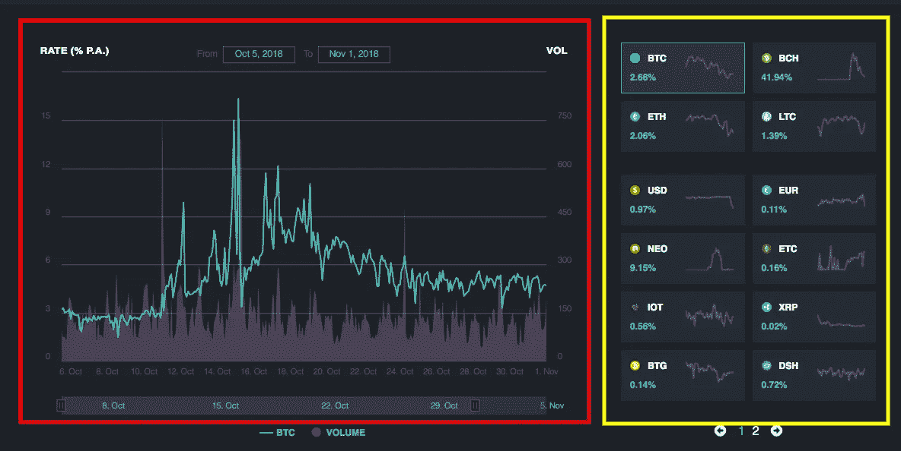
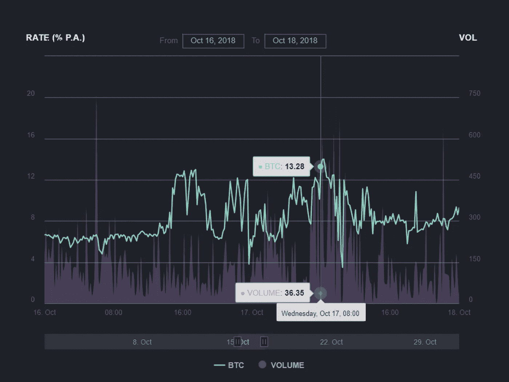
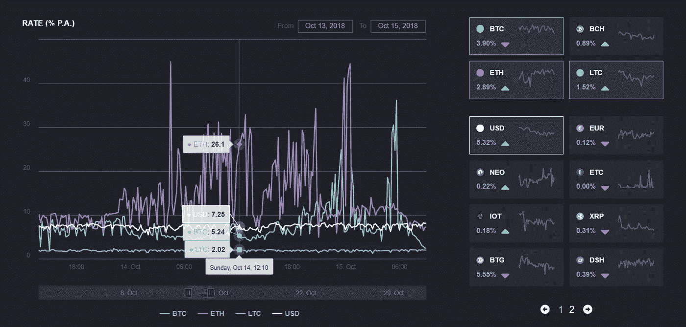

# 融资融券加密货币能赚多少？

> 原文：<https://medium.com/hackernoon/how-much-can-you-earn-from-margin-lending-cryptocurrencies-8d81683630bc>

在 WhaleLend，我们的用户每天都会问我们以下问题:“那么……我可以从保证金贷款中获得什么样的利息回报？”。

对此，我们通常会用一些学术性的东西来回应:“嗯，WhaleLend 为你获取利息的借贷市场是公开的，非常活跃，因此在 BitFinex 等流动性交易所，利率波动很大……”

然后用户通常会说“啊哈，好吧”或“Zzz”。😴"

为了一劳永逸地解决这个问题，我们回到洞穴，处理了数百万个数据点，并根据 BitFinex 数据为你们制作了 [WhaleLend 历史利率图](https://www.whalelend.com/rates?utm_campaign=rates-chart&utm_source=medium_post)。我们这样做是因为:

*   我们希望为我们的用户提供互联网上最全面的利率数据，这样他们就可以对 WhaleLend 做出明智的决定
*   我们是 WhaleLend 的一群书呆子，我们相信图片(或数据图，ping [r/dataisbeautiful](https://www.reddit.com/r/dataisbeautiful/) )胜过千言万语。没有什么比一张精心策划的数据图更强大的了，它能让一堆看似混乱的数据点变得有意义
*   做一件同类中最好的和同类中第一件的事情是很有趣和很酷的
*   很多人需要这些信息，所以为什么不把它免费提供给加密社区呢？毕竟，没有你们，我们就不会存在

# 那么…我到底在看什么？

我们的利率图表有两个主要部分:

1.  ***左边红框中的利率+成交量图*** ，显示了 BitFinex 中贷款支付的利率( ***这是 WhaleLend 为其客户*** )以及这些保证金贷款的成交量
2.  ***黄框右侧的标记选择框*** ，您可以在图形上同时选择最多 4 个感兴趣的标记

**1。利率+成交量图表**

**利率(% P.A.):** 我们的后端实时梳理 BitFinex 上的每一笔贷款，并以 10 分钟为间隔计算 VWAR(交易量加权平均利率)。该方法与传统金融中广泛应用于股票市场的 [VWAP](https://www.investopedia.com/terms/v/vwap.asp) 的方法同义。

例如，在过去的 12 个月中，仅 BitFinex 上就有大约 760 万笔以美元结算的贷款。然后，计算过去一年中每个 10 分钟窗口的音量加权平均速率的数据点。

请注意，BitFinex 上的报价是 ***日费率*** ，我们通过将原始日费率乘以 365 (12.5%的年费率比 0.034%的日费率更容易理解)来计算年费率。

**Vol:**10 分钟窗口内的已结清贷款量。这对于标出异常高或异常低的利率以及理解任何给定利率的背景尤其重要。体积始终以本地选择的标记命名，例如，如果您正在查看 BTC 汇率，则体积以 BTC 的数量显示。

**时间段选择:**您可以使用图表上方的“从…到…”框或图表下方的滑块来放大您的选择。

在下面的例子中，我们可以看到，在 10 月 17 日星期三 0750-0800 UTC，总共有 36.35 笔 BTC 贷款以每天 0.0364%或每年 13.28%的 VWAR 结束。

**2。代币选择平铺**

每个令牌块有两个功能:

**为令牌费率信息平铺，**

*   **它显示了*最新的实时报价器*以所述令牌计价的贷款的年化利率:**该图表计算每 10 分钟关闭的所有贷款，以给你一个数据点，它可以很容易地由成千上万的单个贷款组成。磁贴总是显示最近一笔贷款的数字
*   **它显示利率变动的方向:**紫色向下的三角形表示最新贷款的利率与前一笔贷款相比有所下降，绿色向上的三角形表示相反的情况
*   **它显示了每个代币一周运动的简单摘要:**迷你图(磁贴内的白色小波浪线)是上周利率运动的快照。真的是先睹为快。

**作为选择器，**

*   您最多可以选择 4 项资产同时显示在图表中(如下所示)

Max 4 tokens can be selected to be shown in the graph at the same time

# 呃…..那么到底有多少数据可用呢？

我们有 3 个子集的数据可供查看，而且都是完全免费的。

*   **访客**:如果你作为一个网站访客偶然发现我们的网站，你可以查看**所有代币**的**一个月**的数据，间隔 **10 分钟**
*   **注册用户**:拥有 WhaleLend 账户或者是 API 用户，可以在 **10 分钟间隔**查看**所有令牌**的**三个月**的数据
*   **注册存款用户:**如果您是 WhaleLend 储蓄账户用户，您可以查看**所有代币**的**十二个月**的数据，间隔 **10 分钟**

# 好吧，那么…那么这里的价格是我用 WhaleLend 得到的价格吗？

事情没那么简单。我们会写一篇更长的帖子来解释细节，但这里有一个简短的例子:

假设 2018 年 11 月 1 日，BTC 贷款的当前市场利率正好是 10%的年化利率。这意味着，如果我们以这个利率将 BTC 借出去一整年，回报率将是 10%。

实际上，WhaleLend 可以借出 100 BTC 30 天。如果贷款实际上持续 30 天，那么利息收入将是 100 BTC x 10% /12 个月，这给出大约 0.83 BTC 作为利息收入。

复杂的情况来自两件事。1)贷款很少能持续到完全到期(有时只持续几个小时)2)正因为如此，你的真正回报，最终是一系列以不同利率发放的贷款，而且持续时间长短不一。

WhaleLend 的工作是处理所有这些复杂问题，并优化以捕捉这些图表中的高峰值。从科学角度来看，这是一项重要的任务。

因此，你看到的回报率是你回报率的一个很好的近似值，但不会完全匹配。

# 好吧…现在怎么办？

我们希望这将是一个有用的工具，你感兴趣。如果您有任何意见或问题，请发至我们的[电报](https://t.me/WhaleLendOfficial)组。请记住，你可以通过[注册获得无限制版本的图表(通过这个链接，你将获得 3 个月 20%的收入增长！)](https://www.whalelend.com/referred?code=X23G42&utm_campaign=rates-chart&utm_source=medium_post)进行第一次存款。