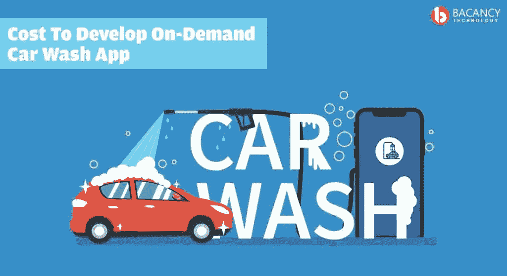

# 自己开发:按需洗车 App 要多少钱！

> 原文：<https://medium.com/hackernoon/how-much-does-it-cost-to-develop-your-own-on-demand-car-wash-app-like-washos-99c315fbda43>

智能手机实际上已经改变了我们日常活动的方式。不可否认的是，你所寻找的所有需求和服务都离你很近。你所需要做的只是点击几下你的应用程序，它就完成了。

## 所以，规划洗车 APP 开发？

为了开发一个应用程序，你需要在应用程序中固定你想要的模块。只要从实用的角度考虑，然后将它与服务和表示同步。为了让你的 MVP 在最少的试验中做好准备，隔离不同的应用程序资源，并将相似的资源捆绑在一起，以完成一个功能模块。

## 一个洗车 APP 应该具备哪些前期服务？

一旦你定义了你的应用程序流程，按照导航和通信来放置你的所有模块，这样用户就能感觉到与应用程序的连接。在探索和研究这些因素时，我发现了洗车应用程序应该基于的几个模块。
**下面是一个基础洗车应用开发应该具备的一些因素:**

*   允许用户下洗涤订单
*   跟踪清洗订单
*   浏览各种服务包和服务器选项
*   完成付款
*   接受和拒绝请求
*   评级和评论
*   驱动器/清洗器可用性

## 洗车移动应用程序的哪些功能取得了巨大成功？

## 用户:

*   执行用户注册和登录
*   电子邮件确认
*   汽车位置选择
*   选择/添加多辆汽车
*   为一辆汽车选择多项服务
*   选择洗车套餐
*   检查服务/技术人员的可用性
*   支付模块
*   推送通知
*   服务等级
*   查看过去订单的详细信息
*   订单跟踪和更新

## 技术人员:

*   技术人员登录
*   推送通知
*   更新可用性/服务状态
*   应用户要求投标
*   服务完成后上传图片
*   查看作业历史记录

## 管理员:

*   技师注册
*   管理技术人员、用户配置文件和凭据
*   管理服务和时区
*   管理用户作业
*   管理用户付款历史记录
*   管理评分和反馈

## 做一个洗车 APP 开发要多少钱？

说到应用程序开发，没有一个放之四海而皆准的解决方案。因此，如果你只是想估算一下洗车应用的开发成本，那么随着你接触不同的移动应用开发公司，成本会有所不同。

在另一种情况下，如果您使用混合模式，将比原生平台多花 25-30 天，并且成本会逐渐增加。

> BACANCY TECHNOLOGY 如何帮助您构建前沿的按需洗车移动应用程序？
> 
> 按需应用开发正在颠覆移动技术，我们是未来的创造者。我们拥有技术娴熟、才华横溢的开发人员和设计师，他们在为您的企业制作屡获殊荣的移动应用程序方面拥有丰富的经验。以可承受的价格模式从我们这里聘请移动应用程序开发人员，并与我们一起开发您的应用程序。立即联系我们。

> *最初发表于*[*【www.bacancytechnology.com】*](https://www.bacancytechnology.com/blog/cost-to-develop-on-demand-car-wash-app)*。*