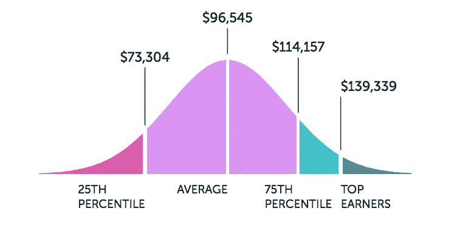

# 2018 年请一个区块链开发者需要多少钱？薪资概览和招聘趋势

> 原文：<https://medium.com/hackernoon/how-much-does-it-cost-to-hire-a-blockchain-developer-in-2018-salary-overview-and-hiring-trends-908488615142>

对 T2 区块链开发商的需求空前高涨。这是目前 upwork.com 上增长最快的技能:与 2017 年同期相比，区块链开发商的需求增长了令人瞠目结舌的 6000%。

另一个自由职业市场， [Toptal](https://hackernoon.com/tagged/toptal) ，已经[报道了](https://www.businesswire.com/news/home/20180215005660/en/Toptal-Launches-Elite-On-Demand-Talent-Network-Blockchain)类似的趋势。这里的区块链开发商需求在短短一年内增长了 700%。

然而，哪里有需求，哪里就不一定有供应。区块链仍然是一个非常罕见的技能。因此，大多数雇主很难快速找到合适的人才。此外，虽然远程招聘可能会解决这个问题，但区块链开发人员的工资是企业需要解决的另一个紧迫问题。

**2018 年雇佣一个区块链开发者需要多少钱？不同地区的价格差异有多大？在美国寻找区块链的内部开发人员有意义吗？还是远程招聘更好？**

在这篇文章中，我们将研究给定的问题，以帮助您在地点和费率方面做出最重要的招聘决定之一。现在，让我们认真对待事实。

# 美国区块链开发者薪资

作为世界主要的科技中心，美国一直对熟练的 IT 专家有着最高的需求。很自然，区块链专家的情况也不例外。有成千上万的公司和创业公司为他们的项目雇佣开发人员和顾问。

为了获得最优秀的人才，雇主们一直在提高薪资期望值。因此，根据 paysa.com 的数据，目前美国区块链开发者的平均工资为 95545 美元。

*Source —* [*paysa.com*](https://www.paysa.com/salaries/blockchain)

另一方面，Glassdoor 的区块链开发人员的平均工资要低得多——只有**79，985 美元**。根据该资源，以下是区块链开发者在美国不同城市的工资差异。

*Source —* [*glassdoor.com*](https://www.glassdoor.com/Salaries/blockchain-developer-salary-SRCH_KO0,20.htm)

正如我们所见，旧金山和纽约是美国收入最高的城市。在三藩市，区块链开发人员的平均工资是 100，819 美元，而在亚特兰大，区块链开发人员的平均工资只有大约 80，000 美元。

但是，其他资源提供的薪金报告往往会有所不同。Hired.com 有一个不同的数据，根据开发商的位置工资范围。例如，根据资源显示，芝加哥的区块链开发者收入为 112，333 美元(相比之下，Glassdoor 报道的收入为 80，988 美元)。

*Source —* [*glassdoor.com*](https://www.glassdoor.com/Salaries/blockchain-developer-salary-SRCH_KO0,20.htm)*,* [*hired.com*](https://hired.com/salaries/blockchain-engineer)

无论如何，你都不能指望以每年 8 万美元以下的价格雇佣一名内部区块链专家。

如果你没有预算来发展你的内部团队，可以考虑远程招聘。这可能是传统招聘的一个可行的替代方案，也是降低你 30%开支的一个好方法。网上有很多 [**平台招聘远程区块链开发者**](https://youteam.io/blog/blockchain-hiring-guide-where-to-find-blockchain-developers/) 可供选择。

# **欧洲区块链开发者薪资**

与美国相比，欧洲的招聘情况有些不同。在德国或法国，没有区块链开发者的工作。在这种情况下，欧洲仍然远远落后于美国区块链发展生态系统。除了英国似乎是一个独立的中心。

根据 itjobswatch.co.uk 的数据，这里的平均工资为 73750 英镑(约合 98824 美元)。一个在伦敦的区块链开发者可以期望得到更高的工资——75000 英镑(100495 美元)。

另一个受欢迎的求职门户网站 hired.com 显示，区块链开发者在伦敦的薪水要低一些——只有 69654 英镑(93347 美元)。至于这个国家的其他地方，没有足够的数据来得出任何结论。除了伦敦以外，其他城市的职位空缺数量非常少。

至于雇佣类型，大多数公司更喜欢雇佣永久的内部员工，而不是短期合同工。去年，这一趋势在英国变得尤为突出。

*Source —* [*www.itjobswatch.co.uk*](https://www.itjobswatch.co.uk/jobs/uk/blockchain%20developer.do)

我们认为，这种趋势可以用这样一个事实来解释，即大多数大公司，比如埃森哲，雇佣区块链的内部开发人员，而不是远程承包商，因为他们的内部项目需要敏感数据的信任。

瑞士，另一个受欢迎的欧洲 IT 中心，也是世界上软件工程师工资最高的国家，据报道提供了非常丰厚的报酬。据[商业内幕](http://uk.businessinsider.com/blockchain-developer-salaries-in-switzerland-raised-by-ico-boom-2017-12)称，这里的区块链开发者每年可以期望从**赚 12 万**到**18 万**美元。

# 澳大利亚区块链开发者薪资

当地求职门户网站[jora.com](https://au.jora.com/)上的大多数招聘广告列出的估计薪酬在**9 万美元**到**11 万美元**之间。几乎 30%的公司准备每年支付超过 11 万美元。

澳洲的雇主似乎也很清楚一个优秀人才的成本:只有不到 1%的雇主希望以低于 5 万美元的薪水雇佣一名区块链开发人员。

*Source —* [*au.jora.com*](https://au.jora.com/j?q=Blockchain+developer&l=Australia&button=&sp=search)

可以预见，墨尔本和悉尼是区块链招聘广告最多的两个城市。尽管墨尔本对区块链开发商的需求明显较高，但悉尼提供的平均工资也较高。大约 95%在悉尼的区块链开发商收入超过 7 万美元(相比之下，墨尔本的这一比例为 90%)。

# 自由区块链开发者小时费率

正如我们所看到的，在现场雇佣区块链开发人员是很昂贵的，尤其是如果你的公司位于最昂贵的国家，如美国或瑞士。这就是为什么许多企业选择雇佣自由职业者而不是内部雇员。然而，仍有一些挑战需要考虑。

作为自由市场之一，Upwork.com 目前有大约 300 名区块链开发者(按标题搜索)。然而，其中只有 129 人在该平台上赚了至少 1 澳元。如果我们更详细地了解一下，只有 74 名专家的工作成功率达到 80%或更高。

至于成本，Upwork.com 的大多数自由区块链开发者每小时收费 10-30 美元(46%的自由职业者)。

更详细地看一下自由职业者的工资，你会发现区块链开发者的平均时薪是 55 美元，最低 5 美元，最高 300 美元。

一个受欢迎的区块链招聘平台[**【Cryptohire】**](https://cryptohire.io/)，价格区间更窄:从 40 美元到 135 美元。在这里，区块链开发者的平均时薪大约是 50-70 美元(T5)。价格差异可以解释为这样一个事实，这里的专家是经过预先审查和信任的专业人士，为世界上最好的 IT 咨询公司工作。

# 雇用区块链开发人员的一般趋势和公司

浏览一些区块链开发人员的工作(远程和现场)，你可以看到任何类型的前瞻性思维的公司。有像微软、甲骨文、IBM、维萨、万事达、埃森哲和脸书这样的公司巨头。甚至一些汽车行业的公司，包括宝马、通用、福特和雷诺，也在寻求雇佣区块链开发者。

许多不同行业的初创公司也在寻找区块链开发者，包括 Udacity、Circle、Blockstack、CoinList、Paxos、Bloom 等。当然，有几十家区块链创业公司的目标是颠覆特定的行业，比如房地产业或银行业。

大多数公司都在寻找全职的中级专家。只有大约 8%的雇主提供基于合同的职位。

*Source —* [*indeed.com*](https://www.indeed.com/q-Blockchain-jobs.html)

然而，这可以被视为一个好消息:虽然较大的公司正在寻找内部全职员工，但专门从事区块链开发的远程承包商的人才库仍然对新的机会开放。

# 包扎

有几十个方面影响着区块链开发者的薪水:地点、经验、雇佣类型、公司规模、附加技能等等。有一点永远不变:伟大的天赋是有代价的。无论是旧金山、柏林还是曼谷，你总能找到更便宜的人来做这项工作。**问题是，这值得吗？**

当然，你可以通过远程填补区块链开发人员的职位来节省一些钱。然而，自由职业者市场，以及自由职业者本身，并不能给你创造伟大产品所需要的质量和可靠性。

以下是解决方案。将自由开发人员的灵活性和成本效益与内部员工的可靠性和质量相结合的绝佳选择。此外，如果你愿意，你可以在这个平台上用比特币、以太坊或其他代币支付工程师:

Cryptohire 让你接触到一些最好的区块链人才，这些人才由经过预先审查的软件公司精心挑选和管理。您可以浏览远程专家的可用资料，比较他们的费率，并建立您的区块链开发人员的离岸开发团队，这比传统招聘快 10 倍。Cryptohire 只对您通过三方以太坊智能合同接受的工作进行支付。

我希望现在你有足够的信息来做出正确的决定，在哪里以及如何雇佣你的下一个区块链开发团队，以及期望的工资。