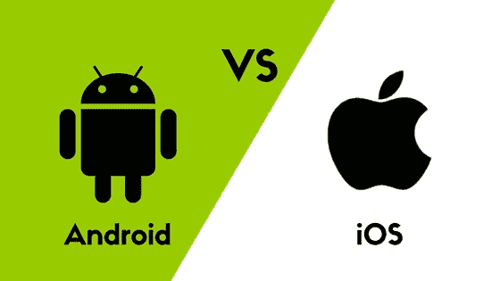

# 做一个手机 app 要多少钱？

> 原文：<https://medium.com/hackernoon/how-much-does-it-cost-to-make-an-mobile-app-7343dbd99f68>

How much does it cost to make an Mobile app?

无论是[点餐](https://hackernoon.com/how-to-build-a-food-ordering-app-an-ultimate-guide-on-food-ordering-mobile-app-c19441826aca)、预订航班、[与朋友聊天](https://www.engineerbabu.com/blog/create-chat-apps-for-android/)还是预订出租车，你想到的唯一一件事就是你的智能手机。

世界其他地方也是如此。

[移动应用](https://www.engineerbabu.com/blog/top-ten-mobile-app-development-companies-india-2/)已经成为占领快速移动化的巨大市场的当务之急。

开发移动应用是企业新的赚钱手段。

[图像来源](https://www.otssolutions.com/blog/why-mobile-app-development-is-going-micro/)

这给我们带来了一个关键问题:开发一个移动应用程序要花多少钱？

这个问题没有单一的答案。

很多因素，包括制作应用程序的平台、应用程序的复杂性、开发团队的经验以及其他一些因素。

迷茫？那么首先我们来了解一下影响 app 开发成本的变量。

# **商业模式:**

为您的企业开发应用程序的旅程始于业务和创收计划的核心。收入或商业模式是开发应用程序成本背后的最大驱动力。

这里有几点需要考虑:

您的目标客户首选的平台

你试图销售的产品

需要集成以使应用程序响应的设备

免费应用或付费应用

应用内购买

视觉设计在应用程序界面中的作用

广告——第三方或您自己产品的广告

这些因素和许多其他因素在开发移动应用程序所需的成本和时间方面起着非常重要的作用。

例如，货币化战略起着非常重要的作用。付费应用比需要整合应用内购买的应用更容易开发。

一个电子商务应用程序需要更多的时间和成本。

# **你的客户在哪里？**

你的商业模式最重要的部分是了解你的客户。很容易忽略客户的需求。

简而言之，你通过应用程序解决了什么问题？问题的答案有助于确定目标受众，或者如加里·哈尔伯特所说，你的“饥饿人群”。

[图像来源](https://blog.payjunction.com/customer-relationships-tips/)

即使是最大的创业公司也犯过类似的错误。

例如，Snapdeal 未能赢得其客户的信任，因为它在质量和数量上做出了妥协。

它在电子市场也失败了，特别是因为亚马逊和 Flipkart 通过推出独家智能手机获得了巨大的市场吸引力。

结果，它的市场份额在一年内从四分之一下降到 4%。

如果没有真正的饥饿，你不会从一个应用程序中赚到一分钱。找到市场了？现在我们来确定货币化策略。

# **付费应用、免费应用还是电子商务？**

[电子商务](https://www.engineerbabu.com/blog/ecommerce-app-development-guide/)是基于市场的收入模式，主要是销售自己的产品或从应用程序上列出的卖家那里赚取佣金。

付费应用通过下载获得前期收入。

产生收入甚至支付开发应用程序的成本的能力很大程度上取决于应用程序的下载次数。

android market 和 app store 上有几款付费应用，价格从 1 美元到 25 美元不等。

因此，设定正确的价格决定了你可能持有的股票。

重要的是要考虑你的客户是否愿意为你的应用付费，并进行竞争分析。

免费应用可以从应用商店免费下载，但有不同的创收模式。现在，一个免费的应用程序如何赚钱？

# **这里有几个:**

免费应用是扩大现有客户群或建立用户群的好方法，你可以在以后向他们销售。

这些应用程序还在您和您的客户之间建立了一种基于信任的关系，有助于提升现有产品的价值。

广告和联盟营销可以产生直接收入

应用内购买也是一种直接的收入来源，尤其是对容易上瘾的游戏而言。

一个确定的模式取决于你的目标和你的客户偏好，在任何情况下，一个移动应用程序都可以获得很高的利润。

# **应用类型:**

手机 app，通俗地说就是专门为编程而开发的软件程序，特别是在移动设备和平板电脑上。

从本质上来说，它可以执行与你的网站相同的任务，但是这个过程会变得更加高效和用户友好。

因此，“易用性”是应用程序的一个重要前提。

[图像来源](https://www.360technosoft.com/blog/types-of-mobile-application-to-develop-for-business)

现在，所有的应用程序都一样吗？

肯定不是。有三种类型的移动应用程序— Web、本地和混合。让我们来看看每一种类型的发展过程。

# **1。网络应用:**

几项调查发现确凿的证据表明，超过 80%的智能手机用户更喜欢应用程序而不是移动网站。网络应用是为手机用户优化的网站。

# **2。原生应用:**

原生应用是一种为特定操作系统(Android 或 IOS)开发的移动应用，可以从苹果商店或谷歌 play 商店下载。

原生应用更复杂，但提供了无与伦比的用户体验。

它们必须为 Android 和 IOS 平台分别开发，并需要获得批准才能上市。

# **3。混合应用:**

一个相对简单的应用程序开发，混合应用程序功能单一的编程语言，可以在两个平台上工作。

它们通常像本地应用一样运行，更易于开发和管理。但是，原生应用上的用户体验更好。

# **平台:**

既然已经打好了基础，就该想想用什么平台了。

该应用程序可以跨多个平台访问，如 IOS、Android、Windows 和 Web 或所有平台。这个问题的答案取决于客户在哪里。

Android 和苹果 IOS 有着明显不同的界面和系统，因此为这些平台开发的应用程序肯定是不同的。

Android vs IOS 不是一个容易的选择。如果口袋允许的话，建议两个都去。

知道必须为各自的平台开发两个不同的应用程序，成本也会相应地降低。

[图像来源](https://en.yeeply.com/blog/creating-apps-differences-android-ios/)

如果必须做出选择，这里有一个 IOS 与 Android 的对比总结:

# **IOS 应用—优点:**

IOS 应用程序的构建速度更快，成本通常低于 android 应用程序。

苹果 IOS 拥有更多消费群体；所以，一个付费的 app 更有可能已经在 IOS 上下载了。

IOS 用户一般会坚持使用 IOS 设备，升级也是集成的。

App store 有严格的指导方针，确保应用程序的质量。同一业务的 IOS 应用比 Android 应用表现更好。

IOS 作为一个平台更吸引人，更容易使用，软件故障更少。

# **安卓应用——优点:**

安卓用户数量大大超过苹果用户数量，尤其是在亚洲。因此，基于 Android 平台的应用将获得更多的响应。

与 Android 相比，IOS 的每次下载成本较高。

这些应用不需要像 IOS 那样定期更新。这降低了 android 应用程序的维护成本。

在 Android market 上开发和托管应用程序的成本更低，也更容易，因为指导方针不像 IOS 那样严格。

# [**IOS 应用**](https://www.engineerbabu.com/blog/ios-app-development-future/) **—缺点:**

IOS 应用在 App Store 上的托管成本更高，接近 200 美元，而在 Play store 上为 25 美元。

来自 App store 的批准可能会变得繁琐，因为指导方针非常严格。

在亚太地区，Android 用户数量更多。

# [**安卓应用**](https://www.engineerbabu.com/blog/hire-mobile-app-developers/)**——缺点:**

安卓用户更有可能挥霍无度，付费应用的表现可能不如苹果商店。

android 应用需要满足各种不同尺寸、屏幕分辨率和性能的设备。

Android 应用程序需要更长的开发时间。

在这两者之间做出选择很大程度上取决于你的目标客户和他们的行为。

例如，如果你的目标客户在印度或中国，开发一个 android 应用程序是有意义的，因为它拥有庞大的客户群。

但是，另一方面，如果你的目标是同一个国家的富裕阶层，IOS 应用将是一个更好的选择。

# **App 的功能:**

随着移动应用程序变得越来越先进，一个应用程序可以做的事情几乎没有限制。

因此，成本可以从几百美元开始，飙升到几千美元以上。考虑以下类型的应用程序:

**列表应用** —该应用是网站的移动优化版本，通常会列出各种类别的所有信息。开发起来很简单，不会花很多钱。

**动态应用** —例如，基于脸书的应用需要连接到服务器，以从应用中收集信息。

这些应用程序通过 API 与其他平台和应用程序协同工作。这种应用程序及其 API 的复杂性会导致成本方面的巨大差异。

**游戏**——有最复杂的应用程序需要开发，也可能是最昂贵的。随着使用人工智能的复杂游戏越来越受欢迎，3D 环境和先进的物理学肯定会花费重磅炸弹。

这三个类别可以广泛地定义应用程序，这些天的应用程序是如此多样，以至于不可能有一个明确的类别来包含它们。

每一个独特的功能都将带来额外的成本。虽然一些看似复杂的功能可能不会花费很多，但集成一个简单的东西可能会改变成本。

# **应用中的功能:**

当你决定了你的应用应该做什么——这是基本的功能，那么需要做的特性就会发挥作用。

让我们看一个像脸书这样的示例应用程序。脸书有什么特色？

[图像来源](http://www.buzinga.com.au/buzz/product-death-cycle/)

1.**登录** —下载后的 app 要求通过邮件或电话号码登录，大部分 app 都会有这个功能。这可以是相同的脸书使用电子邮件 id 或电话号码或社会登录。大多数应用程序使用脸书登录来方便用户。

2.**个人资料**——脸书要求提供社交应用的详细个人资料。应用程序可以整合来自脸书的数据来创建用户的个人资料。

3.**推送通知**——这让用户了解应用程序的最新动态。

4.聊天机器人(Chatbots)—这是一种用户友好的、流行的创造销售线索和转化销售的新方式。从用户的角度来看，聊天机器人是交互式的，更有吸引力。

5.**社交整合** —整合社交媒体平台使应用程序更容易使用，更有价值。

6.**地理定位** —对于某些应用程序，地理标记可能是一项重要功能。例如，像优步这样的应用完全基于地理位置。

7.**支付** —对于一个电商 app 来说，这是最重要的需求之一。即使是整合了应用内购买的应用，也需要一个支付系统来完成购买。

所有这些和其他特定于应用程序的功能都需要时间，进而需要更多的开发成本。

因此，应用程序的成本将在很大程度上取决于应用程序无缝运行所需的功能。

# **视觉设计和用户界面/UX:**

无论是约会、新车还是 app 的虚拟设计，第一印象都很重要。做一个好的！

应用程序的第一个外观可以是一个制造商或交易破坏者。应用程序市场竞争激烈，所有公司都想迅速进入商店，这有点道理。

然而，设计是创新和颠覆性应用的重要元素，这一点经常被忽视。

好的设计的重要性超越了应用程序的外观，而是体验。

统计数据显示，促进优秀设计的公司享有 1.5 倍的市场份额。

[图像来源](https://www.techprevue.com/mobile-app-ux-ui-design-facts/)

那么，什么能概括一个好的设计呢？

考虑以下几点很重要:

创新并与新兴技术同步发展

强调产品及其实用性

美学上非常出色

易于理解和使用

有目的

坚固耐用

简单——听过的越少越好！

在所有设备和平台上保持一致

伟大的设计是有代价的。你会注意到 200 美元的设计师和 2000 美元的设计师在设计上的严重差异，为了让一个应用程序看起来很棒，花几美元钞票是一种投资，而不是成本。

平面设计的确重要，用户体验就是一切。您的应用程序如何执行其功能以及导航的难易程度将取决于 UX 的开发。

一个很难理解的杂乱的应用程序将很快被卸载。

伟大的应用程序设计师可以让你的应用程序看起来非常好，以至于用户不想放下他们的手机。点击这里查看我们的投资组合。

# **开发**

你开发的平台是什么，商业模式是什么，你想要什么特性，功能是什么，这些都是决定你成本的重要因素。

还有另一个决定因素——你雇佣谁！

虽然雇佣自由职业者和新人的选择现在看起来是一样的，但从长远来看，这可能会让你付出更多。

自由职业者是个人开发者，他们可能熟练，也可能不熟练，这取决于他们的经验和曝光率。

虽然有很多自由职业者，但他们的技能和一致性可能是一个巨大的问号。

自由职业者可能没有完整的技能来开发应用程序，你可能需要雇用 1 个以上。即使这样，你也可能最终得到一个平庸的应用。

自由职业者是开发应用程序的保守选择，但你的项目也有被推迟或根本无法交付的风险。

小型和新的机构充当自由职业者和经验丰富的团队之间的中间地带。他们的费用比自由职业者高，但通常会更加稳定和熟练。

他们通常是一个由 3-10 名开发人员组成的团队，开发特定的标准应用程序。尽管小团队可能无法开发哪怕是稍微复杂的应用程序。

[图片来源](https://gigster.com/blog/how-to-manage-developers-when-youre-a-non-tech-founder/)

经验丰富的开发人员组成的大团队的成本高于自由职业者和小公司。

然而，他们带来了他们的经验和保证。通常，这样的团队更有能力解决你的需求和理解商业模式。

回顾团队过去所做的工作也很重要。

# **法律&执照**

虽然你可能认为开发一个应用程序将是最后的成本决定因素，但有一些成本可能不是直接的，但通常是重要的。

你在应用程序中的知识产权是有价值的，应该受到保护。

版权、专利和商标可以做到这一点。如果你的应用程序上的信息是你的知识产权，申请专利是很重要的，这样可以防止人们从中获利。

商标保护名称。如果你有一个突出的名字，就值得注册。版权保护你的视觉和文字内容不被剽窃。

一些应用程序是基于模板开发的，必须获得使用许可。要在 Android store 或苹果的 App store 上部署应用程序，必须购买许可证。

授权服务是一种安全的方式来控制对您的应用程序的访问并保护它。

# **支持和维护:**

[图片来源](https://www.tenable.com/support/technical-support)

管理更新、API、用户资料和数据甚至监控客户的技术支持是应用功能的重要组成部分。

在适当的支持下，该应用程序将无法完成其开发目的。

新功能会让你付出代价。大约 20%的总成本将用于增强现有功能和完善应用程序。

这是一个持续的过程，随着技术的每一次变化，都需要新的更新来使您的应用程序无摩擦。

# **总投资:**

应用程序开发的时间和成本将在很大程度上取决于应用程序的复杂性。由于众多的主观决定因素，很难确定你的应用程序的成本。虽然这里有一些平均成本，以帮助你得到一个想法。

一个没有后端数据库、API 功能或社交媒体集成的基本应用程序的价格在 2000 美元至 10000 美元之间。在美国，它可能花费 8000 美元左右，然而，在印度，同样的应用程序的开发成本可能是一半。

时间可能从 1 到 3 个月不等，可以由新的开发人员完成，因为他们很容易开发。

中等复杂程度的成本在 1 万到 4 万美元之间。根据平台和应用开发所在的国家，费用可能会有所不同。

同一个应用程序在印度开发的价格可能是美国的一半，而且不影响技术。开发这样一个应用程序需要三到六个月的时间。

由于 API、社交媒体集成、后端支持和复杂的功能，一个复杂的应用程序需要有经验的开发人员来完成。

这类应用程序的开发成本会更高，一般在 4 万至 8 万美元左右。在美国，同样的应用程序的安卓版本价格可能超过 10 万澳元。在印度，这可能要花费 3.5 万美元。

[图像来源](https://www.hyperlinkinfosystem.com/)

根据 Hyperlink Infosystem 的研究，开发一个应用程序的平均时间是 8 周，即 320 个计费小时。

一个简单的应用程序在印度售价 4800 美元，而在美国售价 48000 美元。

一台复杂的机器在印度可能要 38000 美元，在美国可能要 250000 美元。许多应用程序开发项目因此外包给印度。

应用背后的核心开发包括以下内容:

团队成员
职责
小时成本
。$35 项目经理与团队和客户沟通以避免差距，并检查最后期限
。20 美元以上的开发者:通过编写代码开发应用程序并修复漏洞
。25 美元以上的后端开发人员:确保服务器和数据库之间有效和不间断的通信，以确保应用程序的正常运行
。20 美元以上的设计师负责应用程序的外观和用户友好的应用程序。
。15 美元以上的测试人员确保应用程序按照要求运行。

显而易见，平均成本可能不足以解决问题。你的应用程序将有明显不同的功能和特性，有一些一致的定价方法。

你也可以通过阅读评论和其他顾客支付的价格来了解价格的更多细节[https://clutch.co/profile/engineerbabu#reviews](https://clutch.co/profile/engineerbabu#reviews)

— — — — — — — — — — — — — — — — — — — — — — — — — — -

# 阅读我的其他 Hackernoon 文章

1.[我的非科技女联合创始人是如何为顶尖创业公司打造 45 位 CTO 的！](https://hackernoon.com/how-my-non-tech-female-cofounder-built-45-ctos-for-top-notch-startups-12a9a9a31167)
2。[如何搭建一个交友 App？约会手机 App](https://hackernoon.com/how-to-build-a-dating-app-an-ultimate-guide-on-dating-mobile-app-aaa6964cb7f1)
3 终极指南。[如何聘请到合适的设计师或开发人员](https://hackernoon.com/how-to-hire-a-right-designer-or-developer-d4f24d78e2e1)
4。[如何搭建一个订餐 App？手机点餐 App](https://hackernoon.com/how-to-build-a-food-ordering-app-an-ultimate-guide-on-food-ordering-mobile-app-c19441826aca)
5 终极指南。[Mayank Pratap 如何建立 engineer Babu——一家盈利的 IT 服务公司](https://hackernoon.com/how-mayank-pratap-built-engineerbabu-a-profitable-it-service-company-generating-more-than-50-000-per-month-bcd3006bdbb5)

*我是 Mayank，*[*engineer Babu*](https://www.engineerbabu.com/)*的联合创始人。请随时联系我，联系方式是*[*Linkedin*](https://www.linkedin.com/in/mayankpratap/)*| mayank@engineerbabu.com* 此外 [EngineerBabu](https://www.engineerbabu.com/) 帮助初创公司、企业和所有者通过构建高级 IT 解决方案来发展业务。他们开发的项目 95%都按时完成了。 [30+由风投](https://www.engineerbabu.com/casestudies)资助，获得最具创新总理设计奖，入选 Y-Combinator 2016 & 2017。