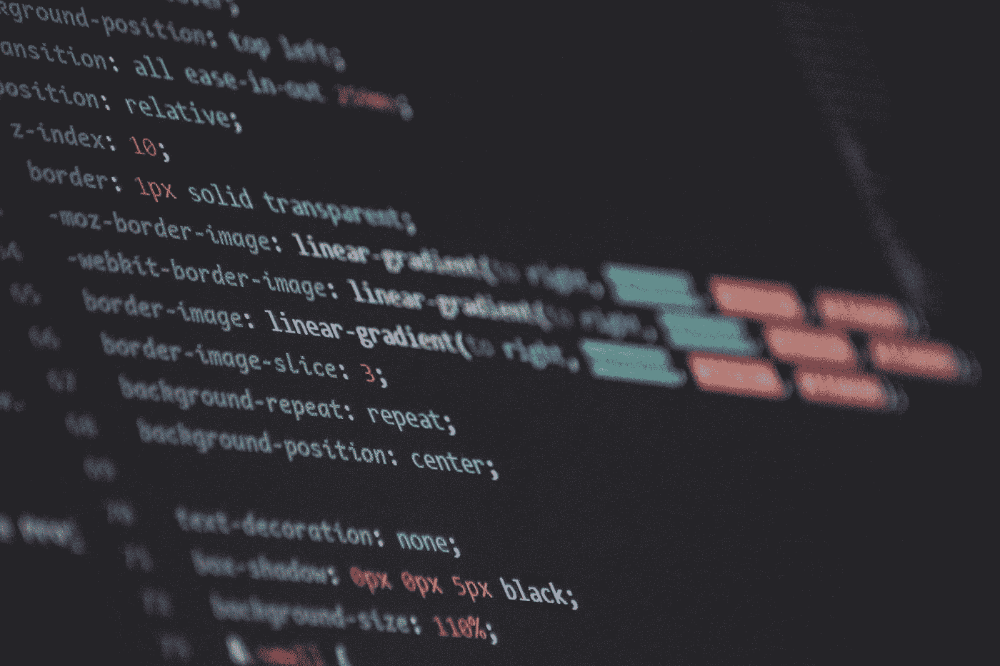

# 做一个完整的开发者应该了解多少 HTML 和 CSS？

> 原文：<https://medium.com/hackernoon/how-much-html-and-css-should-you-know-to-develop-4456e2ca8595>

在学习 web 开发和编程之前，每当我看到制作精美的网站时，我总是心存敬畏。

我喜欢阅读文章，网络是我获取当代信息的主要来源。

因此，我接触到了大量令人敬畏的页面，它们不仅看起来很棒，而且为浏览者提供了合理的功能。它激起了我的一个愿望，希望有一天能够以一种让任何人都惊叹的方式向世界展示信息。

Image by [Caleb Dow](https://unsplash.com/@calebscamera?utm_medium=referral&utm_campaign=photographer-credit&utm_content=creditBadge) on Unsplash

作为一名内容创作者，我开始使用 Blogger，写关于金融教育和创业的文章。

在那个时代，Blogger 在定制网站外观方面没有太多的余地。我开始修改并找到了一些教程，教我如何调整博客主题的 CSS 文件。

这时我意识到我需要学习 HTML 和 CSS。

直到我最终接受了这样一个事实，即编辑几行 CSS 代码永远不能让我完全控制我正在制作的网站的外观和功能，我才开始学习。

现在，五年多过去了，我已经知道如何从头开始创建一个网站，甚至把基本的功能放进去。

见鬼，我现在甚至可以编写一个基本博客应用程序的前端和后端代码，甚至可以用 ReactJS 构建一个 T2 电视剧应用程序。

不管我现在的技能有多高级，我都不能否认学习 HTML 和 CSS 是我的基础这个事实。

我理解人们渴望从一门真正的编程语言开始，比如 Ruby、JavaScript 或 Python。但是要构建一个完整的东西，至少对于 web 来说，开发人员应该有不错的 HTML 和 CSS 技能。

然而，web 开发人员不需要成为这方面的专家。

# 做开发者需要那么多 HTML/CSS 吗？

我最初想做一个完整的列表，列出所有的 HTML 标签和 CSS 选择器/属性。然后我意识到我可以引导读者找到更多有用的资源。

然后我会给出一些高层次的建议，以强调 web 开发人员不需要具备李小龙级别的能力就能成为 HTML/CSS 忍者。

要构建一个站点，你只需要使用常见的 HTML 标签，比如:**标题** (h1-h6)、**链接** ( < a >)、**图片** ( < img >)、**无序列表** ( < ul >内有< li >)、 **divs** 和 **spans。**

除此之外还有这些 [**HTML5 语义标签**](https://www.bitdegree.org/learn/html5-semantic-tags/) <表头>、<导航>、<主>、<小节>、<旁注>、<文章>和<页脚>。

在某些情况下还需要很多其他的标签，但是我只包括了那些常用的标签。

对于 CSS，你只需要学习如何**样式文本**(字体属性)**链接**(主要是文本装饰)**调整元素的尺寸和位置**(宽度、边距、填充、浮动、位置)和**样式背景**(背景图像和背景颜色)。

CSS 过渡和动画现在在大多数网站中也无处不在，所以有必要学习它们。

**这里是学习 HTML 和 CSS 的简单但很棒的教程的链接:**

1.  [学习 HTML5](https://www.tutorialrepublic.com/html-tutorial/)
2.  [学习 CSS3](https://www.tutorialrepublic.com/html-tutorial/)
3.  [响应式网页设计](https://learn.shayhowe.com/advanced-html-css/responsive-web-design/)

Image by [Maik Jonietz](https://unsplash.com/@der_maik_) on Unsplash

# 框架和库给了我们 CSS 超能力

如今，我们很幸运拥有工具、库和框架，让我们构建网站的标记和风格变得更加简单和容易。

以前，在 CSS 中完全使用浮动和位置属性来完善页面布局是很困难的。

但是现在我们有了 **FlexBox** 和 **CSS 网格**。拥有这两方面的基本技能将会让你制作出令人难以置信的网页。

除此之外，我们还有提供现成样式的库，如[引导库](https://getbootstrap.com/)、[基础库](https://foundation.zurb.com/)和[语义用户界面](https://semantic-ui.com/)。

我们只需要链接到他们的 CSS 文件(和 JavaScript/jQuery 库)，理解他们的类和网格系统，瞧，你就可以构建看起来很棒的站点。

## 在享受乐趣的同时学习 Flexbox 和 CSS 网格

1.  [Flexbox Froggy](https://flexboxfroggy.com/) —通过游戏学习 Flexbox
2.  [Scrimba 上的 Flexbox 教程](https://scrimba.com/g/gflexbox)
3.  [网格花园](http://cssgridgarden.com/) —通过游戏学习 CSS 网格
4.  [Scrimba 上的 CSS 网格教程](https://scrimba.com/g/gR8PTE)

唉，似乎以上还不够，我们现在有了 CSS 预处理器(即， [SASS](http://sass-lang.com/) ， [LESS](http://lesscss.org/) )。

它们有什么用？

如果你以前做过很多 CSS，你会同意 CSS 代码会变得混乱和难以理解。

这样做的后果是一场噩梦，调试会话会发现 700 多行 CSS 中的哪一部分是罪魁祸首。那些重复的或者多余的选择符会让你的 CSS 变得那么长吗？

我相信 CSS 预处理器的最大价值来自于它如何帮助开发者组织他/她的 CSS 代码。这使得管理具有多个选择器和属性的站点变得容易。

现在，如果你开始 web 开发，你真的渴望开始“实际编程”，那么你会很高兴地知道，有了 CSS 预处理程序，它几乎就像编程一样了。

你可以像使用 JavaScript 或 Ruby 一样使用变量、循环和函数。

SASS Tutorial On YouTube — [click this link for full playlist](https://www.youtube.com/playlist?list=PLUoqTnNH-2XxOt7UsKlTqbfrA2ucGosCR)

# 学习使用 Chrome 开发者工具

有人建立一个网站应该永远，我的意思是永远，忽视使用这个伟大的工具。

火狐也有，但我觉得 Chrome 更容易使用。使用 Chrome 的开发工具，你可以很容易地检查你的网站的 HTML 元素和 CSS 属性，以便修复 bug 或测试你想要加入到你的页面中的新样式，而无需提交到实际的代码中。

# **通过克隆网站快速掌握 HTML/CSS**

开始 web 开发之旅的人必须熟悉 HTML 和 CSS 几个星期(甚至几个月)，然后才能开始学习编程。

但是练习建站最好的方法是什么呢？简单回答—克隆现有站点。

这样做会节省你寻找想法的时间和麻烦。一旦你建立了你要克隆的网站的头部或导航部分，你会有很大的自信。

# **最佳学习方式——与编码伙伴一起**

我开始自学网页开发和编程。

虽然你可以自己学到很多东西，但和别人一起工作还是更好。会有很多次你会被一些错误所困扰，因为你写了很多行代码，而你却找不到。

另一双眼睛会把你从这种痛苦中拯救出来。还需要我说更好玩吗？我自己[目前每天都和一个来自世界另一个地方的编码伙伴一起工作](https://hackernoon.com/how-five-weeks-of-remote-pair-programming-helped-me-build-strong-habits-e0493c9ba780)。

我们克隆了热门公司的主页，包括 Mint.com、T2、苹果、T4、新闻周刊和网络新闻。

一路上我们学到了很多。纪律和一致性对于成为一名高技能的 web 开发人员或软件工程师非常重要。

拥有一个负责任的伴侣有助于培养这两种品质。

## 找到一种结构化的学习方法

如果你想接受高强度的软件工程培训，那就去 Microverse.org 吧。

如果你是第一次编写代码，注册预科课程，你将学习(免费)网络开发和软件工程。

如果你是一个高级学习者(你对一些 JavaScript 或任何其他编程语言都很熟悉)，那么我会推荐快速通道计划(你只有在完成该计划并找到一份远程软件工程工作后才会付费)。

**在[**Twitter**](https://twitter.com/coachryanv)|[**Github**](https://github.com/rvvergara)上关注我**