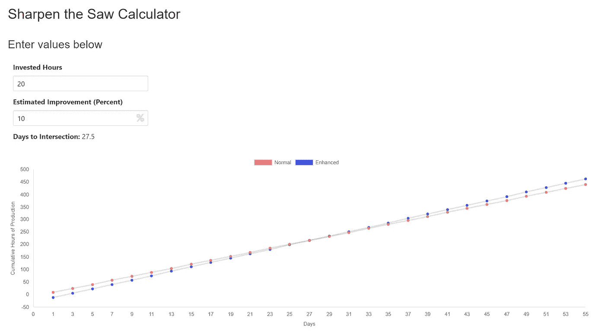

# 你应该在训练上投入多少时间？

> 原文：<https://medium.com/hackernoon/how-much-time-should-you-invest-in-training-db4fe5159ca7>

## 训练、纪律和自动化的分析方法。

> “给我六个小时砍树，我会用前四个小时磨利斧头。”
> - [其实不是亚伯拉罕·林肯](https://quoteinvestigator.com/2014/03/29/sharp-axe/)

这句话几乎已经成为陈词滥调，但我经常看到，总的来说，它的信息被忽视了。

我正在设计一个框架来帮助决定*T4 培训是否值得，以及在*什么时候*值得。*

# 客观正确

在斯蒂芬·科维的高效人士的 7 个习惯中，最后一个习惯是“磨利锯子”。虽然这个概念的范围比我所描述的要大，但它展示了让自己保持敏锐的方法的重要性以及这样做的好处。

我的意图是让持续学习和改进成为客观正确的选择，而不是主观模糊的选择。

# **场景**

*上下文:* *这些例子和问题取自个人经验，主要是在创业领域和更具体的编码领域进行研究，但它们适用于任何可以测量的领域。*

1.  你想上一门新课程。估计要 20 个小时。你估计这会给你的编码速度带来 10%的提高。什么时候值得？
2.  你每天花两个小时回复邮件。有没有办法完全去掉这个过程或者训练别人替你做？假设您将花费 20 个小时来自动化或委托培训。
3.  谷歌 AdWords 培训课程是 20 小时的视频，估计总培训时间为 50 小时。研究表明，培训通常会导致广告收入增加 100%。

# 房间里的大象:误差幅度

我想承认，在我给出的每一个例子中,“改进”都是估计或猜测的。

改进永远不可能那么精确，但你可以衡量。

您可以找到与您的绩效相关的指标，并测量其随时间的变化。如果你正在管理一个团队，你可以做一个对照研究(即把 30 个人分成两组，每组 15 人，其中一半去参加一个会议)。为了让计算器有价值(见下文)，你要么需要测量结果 ***要么*** 承认其他变量会干扰结果。

# 计算器

我创造了一个计算器，让它很容易看到什么时候有回报。假设每天 8 小时。

[磨利锯计算器](https://kerryjones.github.io/sharpen-the-saw/)

上面的第一个例子，图表显示:

在这个例子中，在你投资的时间得到回报之前需要 27.5 天。*你获利后的每一天。*理论上，永远。

# 错误的结论；或者，哪里出了问题

“我应该把所有时间都花在学习上。”这就是学校存在的意义。现在，你可能有最后期限。在上面的例子中，如果你有 15 天的时间来完成一个项目，而这个项目所依赖的课程在你收支平衡并越过那条线之前花费了 27.5 分，*它就不会起作用*。

# 公制中的选择

你正在改善的东西有影响吗？

如果我能把打字速度从 120 WPM 提高到 150 WPM(提高 25%！)一门 50 小时的课程，我需要 31 天才能“收回”我投入的时间。我认为，除了在极少数情况下，这不会产生重要的变化。

# 帕累托原则(80/20 法则)

[帕累托法则](https://betterexplained.com/articles/understanding-the-pareto-principle-the-8020-rule/)极大地放大了这一规则。以上述场景之一 Google Adwords 为例，考虑以下情况:

*   最有可能的是，你成功开展营销活动所需的大部分内容都在课程的前 20%中(10 个小时而不是 50 个小时)
*   你得到 80%的原始收益(100%中的 80%)
*   现在只需 2.9 天就能获得最大收益(而不是以前的 12.5 天)

# 摘要

框架如下:

1.  计算所需/要求的小时数
2.  选择有影响力的指标
3.  估计将获得的改进百分比
4.  [计算交集](https://kerryjones.github.io/sharpen-the-saw/)
5.  将交叉点与任何截止日期进行比较，然后**客观地决定**的行动路线

这是我的框架，用来决定当我需要委派任务时，员工应该参加哪些研讨会，或者*我需要花多少*时间给新工具或实验一个“真实镜头”。

希望对你有用。

# 如果你快乐并且你知道它…

如果你喜欢这篇文章，并且觉得它很有用，请告诉我，并在下面*鼓掌*或写评论！我很乐意进一步阐述你可能有的任何问题。

[Kerry Jones](/@kerryjones12) 是创始人兼首席技术官，最近被授予福布斯 30 位 30 岁以下成就。我对一切创业都充满热情，从文化优先的环境到技术堆栈和范例的利弊。在 LinkedIn 上和我联系，或者在 Twitter 上和我打招呼。