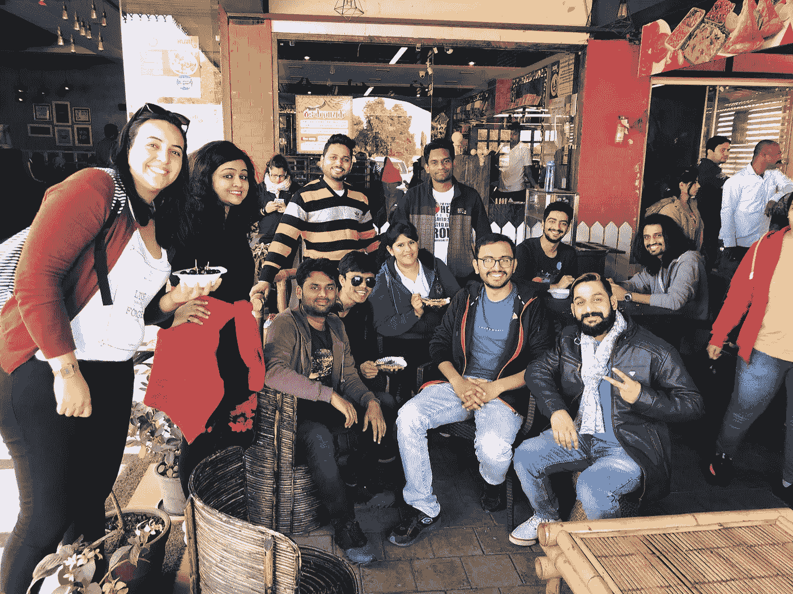

# 我的非技术女联合创始人是如何为顶尖创业公司打造 45 位 CTO 的！

> 原文：<https://medium.com/hackernoon/how-my-non-tech-female-cofounder-built-45-ctos-for-top-notch-startups-12a9a9a31167>

今天，她获得了她最喜欢的宝莱坞演员颁发的女性荣誉奖。她已经跻身印度十大女企业家之列。她的成功是她努力工作和坚持不懈的结果，通过许多背景障碍，她一步步走到了顶端。

**在 LinkedIn 上添加联合创始人标签很容易，证明这一点却很难**。作为首席执行官，你必须做出一些大胆的决定，你别无选择。

[**Aditi Chaurasia**](https://yourstory.com/2015/07/aditi-chaurasia-2/)**:engineer Babu****联合创始人兼 CEO**[**。**](https://hackernoon.com/how-mayank-pratap-built-engineerbabu-a-profitable-it-service-company-generating-more-than-50-000-per-month-bcd3006bdbb5)

她做出了一些明智的决定，帮助我们走到了今天。

# 1.你应该选择你的客户，而不是相反！

这个想法是，人们确实了解他们的业务领域和市场，但技术可能不是他们的强项。最终，大多数人都雇佣了错误的人。

Aditi 做了一个决定，头两年我们只和初创公司合作。

我问她为什么，因为每个人都期待为企业工作，我们可以用它赚更多的钱。

她回答道:“我们将帮助企业家建立他们的 MVP，并学习如何成功创业。最初，我们可能赚不了多少钱，但我们肯定会从这些创业公司的创始人那里学到很多东西。一旦这些产品中的一个成功了，我们就可以轰轰烈烈地进入市场。”

她在四年前做出了这个决定，今天，我们生产的 30 多种产品已经获得了他们想要的投资。其中两人在 2016 年和 2017 年被 Y-Combinator 选中。我们已经建立了我们的名字，其中许多企业现在是 500 多人的企业。

与企业家合作并不容易。他们没有多少钱；他们带着的只是梦想和希望。他们中的大多数人将辛苦赚来的积蓄投入到产品中，因为他们通常会在别人手下工作时感到沮丧，并决定走自己的路，建立自己的公司。

他们通常不寻找技术合作伙伴；他们在找一个朋友。一个能够倾听他们的想法、了解市场、帮助他们制造伟大产品并实现梦想的人。

# 2.投资是破产的第一步。

> 拿投资类似于对抗疗法。一旦你拿走了，你就会再次需要它。

许多创业公司失败是因为他们得到的投资。

任何人都可以烧投资者的钱，但需要坚实的产品或服务来赚取客户的钱。

当其他所有的创业公司都获得了资助时，资助开始被视为成功。如果你不是一个受资助的创业公司，人们会看不起你。

Aditi 解释说，我们将从第一天起就保持自举和盈利。我们将从顾客的钱中赚钱。

两年来，我们已经是一家靠自己创业并盈利的初创公司，但为了扩大规模，我决定投资。

我们收到了 10 万美元的资金，并使用了它。

但很快，我意识到，这是我们的第一个重大错误。

我们无法符合商业道德。我不知道该怎么办，这是我的错误决定。我别无选择，我想放弃。我有生以来第一次哭了。我不能因为外界有人认为我的员工没有能力，就解雇他们。

她接了个电话，和我们的投资人谈了谈-

# *“老板这是我的公司，我知道怎么做生意。请保守你的忠告；我们会退还你的钱”。*

接下来的几个月对我们来说是一段非常艰难的时期，因为我们已经计划好了我们的开支，以保持这笔投资的前景。现在，我们不得不把它从我们的业务中拿出来，唯一的办法就是从顾客那里拿钱。

她与团队交流，分享她的决定；为了我们所有人更美好的未来。

*“我们将面临一些问题，可能无法支付你们的薪水。如果你愿意，你可以和我们在一起；如果你愿意，你可以离开”。*

CrazyEngineer’s featured us for working 100 hours a week.

这是一个艰难的决定，但我们别无选择。团队做出了选择，令人惊讶的是，但并不意外的是，每个人都留了下来。

我们也承诺更加努力工作；最后 6 个月是收入最高的月份。这就是一个好团队的力量，他们相信你的梦想。

# 3.信任和承诺文化:

当我们开始的时候，没有人准备加入我们。当然，优秀的人在寻找高薪工作，这是我们最初无法提供的，因为我们甚至连生存都很困难。

Aditi 根据员工的态度决定雇佣他们。她说我们可以训练他们的技能，但态度是教不出来的；那是内在的。

我们雇佣的第一个人是 [*穆克什*](https://www.linkedin.com/in/mukesh-patidar-6811599a) ，一个文学学士毕业生，一个非技术人员，已婚。他绝对不想在某人的办公室里做报酬最低的工作。

他来找我们是为了一个学习 Android 的机会。我告诉他我会给他机会。

他问我“如果我学不会，你会离开我吗”？

我告诉他*“我不会离开你，直到你学会。”*

对于一个不懂 C、C++或 Java 的非技术人员来说，学习 Android 是相当大胆和雄心勃勃的一步。那时候，Android 是一项非常新的技术。互联网上只有一些教程。以前我们运行模拟器时，笔记本电脑会挂起。今天， *Mukesh* 作为一名高级 Android 开发人员与我们一起工作。他已经免费培训了 50 多名 Android 技术学生。

*Parth，*当时是一名游戏设计师，现在领导着应用程序设计团队。

*希夫拉姆*曾经在一家黄金公司做 Photoshop，现在做漂亮的网站。

健身房教练 Sharad 设计了我们可爱的网站。

Parth, Shivram & Team

*Pavan，* Java 专家，问我“ *Bhaiya，我想和你一起工作*”。
我们不是在研究 Java 技术。我告诉他，我们有一个 PHP 开发人员的职位可以提供给他做实习生。我们需要有人来制作 API。他现在领导 PHP 团队，是 Angular 和 Node 方面的专家。

## *Raju Bhaiya* - >办公室勤杂工- >客户经理

他的故事被刊登在他想学习和成长的《印度时报》上。如今，他管理公司财务，也管理我的财务。已经三年了，我从来没有登录过我的银行账户，都是他在打理。

你不可能在一天之内创造出一种文化。赢得人民的信任需要时间。

> ***人们不忠于公司，他们忠于人。***

# 4.我们没有一个首席技术官，因为我们有很多！

一旦我们雇佣了我们的团队，对他们进行最新技术的培训就是一个巨大的挑战。

当然，你可以在谷歌上学习任何东西，但是你不会有任何人亲自指导你学习他们的经验。

例如，你在谷歌上学习编码，然后写下这些复杂的代码，当你的应用程序上有 12000 个用户时，这可能会导致问题。现在，没有人会告诉你，一个糟糕的代码会让你的客户 AWS 账单增加 5 倍。

我们如何建立我们的技术团队:*疯狂的想法，你应该自己试试！*

阿迪提又想出了一个好主意。

她说“我们负担不起一个全职首席技术官，但如果我们能负担得起许多首席技术官每人 1 小时的工作呢？”听起来很疯狂，是吧？

我们开始与最好的首席技术官和技术专家交谈。我们要求他们每天指导我们的团队 1 小时。他们必须指导我们的团队管理项目，解决问题，让他们成为更好的技术人员。

# 我们发布了“寻找顶级首席技术官来帮助我们构建伟大的产品，可能是未来的谷歌、Dropbox。”

9/10 同意！现在我们有 10 名首席技术官指导我们的团队。我的团队成员学到了很多知识。

向 CTO 学习帮助他们成为更好的工程师，现在我们有来自顶尖大学 NITs，IITs 的团队，两名外国人也是 Engineerbabu 大家庭的一员

Left : They came from Azerbaijan. Helping us in Marketing & Culture Building

我们的大多数团队成员都是独自完成整个产品的。

最重要的是，他们还帮助我们的企业家客户为他们的产品提供更好的功能建议。我们开发的一些创业产品得到了 Y-Combinator 的资助和选择。

客户雇佣他们自己的团队:我们在雇佣、知识转移、理解代码方面帮助他们。

昨天，其中一家公司雇佣了一个有 7 年经验的人来管理他们的产品和团队。他咨询了我们 6 个月的经验丰富的家伙，关于他如何写和管理 API 文档如此美丽。我们手动操作。

# 一旦树根蔓延开来，你就不能用轻轻的吹气来移动一棵树。但是你可以通过同样的方法从根本上改变一颗种子的落地位置。

阅读我的其他 Hackernoon 文章

1.[如何雇佣一个合适的设计师或开发人员](https://hackernoon.com/how-to-hire-a-right-designer-or-developer-d4f24d78e2e1)
2。[做一个手机 app 要多少钱？](https://hackernoon.com/how-much-does-it-cost-to-make-an-mobile-app-7343dbd99f68)
3。[如何搭建一个交友 App？约会手机 App](https://hackernoon.com/how-to-build-a-dating-app-an-ultimate-guide-on-dating-mobile-app-aaa6964cb7f1)
4 终极指南。[如何搭建一个订餐 App？订餐手机 App](https://hackernoon.com/how-to-build-a-food-ordering-app-an-ultimate-guide-on-food-ordering-mobile-app-c19441826aca)
5 终极指南。[Mayank Pratap 如何建立 engineer Babu——一家盈利的 IT 服务公司](https://hackernoon.com/how-mayank-pratap-built-engineerbabu-a-profitable-it-service-company-generating-more-than-50-000-per-month-bcd3006bdbb5)

*我是马扬克，* [*工程师*](https://www.engineerbabu.com/) *的联合创始人。请随时联系我，联系方式是*[*Linkedin*](https://www.linkedin.com/in/mayankpratap/)*| mayank@engineerbabu.com* 此外 [EngineerBabu](https://www.engineerbabu.com/) 帮助初创公司、企业和所有者通过构建高级 IT 解决方案来发展业务。他们开发的项目 95%都按时完成了。 [30+由风投](https://www.engineerbabu.com/casestudies)资助，获得最具创新总理设计奖，入选 Y-Combinator 2016 & 2017。