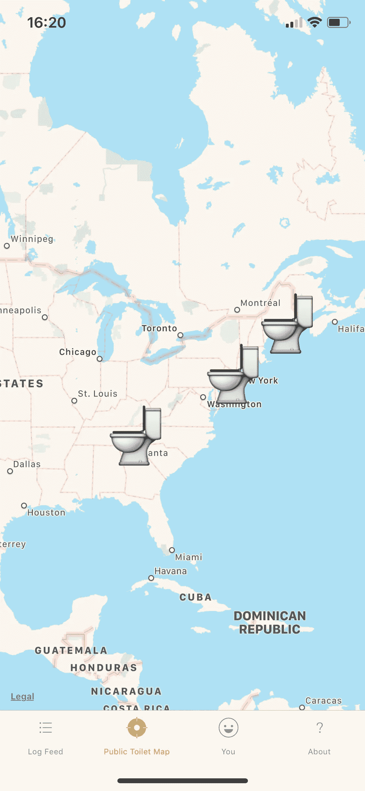

# 我愚蠢的应用程序是如何变成潜在有用的东西的

> 原文：<https://medium.com/hackernoon/how-my-silly-app-turned-into-something-potentially-useful-1c5d7443d3fe>

## 事实证明，实时记录用户在地图上的便便实际上可以帮助每个人。

Dan Edwards — Unsplash

## 背景

大约几年前，我开始研究 React Native 作为一名 web 开发人员，不用掌握多个生态系统和堆栈就能创建原生应用程序的想法是不可思议的。我个人喜欢应用程序——我知道有些人更喜欢网络体验或 pwa 来节省他们设备的存储空间，或者不想下载一次性使用的东西，但我只是发现应用程序往往有更好的用户界面和 UX——好到我很乐意下载它们。

我不想在这里开始一场 web 与本地的战争——它们都很棒，而且一些 web 应用程序肯定比它们的本地对手更好；然而，根据我的经验，应用程序通常更精致。

无论如何，我希望建立某种项目，而不仅仅是待办事项列表或 notes 应用程序；我想要一些技术上更具挑战性的东西，这样我就可以测试 React Native 是否真的可以被公司或现实世界的应用程序所利用。我也开始在 SkyScanner 工作，担任 React 本地工程师，所以我想在开始工作之前获得一些实践经验。

## 履行

介绍登录器:便便跟踪器！

Logger 是一个源于双关语的想法，我不会解释；简短和甜蜜的是，它是一个实时的，GPS 跟踪，利用脸书 oAuth 和谷歌地图记录应用程序。它由 Firebase 提供动力(这是不可思议的，而且在某种程度上是免费的)，而且完全免费。

一个总结是它的应用程序与实时饲料记录每个用户的公共日志。每个日志都有一个相关的星级评定(因为为什么不),每个用户都有一个个人资料页面，他们可以使用它来查看他们的平均星级，他们的昼夜比例以及他们在哪里使用它。

实际实现并不神奇——它记录到 Firebase，并利用 Expos 奇妙的特性库，如 MapView 和脸书 oAuth 来验证、存储和在地图上显示日志。

## 发动

Logger 是一个笑话——它是我的朋友开始制作的，后来他放弃了，所以我想为什么不把它作为我的 React 本地培训的基础。我花了大约 4 个月的时间断断续续地开始和停止——主要是因为一些库没有很好地运行(主要是 React 导航),也因为很难对一个如此愚蠢且毫无用处的项目保持积极性。

事情是这样的，Logger 确实有用途——实际上是多种用途。在我发布它之后，我意识到它实际上在世界各地被使用:美国，亚洲部分地区，欧洲；我甚至没有花任何钱或真正的努力来推广它——口碑、幽默和应用程序商店的魔力已经把它掌握在用户手中。

那时，我意识到众包信息实际上可以用于一些事情…

## 厕所

> 每个人都会大便。甚至有一本关于它的书。

在 Loggers 发布到 App Store 的第二天，我添加了一个新功能，添加了一个新的地图标签，添加了一个日志功能的切换，并利用了我已经建立的平台:“**公共厕所？**”。

通过为用户添加一种方法来标记他们的日志是否在公共场所，我能够映射这些数据，并允许所有用户看到可供使用的当地公共厕所的地图。问题是这些信息都是众包的——这意味着如果人们不使用这款应用，就不会有厕所信息可以分享——这一切都始于用户，也止于用户。

所有的机制都到位了，人们已经把这个应用当成了一个笑话，但是现在他们有了一个真正的理由去使用它。如果有人想知道最近的公共厕所在哪里，或者想添加到数据库中，他们有相应的日志。

我已经使用 **Expo** 构建并发布了我的应用程序二进制文件，这支持了我最喜欢的 React 本地开发部分——将我的二进制文件发布到 CDN。没错，我不需要发布新的应用程序版本，也不需要再次经历苹果的审查过程。点击发布后，我的新版本在几秒钟内就上线了——就像一个网站一样！

## 后续步骤

我是否继续开发 Logger 是基于有多少人实际使用它——如果人们觉得它有用，我会继续支持和维护它。否则，这就是一个有趣的小实验，看看我是否可以用我的 React 技能来构建一个移动应用程序——我可以！

反应原生是美好的。它为 web 开发人员提供了在一个完全不同(有时非常可怕)的原生平台上进行创造和创新的基础，而不必沉浸在 Swift 和 Android 的世界中。如果你以前曾经在 React 中构建过任何东西，并且对如何将它们组合在一起很有信心——我鼓励你尝试一下，它真的没那么糟糕。

这并不是说我已经抛弃了原生开发——相反，React Native 仍然有一些缺点；它不像原生 Swift 那样具有良好的动画效果，它并不总是能很好地与一些库配合，而且如果你使用 Expo，它会产生一个相当大的应用程序。

我实际上计划学习 Swift(这次是正确的)来制作我的第二个 Swift iOS 应用程序，因为这种语言已经脱离了婴儿期。我想我会试着做一些不那么恶心而更有用的东西。

## 立即下载日志程序！

如果你想帮助 Logger 和传播公共厕所的消息，请下载应用程序并报告你的发现！

[点击这里免费下载。](https://itunes.apple.com/us/app/logger-the-poop-tracker/id1378106600?ls=1&mt=8)

也许 Logger 有一些我没有想到的其他用途，如果你能想到什么，请在评论中告诉我！

喜欢我的漫步吗？在 [*twitter*](https://twitter.com/_ChrisGreg) *上关注我，在我的* [*个人网站*](http://chrisgregori.co.uk/) *上了解更多我的开发故事或关注我的附带项目。💻*