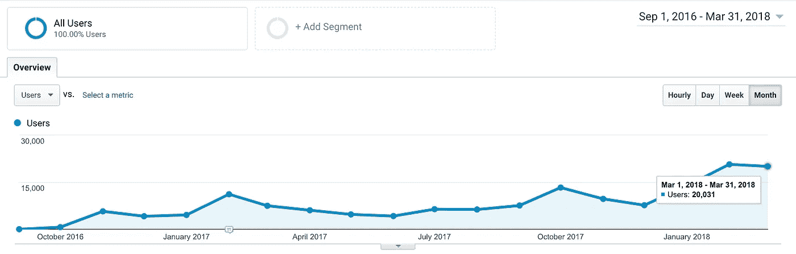

# 我的科技博客是如何在 18 个月内从每月 0 名读者增长到 2 万名读者的

> 原文：<https://medium.com/hackernoon/how-my-tech-blog-went-from-0-to-20000-monthly-readers-within-18-months-79351fd466da>

photo credit: [Alex Knight](https://unsplash.com/photos/j4uuKnN43_M?utm_source=unsplash&utm_medium=referral&utm_content=creditCopyText) | [Unsplash](https://unsplash.com/search/photos/startup?utm_source=unsplash&utm_medium=referral&utm_content=creditCopyText)

## 18 个月前，我创办了 data36.com。这是一个技术博客，我在这里为初学者写入门级的数据科学和分析文章和教程。2018 年 2 月，我达到了期待已久的里程碑:每月 2 万名访客。

当我开始写博客的时候，我决定对一切都完全透明。这篇博文是我朝着这个目标迈出的第一步。我会分享我觉得有趣的每一个细节:

*   我是如何获得我的第一个 100 名读者和第一个 1000 名读者的？
*   写博客每天要花多少时间？
*   我的内容和营销策略是什么？
*   除了全职工作，我是怎么做到的？
*   我是如何克服我的母语不是英语这一事实的？
*   到目前为止，我在博客上花了多少钱？
*   到目前为止，我用博客赚了多少钱？

February 2018— 20,662 visitors; March 2018— 20,031 visitors; April 2018— 21,500 visitors (projected)

***免责声明:*** *我知道，一个月拥有 2 万读者的科技博客并不平凡。但这就是本文的重点:* ***这不是一个平凡的故事*** *。这是每个人都可以做的事情。尽管如此，我看到许多有才华的人在建立自己的博客(和自己的事业)的第一阶段都很挣扎，主要是因为他们不相信自己。他们不相信有人会对阅读他们有价值的想法感兴趣。他们怀疑自己是否能达到每月 1000 读者的里程碑。我能理解他们。从 0 到 1，000 的访客比从 1，000 到 5，000，5，000 到 10，000，或者 10，000 到 20，000 的访客要难得多。*

我写这篇文章是为了激励 0 到 1，000 访问者的人。希望这篇文章能告诉他们，克服最初的(主要是自我怀疑)问题是相当容易的。

# **出发**

建立一个博客非常简单。

你选择一个品牌名称，购买网站域名，租用服务器，建立 Wordpress，选择一个模板，完成。好吧，如果你想拥有自己独特而复杂的网页设计，你可以多花几天或几周的时间来完成这个过程。(不过我不建议这么做。)但如果你只是想开始写作，你可以在一个小时内创建一个博客。稍后，在本文的最后，我将分享我使用的确切工具和服务(以及所有的成本)，但现在我们只能说—技术部分不是主要的挑战。

主要的挑战是写作本身。

*“What should my first article be about?”*

# **第一篇**

问题 1:你的主题应该是什么？对我来说，这很简单:我喜欢数据科学和分析。这是我的工作，这是我 6 年多来每天都在做的事情。不言而喻，我会写下这一点。

好了，数据是主要话题。但还是很宽泛。第二个问题来了:我应该写些什么关于*确切地说是*？帮助我回答这个问题的一件事是，我知道在我的数据科学生涯中，我最享受的是什么。(嗯，除了*在练*数据科学。)它向我的非面向数据的同事、实习生和大三学生解释基础知识。因此，我将话题缩小到初级和入门级数据科学和分析教程。

问题 3: 我的第一篇文章应该是关于什么的？在前两个概念问题之后，这是一个非常具有可操作性的问题。可能这就是最难回答的原因吧。当我开始读 data36.com 时，我也很难回答这个问题。回想起来，我会对自己说:“伙计，开始写你想写的东西吧。尽可能提供更多的价值。如果你的东西好，那就好，如果不好，反正没人会看。”经过几个月的思考，事情就是这样了——我开始写我觉得有趣的各种话题。后来，随着我从读者那里得到更多的反馈，我能够做出更明智的决定，哪些是我的目标受众感兴趣的，哪些是不感兴趣的。我会回来的。但是首先…

# **我的第一个 100 个读者是怎么来的？**

我认为如果你想写博客，最重要的是你必须真正热爱写博客。如果你不这样做，你就会在获得动力之前停下来。回到 2016 年，我决定每周写一篇文章。我坚持了将近一年。(最近我每隔一周切回一篇 ***确实不错的*** 文章。)如果你想让读者关注你的博客，一致性是关键。

1 article per week

如果我不喜欢写博客，我不可能一周写一篇文章。你知道，我正在周五晚上 10 点起草这篇文章。大多数人在聚会前喝第一杯酒，或者看电视，或者只是为了周末放松一下。我在“工作”还是我？即使写博客被认为是“工作”，我觉得它更像是一种爱好。我认为这是我能够坚持下去的一个关键因素。

我也来回答这个问题。我的第一个 100 个读者是怎么来的？我写的第一批 5-10 篇文章平均每周有 10 个人阅读(根据谷歌分析)。但这是有意的。我不想让太多人来我的博客，除非我至少有几篇好文章可以让他们参与进来。我不得不告诉你，这是一个非常痛苦的时期。写了 2 个月的文章，反馈几乎为零，不容易。

然而，当我有了前 10 篇文章后，我想到了一个最糟糕的(也是最常见的)营销点子:我开始将我的文章发布到相关的脸书群组中。当然，我被禁止加入其中的一些群组，而在其余的群组中，我只带来了一些(大约 100-200)的浏览量。但是，嘿，至少我的内容上有 100 双可以给我反馈的眼睛。那时候我需要的就是这些。

# 我是如何获得第一批 1000 名读者的？

我的一篇文章在脸书的一个群里得到了评论。类似于:

*“好文章！谢谢大家！我也在黑客新闻上分享了。”*

谢了伙计。但是黑客新闻到底是什么？我了解到:这是一个有很多访问者的内容分享网站。如果你被投票支持(几率:0.001%)，你会得到很多关注——如果不是，你什么也得不到(几率:99.999%)。

总之，从那时起，我开始在脸书的 ***和*** 黑客新闻上发表我的文章。这成了我的例行公事。我写了一篇文章，然后花了大约 2-3 个小时在不同的论坛上分享。(顺便说一下，我从其他评论者那里了解到了三个更酷的内容分享网站:GrowthHackers、Reddit 和 Datatau。)

你知道，我在 [Data36](https://data36.com/) 上每天的访问量不超过 40-50 次。但我不在乎低数字——这是我心态的一个关键组成部分。当我写一篇新文章时，我总是让自己相信这将是我的重大突破。我没有让自己写平庸的东西，我从来不发表任何东西，直到我觉得这是我能发表的最好的东西。而且即使我知道我的新文章只有几个人看，我还是把它们写得像成千上万的人在看一样。

有一天奇迹发生了！

我的一篇文章在黑客新闻上获得了好评。试着想象一下，当我在博客上写了 3 个月后，在谷歌分析上看到这个消息时，我是多么兴奋:

太疯狂了。有几天了。你要知道:这些事情来得快，去得也快。

但我想这是我知道我不能就此止步的时候！

# **前 1000 名读者之后……**

这个高峰总共给我带来了大约 8000 名新访客。但是一个博客的长期成功并不取决于新访客的数量，而是取决于参与访客的数量。我创建了一个简讯列表(没有“销售线索磁铁”，所以我只有那些因为我文章的初始质量而加入的订户，而不是一次性下载 PDF 电子书的订户)，我每周都给这些人发送我的新文章。我要求反馈。我学习并优化了。最后，我得到了一个人数不多但很棒的核心受众，我可以了解并满足他们的需求。

与此同时，我每周都写新文章，我也在上述论坛上分享我的内容。在 11 月份我的第一个帖子之后，我收到了第二个(来自 Reddit 分享)和第三个(当 O'Reilly Media 将我的文章放在他们的时事通讯上时)，我觉得我走在了正确的道路上。

事情变得越来越快；读者开始在社交媒体上分享我的内容，我从不同的网站获得链接，2017 年 3 月，甚至 O'Reilly Media 也联系我，说他们想与我合作。(这是我的遗愿清单，因为我是奥莱利媒体的超级粉丝。)

我还意识到，这些偶尔出现的价格飙升从长期来看是不可持续的，于是我开始专注于寻找新的营销渠道。我对 SEO 和关键词研究越来越有意识(顺便说一下，这也提高了我的内容质量)。我开始在 Hacker Noon、Crazy Egg、Optimizely 等网站上写客座博客。我不仅在他们的网站上获得了许多读者和一些推荐流量，还获得了高质量的反向链接来提高我的长期域名权威。我也建立了我的社交媒体账户。后来，我慢慢停止在脸书小组、黑客新闻和 Reddit 上发帖。

这就是 18 个月后的我:

a few of the marketing channels

*   简讯列表:2，400 多名订户
*   [推特](https://twitter.com/data36_com):1160 多名关注者
*   [脸书](https://www.facebook.com/data36/) : 660+追随者
*   中等关注者:2 800 多名关注者
*   Youtube : 320 多名用户
*   博客访客:每月 20，000+。
*   博客 SEO 流量:13000+/月

# **我是如何做到这一点的？**

直到去年 9 月，我一直在一家瑞典初创公司做全职数据分析师。所以这是一个非常相关的问题:我是如何在全职工作之外每周写一篇文章的？这没有你想象的那么难。写一篇 2000 字左右的文章(这是我文章的平均长度)对我来说需要 6-8 个小时，所以写博客这件事作为一个不错的业余/周末项目是可行的。鉴于我也有社交生活、家庭和爱好，有时一周找 6-8 个小时并不简单——但必要时，我会在午餐时间写文章，或者在午夜过后睡觉前花几个小时。重点是:除了全职工作，每周写一篇好文章是完全可行的。

不管怎样，去年九月我决定辞职，因为我想把全部精力放在 Data36 上。如今，我花了大部分时间(除了写新文章)为欧洲的技术/创业/数字营销公司创建在线课程和提供入门级的 SQL 和 Python 研讨会。

my new “job”: data workshops around Europe

# 我是如何克服我的母语不是英语这一事实的？

当我开始 Data36 的时候，我并不是英语说得最好的人。幸运的是，我的妻子英语说得比我好，所以在第一年，她审查了我的文章，并删除了所有的大语法错误。(谢谢，亲爱的！；-))

但这并不能改变我们都不是以英语为母语的人的事实，我敢打赌，美国或英国的读者很容易就能看出这一点。但我没有太在意。我的策略是:创造如此有价值的好内容，以弥补不到 100%完美的英语语法和风格。我还认为，在过去的 18 个月里——仅仅通过写数据 36——我的英语已经提高了很多。

现在我已经克服了这个语言问题，我从我的博客中获得了一些收入，我也可以和专业校对人员一起工作了。(你好格里夫，你好埃里克！:-))

# **我的工具和费用**

正如我承诺的，我在这里列出了我在博客上使用的所有在线工具。

**网址:**

*   博客引擎:免费
*   免费
*   域名:dotroll.com——10 美元/年(我知道很多人喜欢[godaddy.com)](https://uk.godaddy.com/)
*   托管服务:[digitalocean.com](https://www.digitalocean.com/)——10 美元/月
*   SSL 证书:[让我们加密](https://letsencrypt.org/) —免费

**营销:**

*   社交渠道:Youtube、Instagram、脸书、Twitter——免费
*   电子邮件营销:[Mailchimp](https://mailchimp.com/)——36 美元/月(目前)

**网络课程平台:**

*   可教的——每月 39 美元

我提到我也在经营[在线课程](https://courses.data36.com/)。(在另一篇文章中有更多相关内容。)我花了好几个星期做研究，寻找可能的最佳平台。在考虑了方方面面之后，我选择了[可教](https://teachable.sjv.io/c/1283609/998787/12646)。我一点也不后悔。他们真的物有所值:他们的平台很棒，很容易使用，他们提供了很好的支持，他们还负责发票和支付流程。(作为一个刚起步的创业者，我不想花太多时间在行政上，所以后一条对我来说很重要。)所以，如果你考虑开办在线课程，我绝对推荐[可教](https://teachable.sjv.io/c/1283609/998787/12646)。(在 8 月 29 日之前，他们有一个特别优惠:一个月的免费 PRO 计划和上面的链接)。

*注意:以上链接是附属链接。如果你不想用我的链接，就直接去***！**

***其他费用:***

*   *校对:[paragraphly.com](http://www.paragraphly.com/)——140 美元/月*

***总计:～220 美元/月***

# ***我的收入***

*   *约 100 美元/月—数字海洋附属机构(优惠券形式)*
*   *约 700 美元/月—在线课程(税后)*
*   *约 100 美元/月——其他较小的收入来源(税后)*

*总计:～900 美元/月*

# ***未来***

*正如你所看到的，我的博客还没有赚很多钱，但它已经是我主要收入之外的一个不错的额外收入了(这是现场 SQL 和 Python 研讨会)。将来，我会更加专注于开发在线课程。事实上，在过去的六个月里，我一直在努力学习一个为期六周的数据科学挑战视频课程，我将在几天后发布这个课程。在我的下一篇文章中，我会让你知道进展如何，我会写更多关于在线课程的内容。*

# *更新(2019 年 8 月 7 日)*

*该博客的流量慢慢增长到每月 10 万独立访问者。我最新推出的课程实现了收入 10，000 美元的梦想目标。*

*故事在这里继续:[**https://tomi mester . com/online-course-case-study-10000-launch/**](https://tomimester.com/online-course-case-study-10000-launch/)*

**

*LINK: [https://tomimester.com/online-course-case-study-10000-launch/](https://tomimester.com/online-course-case-study-10000-launch/)*

# ***结论***

*所以，总结一下我的文章，如果你想开一个博客，并且每个月有 10，000 名访客，下面是我的五个建议:*

1.  *从小处着手，但要坚持不懈。如果前几个月没有太多读者也不用担心。*
2.  *专注于为**提供你的每一篇文章的巨大价值**。*
3.  ***战略性地进行营销**，通过多种渠道宣传你的产品。*
4.  *试着从你的观众那里得到尽可能多的反馈。*
5.  *做你喜欢做的事。写你喜欢写的东西。*

*我希望你觉得这很有用。以后我会多写几篇关于这个话题的文章。如果你不想错过他们，请在 Medium、 [Twitter](https://twitter.com/data36_com) 或/和 [Linkedin](https://www.linkedin.com/in/tomimester/) 上关注我。*

*喜欢这篇文章吗？请点击让我知道👏下面。这也有助于其他人看到这个故事！*

*看看我的新文章:*

* [## 创建在线课程的最佳工具

### 在我创建我的第一个在线视频课程之前，我花了几个小时和几天研究不同的摄像机…

medium.com](/@datalab/best-tools-to-create-online-courses-175d2a41a6cc) 

***欢呼，
孙铁麟·梅斯特****