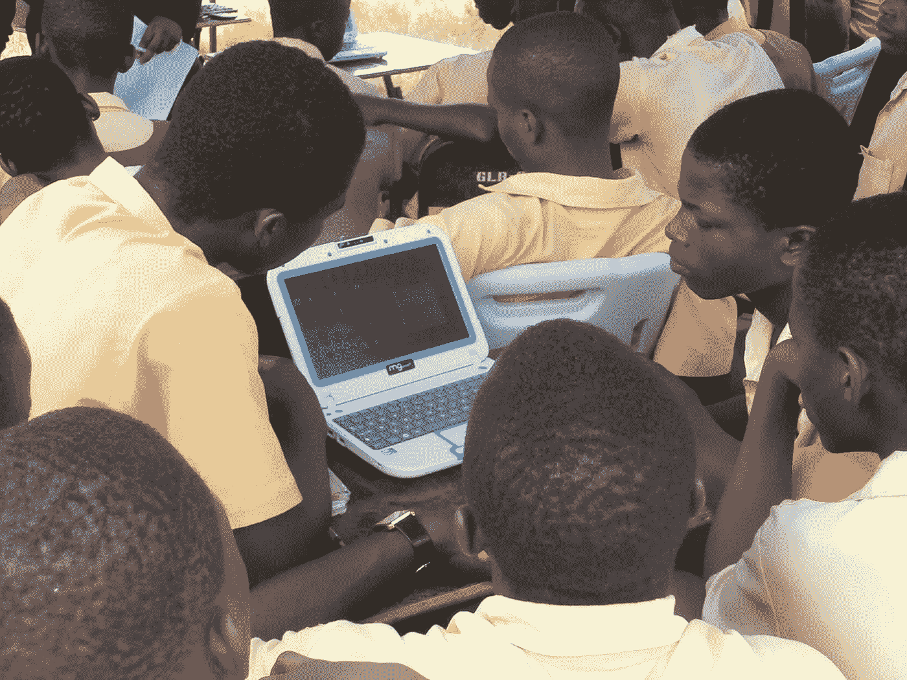

# 我在加纳的泥屋里的时光教会了我去中心化的系统

> 原文：<https://medium.com/hackernoon/how-my-time-in-a-mud-hut-in-ghana-taught-me-about-decentralized-systems-9edf40d3388d>

[EIFL](https://www.flickr.com/photos/eifl/8551828578) Ho Mobile Library Service

2000 年夏天，我发现自己和十几个其他人一起住在加纳东部沃尔特地区的偏远村庄扎哈维·洛伊米。我们曾代表犹太世界服务组织前往那里，在一个缺乏自来水、官方电力或现代浴室的小村庄里建造一所泥砖学校。

我们住在泥屋里，用水桶洗澡。晚上，在无边无际的星空下，我会看到村民们用 100 年前的步枪猎杀超大的老鼠。

抛开疟疾引起的发烧幻觉，或者我花时间听一个村里的老人哼着他的人民的过去，我注意到这个我们花了四周时间帮助的村庄，在利用分散文化方面取得了胜利。

Zahavi Leumi 村与附近城市 Ho 的人很少或根本没有联系，除了一个搬回他年轻时居住的村庄的富人之外，没有合理的基础设施或国家政府之间任何标准的相互关系。尽管如此，村民们通过使用他们脱离电网的现实来扩大他们在没有政府帮助的情况下生存的能力，从而繁荣起来。

我很早就注意到的一件事是，尽管没有官方连接到贯穿他们村庄的主要电力线，但居民们有时会想办法接入不是为他们准备的电线。这提供了有限容量的电力。

唯一的商店出售啤酒、苏打水和瓶装水。没有任何记录，也没有缴税。村民靠自给农业和狩猎割草者(我之前提到的那些超大的老鼠)为生。

那么中央政府是怎么知道这个村庄的存在的呢？他们是如何与他们联系起来的？这位富人搬回了 Zahavi Leumi，基本上是住在远离村庄的一座有人看守的别墅里，他自己充当了村庄与地区和国家政府的联络人。

我们越是谈论区块链和作为一种生活方式的权力下放，我就越是想到靠近多哥边境的扎哈维·勒乌米村。从本质上说，区块链赋予了人类条件现代化的能力，这种能力是从时间开始的，即在高度独立的同时又相互关联。

过去，权力下放是自然趋势的产物，缺乏明确的替代方案。那些中央集权的社会利用中央集权走在了分权社会的前面，但同时他们的进步也是有代价的。最终，我们失去了自己的独立性和决策权。区块链补救了这个问题。

全人类都应该能够作为个人、家庭和社区独立行动，同时在国家和全球范围内互动，以确保我们的所有利益都以整体的方式得到促进。

这就是为什么区块链，尤其是其在治理、银行和可持续发展领域的实施，为我们提供了一个为小社区和大城市创造公平竞争环境的绝佳机会。第一次，每个人都很重要，没有人的声音可以被压制。

非洲是有史以来使用移动电话最多的地区，随着世界互联网的全面普及，有很多机会可以过上完全分散的生活，而不会与以前的技术进步脱节。

自从我在加纳的一个泥屋里度过夏天以来，18 年已经过去了，但我的假设是，在过去的 18 年里，即使是一个与世隔绝的村庄，现在也与更广阔的非洲和更容易接近的世界连接起来了。当我到达那里时，我们一行人是他们遇到的第一个来自加纳以外的人。

我们的新世界正在向我们所有人汇聚，这意味着如果我们选择以一种既不会抹杀一个人的个人贡献，又允许一个人的潜力在更大的人类结构中被挖掘的方式来整合，这些村庄和我们的技术就可以成为一体。当然，我们必须确保区块链和我们正在快速发展的所有技术都是用于积极的方面，没有剥削和议程。