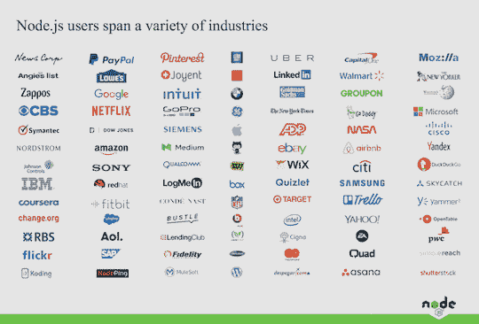

# 网飞和 Paypal 是如何利用 Node.js 进行产品转型的？

> 原文：<https://medium.com/hackernoon/how-netflix-and-paypal-did-product-transformation-using-node-js-22074e13caad>

Paypal and Netflix using Nodejs

几天前发布了 Node.js V.10.0，为什么世界各地对 Node.js 有如此多的宣传？让我分享一些关于 Node.js 的案例研究，在生产中的使用，Node.js 的未来，以及为什么企业家，初创公司创始人，首席技术官应该关注市场中的新变化。

# 个案研究

**网飞**

网飞就是一个最好的例子，他通过在生产中实施 Node.js，利用了 node . js 的优势，并在经济和性能方面取得了巨大的成绩。

[网飞](http://www.netflix.com/)是全球最大的在线流媒体提供商之一，每季度向 60 个国家的近 5000 万客户提供近 70 亿小时的视频。

早期，网飞在服务器端使用 Java，在前端使用 javascript，所以开发人员必须编写两次代码，这要求他们理解这两种语言。为了错误处理、活动跟踪和调试，他们不得不把所有东西都写两遍。

为什么实施 Node.js 首席工程师肖。

# 转移到 Node.js 的主要原因

*   服务器端和浏览器端有一个共同的语言。
*   Node.js 提供的性能。从 40 分钟以上的启动时间到不到一分钟
*   Node 有很多大部分是开源的模块。
*   构建单页应用程序。

# 网飞的未来目标

Node.js 支持非阻塞，可以用于 AWS Lambda 这样的微服务来开发[无服务器架构](https://www.techuz.com/blog/steps-creating-serverless-microservice-aws-lambda/)。该公司正计划使用 [AWS Lambda](https://aws.amazon.com/lambda/) 来构建基于规则的自我管理基础设施，并取代低效的流程，以降低出错率并节省宝贵的时间。

**贝宝**

Paypal 是第一批有机会使用 Node.js 的公司之一，冒险做出改变，因为当时 Node.js 不是流行语言。

首先，他们在服务器端使用 Java，在浏览器端使用 javascript。他们首先尝试使用 Node.js 和 java 开发原型。为了使用 java 开发原型，他们指派了一个由 5 名开发人员组成的团队和一个由 2 名开发人员组成的团队来使用 node.js。

令人惊讶的是，他们得到了令人难以置信的结果，两个开发人员的团队在原型开发中赶上了 java 开发人员的团队，这非常快。与 Java 相比，使用 Node.js 可以用一半的时间开发一个应用程序。

实现 Node.js 的主要原因

在生产中实现 node.js 的一个主要原因是为了处理“100%的业务可用性，即使有巨大的负载”。

> “在美国，每年黑色星期五的一天，大约有 15 亿美元被用于网上消费。”

Paypal 在性能方面取得了用户可以明确注意到的好成绩:

> 同一页面的平均响应时间减少 35%。这
> 
> 结果页面服务速度提高了 200 毫秒——这是用户的要求
> 
> 肯定会注意到。

来源:builtinnode.com

Node.js 的未来是光明的

是的，我是认真的。你也会的！这就是证据

由于 Node.js 自 2015 年以来就有 LTS(一项专注于安全性和稳定性的长期支持计划)，难怪大型企业会不断将其添加到他们的堆栈中。

来源:risingstack.com

**企业家为什么要关注趋势？**

*   你需要一半的团队来开发你的应用或产品
*   可以在无服务器架构中部署应用程序吗？您可以减少服务客户所需的服务器数量。
*   通过减少 50%到 60%的页面加载时间让客户更加满意 [Kissmetric 的研究](https://blog.kissmetrics.com/loading-time/)显示 **40%的人放弃了一个加载时间超过 3 秒的网站**，47%的消费者希望网页加载时间不超过 2 秒。
*   开发人员会很乐意为你的产品工作，因为他们只需要理解一种编写服务器端和浏览器端的语言——Javascript。

**node . js 的应用领域:**

*   IOT
*   众筹
*   电子商务
*   支付处理
*   强大的 SPA-网飞
*   社会化媒体
*   实时服务-聊天
*   媒体
*   企业 Web 服务