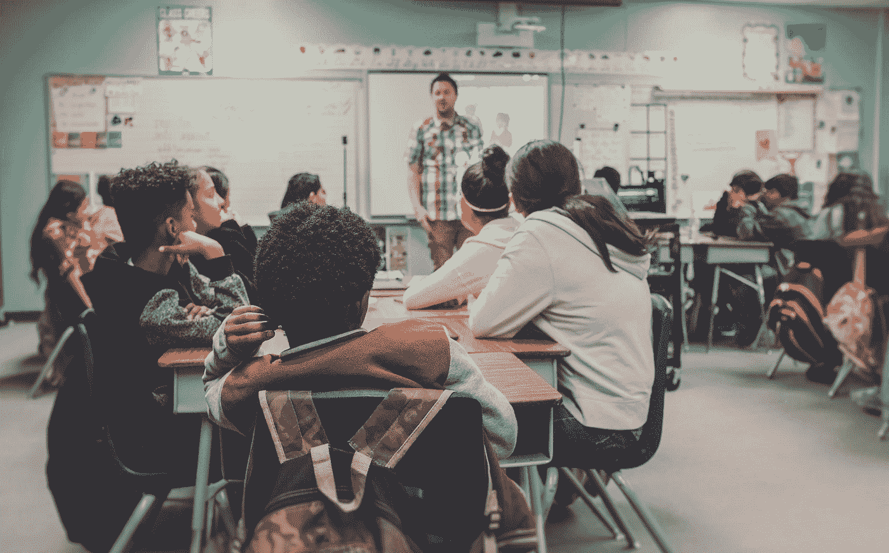

# 新创企业如何颠覆教育

> 原文：<https://medium.com/hackernoon/how-new-startups-are-disrupting-education-b16ad2de9905>

*Image credit:* [*Unsplash*](https://unsplash.com/photos/zFSo6bnZJTw)

在过去的十年里，有很多创业公司颠覆了世界各地的教育，让知识变得更容易获取。似乎所有的重大变化都已做出，没有显著改进的余地。

然而，新一代的创业公司证明这些说法是错误的，他们实施新的方法来修复现代教育及其过程中仍然存在的缺陷。

# [**德尔菲亚**](https://delphia.com/) **:在 AI 的帮助下选择学院**

代表 2018 年春季 YC 批次的德尔菲亚创业团队正在开发一种人工智能工具，帮助人们做出重要的人生决定，如选择大学和专业。高中生被提供参加一个 40 个问题的调查，然后信息被一个人工智能处理，产生推荐什么学校和项目可能是最适合的。

这家总部位于加拿大的公司的首席执行官 Andrew Peek 也在媒体上提到，该系统是在从最近的大学毕业生调查中收集的数据集上进行训练的。如果用户对收到的推荐不满意，他或她可以让系统知道，这样 AI 就可以重新校准自己

虽然教育是一个重要的和鼓舞人心的利基探索计划与大学的合作伙伴关系，德尔福团队不打算只关注它。例如，该公司将其调查工具授权给媒体公司(VOX 等。)

# [**W1D1**](https://w1d1.com/) **:学习创新的新方法**

总部位于纽约的 W1D1 项目的创始人 Alexey Ivanovsky 和 Andrew Chernoguzov 告诉我们，他们几年来一直在从事一系列项目，最终意识到我们的世界中真正破碎的是什么。是创造力。如今，许多可能从事从摄影到音乐的人都认为，“它对像我这样的普通男人或女孩来说太特别了。”

目前创造性学习的方法也不能解决这个问题。摄影或音乐学校通常很枯燥，尤其是对年轻人来说。他们从小到大都认为，创造性是一种特权，并不是每个人都有。即使他们觉得生活中需要一些创造力，他们唯一能做的就是参加绘画班，除此之外别无其他想法。

W1D1 应用程序旨在解决这一问题。这是一个可以用来探索创造力的工具。用户注册并开始接受创造性的任务，这为创造性留下了足够的空间，但也设定了界限。例如，一个应用程序可能会说检查一些索尔·莱特的照片，然后尝试在用户所在城市的街道上捕捉类似的时刻。有自由和对做什么的严格理解，这样的组合对开始做创造性的事情是完美的。

该应用程序还具有人工智能功能，可以研究用户的偏好和结果，为他或她提供更好的学习小组。

# [**大绿**](https://biggreen.org/) **:小学生美食素养**

金巴尔·马斯克(Kimbal Musk)创办的一家非营利初创公司希望从学龄开始教授“食物素养”。在一些州，幼儿园儿童的肥胖率高达 20%。这是一个真正的公共健康问题，堪比吸烟。Big Green 背后的想法是在低收入地区建立学校花园(这意味着那里 60%的学生有资格享受免费或低价午餐)。学生们将能够种植新鲜的水果和蔬菜，也可以食用它们。

高中水平的参与者甚至应该能够在农贸市场出售他们的新鲜农产品。这家初创公司的项目已经覆盖了 400 多所学校，还有几十所学校即将启动。金巴尔·马斯克透露，他计划在 2020 年前扩展到美国 10 个主要城市的贫困地区，覆盖 100 万学生。

你知道哪些令人兴奋的新教育创业公司？请在评论中分享。