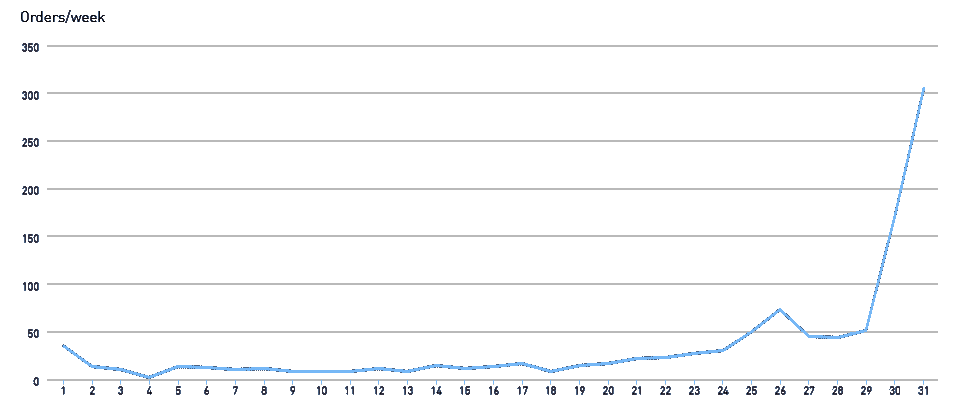
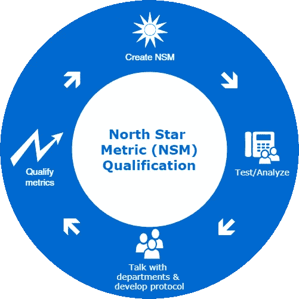

# 北极星度量标准如何引领你走向南方

> 原文：<https://medium.com/hackernoon/how-north-star-metrics-can-lead-you-south-1488c09891de>

## 什么是北起点度量(NSM)？

让我们从一个定义开始:

> 北极星指标是最能抓住你的产品向客户传递的核心价值的单一指标。- [什么是北极星公制](https://blog.growthhackers.com/what-is-a-north-star-metric-b31a8512923f)

它有助于团结一个公司或部门，以产生一个单一的结果，每个人都可以集中精力。

## 北极星增长指标

有几篇关于如何创建或选择 NSM 的很棒的文章，我不打算重复这些文章。[【1】](https://blog.growthhackers.com/what-is-a-north-star-metric-b31a8512923f)[【2】](https://amplitude.com/blog/2018/03/21/product-north-star-metric)

一般来说，nsm 用于激发对增长的高度关注(但不是必须的)。在某些情况下，你可以说它定义了成长。你可能已经知道了，我是 Y-Combinator 的粉丝，请原谅我引用了他们的一些文章。 [*Start = Growth*](http://www.paulgraham.com/growth.html) 是保罗·格拉厄姆的一个伟大的理论，很好地解释了这个概念。

他们的一个关键概念是“你制造你测量的东西。”这对于创业公司来说至关重要，但是人们似乎就此止步，而忽略了一个推论:“小心你衡量的东西”。

我想带来另一个视角。这篇文章的灵感来自于我在博·伯林厄姆的《小巨人:选择伟大而不是大的公司》一书中读到的那些有意选择不发展的公司。然后我发现福布斯也受到了这本书的启发，并有一个专门针对他们的版块:[《福布斯——小巨人](https://www.forbes.com/feature/small-giants/)。

与我所研究的各种成长型创业公司相比，这些小巨头专注于什么，他们的 NSM 是什么，这种鲜明的对比令人吃惊。

澄清一下，我喜欢超高速增长的创业公司，但是我看到很多这样的创业公司犯的一个错误是小巨人从来没有犯过的错误。在我们讨论他们做了什么之前，我们需要回顾一下，讨论一下合格增长。

# 合格增长

我使用了一个不太常见的“合格”定义，所以我想我会像现在这样定义它:

> “从一般形式减少到特殊的或受限制的形式”
> - [韦氏词典](https://www.merriam-webster.com/dictionary/qualify)

当我说“限定”增长时，我的意思是让你的 NSM 不那么笼统，更具体到你的产品提供的核心价值*。*

*我将使用 Doordash 作为一个例子。除了他们公开发表的言论之外，我与他们没有任何关系，对他们的公司也没有任何特别的了解。*

*Doordash 的合理 NSM 可以是:“**订单数/周**”。*

*这在他们刚开始的时候可能会很棒。他们在几个月内从零订单增加到数百订单，几个月后可能增加到数千订单。*

## *孤立的责任*

*当公司只由创始人组成时，他们可能不仅仅是处理订单，他们天生就知道公司各个不同部分的重要性。Doordash 有 4 个创始人，你可以打赌，那些建立网站、联系餐馆和送餐的人，即使不能同时履行其中的几项职责，至少也能保持良好的沟通。*

*随着他们开始成长，人们被赋予孤立的责任，这种 NSM 的实现会导致严重的麻烦。*

*例如，也许他们有了一个新的营销经理，他能够在一个新的邻近城镇获得晋升。幸运的是，他确实记得与技术部合作，以确保他们在这个新城镇有餐厅。这个镇的促销活动让 metric 看起来很棒！*

**

*不久后，客户支持部门开始收到投诉，他们意识到他们在该地区没有足够的送货司机(或任何司机)来满足需求。市场部只是被告知增加指标，在他们部门看来，他们成功了。*

*他们最终不得不退还数百份订单，因为他们无法履行这些订单。他们损失了数千美元，几家餐厅退出了平台，还出现了新的可怕的 Yelp 评论。他们对“获得更多订单”的孤立，不合格和没有意识或讨论导致他们走向灾难。*

## *游戏化*

*当你没有恰当地限定度量标准时，人们会把它们变成一个游戏。你告诉他们你需要更多的 Instagram 粉丝，他们就会买一堆粉丝，可能真的相信这会带来真正的粉丝。*

**任务完成！**

*或者不是。这听起来可能像是硅谷的一集，但是我可以告诉你，从我在硅谷的个人经历来看，这部剧并没有很多人认为的那么夸张。*

*你可能倾向于认为，“当然，但那只是不诚实的员工”。让我告诉你，给某人一个指标，并对他们施加压力以达到这个指标，你会得到一些奇怪的结果。或者，你可以建议不要施加压力。我同意你的观点，但我也认为持续无压力环境的可能性非常低。*

*真实世界的例子: [Zenefits](https://www.forbes.com/sites/briansolomon/2016/02/08/zenefits-ceo-parker-conrad-resigns-amid-scandal/#5a7d35108314) 。Zenefits 的首席执行官被解雇，因为他开发了一个程序，基本上允许人们在国家要求的许可上作弊，以促进增长。你认为他的 NSM 是什么？它显然不包括质量控制。*

*这给我们带来了解决方案。*

## *鉴定指标*

*请，*请，*验证您的指标。我再怎么强调这一点也不为过。*

*重复这一步，直到你 ***完全确定*** 这些指标表达了你的产品交付的全部价值(参见 NSM 的定义。)*

****合格指标通常是在原始统计数据中增加一个质量控制水平。****

*这就是小巨人与众不同的地方。他们的 NSM 是基于质量而不是增长。你看到的更多的是“每周在我们餐厅用餐的快乐顾客数量”，而不是“每周制作的三明治数量”。正是这种对客户质量和员工质量的高度关注，让一切变得不同。*

*返回并修改我们的 Doordash 示例:“每周交付的*订单数量*”*

*这是更好的，而且肯定会避免前面看到的灾难，因为它迫使几个部门一起工作来提高它。因为你现在专注于*交付，*你必须与订单交付部门互动，然后他们也必须与驱动程序获取部门互动，以确保他们能够完成预期的订单。*

*如果这是您关注的唯一或主要的统计数据，这在现实世界中仍然会失败。它完全忽略了任何与记忆有关的东西。你会发现你有 10%的保留率，换句话说，9/10 向你订购的人不会再订购。*

*这意味着营销可能做得“很好”或使用噱头，如过多的新闻稿，让人们兴奋，但产品是缺乏的。*

**

*Protocol development discussed below*

## ****迭代****

*您发现交付估计时间窗口少了 50%。再改一次:“准时交付订单数*/周*”。***

**留存率高达 30%。好多了，但还是有问题。你检查你的 [NPS](https://en.wikipedia.org/wiki/Net_Promoter) 分数，它是 20(非常低)。NPS 通常与客户满意度相关，因此您会得出:**

**“每周按时交付给满意客户的订单数量**

***这可能是结束，或者您可能需要再次迭代。但是现在你有这么多的部门。也许你雇佣了糟糕的司机，他们乱扔食物或者不尊重你的顾客，而你现在已经把雇佣和你的统计联系起来了。如果不讨论你对司机的需求和期望，以及他们如何挑选食物，你就不可能让*的顾客*(一个滞后指标)满意。你还捆绑了餐厅的送货时间估计和送货保证。***

## **孤立的部门**

**这是本文第二个最重要的部分和一点点题外话。**

**我在上面提到了独立的责任，但我没有深入探讨。在您的部门方法中有大量的隔离或“模块化”,看起来像是有人试图将编程架构原则应用到业务中，而没有完全理解它是如何工作的。**

**在编程中，模块化设计通常被认为是理想的设计。这意味着某些东西完全独立工作，并且可以被其他东西替换。**

**举一个现实世界的例子，想想电子邮件客户端。如果你使用 Gmail，你可以使用他们的在线界面，或者你可以使用 Outlook 或苹果邮件或雷鸟。它们可以在任何时候交换，而不会影响邮件的收发。这是因为他们都同意使用非常详细的电子邮件工作协议。**

***大多数部门都不是这种模块化或定义明确的*。**

**以我们的例子为例，假设 Doordash 有一个雇佣送货司机的部门。你能不能完全调动或解雇这个部门的所有人，雇佣一家外部公司来帮你招聘呢？你可能会发现文化开始改变，不同水平的技能进来了(更高或更低)，进来的人在他们的特定角色上训练得更少，你可能会得到比你需要的更多或更少的人。*除非你定义了协议。***

***协议*有几个不同的含义，我使用的定义是:**

*****协议是部门之间的协议，用于定义需求和期望或各部门可以使用的沟通渠道(传递这些需求)。*****

**在一家公司的初创阶段，你经常会意识到每个人的需求，因为团队很小。很难定义协议，因为一切都在快速变化:一个部门的需求或期望可能每周都有很大变化。**

**所以，你要关注部门之间的沟通，这样当事情发生变化时，每个部门都能保持警觉，并能根据需要进行调整。**

**当你的部分操作或协议变得“稳定”时，协议就形成了。**

**那么，*的增长需要通过高水平的部门间沟通*和*协议创建*来平衡。**

**回到北极星度量标准，一个部门的 NSM 必须由部门之间制定的协议或协定来限定。我们将继续以 Doordash 为例。**

*   ****司机团队:**“每月雇佣的司机数量”
    压力很容易导致雇佣糟糕的司机，进而影响其他部门或客户。将其限定为:“3 个月后/每月雇佣的保持 4.5 星评级的驾驶员人数”。请注意，这是一个滞后的指标，所以它不会立即捕捉到什么。**
*   ****餐厅团队:**“送餐的餐厅/月”。这更好，因为它考虑到了那些*停止*使用平台*的餐馆。*尽管如此，它仍然可以使用指标中的质量控制来将各部门联系在一起——如果司机每次都要等 30 分钟才能拿到食物，导致司机得到较低的评分，因为客户不知道司机或餐厅的延迟有何不同。我们再试一次:“餐厅在预计时间/月的 5 分钟内送餐”。**

# **摘要**

**北极星指标(nsm)对公司的发展至关重要，但应该通过质量保证进行认证。当一家公司在成长，各个部门都有各自独立的 nsm 时，这一点变得更加重要和明显。**

**迭代这个过程是很有用的，这样可以找到什么样的度量标准需要各部门一起工作，开发沟通渠道和协议，并且*捕获你的产品的核心价值*。**

**现实世界中有许多创业公司失败或失误的例子，因为他们以不可持续/不正确的方式追求增长。我要求你弄清楚它是否来自一个不合格的指标，以及这个指标是什么。**

## **参考**

**[1] [肖恩·埃利斯提出的北极星度量标准](https://blog.growthhackers.com/what-is-a-north-star-metric-b31a8512923f)是什么**

**每个产品都需要一个北极星指标:下面是如何找到你的北极星指标**

**[3] [保罗·格拉厄姆的 13 句话创业](http://paulgraham.com/13sentences.html)—第 7 句**

****感谢**妮可·伊莲和拉里·琼斯阅读草稿并提供编辑反馈。**

# **如果你快乐并且你知道它…**

**如果你喜欢这篇文章，并认为它有用，请让我知道，并*鼓掌*或写下评论！我很乐意进一步阐述你可能有的任何问题。**

**[Kerry Jones](/@kerryjones12) 是创始人兼首席技术官，最近被授予福布斯 30 岁以下 30 人成就奖。我对一切创业都充满热情，从文化优先的环境到技术堆栈和范例的利弊。在 [LinkedIn](https://www.linkedin.com/in/kerryrjones/) 上和我联系，或者在 [Twitter](https://twitter.com/kerryjones) 上和我打招呼。**